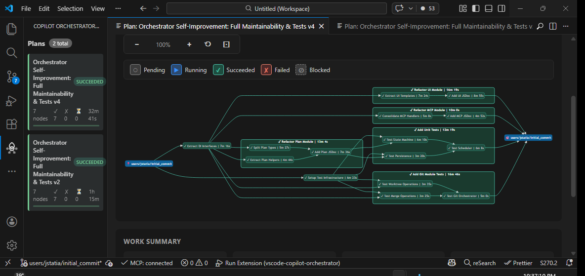
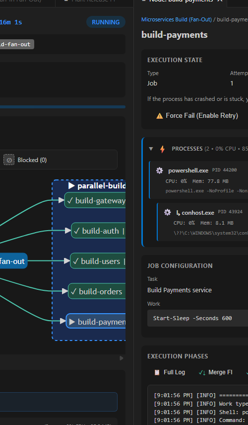
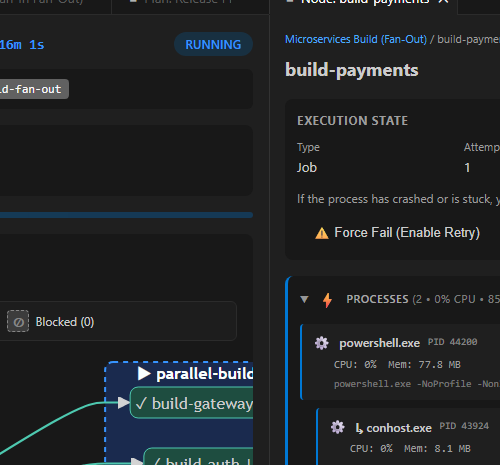
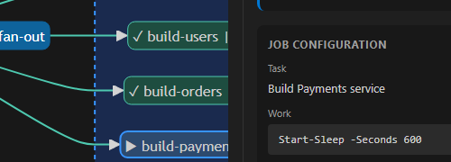

# Copilot Orchestrator for Visual Studio Code

<p align="center">
  
</p>

<p align="center">
  <strong>🚀 Scale your GitHub Copilot usage with parallel AI agents in isolated git worktrees</strong>
</p>

<p align="center">
  <a href="#features">Features</a> •
  <a href="#see-it-in-action">See It In Action</a> •
  <a href="#installation">Installation</a> •
  <a href="#quick-start">Quick Start</a> •
  <a href="#mcp-integration">MCP Integration</a> •
  <a href="#configuration">Configuration</a>
</p>

---

## Why Copilot Orchestrator?

**Turn GitHub Copilot into a parallel development powerhouse.** Instead of working on one task at a time, orchestrate multiple AI agents simultaneously—each working in its own isolated git worktree, automatically merging changes when complete.

<p align="center">
  
</p>

### The Problem

You have Copilot. It's great at coding tasks. But it works sequentially—one task at a time. Your feature branch sits waiting while Copilot finishes task A before starting task B.

### The Solution

**Copilot Orchestrator** unlocks **concurrent Copilot execution**:

| Capability | What It Means |
|------------|---------------|
| 🚀 **Parallel Agents** | Run 4, 8, or more Copilot agents simultaneously on different tasks |
| 🔀 **Git Worktree Isolation** | Each agent works in its own branch—zero conflicts, clean history |
| 📊 **Visual DAG Execution** | See your entire plan as an interactive dependency graph |
| ⚡ **Automated Pipelines** | Pre-checks → AI Work → Post-checks → Auto-merge → Cleanup |
| 🤖 **Native MCP Integration** | Create and monitor jobs directly from GitHub Copilot Chat |
| 🔄 **Smart Retry** | Failed jobs include AI-analyzed failure context for intelligent retry |

---

## See It In Action

### Plan Execution Dashboard

Monitor complex multi-job plans with an interactive Mermaid-based DAG visualization:

<p align="center">
  
</p>

**What you see:**
- 📊 **Live DAG diagram** showing job dependencies and parallel execution paths
- 🎨 **Color-coded status**: Green (succeeded), Blue (running), Red (failed), Gray (pending/blocked)
- ⏱️ **Duration tracking** on each node showing actual execution time
- 📈 **Progress stats**: Total nodes, succeeded, failed, running, pending at a glance

### Node Detail Panel

Click any node to see comprehensive execution details:

<p align="center">
  
</p>

**Includes:**
- **Execution State**: Status, attempts, start time, duration
- **Work Summary**: Commits made, files added/modified/deleted
- **Job Configuration**: Task description and work specification
- **Agent Instructions**: Full Markdown-rendered instructions for AI jobs

### Agent Instructions View

See exactly what the AI agent is being asked to do:

<p align="center">
  
</p>

**Agent work specs support:**
- Markdown formatting with headers, lists, code blocks
- Context files for focused AI attention
- Max turns configuration for complex tasks

---

## Features

### 🎯 Automated Job Lifecycle

Every job follows a complete automated pipeline:

```
📥 CREATE WORKTREE    →    ✅ PRECHECKS    →    🤖 AI WORK    →    ✅ POSTCHECKS    →    🔀 MERGE    →    🧹 CLEANUP
   Fork from base           Run tests first      Agent coding        Verify changes       Squash back       Remove worktree
```

**Why this matters:**
- ✅ **Prechecks** ensure you start from a working state
- 🤖 **Isolated work** means AI changes can't break your main branch
- ✅ **Postchecks** validate the AI's work before merging
- 🔀 **Auto-merge** with squash keeps your git history clean

### 🤖 Flexible Work Specifications

Jobs support multiple work types:

**AI Agent Work** (recommended):
```json
{
  "work": {
    "type": "agent",
    "instructions": "# Add Input Validation\n\n## Task\nAdd client-side validation to the registration form...",
    "contextFiles": ["src/components/RegisterForm.tsx"],
    "maxTurns": 15
  }
}
```

**Shell Commands** (for build/test tasks):
```json
{
  "work": {
    "type": "shell",
    "command": "npm run build && npm run test:integration"
  }
}
```

**Simple String** (legacy support):
```json
{
  "work": "@agent Fix the memory leak in WebSocket handler"
}
```

### 📊 Real-Time Monitoring

<p align="center">
  
</p>

**The sidebar shows:**
- All plans with completion progress
- Node counts by status (succeeded/running/failed)
- Total duration and timing

**The Node Detail panel shows:**
- Execution state with attempt tracking
- Phase tabs (Prechecks, Work, Postchecks, Mergeback, Cleanup)
- Live logs during execution
- Work summary with commit details

### 🔌 MCP (Model Context Protocol) Integration

The orchestrator exposes a full MCP server that integrates directly with GitHub Copilot Chat:

**Node Tools (Direct Node Management):**
| Tool | Description |
|------|-------------|
| `create_copilot_node` | Create standalone or grouped nodes |
| `get_copilot_node` | Get node details by ID |
| `list_copilot_nodes` | List nodes with filtering (group, status, name) |
| `retry_copilot_node` | Retry a specific failed node |
| `get_copilot_node_failure_context` | Get failure details for a node |

**Plan Tools:**
| Tool | Description |
|------|-------------|
| `create_copilot_plan` | Create a plan with jobs and visual groups |
| `create_copilot_job` | Create a single job (wrapped in a plan) |
| `get_copilot_plan_status` | Get plan progress, job statuses, and group summary |
| `list_copilot_plans` | List all plans |
| `cancel_copilot_plan` | Cancel a plan and all its jobs |
| `delete_copilot_plan` | Delete a plan and all its state |
| `retry_copilot_plan` | Retry failed nodes in a plan |
| `retry_copilot_plan_node` | Retry a specific failed node |
| `get_copilot_plan_node_failure_context` | Get failure details for a node |
| `get_copilot_node_details` | Get details for a specific node |
| `get_copilot_node_logs` | Get execution logs for a node |
| `get_copilot_node_attempts` | Get all attempts with logs for a node |

**Example Copilot Chat interaction:**
```
You: Use the Copilot Orchestrator to create a job that implements 
     JSON serialization for the TrustPlanPolicy class

Copilot: I'll create an orchestrator job for that task...
         [Calls create_copilot_job tool]
         
         Job created! ID: abc-123
         - Status: running
         - Current step: work
         - Progress: 45%
```

### 📋 Multi-Job Plans

Orchestrate dependent jobs with execution plans:

Plans allow you to run multiple jobs with dependencies. Jobs execute in parallel up to `maxParallel`, but respect dependency ordering.

**Example: Code Quality Pipeline**
```json
{
  "name": "Code Quality Pipeline",
  "maxParallel": 2,
  "jobs": [
    { 
      "id": "format", 
      "task": "Format all TypeScript files",
      "work": "@agent Run prettier on all .ts files and fix formatting issues"
    },
    { 
      "id": "lint", 
      "task": "Fix lint errors",
      "dependsOn": ["format"],
      "work": "@agent Fix all ESLint errors, don't just disable rules"
    },
    { 
      "id": "tests", 
      "task": "Add missing tests",
      "dependsOn": ["lint"],
      "work": "@agent Add unit tests for any untested functions",
      "postchecks": "npm test"
    },
    { 
      "id": "docs", 
      "task": "Update documentation",
      "dependsOn": ["tests"],
      "work": "@agent Update JSDoc comments and README for any changed APIs"
    }
  ]
}
```

**Execution order:**
```
        ┌─────────┐
        │ format  │  ← Starts immediately
        └────┬────┘
             │
        ┌────▼────┐
        │  lint   │  ← Waits for format
        └────┬────┘
             │
        ┌────▼────┐
        │  tests  │  ← Waits for lint
        └────┬────┘
             │
        ┌────▼────┐
        │  docs   │  ← Waits for tests
        └─────────┘
```

### 🔗 Visual Groups (Organized Workflows)

For complex workflows, use **groups** to organize jobs visually and provide namespace isolation. Groups render as nested boxes in the UI with aggregate status:

**Example: Full Release Pipeline with Grouped Phases**
```json
{
  "name": "Release Pipeline",
  "maxParallel": 4,
  "jobs": [
    {
      "producer_id": "prepare",
      "task": "Bump version and update changelog",
      "dependencies": [],
      "work": "@agent Update version in package.json and add changelog entry"
    }
  ],
  "groups": [
    {
      "name": "build",
      "jobs": [
        {
          "producer_id": "api-service",
          "task": "Implement API changes",
          "dependencies": ["prepare"],
          "work": "@agent Implement the new REST endpoints"
        },
        {
          "producer_id": "web-client",
          "task": "Update web frontend",
          "dependencies": ["prepare"],
          "work": "@agent Update React components"
        },
        {
          "producer_id": "mobile-client",
          "task": "Update mobile app",
          "dependencies": ["prepare"],
          "work": "@agent Update React Native screens"
        },
        {
          "producer_id": "docs-update",
          "task": "Update all documentation",
          "dependencies": ["prepare"],
          "work": "@agent Update API docs, README, and user guide"
        }
      ]
    },
    {
      "name": "testing",
      "jobs": [
        {
          "producer_id": "unit-tests",
          "task": "Run unit tests",
          "dependencies": ["build/api-service", "build/web-client"],
          "work": "npm run test:unit"
        },
        {
          "producer_id": "integration-tests",
          "task": "Run integration tests",
          "dependencies": ["build/api-service"],
          "work": "npm run test:integration"
        },
        {
          "producer_id": "e2e-tests",
          "task": "Run E2E tests",
          "dependencies": ["unit-tests", "integration-tests"],
          "work": "npm run test:e2e"
        }
      ]
    },
    {
      "name": "deploy",
      "jobs": [
        {
          "producer_id": "release",
          "task": "Deploy to production",
          "dependencies": ["testing/e2e-tests", "build/docs-update"],
          "work": "@agent Create release tag and trigger deployment",
          "postchecks": "npm run smoke-test"
        }
      ]
    }
  ]
}
```

**Execution visualization:**
```
                              ┌───────────┐
                              │  prepare  │  ← Root job (no group)
                              └─────┬─────┘
            ┌─────────────┬─────────┴────┬───────────┐
            │             │              │           │
      ┌─────▼─────┐ ┌─────▼────┐ ┌───────▼───┐ ┌─────▼──────┐
      │api-service│ │web-client│ │mobile-cli │ │docs-update │  ← 📦 build group
      └─────┬─────┘ └─────┬────┘ └───────────┘ └──────┬─────┘
            │             │                           │
            └──────┬──────┘                           │
                   │                                  │
      ┌────────────▼────────────┐                     │
      │  📦 testing group       │                     │
      │  ┌──────┐ ┌───────────┐ │                     │
      │  │ unit │ │integration│ │                     │
      │  └──┬───┘ └─────┬─────┘ │                     │
      │     └─────┬─────┘       │                     │
      │     ┌─────▼─────┐       │                     │
      │     │    e2e    │       │                     │
      │     └─────┬─────┘       │                     │
      └───────────┼─────────────┘                     │
                  └─────────────┬─────────────────────┘
                          ┌─────▼─────┐
                          │  release  │  ← 📦 deploy group
                          └───────────┘
```

Groups enable:
- **Visual organization**: Related jobs grouped in nested boxes
- **Namespace isolation**: Same `producer_id` in different groups (e.g., both groups can have a "build" job)
- **Aggregate status**: Each group shows overall progress (green when all jobs succeed)
- **Simplified references**: Jobs in same group use local names; cross-group uses paths

---

## Real-World Example

Here's an actual plan that was executed on this very repository—the Copilot Orchestrator improving itself:

**"Orchestrator Self-Improvement: Full Maintainability & Tests v4"**

```json
{
  "name": "Orchestrator Self-Improvement: Full Maintainability & Tests v4",
  "maxParallel": 4,
  "jobs": [
    { "producer_id": "setup-test-infra", "task": "Setup Test Infrastructure", "dependencies": [], "work": { "type": "agent", "..." } },
    { "producer_id": "extract-interfaces", "task": "Extract DI Interfaces", "dependencies": [], "work": { "type": "agent", "..." } }
  ],
  "groups": [
    {
      "name": "refactor-plan-module",
      "jobs": [
        { "producer_id": "plan-split-types", "task": "Split Plan Types", "dependencies": ["extract-interfaces"] },
        { "producer_id": "plan-extract-helpers", "task": "Extract Plan Helpers", "dependencies": ["extract-interfaces"] },
        { "producer_id": "plan-add-jsdoc", "task": "Add Plan JSDoc", "dependencies": ["plan-split-types", "plan-extract-helpers"] }
      ]
    },
    { "name": "refactor-ui-module", "jobs": [{ "producer_id": "ui-cleanup", "task": "...", "dependencies": ["extract-interfaces"] }] },
    { "name": "refactor-mcp-module", "jobs": [{ "producer_id": "mcp-cleanup", "task": "...", "dependencies": ["extract-interfaces"] }] },
    { "name": "testing", "jobs": [
      { "producer_id": "add-unit-tests", "task": "Add Unit Tests", "dependencies": ["refactor-plan-module/plan-add-jsdoc", "refactor-ui-module/ui-cleanup"] },
      { "producer_id": "add-git-tests", "task": "Add Git Module Tests", "dependencies": ["add-unit-tests"] }
    ]}
  ]
}
```

**Result:** 7 nodes, all succeeded, 32 minutes total execution time, producing clean refactored code with JSDoc documentation and test coverage.

---

## Installation

### From VS Code Marketplace

1. Open VS Code
2. Go to Extensions (`Ctrl+Shift+X` / `Cmd+Shift+X`)
3. Search for "Copilot Orchestrator"
4. Click **Install**

### From VSIX

1. Download the `.vsix` file from [Releases](https://github.com/JeromySt/vscode-copilot-orchestrator/releases)
2. In VS Code, go to Extensions
3. Click the `...` menu → **Install from VSIX...**
4. Select the downloaded file

### Prerequisites

- **VS Code** 1.85.0 or later
- **GitHub Copilot** extension installed and authenticated
- **GitHub Copilot CLI**:
  ```bash
  # Install via GitHub CLI (recommended)
  gh extension install github/gh-copilot
  ```
- **Git** 2.20+ (for worktree support)

---

## Quick Start

### 1. Open the Copilot Orchestrator Panel

Click the **Copilot** icon in the Activity Bar (left sidebar) to open the Jobs panel.

### 2. Create Your First Job

**Option A: Command Palette**
1. Press `Ctrl+Shift+P` / `Cmd+Shift+P`
2. Type "Copilot Orchestrator: Start Job"
3. Enter base branch: `main`
4. Enter target branch: `feature/my-task`

**Option B: Via GitHub Copilot Chat**
```
@workspace Use the Copilot Orchestrator to create a job that adds 
input validation to the user registration form
```

### 3. Monitor Progress

- Watch the job in the **Copilot: Jobs** sidebar
- Click on a job to see detailed logs and status
- Use the phase tabs to filter logs (Prechecks, Work, Postchecks, etc.)

### 4. Review and Merge

When the job completes:
- Review the **Work Summary** (commits, files changed)
- Click the expandable summary to see per-commit details
- Changes are automatically merged back to your base branch

---

## MCP Integration

### Automatic Registration

The extension automatically registers the MCP server with VS Code:
- **Status Bar**: Shows MCP connection state
- **Copilot Chat**: Tools appear automatically in tool selection
- **Transport options**: stdio (process-based, no port needed) or HTTP (`http://localhost:39219/mcp`)

### Manual Configuration

If needed, add to your VS Code settings or `mcp.json`:

**Stdio transport (recommended):**
```json
{
  "mcpServers": {
    "copilot-orchestrator": {
      "type": "stdio",
      "command": "node",
      "args": ["${extensionPath}/out/mcp/stdio/server.js"]
    }
  }
}
```

**HTTP transport:**
```json
{
  "mcpServers": {
    "copilot-orchestrator": {
      "type": "http",
      "url": "http://localhost:39219/mcp"
    }
  }
}
```

---

## Configuration

### Extension Settings

| Setting | Default | Description |
|---------|---------|-------------|
| `copilotOrchestrator.mcp.enabled` | `true` | Enable MCP server |
| `copilotOrchestrator.mcp.transport` | `http` | Transport type: `stdio` (no port needed) or `http` |
| `copilotOrchestrator.worktreeRoot` | `.worktrees` | Worktree directory |
| `copilotOrchestrator.maxConcurrentJobs` | `0` (auto) | Max concurrent jobs (0 = CPU count - 1) |
| `copilotOrchestrator.merge.mode` | `squash` | Merge strategy: `squash`, `merge`, or `rebase` |
| `copilotOrchestrator.merge.prefer` | `theirs` | Conflict resolution: `ours` or `theirs` |
| `copilotOrchestrator.merge.pushOnSuccess` | `false` | Auto-push after successful merge |

### Debug Logging

Enable granular logging for troubleshooting:

| Setting | Description |
|---------|-------------|
| `copilotOrchestrator.logging.debug.mcp` | MCP protocol and server operations |
| `copilotOrchestrator.logging.debug.http` | HTTP server requests and responses |
| `copilotOrchestrator.logging.debug.jobs` | Job runner operations |
| `copilotOrchestrator.logging.debug.plans` | Plan runner operations |
| `copilotOrchestrator.logging.debug.git` | Git and worktree operations |
| `copilotOrchestrator.logging.debug.ui` | UI and webview operations |

---

## Architecture

```
┌─────────────────────────────────────────────────────────────────┐
│                      GitHub Copilot Chat                        │
│                    (MCP Tool Integration)                       │
└────────────────────────────┬────────────────────────────────────┘
                             │ MCP (stdio or HTTP)
                             ▼
┌─────────────────────────────────────────────────────────────────┐
│                  VS Code Extension Host                         │
│  ┌───────────────────────────────────────────────────────────┐  │
│  │    MCP Server (stdio or HTTP transport)                   │  │
│  │    • stdio: JSON-RPC over stdin/stdout (no port needed)   │  │
│  │    • HTTP: /mcp JSON-RPC endpoint (port 39219)            │  │
│  └────────────────────────────┬──────────────────────────────┘  │
│                               │                                  │
│  ┌────────────────────────────▼──────────────────────────────┐  │
│  │                     PlanRunner                            │  │
│  │  • DAG-based execution engine                             │  │
│  │  • Parallel job scheduling (respects maxParallel)         │  │
│  │  • Forward/Reverse integration merges                     │  │
│  │  • Retry with failure context                             │  │
│  └────────────────────────────┬──────────────────────────────┘  │
│                               │                                  │
│  ┌──────────────┐  ┌──────────▼────────┐  ┌────────────────┐   │
│  │ Git Worktree │  │  Copilot CLI      │  │  UI Panels     │   │
│  │  Operations  │  │  Agent Execution  │  │  (Webviews)    │   │
│  └──────────────┘  └───────────────────┘  └────────────────┘   │
└─────────────────────────────────────────────────────────────────┘
```

**Key design principles:**
- **No external runtime** - Everything runs inside the VS Code extension
- **Isolated execution** - Each job gets its own git worktree
- **Automatic cleanup** - Worktrees are removed after successful merge
- **Event-driven UI** - Real-time updates via VS Code webview messaging

---

## Contributing

We welcome contributions! See [CONTRIBUTING.md](CONTRIBUTING.md) for guidelines.

```bash
# Development setup
git clone https://github.com/JeromySt/vscode-copilot-orchestrator.git
cd vscode-copilot-orchestrator
npm install
npm run compile

# Run extension in development mode
# Press F5 in VS Code to launch Extension Development Host

# Package for distribution
npm run package
```

---

## License

MIT License - see [LICENSE](LICENSE) for details.

---

<p align="center">
  <strong>🚀 Stop waiting. Start orchestrating.</strong><br>
  Scale your GitHub Copilot workflow with parallel AI agents.
</p>

<p align="center">
  <a href="https://github.com/JeromySt/vscode-copilot-orchestrator/issues">Report Bug</a> •
  <a href="https://github.com/JeromySt/vscode-copilot-orchestrator/issues">Request Feature</a> •
  <a href="https://github.com/JeromySt/vscode-copilot-orchestrator/stargazers">⭐ Star on GitHub</a>
</p>
