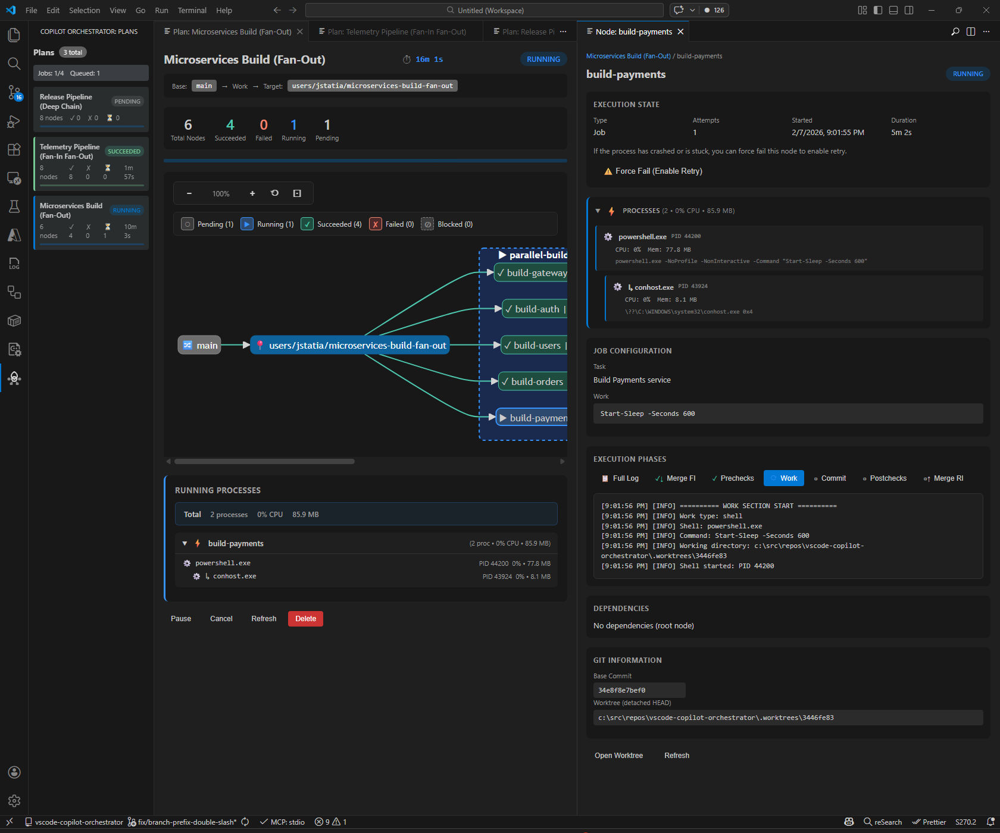
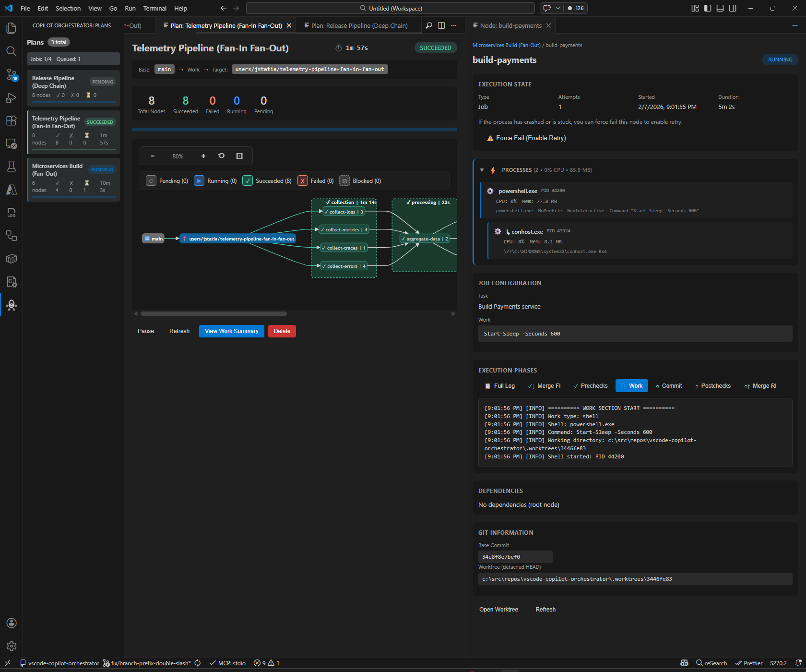
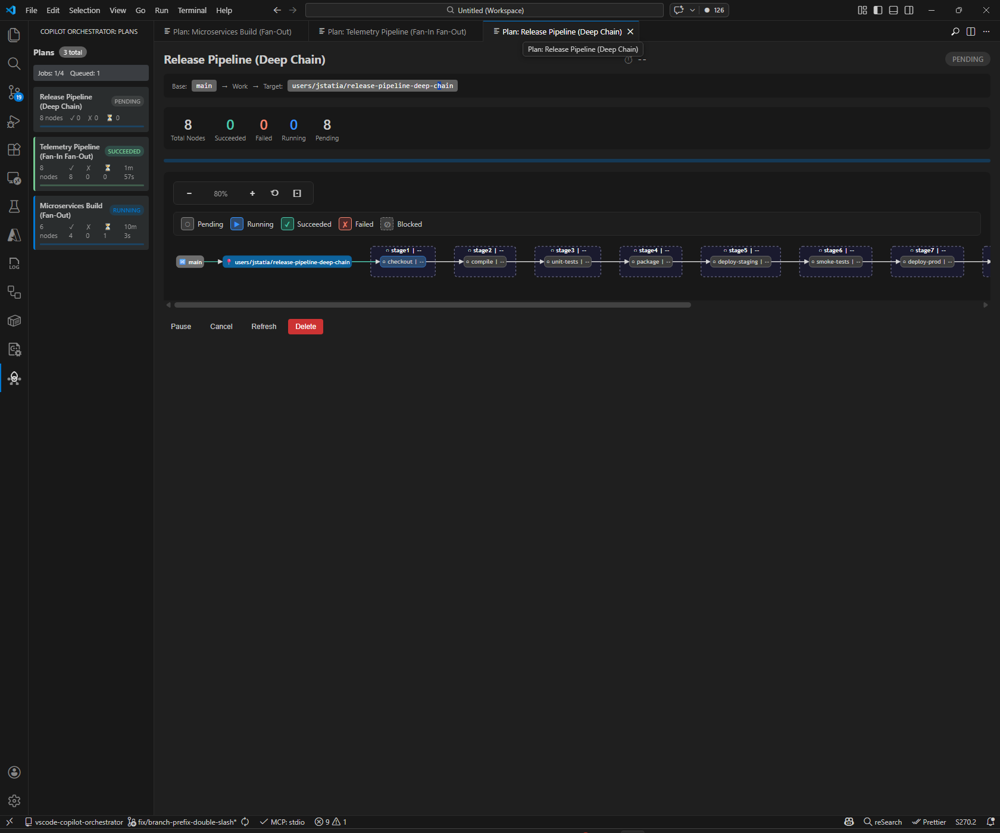

# Copilot Orchestrator for Visual Studio Code

<p align="center">
  
</p>

<p align="center">
  <strong>🚀 Turn GitHub Copilot into a parallel development powerhouse — run multiple AI agents simultaneously in isolated git worktrees</strong>
</p>

<p align="center">
  <a href="#see-it-in-action">See It In Action</a> •
  <a href="#features">Features</a> •
  <a href="#mcp-architecture--security">MCP Architecture</a> •
  <a href="#installation">Installation</a> •
  <a href="#quick-start">Quick Start</a> •
  <a href="#configuration">Configuration</a>
</p>

---

## Why Copilot Orchestrator?

You have Copilot. It's great at coding tasks. But it works **one task at a time** — your feature branch sits idle while Copilot finishes task A before starting task B.

**Copilot Orchestrator** changes that. Decompose complex work into a **Directed Acyclic Graph** of tasks, then execute them in parallel — each in its own git worktree, with automated pre-checks, AI work, post-checks, and merge-back.

<p align="center">
  
</p>

| Capability | What It Means |
|------------|---------------|
| 🚀 **Parallel AI Agents** | Run 4, 8, or more Copilot agents simultaneously on different tasks |
| 🔀 **Git Worktree Isolation** | Each agent works in its own worktree branch — zero conflicts, clean history |
| 📊 **Interactive DAG Visualization** | See your entire plan as a live, zoomable Mermaid dependency graph |
| ⚡ **Automated 7-Phase Pipeline** | Merge FI → Prechecks → AI Work → Commit → Postchecks → Merge RI → Cleanup |
| 🤖 **20 Native MCP Tools** | Create and manage plans directly from GitHub Copilot Chat |
| ⏸️ **Pause / Resume / Retry** | Pause running plans, resume later, or retry failed nodes with AI failure context |
| 🔒 **Secure MCP Architecture** | Nonce-authenticated IPC ensures 1:1 pairing between VS Code and MCP stdio process |
| 🛡️ **Default Branch Protection** | Auto-creates feature branches when targeting main/master — never writes to default |
| 📡 **Live Process Monitoring** | Real-time CPU, memory, and process tree visibility for every running agent |

---

## See It In Action

### Fan-Out: Parallel Microservices Build

Six services building simultaneously — each in its own worktree, with real-time process monitoring and per-node execution logs:

<p align="center">
  
</p>

**What you see:**
- 📊 **Live DAG diagram** with color-coded node status (✓ succeeded, ▶ running, ○ pending)
- 🔍 **Node Detail Panel** (right) — execution state, job configuration, phase tabs, live logs
- ⚙️ **Process Monitoring** — CPU/memory per process, full process tree for each agent
- 🌿 **Git Information** — base commit, worktree path, branch flow (`main → Work → Target`)

### Fan-In Fan-Out: Telemetry Pipeline

A complex data pipeline with visual groups — collectors fan out, then aggregate and fan back in:

<p align="center">
  
</p>

**Key features visible:**
- 📦 **Visual Groups** — `collection` and `processing` groups organize related nodes
- ⏱️ **Duration tracking** on each node (`| 1m 14s`, `| 23s`, `| 4s`)
- ✅ **8/8 Succeeded** — aggregate progress stats at a glance
- 📋 **View Work Summary** button — drill into commits, files added/modified/deleted

### Deep Chain: Sequential Release Pipeline

An 8-stage release pipeline — checkout → compile → unit-tests → package → deploy-staging → smoke-tests → deploy-prod:

<p align="center">
  
</p>

**Shows:**
- 🔗 **Sequential dependency chain** with stage groups
- ⏳ **All 8 nodes pending** — waiting for the first stage to complete
- 🎯 **Target branch** auto-created from `main`

---

## Features

### 🎯 Automated 7-Phase Job Lifecycle

Every node follows a complete automated pipeline:

```
🔀 MERGE FI → ✅ PRECHECKS → 🤖 AI WORK → 💾 COMMIT → ✅ POSTCHECKS → 🔀 MERGE RI → 🧹 CLEANUP
Forward Int.    Validate       Agent work    Stage &      Verify          Reverse Int.   Remove
from target     pre-state      in worktree   commit       changes         to target      worktree
```

**Why this matters:**
- **Merge FI** (Forward Integration) brings the latest target branch changes into the worktree before work begins
- **Prechecks** ensure you start from a working state
- **AI Work** runs in complete isolation — can't break your main branch
- **Commit** stages and commits only the agent's changes
- **Postchecks** validate the AI's work before merging back
- **Merge RI** (Reverse Integration) squash-merges results back to the target branch
- **Cleanup** removes the worktree and temporary branch

### 🤖 Flexible Work Specifications

Jobs support multiple work types:

**AI Agent Work** (recommended):
```json
{
  "work": {
    "type": "agent",
    "instructions": "# Add Input Validation\n\nAdd client-side validation to the registration form...",
    "contextFiles": ["src/components/RegisterForm.tsx"],
    "maxTurns": 15
  }
}
```

**Shell Commands** (for build/test tasks):
```json
{
  "work": {
    "type": "shell",
    "command": "npm run build && npm run test:integration"
  }
}
```

**Process Execution** (direct process spawn, no shell):
```json
{
  "work": {
    "type": "process",
    "executable": "node",
    "args": ["build.js"]
  }
}
```

**Work Evidence** (for nodes that don't produce file changes):
```json
{
  "work": { "type": "agent", "instructions": "Run the audit and report results" },
  "expects_no_changes": true
}
```
When `expects_no_changes` is `true`, the node succeeds without requiring file modifications. Agents can write evidence to `.orchestrator/evidence/{nodeId}.json`.

### 🔗 Visual Groups & DAG Composition

Organize complex workflows with **groups** that provide visual hierarchy and namespace isolation:

```json
{
  "name": "Release Pipeline",
  "maxParallel": 4,
  "groups": [
    {
      "name": "build",
      "jobs": [
        { "producer_id": "api", "task": "Build API", "dependencies": [] },
        { "producer_id": "web", "task": "Build Web", "dependencies": [] }
      ]
    },
    {
      "name": "test",
      "jobs": [
        { "producer_id": "e2e", "task": "E2E Tests", "dependencies": ["build/api", "build/web"] }
      ]
    }
  ]
}
```

Groups enable:
- **Visual organization** — Related jobs render as nested boxes in the DAG
- **Namespace isolation** — Same `producer_id` in different groups won't conflict
- **Aggregate status** — Each group shows overall progress (green when all jobs succeed)
- **Cross-group references** — Use paths like `build/api` to reference jobs in other groups

### ⏸️ Pause, Resume & Smart Retry

| Action | What Happens |
|--------|-------------|
| **Pause** | Running nodes complete their current phase, then the plan stops scheduling new work |
| **Resume** | Resumes from where it left off — no work is repeated |
| **Retry** | Failed nodes restart from the failed phase with AI-analyzed failure context |
| **Force Fail** | Manually fail a stuck node to unblock the pipeline |

On retry, the orchestrator provides the AI agent with **structured failure context** — the error output, the phase that failed, and the previous attempt's logs — enabling smarter second attempts.

### 🛡️ Default Branch Protection

When targeting a **default branch** (`main`, `master`), the orchestrator **auto-creates a feature branch**:

```
Base: main  →  Target: users/<you>/<plan-name>  (auto-created)
Base: feature/x  →  Target: feature/x  (used as-is)
```

AI agents **never write directly to your default branch**.

### 📡 Real-Time Process Monitoring

The extension provides live visibility into every running agent:

- **Process tree** — See every spawned process (powershell, node, git) with PIDs
- **Resource usage** — CPU percentage and memory consumption per process
- **Aggregate stats** — Total processes, CPU, and memory across all running nodes

---

## MCP Architecture & Security

The Copilot Orchestrator integrates with GitHub Copilot Chat via the **Model Context Protocol (MCP)**. Unlike simple HTTP-based MCP servers, the orchestrator uses a **secure child-process architecture with authenticated IPC** — ensuring that only the VS Code instance that spawned the MCP server can communicate with it.

### How It Works

```
┌──────────────────────────────────────────────────────────────────────┐
│  GitHub Copilot Chat                                                  │
│  (MCP Client)                                                         │
└──────────┬───────────────────────────────────────────────────────────┘
           │  JSON-RPC 2.0 over stdin/stdout
           ▼
┌──────────────────────────────────────────────────────────────────────┐
│  MCP Stdio Child Process  (spawned by VS Code)                        │
│  ┌──────────────────────────────────────────────────────────────────┐ │
│  │  StdioTransport                                                  │ │
│  │  • Reads newline-delimited JSON-RPC from stdin                   │ │
│  │  • Writes responses to stdout                                    │ │
│  │  • All console.log redirected to stderr to protect JSON-RPC      │ │
│  └────────────────────┬─────────────────────────────────────────────┘ │
│                       │  IPC (named pipe / Unix socket)               │
│                       │  🔒 Authenticated with nonce                  │
└───────────────────────┼──────────────────────────────────────────────┘
                        ▼
┌──────────────────────────────────────────────────────────────────────┐
│  VS Code Extension Host                                               │
│  ┌──────────────────────────────────────────────────────────────────┐ │
│  │  McpIpcServer                                                    │ │
│  │  • Listens on unique named pipe per VS Code instance             │ │
│  │  • Validates auth nonce on first message                         │ │
│  │  • Accepts exactly ONE authenticated connection                  │ │
│  │  • Routes requests to McpHandler                                 │ │
│  └────────────────────┬─────────────────────────────────────────────┘ │
│                       ▼                                               │
│  ┌──────────────┐  ┌──────────────┐  ┌──────────────────────────┐    │
│  │  McpHandler  │→ │  PlanRunner  │→ │  Git / Agent / UI        │    │
│  │  (20 tools)  │  │  (DAG engine)│  │  (worktrees, Copilot CLI)│    │
│  └──────────────┘  └──────────────┘  └──────────────────────────┘    │
└──────────────────────────────────────────────────────────────────────┘
```

### Security: 1:1 Instance Pairing via IPC & Auth Nonce

The MCP architecture uses three layers of security to ensure that **only the legitimate VS Code instance can control the orchestrator**:

| Layer | Mechanism | What It Prevents |
|-------|-----------|-----------------|
| **Unique IPC Path** | Each VS Code instance creates a named pipe with a random session ID (`orchestrator-mcp-{random}`) | Other processes can't guess the pipe path |
| **Auth Nonce** | A 256-bit cryptographic nonce is generated per session and passed to the child process via the `MCP_AUTH_NONCE` environment variable (never on the command line) | Even if another process finds the pipe, it can't authenticate |
| **Single Connection** | The IPC server accepts exactly **one** authenticated connection and rejects all others | Prevents connection hijacking or MitM after initial auth |

**Auth handshake flow:**
1. Extension host generates a random nonce and starts the IPC server on a unique named pipe
2. VS Code spawns the stdio child process with `MCP_AUTH_NONCE` and `MCP_IPC_PATH` as environment variables
3. Child process connects to the named pipe and sends `{ type: "auth", nonce: "<nonce>" }` as its first message
4. IPC server validates the nonce — if it matches, sends `{ type: "auth_success" }` and begins routing MCP requests
5. If auth fails or times out (5 seconds), the connection is destroyed

**Why not just use HTTP?** The previous HTTP-based MCP server had port conflicts when multiple VS Code windows were open, required health-check polling, CORS headers, and exposed a localhost port that any local process could access. The stdio + IPC architecture eliminates all of these issues.

### Auto-Registration

The extension implements VS Code's `McpServerDefinitionProvider` API to automatically register the MCP server:

- **Zero configuration** — The server appears in "MCP: List Servers" automatically
- **VS Code manages lifecycle** — No manual process management needed
- **Workspace-scoped** — Each workspace gets its own MCP server instance

### 20 MCP Tools

**Plan Management (14 tools):**

| Tool | Description |
|------|-------------|
| `create_copilot_plan` | Create a multi-node plan with DAG dependencies and groups |
| `create_copilot_job` | Create a single job (auto-wrapped in a plan) |
| `get_copilot_plan_status` | Get plan progress, node states, and group summary |
| `list_copilot_plans` | List all plans with optional status filter |
| `cancel_copilot_plan` | Cancel a plan and all running nodes |
| `pause_copilot_plan` | Pause a plan — running nodes finish, no new work starts |
| `resume_copilot_plan` | Resume a paused plan |
| `delete_copilot_plan` | Delete a plan and all persisted state |
| `retry_copilot_plan` | Retry all failed nodes in a plan |
| `retry_copilot_plan_node` | Retry a specific failed node in a plan |
| `get_copilot_plan_node_failure_context` | Get AI-friendly failure context for a node |
| `get_copilot_node_details` | Get detailed node info (config, state, work summary) |
| `get_copilot_node_logs` | Get execution logs filtered by phase |
| `get_copilot_node_attempts` | Get full attempt history with per-attempt logs |

**Node Management (6 tools):**

| Tool | Description |
|------|-------------|
| `create_copilot_node` | Create standalone or grouped nodes with dependencies |
| `get_copilot_node` | Get node details by ID |
| `list_copilot_nodes` | List nodes with filtering (group, status, name) |
| `retry_copilot_node` | Retry a specific failed node |
| `force_fail_copilot_node` | Force-fail a stuck node to unblock dependents |
| `get_copilot_node_failure_context` | Get structured failure details for retry |

**Example — Creating a plan via Copilot Chat:**
```
You: Use the Copilot Orchestrator to build and test the 3 microservices 
     in parallel, then run integration tests

Copilot: I'll create an orchestrator plan with parallel build nodes and 
         a dependent integration test node...
         [Calls create_copilot_plan]
         
         ✅ Plan created: "Microservices CI"
         • 4 nodes (3 parallel builds → 1 integration test)
         • Target branch: users/you/microservices-ci
         • Status: running
```

---

## Installation

### From VS Code Marketplace

1. Open VS Code
2. Go to Extensions (`Ctrl+Shift+X` / `Cmd+Shift+X`)
3. Search for **"Copilot Orchestrator"**
4. Click **Install**

### From VSIX

1. Download the `.vsix` file from [Releases](https://github.com/JeromySt/vscode-copilot-orchestrator/releases)
2. In VS Code: Extensions → `...` menu → **Install from VSIX...**

### Prerequisites

- **VS Code** 1.99.0+ (for MCP stdio support; 1.85.0+ for core features)
- **GitHub Copilot** extension installed and authenticated
- **GitHub Copilot CLI** (for AI agent work):
  ```bash
  gh extension install github/gh-copilot
  ```
- **Git** 2.20+ (for worktree support; 2.38+ for checkout-free merge)

---

## Quick Start

### 1. Open the Orchestrator Panel

Click the **Copilot Orchestrator** icon in the Activity Bar (left sidebar) to open the Plans panel.

### 2. Start the MCP Server

1. Run command: **MCP: List Servers**
2. Find **"Copilot Orchestrator"** → Click **Start**
3. The status bar shows `MCP: stdio` when connected

### 3. Create Your First Job

**Via Copilot Chat (recommended):**
```
Use the Copilot Orchestrator to create a job that adds input validation
to the user registration form
```

**Via Command Palette:**
1. `Ctrl+Shift+P` → **Copilot Orchestrator: MCP – How to Connect**

### 4. Monitor & Review

- Watch progress in the **Plans** sidebar (live status updates)
- Click a plan to see the **interactive DAG visualization**
- Click any node for **execution details, logs, and process monitoring**
- Use **phase tabs** (Merge FI, Prechecks, Work, Commit, Postchecks, Merge RI) to filter logs
- Review the **Work Summary** for commits and file changes

---

## Example Prompts for Copilot Chat

Once the MCP server is running, you can talk to Copilot in natural language. Here are prompts that work well — from simple single jobs to complex multi-node plans.

### Single Job — Quick Tasks

```
Create a Copilot Orchestrator job to add input validation to the
user registration form in src/components/RegisterForm.tsx
```

```
Use the orchestrator to create a job that refactors the database
connection pool to use async/await instead of callbacks
```

```
Create an orchestrator job to write unit tests for the PaymentService
class. Run "npm test" as a postcheck to make sure they pass.
```

### Multi-Node Plan — Parallel Work

```
Create a Copilot Orchestrator plan called "API Modernization" with 
these parallel jobs:
1. "migrate-auth" — Convert auth middleware from Express to Fastify
2. "migrate-routes" — Convert all route handlers to Fastify format
3. "update-tests" — depends on both migrate jobs, updates all test files
Run up to 2 jobs in parallel.
```

```
Use the orchestrator to create a plan with 3 parallel nodes that each
add comprehensive JSDoc documentation to a different module:
- src/services/
- src/controllers/
- src/middleware/
Then add a 4th node that depends on all three to update the README
with the new API docs. Name it "Documentation Sprint".
```

### Grouped Plans — Organized Workflows

```
Create an orchestrator plan called "Full Stack Feature" with groups:

Group "backend":
  - "add-api-endpoint" — Add POST /api/widgets endpoint
  - "add-db-migration" — Create the widgets table migration

Group "frontend":  
  - "add-widget-form" — depends on backend/add-api-endpoint, 
    create the React form component
  - "add-widget-list" — depends on backend/add-api-endpoint,
    create the widget list view

Group "testing":
  - "integration-tests" — depends on frontend/add-widget-form 
    and frontend/add-widget-list, write E2E tests

Run up to 4 jobs in parallel.
```

### Monitoring & Managing Plans

```
What's the status of my orchestrator plans?
```

```
Show me the details of the failing node in my current plan.
What went wrong?
```

```
Retry the failed nodes in my orchestrator plan. The build-api node
failed because it was missing an import — it should work on retry.
```

```
Pause my running orchestrator plan — I need to make a manual fix
before the remaining nodes run.
```

```
Resume my paused orchestrator plan.
```

### Advanced — Retry with New Instructions

```
Retry the "add-tests" node but give it these new instructions:
Focus only on the UserService class. Use Jest with describe/it syntax,
not Mocha. Mock the database with jest.mock().
```

### Tips for Best Results

| Tip | Why |
|-----|-----|
| **Name your plan** | Copilot uses it as the plan title in the UI |
| **Be specific about dependencies** | Say "depends on X and Y" — Copilot maps this to the `dependencies` array |
| **Mention postchecks** | Say "run `npm test` after" to add validation |
| **Specify parallelism** | Say "run up to N in parallel" to set `maxParallel` |
| **Use groups for organization** | Say "group these into backend/frontend" for visual hierarchy |
| **Ask for status naturally** | "What's happening with my plan?" triggers `get_copilot_plan_status` |

---

## Configuration

### Extension Settings

| Setting | Default | Description |
|---------|---------|-------------|
| `copilotOrchestrator.mcp.enabled` | `true` | Enable MCP server auto-registration |
| `copilotOrchestrator.worktreeRoot` | `.worktrees` | Worktree directory (relative to repo root) |
| `copilotOrchestrator.maxConcurrentJobs` | `0` (auto) | Max parallel jobs (0 = CPU count − 1) |
| `copilotOrchestrator.merge.mode` | `squash` | Merge strategy: `squash`, `merge`, or `rebase` |
| `copilotOrchestrator.merge.prefer` | `theirs` | Conflict resolution: `ours` or `theirs` |
| `copilotOrchestrator.merge.pushOnSuccess` | `false` | Auto-push to remote after successful merge |
| `copilotOrchestrator.copilotCli.required` | `true` | Warn if GitHub Copilot CLI is missing |
| `copilotOrchestrator.copilotCli.enforceInJobs` | `true` | Fail jobs early if CLI is missing |

### Debug Logging

Enable granular logging for troubleshooting:

| Setting | Description |
|---------|-------------|
| `copilotOrchestrator.logging.debug.mcp` | MCP protocol, IPC, and stdio transport |
| `copilotOrchestrator.logging.debug.jobs` | Job executor operations |
| `copilotOrchestrator.logging.debug.plans` | Plan runner and scheduler |
| `copilotOrchestrator.logging.debug.git` | Git, worktree, and merge operations |
| `copilotOrchestrator.logging.debug.ui` | UI panels and webview messaging |
| `copilotOrchestrator.logging.debug.extension` | Extension lifecycle events |

---

## Architecture

For detailed architecture documentation, see [docs/ARCHITECTURE.md](docs/ARCHITECTURE.md).

```
┌─────────────────────────────────────────────────────────────────────┐
│                       GitHub Copilot Chat                            │
│                     (MCP Client — JSON-RPC)                          │
└────────────────────────────┬────────────────────────────────────────┘
                             │ stdin/stdout
                             ▼
┌─────────────────────────────────────────────────────────────────────┐
│  MCP Stdio Process ─── IPC (named pipe, nonce auth) ──┐             │
│                                                        ▼             │
│  ┌─────────────────────────────────────────────────────────────────┐ │
│  │  VS Code Extension Host                                         │ │
│  │                                                                 │ │
│  │  McpHandler → PlanRunner → Scheduler → JobExecutor              │ │
│  │                    ↓            ↓           ↓                   │ │
│  │              StateMachine   Persistence   GitOrchestrator       │ │
│  │                                               ↓                 │ │
│  │                                      Worktree │ Merge │ Branch  │ │
│  │                                                                 │ │
│  │  UI: PlansView │ PlanDetailPanel │ NodeDetailPanel │ StatusBar  │ │
│  └─────────────────────────────────────────────────────────────────┘ │
└─────────────────────────────────────────────────────────────────────┘
```

**Key design principles:**
- **No external runtime** — Everything runs inside the VS Code extension
- **Isolated execution** — Each node gets its own git worktree
- **Thread-safe worktrees** — Per-repository mutex prevents git race conditions
- **Event-driven UI** — Real-time updates via VS Code webview messaging
- **Secure IPC** — Nonce-authenticated named pipes for MCP communication
- **Crash-isolated MCP** — Stdio child process can crash without taking down VS Code

---

## Contributing

We welcome contributions! See [CONTRIBUTING.md](CONTRIBUTING.md) for guidelines.

```bash
git clone https://github.com/JeromySt/vscode-copilot-orchestrator.git
cd vscode-copilot-orchestrator
npm install
npm run compile

# Launch Extension Development Host
# Press F5 in VS Code

# Run tests
npm test

# Package
npm run package
```

---

## License

MIT License — see [LICENSE](LICENSE) for details.

---

<p align="center">
  <strong>🚀 Stop waiting. Start orchestrating.</strong><br>
  Scale your GitHub Copilot workflow with parallel AI agents in isolated git worktrees.
</p>

<p align="center">
  <a href="https://github.com/JeromySt/vscode-copilot-orchestrator/issues">Report Bug</a> •
  <a href="https://github.com/JeromySt/vscode-copilot-orchestrator/issues">Request Feature</a> •
  <a href="https://github.com/JeromySt/vscode-copilot-orchestrator/stargazers">⭐ Star on GitHub</a>
</p>
