# Architecture

> Copilot Orchestrator — Parallel Copilot-driven development using DAG execution in isolated git worktrees.

## System Overview

Copilot Orchestrator is a VS Code extension that decomposes complex development tasks into a **Directed Acyclic Graph (DAG)** of work nodes, each executing in parallel within isolated git worktrees. It integrates with GitHub Copilot Chat via the **Model Context Protocol (MCP)** and provides real-time visual feedback through VS Code's UI.

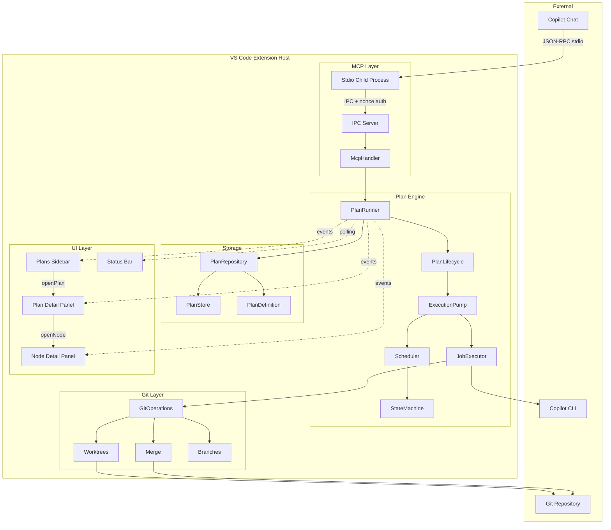

### Design Principles

| Principle | Implementation |
|-----------|----------------|
| **Isolation** | Each node executes in its own git worktree — no interference with the user's working directory |
| **Composability** | Plans are flat DAGs with visual grouping — no nested execution hierarchy |
| **Fault tolerance** | Failed nodes block only their dependents; retry resumes from the failed phase |
| **Extensibility** | DI interfaces (`INodeRunner`, `INodeExecutor`, `IGitOperations`) make every subsystem pluggable |
| **Observability** | Real-time UI updates via event emission on every state transition |
| **Security** | Agents sandboxed to their worktree; MCP bridge uses nonce authentication |

---

## Class Diagram — Core Domain

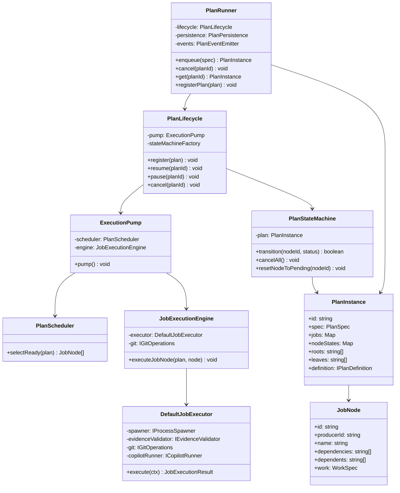

---

## Class Diagram — Storage Layer

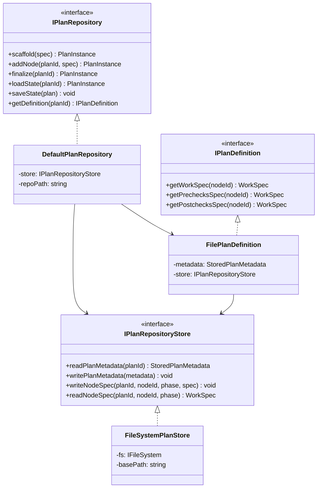

---

## Class Diagram — DI & Adapters

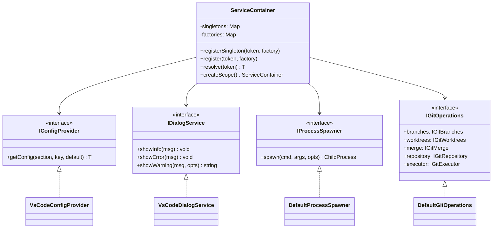

---

## Sequence Diagram — Plan Creation via MCP

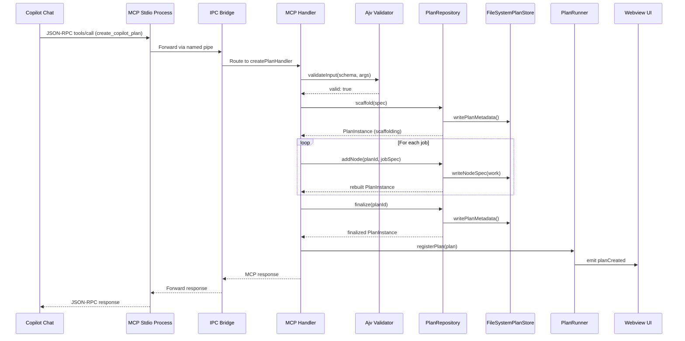

---

## Sequence Diagram — Node Execution Pipeline

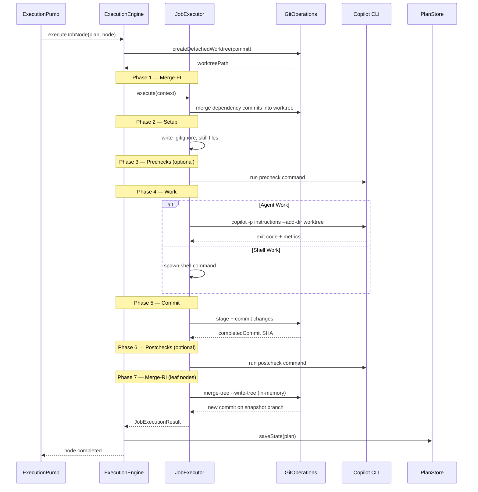

---

## Sequence Diagram — Snapshot Validation & Final Merge

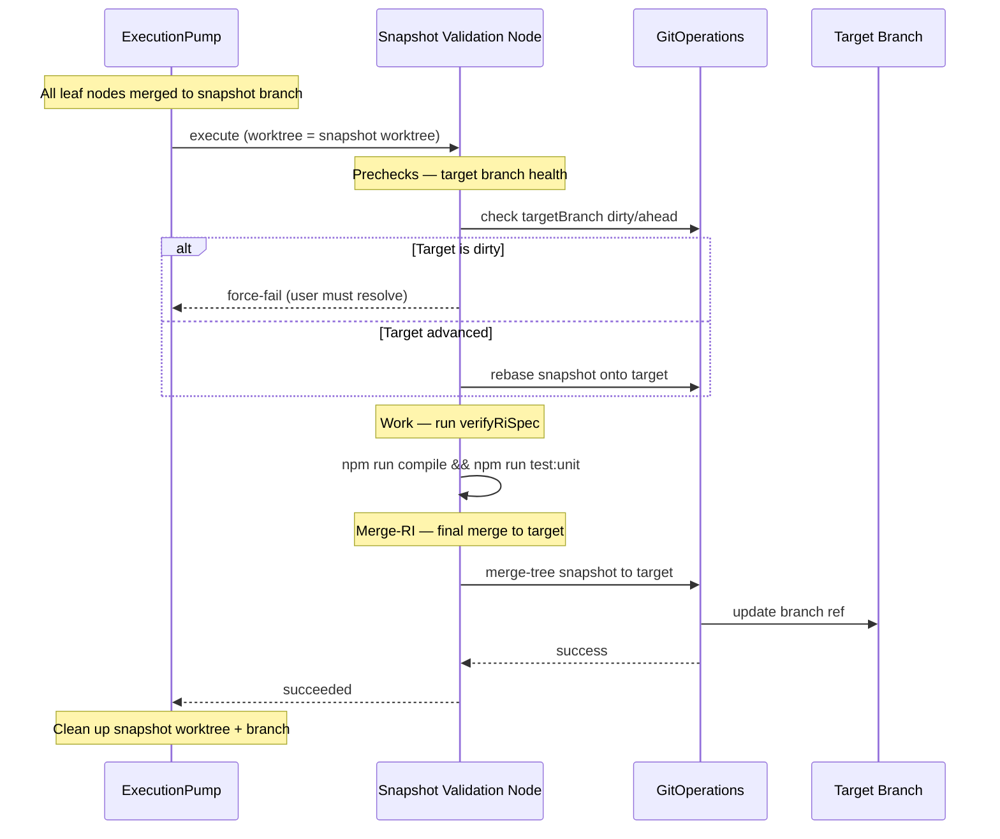

---

## Component Dependency Map

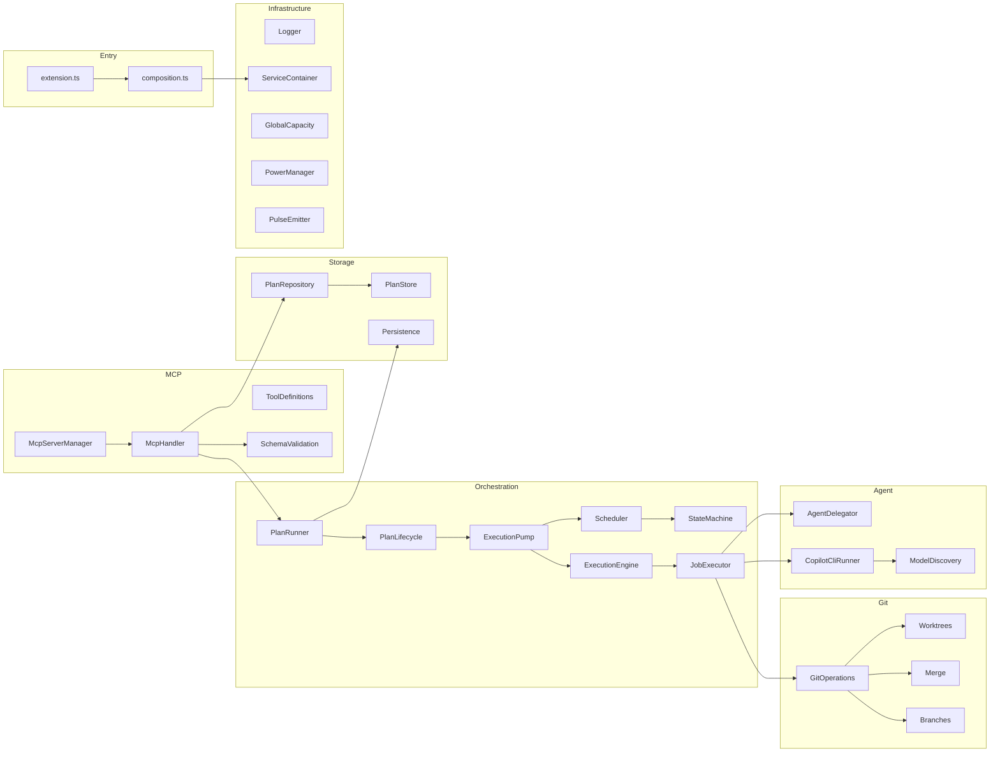

---

## Module Layout

```
src/
├── extension.ts              # Extension activation and lifecycle
├── composition.ts            # Production DI composition root
├── agent/                    # Copilot CLI delegation
│   ├── agentDelegator.ts     #   Agent orchestration and prompt building
│   ├── copilotCliRunner.ts   #   CLI invocation wrapper
│   ├── copilotStatsParser.ts #   Usage metrics extraction
│   ├── modelDiscovery.ts     #   Dynamic model enumeration
│   └── cliCheck*.ts          #   CLI availability detection
├── commands/                 # VS Code command registrations
├── core/                     # Core infrastructure
│   ├── container.ts          #   Symbol-based DI container
│   ├── tokens.ts             #   23 service registration tokens
│   ├── logger.ts             #   Structured logging (Logger.for())
│   ├── globalCapacity.ts     #   Cross-instance job coordination
│   ├── powerManager.ts       #   Sleep prevention during execution
│   ├── pulse.ts              #   UI heartbeat timer
│   └── orphanedWorktreeCleanup.ts
├── git/                      # Git operations
│   ├── DefaultGitOperations.ts  # IGitOperations facade
│   ├── orchestrator.ts       #   High-level git workflows
│   └── core/                 #   Low-level git commands
│       ├── branches.ts       #     Branch CRUD
│       ├── executor.ts       #     Async git command execution
│       ├── merge.ts          #     In-memory merge-tree operations
│       └── worktrees.ts      #     Worktree CRUD with per-repo mutex
├── interfaces/               # 18 DI interface files (one per interface)
├── mcp/                      # Model Context Protocol integration
│   ├── handler.ts            #   Tool dispatch router
│   ├── handlers/             #   Business logic per tool
│   │   ├── plan/             #     scaffold, addJob, finalize, reshape, update
│   │   ├── planHandlers.ts   #     Plan CRUD, status, cancel, retry
│   │   └── jobHandlers.ts    #     Job-centric API
│   ├── tools/                #   JSON Schema tool definitions
│   ├── validation/           #   Ajv schema validation
│   ├── ipc/                  #   Named-pipe IPC bridge
│   └── stdio/                #   Stdio transport for MCP child process
├── plan/                     # DAG execution engine
│   ├── runner.ts             #   PlanRunner — top-level orchestrator
│   ├── planLifecycle.ts      #   Start, pause, resume, cancel
│   ├── executionPump.ts      #   Main scheduling loop
│   ├── executionEngine.ts    #   Per-node 7-phase execution
│   ├── executor.ts           #   DefaultJobExecutor (work routing)
│   ├── stateMachine.ts       #   DAG state transitions & propagation
│   ├── scheduler.ts          #   Capacity-aware node selection
│   ├── builder.ts            #   PlanSpec → PlanInstance DAG builder
│   ├── phases/               #   Individual phase implementations
│   │   ├── mergeFiPhase.ts   #     Forward Integration merge
│   │   ├── setupPhase.ts     #     Worktree environment prep
│   │   ├── precheckPhase.ts  #     Pre-execution validation
│   │   ├── workPhase.ts      #     Agent/shell/process execution
│   │   ├── commitPhase.ts    #     Stage + commit changes
│   │   ├── postcheckPhase.ts #     Post-execution validation
│   │   └── mergeRiPhase.ts   #     Reverse Integration (in-memory)
│   ├── repository/           #   Plan persistence layer
│   └── store/                #   Filesystem storage backend
├── process/                  # OS process monitoring (CPU/memory)
├── types/                    # Shared configuration types
├── ui/                       # VS Code UI components
│   ├── plansViewProvider.ts  #   Sidebar webview
│   ├── statusBar.ts          #   Status bar item
│   ├── panels/               #   Webview panels + controllers
│   ├── templates/            #   HTML/CSS/JS template generators
│   └── webview/              #   Browser-bundled control framework
│       ├── eventBus.ts       #     Pub/sub event bus
│       ├── subscribableControl.ts  # Base control class
│       ├── controls/         #     15 reusable webview controls
│       └── entries/          #     esbuild browser entry points
└── vscode/                   # VS Code API adapters
    └── adapters.ts           #   Production implementations
```

---

## Node State Machine

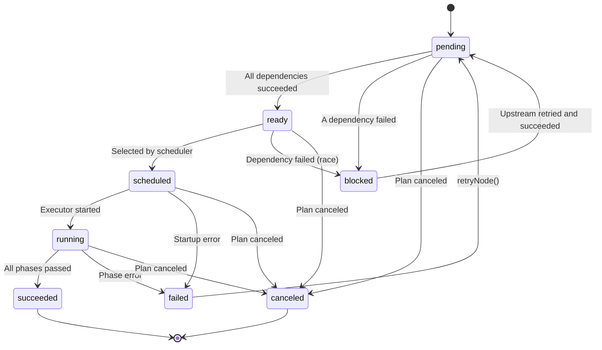

**DAG propagation rules:**
- **On success** → Check all dependents; if all their dependencies succeeded, transition to `ready`
- **On failure** → BFS propagation of `blocked` to all downstream nodes
- **On retry** → `resetNodeToPending()` resets the node and unblocks descendants

---

## 7-Phase Execution Pipeline

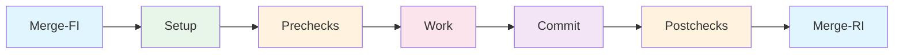

| Phase | Purpose | Skippable |
|-------|---------|-----------|
| **Merge-FI** | Forward-integrate dependency commits into worktree | Never (idempotent) |
| **Setup** | Prepare worktree (.gitignore, skill files, symlinks) | On resume |
| **Prechecks** | Optional validation before work (build, lint) | If not specified |
| **Work** | Execute the actual task (agent/shell/process) | If not specified |
| **Commit** | Stage and commit file changes | On resume |
| **Postchecks** | Optional validation after work (tests) | If not specified |
| **Merge-RI** | In-memory merge to snapshot/target branch (leaf nodes only) | Non-leaf nodes |

On retry, the executor resumes from the failed phase using `resumeFromPhase`, skipping completed phases.

---

## Three-Layer Storage Architecture

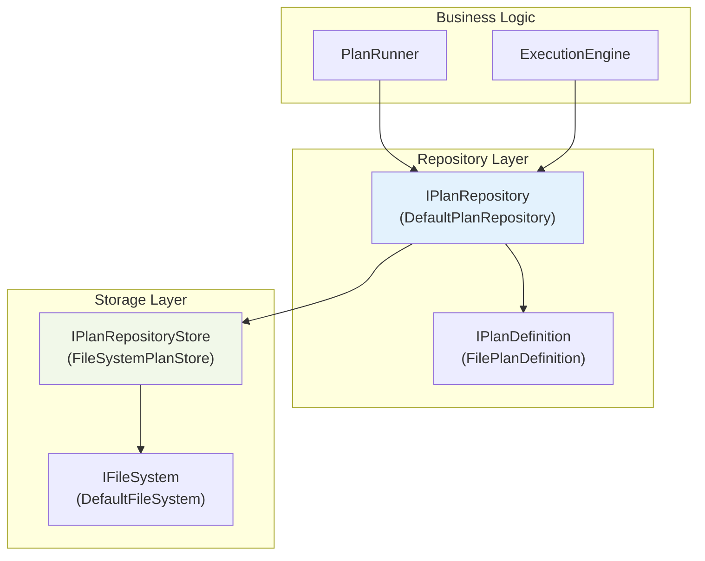

**Filesystem layout:**

```
.orchestrator/plans/<plan-id>/
├── plan.json                      # Topology + execution state
└── specs/<node-id>/
    ├── current/                   # Active specifications
    │   ├── work.json              # Work spec (type, model)
    │   └── work_instructions.md   # Agent instructions (lazy-loaded)
    └── attempts/<n>/              # Per-attempt snapshots
```

---

## MCP Transport Architecture

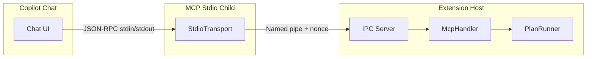

**21 MCP tools** across two APIs:

| API | Tools | Examples |
|-----|-------|----------|
| **Plan-based** | 15 | `create_copilot_plan`, `scaffold_copilot_plan`, `add_copilot_plan_job`, `finalize_copilot_plan`, `get_copilot_plan_status`, `retry_copilot_plan`, `reshape_copilot_plan` |
| **Job-centric** | 6 | `get_copilot_job`, `list_copilot_jobs`, `retry_copilot_job`, `force_fail_copilot_job`, `update_copilot_plan_job` |

---

## DI Token Registry (23 tokens)

| Token | Interface | Concrete Class | Lifetime |
|-------|-----------|---------------|----------|
| `IConfigProvider` | `IConfigProvider` | `VsCodeConfigProvider` | Singleton |
| `IDialogService` | `IDialogService` | `VsCodeDialogService` | Singleton |
| `IClipboardService` | `IClipboardService` | `VsCodeClipboardService` | Singleton |
| `IGitOperations` | `IGitOperations` | `DefaultGitOperations` | Singleton |
| `IProcessSpawner` | `IProcessSpawner` | `DefaultProcessSpawner` | Singleton |
| `IProcessMonitor` | `IProcessMonitor` | `ProcessMonitor` | Singleton |
| `IPulseEmitter` | `IPulseEmitter` | `PulseEmitter` | Singleton |
| `ILogger` | `ILogger` | `Logger` | Singleton |
| `IEnvironment` | `IEnvironment` | `DefaultEnvironment` | Singleton |
| `ICopilotRunner` | `ICopilotRunner` | `CopilotCliRunner` | Singleton |
| `INodeExecutor` | `INodeExecutor` | `DefaultJobExecutor` | Singleton |
| `INodeStateMachine` | `INodeStateMachine` | _(scoped per plan)_ | Transient |
| `INodePersistence` | `INodePersistence` | `PlanPersistence` | Singleton |
| `IEvidenceValidator` | `IEvidenceValidator` | `DefaultEvidenceValidator` | Singleton |
| `IFileSystem` | `IFileSystem` | `DefaultFileSystem` | Singleton |
| `IMcpRequestRouter` | `IMcpRequestRouter` | _(scoped per request)_ | Transient |
| `IMcpManager` | `IMcpManager` | `StdioMcpServerManager` | Singleton |
| `IGlobalCapacity` | `IGlobalCapacity` | `GlobalCapacityManager` | Singleton |
| `IPlanConfigManager` | `IPlanConfigManager` | `PlanConfigManager` | Singleton |
| `IPlanRepositoryStore` | `IPlanRepositoryStore` | `FileSystemPlanStore` | Singleton |
| `IPlanRepository` | `IPlanRepository` | `DefaultPlanRepository` | Singleton |
| `IAgentDelegator` | _(internal)_ | `AgentDelegator` | Singleton |
| `INodeRunner` | `INodeRunner` | _(composed)_ | Singleton |

---

## Security Model

### Agent Sandbox

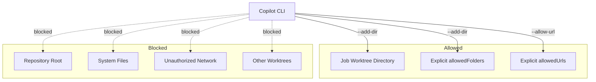

### MCP Authentication

The stdio child process authenticates to the extension host via a nonce:
1. Extension generates random nonce, passes via `MCP_AUTH_NONCE` env var
2. Child presents nonce in IPC handshake
3. Mismatch = connection rejected

### Global Capacity Coordination

Multi-instance coordination via `capacity-registry.json` at the global storage path:
- Instances register on activation, deregister on deactivation
- Heartbeat every 5 seconds; stale instances (>30s) pruned
- Scheduling checks global running count before dispatching work

---

## Related Documentation

| Document | Focus |
|----------|-------|
| [DI Guide](DI_GUIDE.md) | DI patterns, adding services, mocking |
| [Testing Guide](TESTING.md) | Test framework, patterns, coverage |
| [Copilot Integration](COPILOT_INTEGRATION.md) | MCP tools, agent delegation |
| [Groups](GROUPS.md) | Visual hierarchy, namespace isolation |
| [Worktrees & Merging](WORKTREES_AND_MERGING.md) | Git isolation, merge strategies |
| [Contributing](CONTRIBUTING.md) | Setup, workflow, PR process |
