# Architecture

> Copilot Orchestrator — Parallel Copilot-driven development using DAG execution in isolated git worktrees.

## System Overview

Copilot Orchestrator is a VS Code extension that decomposes complex development tasks into a **Directed Acyclic Graph (DAG)** of work nodes, each executing in parallel within isolated git worktrees. It integrates with GitHub Copilot Chat via the **Model Context Protocol (MCP)** and provides real-time visual feedback through VS Code's UI.

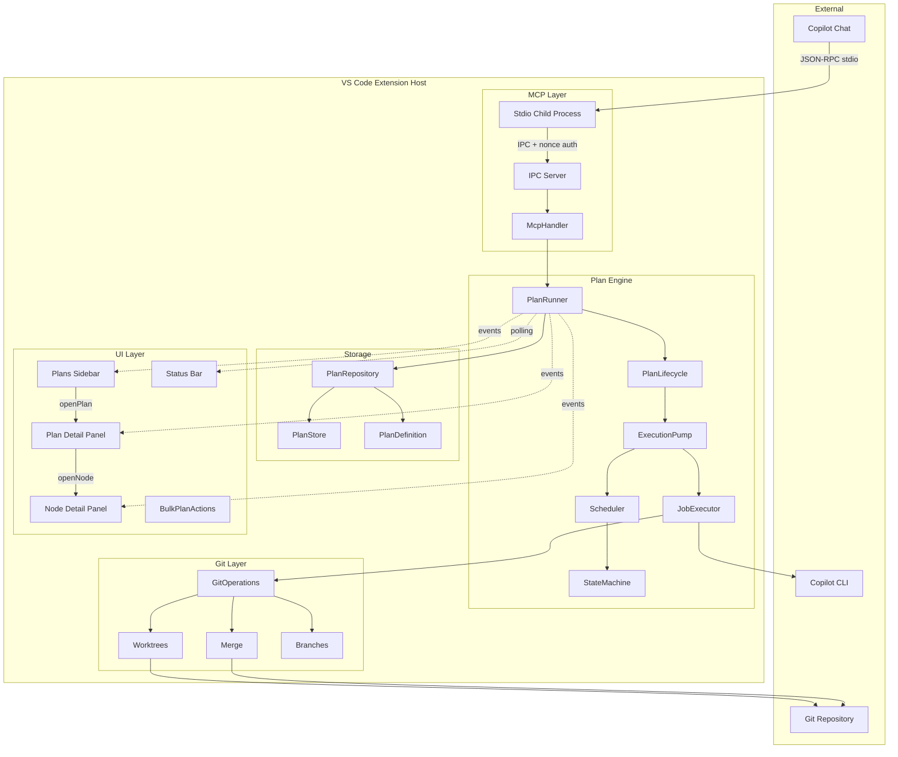
```mermaid
graph TB
    subgraph "External"
        CHAT[Copilot Chat]
        CLI[Copilot CLI]
        REPO[Git Repository]
    end

    subgraph "VS Code Extension Host"
        subgraph "MCP Layer"
            IPC[IPC Server]
            STDIO[Stdio Child Process]
            HANDLER[McpHandler]
        end

        subgraph "Plan Engine"
            PR[PlanRunner]
            LC[PlanLifecycle]
            SM[StateMachine]
            SCH[Scheduler]
            PUMP[ExecutionPump]
            EX[JobExecutor]
        end

        subgraph "Storage"
            REPO_L[PlanRepository]
            STORE[PlanStore]
            DEF[PlanDefinition]
        end

        subgraph "Git Layer"
            GIT[GitOperations]
            WT[Worktrees]
            MRG[Merge]
            BR[Branches]
        end

        subgraph "UI Layer"
            PV[Plans Sidebar]
            SB[Status Bar]
            PDP[Plan Detail Panel]
            NDP[Node Detail Panel]
            BPA[BulkPlanActions]
        end
    end

    CHAT -->|JSON-RPC stdio| STDIO
    STDIO -->|IPC + nonce auth| IPC
    IPC --> HANDLER
    HANDLER --> PR

    PR --> LC
    LC --> PUMP
    PUMP --> SCH
    SCH --> SM
    PUMP --> EX
    EX --> GIT
    EX --> CLI
    PR --> REPO_L
    REPO_L --> STORE
    REPO_L --> DEF

    GIT --> WT
    GIT --> MRG
    GIT --> BR
    WT --> REPO
    MRG --> REPO

    PR -.->|events| PV
    PR -.->|events| PDP
    PR -.->|events| NDP
    PR -.->|polling| SB
    PV -->|openPlan| PDP
    PDP -->|openNode| NDP
```

### Design Principles

| Principle | Implementation |
|-----------|----------------|
| **Isolation** | Each node executes in its own git worktree — no interference with the user's working directory |
| **Composability** | Plans are flat DAGs with visual grouping — no nested execution hierarchy |
| **Fault tolerance** | Failed nodes block only their dependents; retry resumes from the failed phase |
| **Extensibility** | DI interfaces (`INodeRunner`, `INodeExecutor`, `IGitOperations`) make every subsystem pluggable |
| **Observability** | Real-time UI updates via event emission on every state transition |
| **Security** | Agents sandboxed to their worktree; MCP bridge uses nonce authentication |

---

## Class Diagram — Core Domain

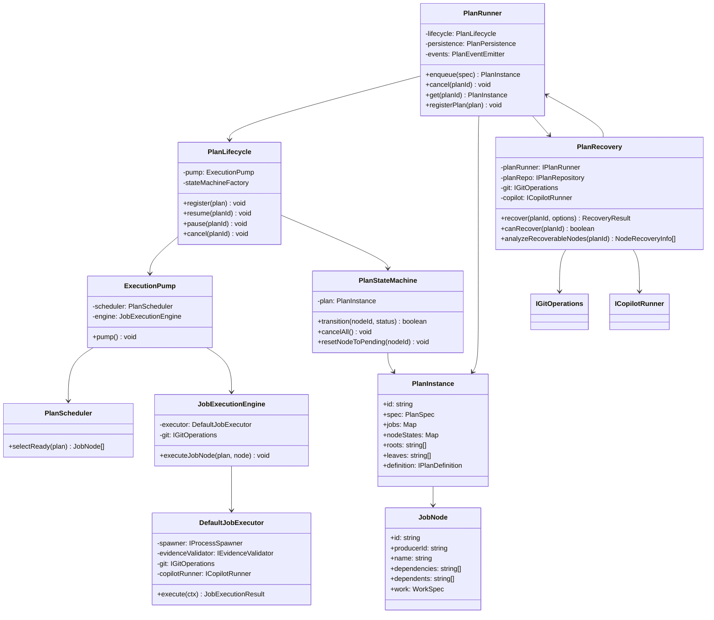
```mermaid
classDiagram
    class PlanRunner {
        -lifecycle: PlanLifecycle
        -persistence: PlanPersistence
        -events: PlanEventEmitter
        +enqueue(spec) PlanInstance
        +cancel(planId) void
        +get(planId) PlanInstance
        +registerPlan(plan) void
    }

    class PlanLifecycle {
        -pump: ExecutionPump
        -stateMachineFactory
        +register(plan) void
        +resume(planId) void
        +pause(planId) void
        +cancel(planId) void
    }

    class ExecutionPump {
        -scheduler: PlanScheduler
        -engine: JobExecutionEngine
        +pump() void
    }

    class PlanScheduler {
        +selectReady(plan) JobNode[]
    }

    class JobExecutionEngine {
        -executor: DefaultJobExecutor
        -git: IGitOperations
        +executeJobNode(plan, node) void
    }

    class DefaultJobExecutor {
        -spawner: IProcessSpawner
        -evidenceValidator: IEvidenceValidator
        -git: IGitOperations
        -copilotRunner: ICopilotRunner
        +execute(ctx) JobExecutionResult
    }

    class PlanStateMachine {
        -plan: PlanInstance
        +transition(nodeId, status) boolean
        +cancelAll() void
        +resetNodeToPending(nodeId) void
    }

    class PlanRecovery {
        -planRunner: IPlanRunner
        -planRepo: IPlanRepository
        -git: IGitOperations
        -copilot: ICopilotRunner
        +recover(planId, options) RecoveryResult
        +canRecover(planId) boolean
        +analyzeRecoverableNodes(planId) NodeRecoveryInfo[]
    }

    class PlanInstance {
        +id: string
        +spec: PlanSpec
        +jobs: Map
        +nodeStates: Map
        +roots: string[]
        +leaves: string[]
        +definition: IPlanDefinition
    }

    class JobNode {
        +id: string
        +producerId: string
        +name: string
        +dependencies: string[]
        +dependents: string[]
        +work: WorkSpec
    }

    PlanRunner --> PlanLifecycle
    PlanRunner --> PlanInstance
    PlanRunner --> PlanRecovery
    PlanRecovery --> PlanRunner
    PlanRecovery --> IGitOperations
    PlanRecovery --> ICopilotRunner
    PlanLifecycle --> ExecutionPump
    ExecutionPump --> PlanScheduler
    ExecutionPump --> JobExecutionEngine
    JobExecutionEngine --> DefaultJobExecutor
    PlanLifecycle --> PlanStateMachine
    PlanStateMachine --> PlanInstance
    PlanInstance --> JobNode
```

---

## Class Diagram — Storage Layer

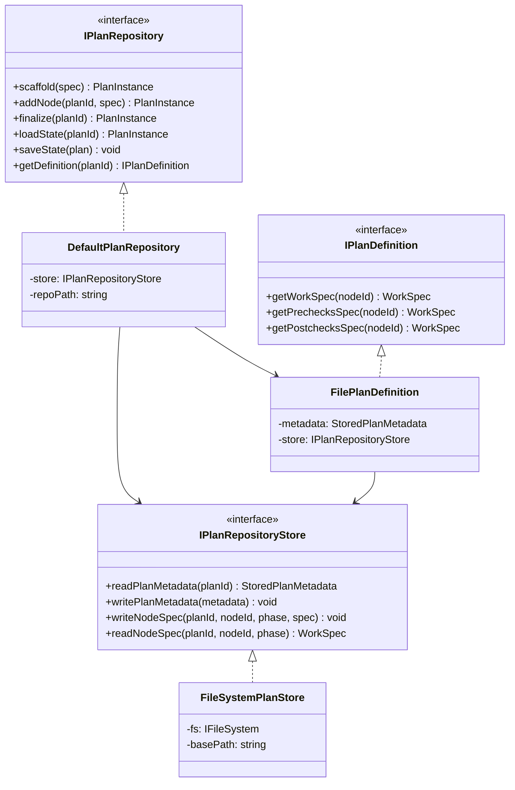
```mermaid
classDiagram
    class IPlanRepository {
        <<interface>>
        +scaffold(spec) PlanInstance
        +addNode(planId, spec) PlanInstance
        +finalize(planId) PlanInstance
        +loadState(planId) PlanInstance
        +saveState(plan) void
        +getDefinition(planId) IPlanDefinition
    }

    class DefaultPlanRepository {
        -store: IPlanRepositoryStore
        -repoPath: string
    }

    class IPlanDefinition {
        <<interface>>
        +getWorkSpec(nodeId) WorkSpec
        +getPrechecksSpec(nodeId) WorkSpec
        +getPostchecksSpec(nodeId) WorkSpec
    }

    class FilePlanDefinition {
        -metadata: StoredPlanMetadata
        -store: IPlanRepositoryStore
    }

    class IPlanRepositoryStore {
        <<interface>>
        +readPlanMetadata(planId) StoredPlanMetadata
        +writePlanMetadata(metadata) void
        +writeNodeSpec(planId, nodeId, phase, spec) void
        +readNodeSpec(planId, nodeId, phase) WorkSpec
    }

    class FileSystemPlanStore {
        -fs: IFileSystem
        -basePath: string
    }

    IPlanRepository <|.. DefaultPlanRepository
    IPlanDefinition <|.. FilePlanDefinition
    IPlanRepositoryStore <|.. FileSystemPlanStore
    DefaultPlanRepository --> IPlanRepositoryStore
    DefaultPlanRepository --> FilePlanDefinition
    FilePlanDefinition --> IPlanRepositoryStore
```

---

## Class Diagram — DI & Adapters

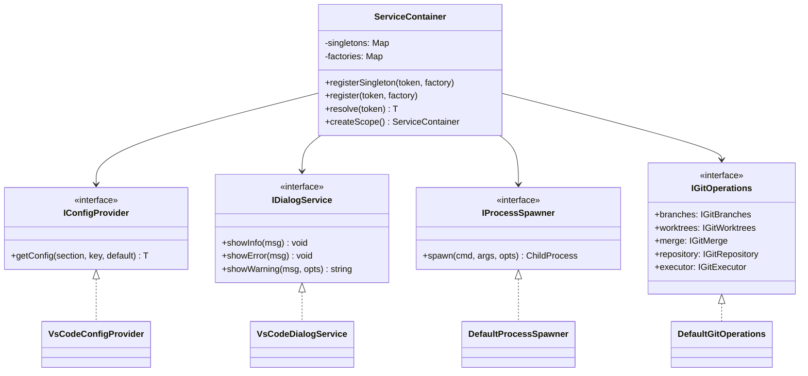
```mermaid
classDiagram
    class ServiceContainer {
        -singletons: Map
        -factories: Map
        +registerSingleton(token, factory)
        +register(token, factory)
        +resolve(token) T
        +createScope() ServiceContainer
    }

    class IConfigProvider {
        <<interface>>
        +getConfig(section, key, default) T
    }
    class IDialogService {
        <<interface>>
        +showInfo(msg) void
        +showError(msg) void
        +showWarning(msg, opts) string
    }
    class IProcessSpawner {
        <<interface>>
        +spawn(cmd, args, opts) ChildProcess
    }
    class IGitOperations {
        <<interface>>
        +branches: IGitBranches
        +worktrees: IGitWorktrees
        +merge: IGitMerge
        +repository: IGitRepository
        +executor: IGitExecutor
    }

    class VsCodeConfigProvider
    class VsCodeDialogService
    class DefaultProcessSpawner
    class DefaultGitOperations

    IConfigProvider <|.. VsCodeConfigProvider
    IDialogService <|.. VsCodeDialogService
    IProcessSpawner <|.. DefaultProcessSpawner
    IGitOperations <|.. DefaultGitOperations

    ServiceContainer --> IConfigProvider
    ServiceContainer --> IDialogService
    ServiceContainer --> IProcessSpawner
    ServiceContainer --> IGitOperations
```

---

## Sequence Diagram — Plan Creation via MCP

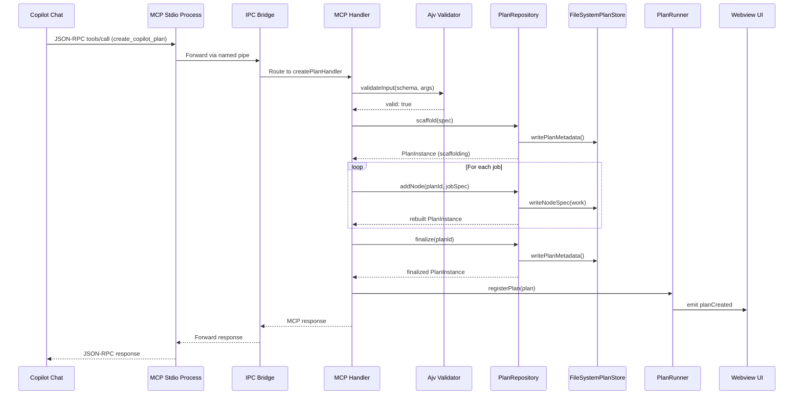
```mermaid
sequenceDiagram
    participant Chat as Copilot Chat
    participant MCP as MCP Stdio Process
    participant IPC as IPC Bridge
    participant Handler as MCP Handler
    participant Validate as Ajv Validator
    participant Repo as PlanRepository
    participant Store as FileSystemPlanStore
    participant Runner as PlanRunner
    participant UI as Webview UI

    Chat->>MCP: JSON-RPC tools/call (create_copilot_plan)
    MCP->>IPC: Forward via named pipe
    IPC->>Handler: Route to createPlanHandler
    Handler->>Validate: validateInput(schema, args)
    Validate-->>Handler: valid: true
    Handler->>Repo: scaffold(spec)
    Repo->>Store: writePlanMetadata()
    Repo-->>Handler: PlanInstance (scaffolding)

    loop For each job
        Handler->>Repo: addNode(planId, jobSpec)
        Repo->>Store: writeNodeSpec(work)
        Repo-->>Handler: rebuilt PlanInstance
    end

    Handler->>Repo: finalize(planId)
    Repo->>Store: writePlanMetadata()
    Repo-->>Handler: finalized PlanInstance
    Handler->>Runner: registerPlan(plan)
    Runner->>UI: emit planCreated

    Handler-->>IPC: MCP response
    IPC-->>MCP: Forward response
    MCP-->>Chat: JSON-RPC response
```

---

## Sequence Diagram — Node Execution Pipeline

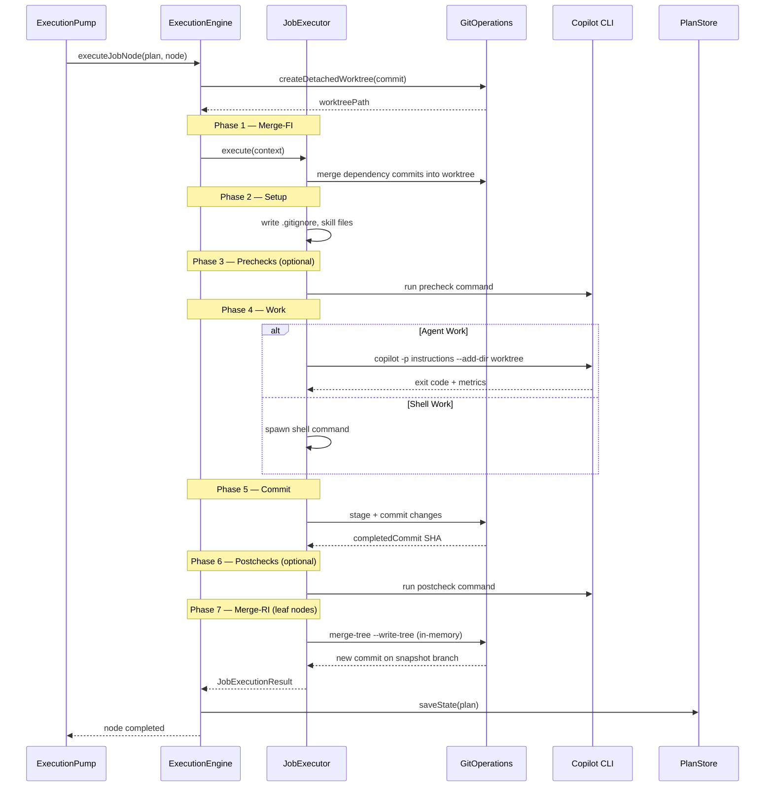
```mermaid
sequenceDiagram
    participant Pump as ExecutionPump
    participant Engine as ExecutionEngine
    participant Exec as JobExecutor
    participant Git as GitOperations
    participant CLI as Copilot CLI
    participant Store as PlanStore

    Pump->>Engine: executeJobNode(plan, node)
    Engine->>Git: createDetachedWorktree(commit)
    Git-->>Engine: worktreePath

    Note over Engine,Exec: Phase 1 — Merge-FI
    Engine->>Exec: execute(context)
    Exec->>Git: merge dependency commits into worktree

    Note over Engine,Exec: Phase 2 — Setup
    Exec->>Exec: write .gitignore, skill files

    Note over Engine,Exec: Phase 3 — Prechecks (optional)
    Exec->>CLI: run precheck command

    Note over Engine,Exec: Phase 4 — Work
    alt Agent Work
        Exec->>CLI: copilot -p instructions --add-dir worktree
        CLI-->>Exec: exit code + metrics
    else Shell Work
        Exec->>Exec: spawn shell command
    end

    Note over Engine,Exec: Phase 5 — Commit
    Exec->>Git: stage + commit changes
    Git-->>Exec: completedCommit SHA

    Note over Engine,Exec: Phase 6 — Postchecks (optional)
    Exec->>CLI: run postcheck command

    Note over Engine,Exec: Phase 7 — Merge-RI (leaf nodes)
    Exec->>Git: merge-tree --write-tree (in-memory)
    Git-->>Exec: new commit on snapshot branch

    Exec-->>Engine: JobExecutionResult
    Engine->>Store: saveState(plan)
    Engine-->>Pump: node completed
```

---

## Sequence Diagram — Snapshot Validation & Final Merge

The Snapshot Validation (SV) node is auto-injected into every plan. It depends on all user-defined leaf nodes, accumulates their work via forward integration, then validates and merges the combined result to the target branch.

**Key invariant**: The SV node's `baseCommit` must be the **original snapshot base commit** (not the worktree HEAD after FI). This ensures the commit phase detects accumulated predecessor work and merge-RI has a real commit to merge.

When no user-provided `verifyRiSpec` exists, the SV node uses a **default verification spec** — a premium-tier agent that cross-references all job deliverables against the actual snapshot changes.

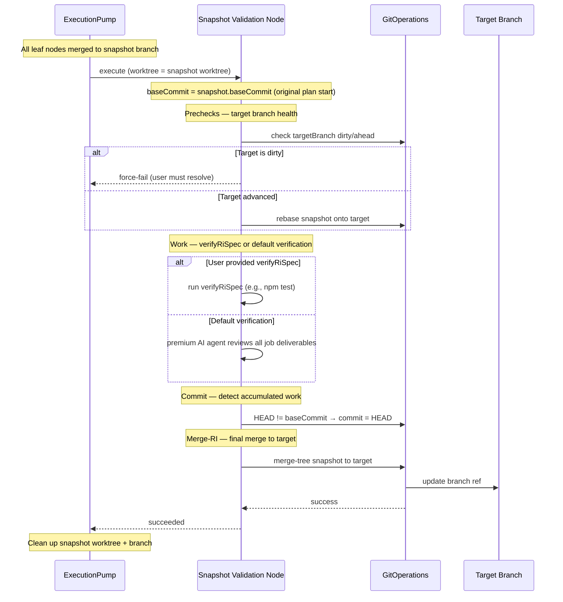
```mermaid
sequenceDiagram
    participant Pump as ExecutionPump
    participant SV as Snapshot Validation Node
    participant Git as GitOperations
    participant Target as Target Branch

    Note over Pump: All leaf nodes merged to snapshot branch

    Pump->>SV: execute (worktree = snapshot worktree)
    Note over SV: baseCommit = snapshot.baseCommit (original plan start)

    Note over SV: Prechecks — target branch health
    SV->>Git: check targetBranch dirty/ahead
    alt Target is dirty
        SV-->>Pump: force-fail (user must resolve)
    else Target advanced
        SV->>Git: rebase snapshot onto target
    end

    Note over SV: Work — verifyRiSpec or default verification
    alt User provided verifyRiSpec
        SV->>SV: run verifyRiSpec (e.g., npm test)
    else Default verification
        SV->>SV: premium AI agent reviews all job deliverables
    end

    Note over SV: Commit — detect accumulated work
    SV->>Git: HEAD != baseCommit → commit = HEAD

    Note over SV: Merge-RI — final merge to target
    SV->>Git: merge-tree snapshot to target
    Git->>Target: update branch ref
    Git-->>SV: success

    SV-->>Pump: succeeded
    Note over Pump: Clean up snapshot worktree + branch
```

---

## Sequence Diagram — Plan Recovery

```mermaid
sequenceDiagram
    participant MCP as MCP Handler
    participant Recovery as PlanRecovery
    participant Runner as PlanRunner
    participant Git as GitOperations
    participant Repo as PlanRepository

    Note over MCP: recover_copilot_plan tool call

    MCP->>Recovery: canRecover(planId)
    Recovery->>Runner: getStatus(planId)
    alt Status is canceled or failed
        Recovery-->>MCP: true
    else Status is running/paused/succeeded
        Recovery-->>MCP: false (error)
    end

    MCP->>Recovery: analyzeRecoverableNodes(planId)
    Recovery->>Runner: get(planId)
    Recovery->>Runner: getStateMachine(planId)
    loop For each node
        Recovery->>Recovery: check node status (succeeded?)
        Recovery->>Recovery: get commitHash from nodeState/attempts/worktree
    end
    Recovery-->>MCP: NodeRecoveryInfo[]

    MCP->>Recovery: recover(planId, options)
    
    Note over Recovery: Step 1: Recreate target branch
    Recovery->>Git: resolveRef(baseBranch)
    Git-->>Recovery: baseCommitHash
    Recovery->>Git: createOrReset(targetBranch, baseCommitHash)

    Note over Recovery: Step 2: Recover worktrees (canceled/failed plans)
    loop For each succeeded node with commit
        Recovery->>Git: resolveRef(commitHash) — verify exists
        Recovery->>Recovery: validate worktree path (no traversal)
        Recovery->>Git: createOrReuseDetached(worktreePath, commitHash)
    end

    opt useCopilotAgent=true
        Recovery->>Recovery: _runRecoveryAgent() — verify integrity
    end

    Note over Recovery: Step 3: Transition to paused
    Recovery->>Runner: pause(planId)
    Runner->>Repo: saveState(plan)

    Recovery-->>MCP: RecoveryResult (success, recoveredNodes, recoveredBranch)

## Sequence Diagram — PR Lifecycle Management

```mermaid
sequenceDiagram
    participant Chat as Copilot Chat
    participant MCP as MCP Handler
    participant PRMgr as PRLifecycleManager
    participant Store as ManagedPRStore
    participant Remote as RemotePRService
    participant Monitor as ReleasePRMonitor
    participant Agent as Copilot Agent

    Note over Chat,Agent: PR Discovery & Adoption

    Chat->>MCP: list_available_prs(repoPath, baseBranch)
    MCP->>PRMgr: listAvailablePRs(options)
    PRMgr->>Remote: getPRs(filters)
    Remote-->>PRMgr: [PR #42, PR #38, ...]
    PRMgr->>Store: loadAll()
    Store-->>PRMgr: [managedPR records]
    PRMgr-->>MCP: [{prNumber, title, isManaged, ...}]
    MCP-->>Chat: PRs with managed status

    Chat->>MCP: adopt_pr(prNumber: 42, priority: 1)
    MCP->>PRMgr: adoptPR(options)
    PRMgr->>Remote: getPR(42)
    Remote-->>PRMgr: PR metadata
    PRMgr->>PRMgr: create ManagedPR (status: adopted)
    PRMgr->>Store: save(managedPR)
    PRMgr-->>MCP: {success: true, managedPR}
    MCP-->>Chat: PR adopted

    Note over Chat,Agent: Monitoring Lifecycle

    Chat->>MCP: start_pr_monitoring(id)
    MCP->>PRMgr: startMonitoring(id)
    PRMgr->>PRMgr: transition adopted → monitoring
    PRMgr->>Monitor: registerPR(managedPR)
    Monitor->>Monitor: start 40-min monitoring cycle
    PRMgr-->>MCP: {success: true}

    loop Every 2 minutes for 40 minutes
        Monitor->>Remote: checkCI()
        Remote-->>Monitor: check status
        Monitor->>Remote: getComments()
        Remote-->>Monitor: unresolved threads
        Monitor->>Remote: getSecurityAlerts()
        Remote-->>Monitor: vulnerabilities

        alt Issues detected
            Monitor->>PRMgr: transition monitoring → addressing
            Monitor->>Agent: spawn fix agent (failure context)
            Agent->>Agent: fix issue + commit + push
            Agent-->>Monitor: fix completed
            Monitor->>PRMgr: transition addressing → monitoring
        else All clear
            Monitor->>PRMgr: update (ready or blocked)
        end
    end

    Note over Chat,Agent: Priority & Lifecycle Management

    Chat->>MCP: promote_pr(id)
    MCP->>PRMgr: promotePR(id)
    PRMgr->>PRMgr: increment priority tier
    PRMgr->>Store: save(managedPR)
    PRMgr-->>MCP: {success: true}

    Chat->>MCP: abandon_pr(id)
    MCP->>PRMgr: abandonPR(id)
    PRMgr->>Monitor: unregisterPR(id)
    PRMgr->>PRMgr: transition → abandoned
    PRMgr->>Store: save(managedPR)
    PRMgr-->>MCP: {success: true}
```

---

### Recovery Flow Details

1. **Validate plan is recoverable**: Only `canceled` or `failed` plans can be recovered
2. **Recreate target branch**: Reset target branch to base branch commit (initial state)
3. **Analyze DAG for successful nodes**: Use git rev-parse to check commit existence and DAG status for work completion
4. **Create worktrees from successful commits**: Recover deepest successful node worktrees at their completed commits
5. **Optionally invoke Copilot CLI**: Verify recovery integrity with agent (currently stubbed)
6. **Transition plan to paused state**: Plan enters paused state for safe inspection
7. **Reset failed/canceled nodes to pending**: Failed nodes are ready to retry from their last successful dependency

---

## Sequence Diagram — Webview Bulk Actions

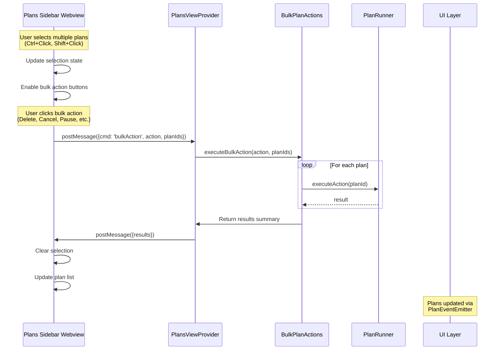
```mermaid
sequenceDiagram
    participant Webview as Plans Sidebar Webview
    participant Provider as PlansViewProvider
    participant BPA as BulkPlanActions
    participant Runner as PlanRunner
    participant UI as UI Layer

    Note over Webview: User selects multiple plans<br/>(Ctrl+Click, Shift+Click)
    Webview->>Webview: Update selection state
    Webview->>Webview: Enable bulk action buttons

    Note over Webview: User clicks bulk action<br/>(Delete, Cancel, Pause, etc.)
    Webview->>Provider: postMessage({cmd: 'bulkAction', action, planIds})
    Provider->>BPA: executeBulkAction(action, planIds)

    loop For each plan
        BPA->>Runner: executeAction(planId)
        Runner-->>BPA: result
    end

    BPA->>Provider: Return results summary
    Provider->>Webview: postMessage({results})
    Webview->>Webview: Clear selection
    Webview->>Webview: Update plan list

    Note over UI: Plans updated via<br/>PlanEventEmitter
```

---

## State Machine — PR Lifecycle

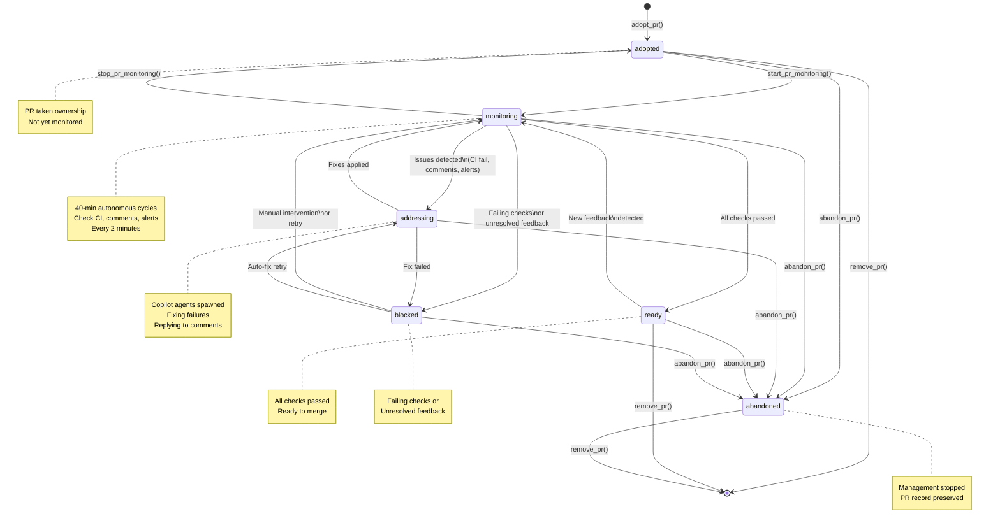
```mermaid
stateDiagram-v2
    [*] --> adopted: adopt_pr()

    adopted --> monitoring: start_pr_monitoring()
    adopted --> abandoned: abandon_pr()
    adopted --> [*]: remove_pr()

    monitoring --> addressing: Issues detected\n(CI fail, comments, alerts)
    monitoring --> ready: All checks passed
    monitoring --> blocked: Failing checks\nor unresolved feedback
    monitoring --> adopted: stop_pr_monitoring()
    monitoring --> abandoned: abandon_pr()

    addressing --> monitoring: Fixes applied
    addressing --> blocked: Fix failed
    addressing --> abandoned: abandon_pr()

    ready --> monitoring: New feedback\ndetected
    ready --> abandoned: abandon_pr()
    ready --> [*]: remove_pr()

    blocked --> monitoring: Manual intervention\nor retry
    blocked --> addressing: Auto-fix retry
    blocked --> abandoned: abandon_pr()

    abandoned --> [*]: remove_pr()

    note right of adopted
        PR taken ownership
        Not yet monitored
    end note

    note right of monitoring
        40-min autonomous cycles
        Check CI, comments, alerts
        Every 2 minutes
    end note

    note right of addressing
        Copilot agents spawned
        Fixing failures
        Replying to comments
    end note

    note right of ready
        All checks passed
        Ready to merge
    end note

    note right of blocked
        Failing checks or
        Unresolved feedback
    end note

    note right of abandoned
        Management stopped
        PR record preserved
    end note
```

---
## Component Dependency Map

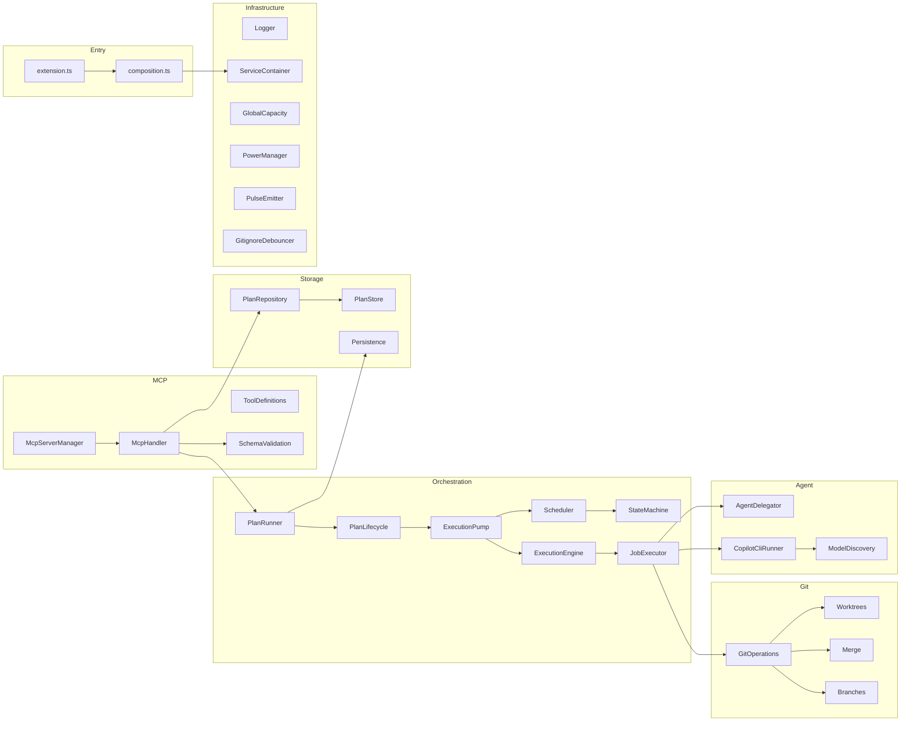
```mermaid
graph LR
    subgraph "Entry"
        EXT[extension.ts]
        COMP[composition.ts]
    end

    subgraph "Orchestration"
        PR[PlanRunner]
        LC[PlanLifecycle]
        PUMP[ExecutionPump]
        SM[StateMachine]
        SCH[Scheduler]
        ENG[ExecutionEngine]
        EXEC[JobExecutor]
    end

    subgraph "MCP"
        MGR[McpServerManager]
        HAND[McpHandler]
        TOOLS[ToolDefinitions]
        VAL[SchemaValidation]
    end

    subgraph "Storage"
        REPO[PlanRepository]
        STORE[PlanStore]
        PERS[Persistence]
    end

    subgraph "Git"
        GITOPS[GitOperations]
        WT[Worktrees]
        MRG[Merge]
        BR[Branches]
    end

    subgraph "Agent"
        DELEG[AgentDelegator]
        COPRUN[CopilotCliRunner]
        DISC[ModelDiscovery]
    end

    subgraph "Infrastructure"
        LOG[Logger]
        CONT[ServiceContainer]
        GLOB[GlobalCapacity]
        PWR[PowerManager]
        PULSE[PulseEmitter]
        GITDEB[GitignoreDebouncer]
    end

    EXT --> COMP
    COMP --> CONT

    PR --> LC
    PR --> PERS
    LC --> PUMP
    PUMP --> SCH
    PUMP --> ENG
    SCH --> SM
    ENG --> EXEC

    EXEC --> GITOPS
    EXEC --> COPRUN
    EXEC --> DELEG

    HAND --> PR
    HAND --> REPO
    HAND --> VAL
    MGR --> HAND

    REPO --> STORE
    GITOPS --> WT
    GITOPS --> MRG
    GITOPS --> BR

    COPRUN --> DISC
```

---

## Module Layout

```
src/
├── extension.ts              # Extension activation and lifecycle
├── composition.ts            # Production DI composition root
├── agent/                    # Copilot CLI delegation
│   ├── agentDelegator.ts     #   Agent orchestration and prompt building
│   ├── copilotCliRunner.ts   #   CLI invocation wrapper
│   ├── copilotStatsParser.ts #   Usage metrics extraction
│   ├── modelDiscovery.ts     #   Dynamic model enumeration
│   └── cliCheck*.ts          #   CLI availability detection
├── commands/                 # VS Code command registrations
├── core/                     # Core infrastructure
│   ├── container.ts          #   Symbol-based DI container
│   ├── tokens.ts             #   23 service registration tokens
│   ├── logger.ts             #   Structured logging (Logger.for())
│   ├── globalCapacity.ts     #   Cross-instance job coordination
│   ├── powerManager.ts       #   Sleep prevention during execution
│   ├── pulse.ts              #   UI heartbeat timer
│   ├── gitignoreDebouncer.ts #   Branch-change-aware .gitignore write delay
│   └── orphanedWorktreeCleanup.ts
├── git/                      # Git operations
│   ├── DefaultGitOperations.ts  # IGitOperations facade
│   ├── orchestrator.ts       #   High-level git workflows
│   └── core/                 #   Low-level git commands
│       ├── branches.ts       #     Branch CRUD
│       ├── executor.ts       #     Async git command execution
│       ├── merge.ts          #     In-memory merge-tree operations
│       └── worktrees.ts      #     Worktree CRUD with per-repo mutex
├── interfaces/               # 18 DI interface files (one per interface)
├── mcp/                      # Model Context Protocol integration
│   ├── handler.ts            #   Tool dispatch router
│   ├── handlers/             #   Business logic per tool
│   │   ├── plan/             #     scaffold, addJob, finalize, reshape, update
│   │   ├── planHandlers.ts   #     Plan CRUD, status, cancel, retry
│   │   └── jobHandlers.ts    #     Job-centric API
│   ├── tools/                #   JSON Schema tool definitions
│   ├── validation/           #   Ajv schema validation
│   ├── ipc/                  #   Named-pipe IPC bridge
│   └── stdio/                #   Stdio transport for MCP child process
├── plan/                     # DAG execution engine
│   ├── runner.ts             #   PlanRunner — top-level orchestrator
│   ├── planLifecycle.ts      #   Start, pause, resume, cancel
│   ├── executionPump.ts      #   Main scheduling loop
│   ├── executionEngine.ts    #   Per-node 7-phase execution
│   ├── executor.ts           #   DefaultJobExecutor (work routing)
│   ├── stateMachine.ts       #   DAG state transitions & propagation
│   ├── scheduler.ts          #   Capacity-aware node selection
│   ├── builder.ts            #   PlanSpec → PlanInstance DAG builder
│   ├── svNodeBuilder.ts      #   Snapshot Validation node spec builder
│   ├── analysis/             #   Job analysis utilities
│   │   └── complexityScorer.ts  # Complexity scoring + decomposition warnings
│   ├── phases/               #   Individual phase implementations
│   │   ├── mergeFiPhase.ts   #     Forward Integration merge
│   │   ├── setupPhase.ts     #     Worktree environment prep
│   │   ├── precheckPhase.ts  #     Pre-execution validation
│   │   ├── workPhase.ts      #     Agent/shell/process execution
│   │   ├── commitPhase.ts    #     Stage + commit changes
│   │   ├── postcheckPhase.ts #     Post-execution validation
│   │   └── mergeRiPhase.ts   #     Reverse Integration (in-memory)
│   ├── repository/           #   Plan persistence layer
│   └── store/                #   Filesystem storage backend
├── process/                  # OS process monitoring (CPU/memory)
├── types/                    # Shared configuration types
├── ui/                       # VS Code UI components
│   ├── plansViewProvider.ts  #   Sidebar webview
│   ├── statusBar.ts          #   Status bar item
│   ├── panels/               #   Webview panels + controllers
│   ├── templates/            #   HTML/CSS/JS template generators
│   └── webview/              #   Browser-bundled control framework
│       ├── eventBus.ts       #     Pub/sub event bus
│       ├── subscribableControl.ts  # Base control class
│       ├── controls/         #     15 reusable webview controls
│       └── entries/          #     esbuild browser entry points
└── vscode/                   # VS Code API adapters
    └── adapters.ts           #   Production implementations
```

---

## Node State Machine

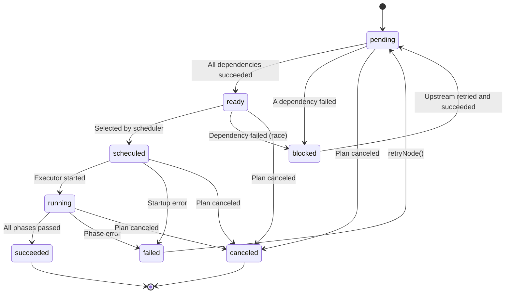
```mermaid
stateDiagram-v2
    [*] --> pending
    pending --> ready : All dependencies succeeded
    pending --> blocked : A dependency failed
    pending --> canceled : Plan canceled

    ready --> scheduled : Selected by scheduler
    ready --> blocked : Dependency failed (race)
    ready --> canceled : Plan canceled

    scheduled --> running : Executor started
    scheduled --> failed : Startup error
    scheduled --> canceled : Plan canceled

    running --> succeeded : All phases passed
    running --> failed : Phase error
    running --> canceled : Plan canceled

    failed --> pending : retryNode()
    blocked --> pending : Upstream retried and succeeded

    succeeded --> [*]
    canceled --> [*]
```

**DAG propagation rules:**
- **On success** → Check all dependents; if all their dependencies succeeded, transition to `ready`
- **On failure** → BFS propagation of `blocked` to all downstream nodes
- **On retry** → `resetNodeToPending()` resets the node and unblocks descendants

---

## 7-Phase Execution Pipeline

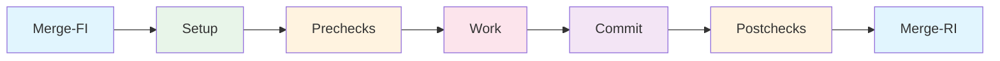
```mermaid
graph LR
    MFI[Merge-FI] --> SETUP[Setup]
    SETUP --> PRE[Prechecks]
    PRE --> WORK[Work]
    WORK --> COMMIT[Commit]
    COMMIT --> POST[Postchecks]
    POST --> MRI[Merge-RI]

    style MFI fill:#e1f5fe
    style SETUP fill:#e8f5e9
    style PRE fill:#fff3e0
    style WORK fill:#fce4ec
    style COMMIT fill:#f3e5f5
    style POST fill:#fff3e0
    style MRI fill:#e1f5fe
```

| Phase | Purpose | Skippable |
|-------|---------|-----------|
| **Merge-FI** | Forward-integrate dependency commits into worktree | Never (idempotent) |
| **Setup** | Prepare worktree (.gitignore, skill files, symlinks) | On resume |
| **Prechecks** | Optional validation before work (build, lint) | If not specified |
| **Work** | Execute the actual task (agent/shell/process) | If not specified |
| **Commit** | Stage and commit file changes | On resume |
| **Postchecks** | Optional validation after work (tests) | If not specified |
| **Merge-RI** | In-memory merge to snapshot/target branch (leaf nodes only) | Non-leaf nodes |

On retry, the executor resumes from the failed phase using `resumeFromPhase`, skipping completed phases.

---

## Three-Layer Storage Architecture

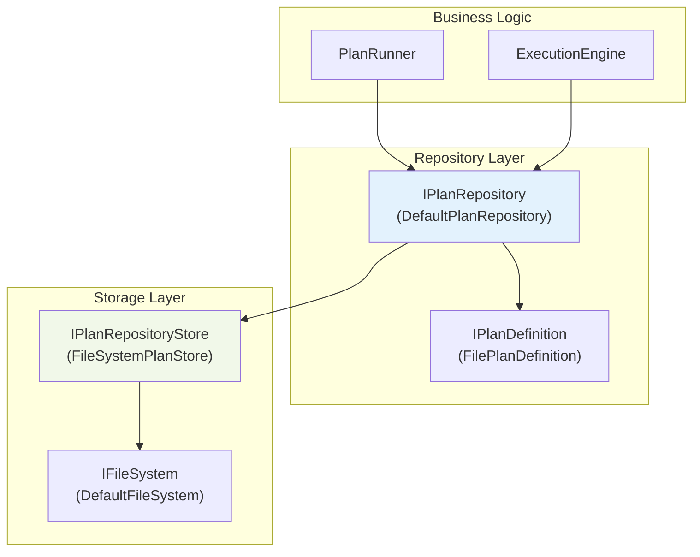
```mermaid
graph TB
    subgraph "Business Logic"
        Runner[PlanRunner]
        Engine[ExecutionEngine]
    end

    subgraph "Repository Layer"
        Repo["IPlanRepository<br/>(DefaultPlanRepository)"]
        Def["IPlanDefinition<br/>(FilePlanDefinition)"]
    end

    subgraph "Storage Layer"
        Store["IPlanRepositoryStore<br/>(FileSystemPlanStore)"]
        FS["IFileSystem<br/>(DefaultFileSystem)"]
    end

    Runner --> Repo
    Engine --> Repo
    Repo --> Def
    Repo --> Store
    Store --> FS

    style Repo fill:#e3f2fd
    style Store fill:#f1f8e9
```

**Filesystem layout:**

```
.orchestrator/plans/<plan-id>/
├── plan.json                      # Topology + execution state
└── specs/<node-id>/
    ├── current/                   # Active specifications
    │   ├── work.json              # Work spec (type, model)
    │   └── work_instructions.md   # Agent instructions (lazy-loaded)
    └── attempts/<n>/              # Per-attempt snapshots
```

---

## Plan Archiving

The `PlanArchiver` service preserves completed plan state/logs while cleaning up git worktrees and branches to reduce repository clutter.

### Archive Flow

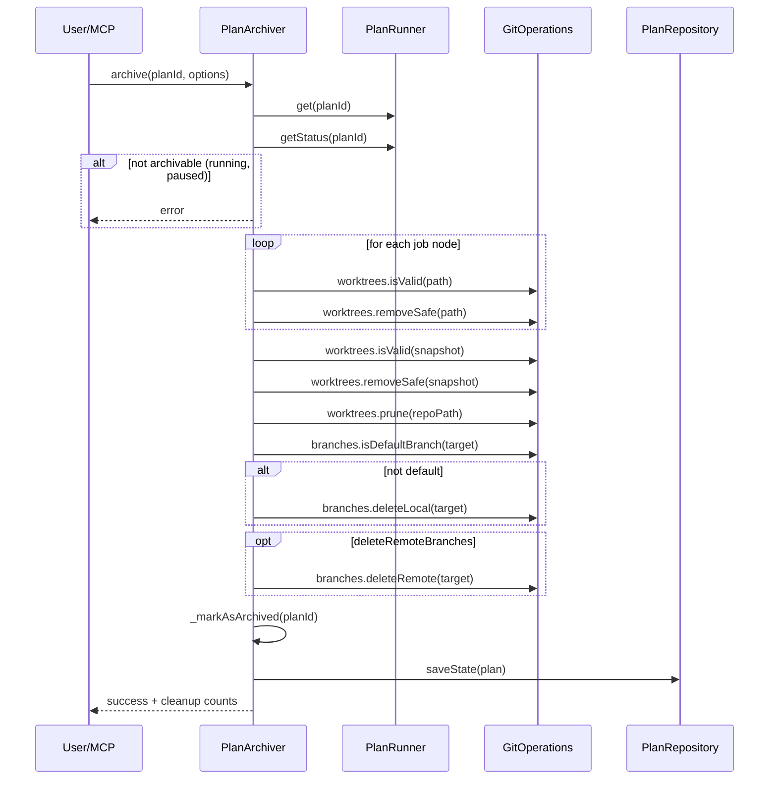
```mermaid
sequenceDiagram
    participant UI as User/MCP
    participant Arch as PlanArchiver
    participant Runner as PlanRunner
    participant Git as GitOperations
    participant Repo as PlanRepository

    UI->>Arch: archive(planId, options)
    Arch->>Runner: get(planId)
    Arch->>Runner: getStatus(planId)
    alt not archivable (running, paused)
        Arch-->>UI: error
    end
    
    loop for each job node
        Arch->>Git: worktrees.isValid(path)
        Arch->>Git: worktrees.removeSafe(path)
    end
    
    Arch->>Git: worktrees.isValid(snapshot)
    Arch->>Git: worktrees.removeSafe(snapshot)
    Arch->>Git: worktrees.prune(repoPath)
    
    Arch->>Git: branches.isDefaultBranch(target)
    alt not default
        Arch->>Git: branches.deleteLocal(target)
    end
    
    opt deleteRemoteBranches
        Arch->>Git: branches.deleteRemote(target)
    end
    
    Arch->>Arch: _markAsArchived(planId)
    Arch->>Repo: saveState(plan)
    
    Arch-->>UI: success + cleanup counts
```

### Archive Process

1. **Validate plan is archivable** (status: succeeded, partial, failed, or canceled)
2. **Remove all job worktrees** (validates paths are inside repo/worktree root)
3. **Remove snapshot worktree** (if exists)
4. **Delete local target branch** (never deletes default branch)
5. **Delete snapshot branch** (force delete)
6. **Optionally delete remote branches** (if `deleteRemoteBranches: true`)
7. **Prune stale worktree references** (`git worktree prune`)
8. **Mark plan as 'archived'** (adds state transition to plan history)
9. **Persist updated state** (saves to disk)
10. **Emit planUpdated event** (refreshes UI)

### Security Validation

- **Path traversal prevention**: Worktree paths validated with `path.resolve()` + `startsWith()` check
- **Dangerous paths rejected**: Worktrees outside `repoPath` or `worktreeRoot` are skipped with warning
- **Default branch protection**: Never deletes the default branch (e.g., `main`, `master`)
- **Graceful degradation**: Individual cleanup failures (worktree, branch) don't halt the archive process

---

## MCP Transport Architecture


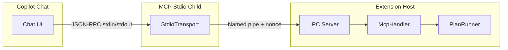
```mermaid
graph LR
    subgraph "Copilot Chat"
        CHAT[Chat UI]
    end

    subgraph "MCP Stdio Child"
        STDIO[StdioTransport]
    end

    subgraph "Extension Host"
        IPC_S[IPC Server]
        ROUTE[McpHandler]
        PLAN[PlanRunner]
    end

    CHAT -->|JSON-RPC stdin/stdout| STDIO
    STDIO -->|Named pipe + nonce| IPC_S
    IPC_S --> ROUTE
    ROUTE --> PLAN
```

**26 MCP tools** across three APIs:

| API | Tools | Examples |
|-----|-------|----------|
| **Plan-based** | 15 | `create_copilot_plan`, `scaffold_copilot_plan`, `add_copilot_plan_job`, `finalize_copilot_plan`, `get_copilot_plan_status`, `retry_copilot_plan`, `reshape_copilot_plan` |
| **Job-centric** | 6 | `get_copilot_job`, `list_copilot_jobs`, `retry_copilot_job`, `force_fail_copilot_job`, `update_copilot_plan_job` |
| **Release Management** | 5 | `create_copilot_release`, `start_copilot_release`, `get_copilot_release_status`, `cancel_copilot_release`, `list_copilot_releases` |

---

## DI Token Registry (36 tokens)

| Token | Interface | Concrete Class | Lifetime |
|-------|-----------|---------------|----------|
| `IConfigProvider` | `IConfigProvider` | `VsCodeConfigProvider` | Singleton |
| `IDialogService` | `IDialogService` | `VsCodeDialogService` | Singleton |
| `IClipboardService` | `IClipboardService` | `VsCodeClipboardService` | Singleton |
| `IGitOperations` | `IGitOperations` | `DefaultGitOperations` | Singleton |
| `IProcessSpawner` | `IProcessSpawner` | `DefaultProcessSpawner` | Singleton |
| `IProcessMonitor` | `IProcessMonitor` | `ProcessMonitor` | Singleton |
| `IPulseEmitter` | `IPulseEmitter` | `PulseEmitter` | Singleton |
| `ILogger` | `ILogger` | `Logger` | Singleton |
| `IEnvironment` | `IEnvironment` | `DefaultEnvironment` | Singleton |
| `ICopilotRunner` | `ICopilotRunner` | `CopilotCliRunner` | Singleton |
| `INodeExecutor` | `INodeExecutor` | `DefaultJobExecutor` | Singleton |
| `INodeStateMachine` | `INodeStateMachine` | _(scoped per plan)_ | Transient |
| `INodePersistence` | `INodePersistence` | `PlanPersistence` | Singleton |
| `IEvidenceValidator` | `IEvidenceValidator` | `DefaultEvidenceValidator` | Singleton |
| `IFileSystem` | `IFileSystem` | `DefaultFileSystem` | Singleton |
| `IMcpRequestRouter` | `IMcpRequestRouter` | _(scoped per request)_ | Transient |
| `IMcpManager` | `IMcpManager` | `StdioMcpServerManager` | Singleton |
| `IGlobalCapacity` | `IGlobalCapacity` | `GlobalCapacityManager` | Singleton |
| `IPlanConfigManager` | `IPlanConfigManager` | `PlanConfigManager` | Singleton |
| `IPlanRepositoryStore` | `IPlanRepositoryStore` | `FileSystemPlanStore` | Singleton |
| `IPlanRepository` | `IPlanRepository` | `DefaultPlanRepository` | Singleton |
| `IPlanArchiver` | `IPlanArchiver` | `PlanArchiver` | Singleton |
| `IAgentDelegator` | _(internal)_ | `AgentDelegator` | Singleton |
| `INodeRunner` | `INodeRunner` | _(composed)_ | Singleton |
| `IReleaseManager` | `IReleaseManager` | `DefaultReleaseManager` | Singleton |
| `IReleasePRMonitor` | `IReleasePRMonitor` | `DefaultReleasePRMonitor` | Singleton |
| `IIsolatedRepoManager` | `IIsolatedRepoManager` | `DefaultIsolatedRepoManager` | Singleton |
| `IReleaseStore` | `IReleaseStore` | `FileSystemReleaseStore` | Singleton |
| `IRemotePRService` | `IRemotePRService` | `GitHubPRService` / `AdoPRService` | Transient |
| `IRemoteProviderDetector` | `IRemoteProviderDetector` | `DefaultRemoteProviderDetector` | Singleton |
| `IRemotePRServiceFactory` | `IRemotePRServiceFactory` | `DefaultRemotePRServiceFactory` | Singleton |
| `IReleaseConfigManager` | `IReleaseConfigManager` | `DefaultReleaseConfigManager` | Singleton |

---

## Security Model

### Agent Sandbox

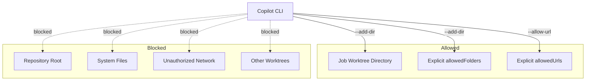
```mermaid
graph TB
    subgraph "Allowed"
        WT[Job Worktree Directory]
        AF[Explicit allowedFolders]
        AU[Explicit allowedUrls]
    end

    subgraph "Blocked"
        ROOT[Repository Root]
        SYS[System Files]
        NET[Unauthorized Network]
        OTHER[Other Worktrees]
    end

    CLI[Copilot CLI] -->|--add-dir| WT
    CLI -->|--add-dir| AF
    CLI -->|--allow-url| AU
    CLI -.->|blocked| ROOT
    CLI -.->|blocked| SYS
    CLI -.->|blocked| NET
    CLI -.->|blocked| OTHER
```

### MCP Authentication

The stdio child process authenticates to the extension host via a nonce:
1. Extension generates random nonce, passes via `MCP_AUTH_NONCE` env var
2. Child presents nonce in IPC handshake
3. Mismatch = connection rejected

### Global Capacity Coordination

Multi-instance coordination via `capacity-registry.json` at the global storage path:
- Instances register on activation, deregister on deactivation
- Heartbeat every 5 seconds; stale instances (>30s) pruned
- Scheduling checks global running count before dispatching work

---

## Release Architecture

The release system combines multiple plan commits into a single pull request with autonomous monitoring and feedback resolution, supporting GitHub, GitHub Enterprise, and Azure DevOps.

### Release Pipeline Flow

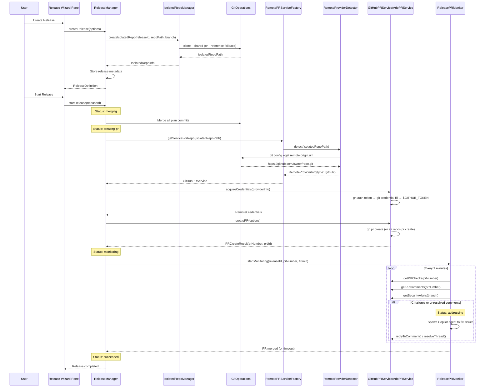
```mermaid
sequenceDiagram
    participant User
    participant UI as Release Wizard Panel
    participant RM as ReleaseManager
    participant IRM as IsolatedRepoManager
    participant Git as GitOperations
    participant Factory as RemotePRServiceFactory
    participant Detector as RemoteProviderDetector
    participant Service as GitHubPRService/AdoPRService
    participant Monitor as ReleasePRMonitor

    User->>UI: Create Release
    UI->>RM: createRelease(options)
    RM->>IRM: createIsolatedRepo(releaseId, repoPath, branch)
    IRM->>Git: clone --shared (or --reference fallback)
    Git-->>IRM: isolatedRepoPath
    IRM-->>RM: IsolatedRepoInfo
    RM->>RM: Store release metadata
    RM-->>UI: ReleaseDefinition

    User->>UI: Start Release
    UI->>RM: startRelease(releaseId)
    
    Note over RM: Status: merging
    RM->>Git: Merge all plan commits
    
    Note over RM: Status: creating-pr
    RM->>Factory: getServiceForRepo(isolatedRepoPath)
    Factory->>Detector: detect(isolatedRepoPath)
    Detector->>Git: git config --get remote.origin.url
    Git-->>Detector: https://github.com/owner/repo.git
    Detector-->>Factory: RemoteProviderInfo(type: 'github')
    Factory-->>RM: GitHubPRService
    
    RM->>Service: acquireCredentials(providerInfo)
    Service->>Service: gh auth token → git credential fill → $GITHUB_TOKEN
    Service-->>RM: RemoteCredentials
    
    RM->>Service: createPR(options)
    Service->>Service: gh pr create (or az repos pr create)
    Service-->>RM: PRCreateResult(prNumber, prUrl)
    
    Note over RM: Status: monitoring
    RM->>Monitor: startMonitoring(releaseId, prNumber, 40min)
    
    loop Every 2 minutes
        Monitor->>Service: getPRChecks(prNumber)
        Monitor->>Service: getPRComments(prNumber)
        Monitor->>Service: getSecurityAlerts(branch)
        
        alt CI failures or unresolved comments
            Note over Monitor: Status: addressing
            Monitor->>Monitor: Spawn Copilot agent to fix issues
            Monitor->>Service: replyToComment() / resolveThread()
        end
    end
    
    Monitor-->>RM: PR merged (or timeout)
    Note over RM: Status: succeeded
    RM-->>UI: Release completed
```

### Release State Machine

The release lifecycle follows a strict state machine with preparation phase support:

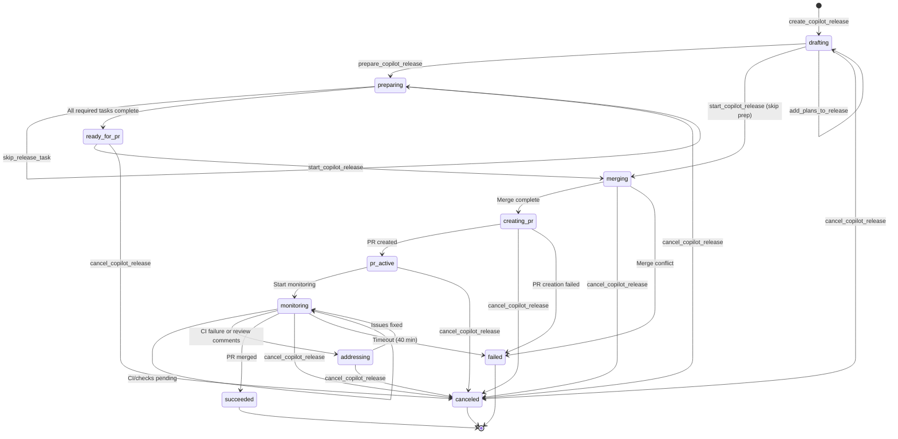
```mermaid
stateDiagram-v2
    [*] --> drafting: create_copilot_release
    
    drafting --> preparing: prepare_copilot_release
    drafting --> merging: start_copilot_release (skip prep)
    drafting --> drafting: add_plans_to_release
    
    preparing --> preparing: execute_release_task
    preparing --> preparing: skip_release_task
    preparing --> ready_for_pr: All required tasks complete
    
    ready_for_pr --> merging: start_copilot_release
    
    merging --> creating_pr: Merge complete
    
    creating_pr --> pr_active: PR created
    
    pr_active --> monitoring: Start monitoring
    
    monitoring --> monitoring: CI/checks pending
    monitoring --> addressing: CI failure or review comments
    
    addressing --> monitoring: Issues fixed
    
    monitoring --> succeeded: PR merged
    
    drafting --> canceled: cancel_copilot_release
    preparing --> canceled: cancel_copilot_release
    ready_for_pr --> canceled: cancel_copilot_release
    merging --> canceled: cancel_copilot_release
    creating_pr --> canceled: cancel_copilot_release
    pr_active --> canceled: cancel_copilot_release
    monitoring --> canceled: cancel_copilot_release
    addressing --> canceled: cancel_copilot_release
    
    merging --> failed: Merge conflict
    creating_pr --> failed: PR creation failed
    monitoring --> failed: Timeout (40 min)
    
    succeeded --> [*]
    failed --> [*]
    canceled --> [*]
```

### Preparation Task Flow

Pre-PR preparation tasks are managed through a structured checklist:

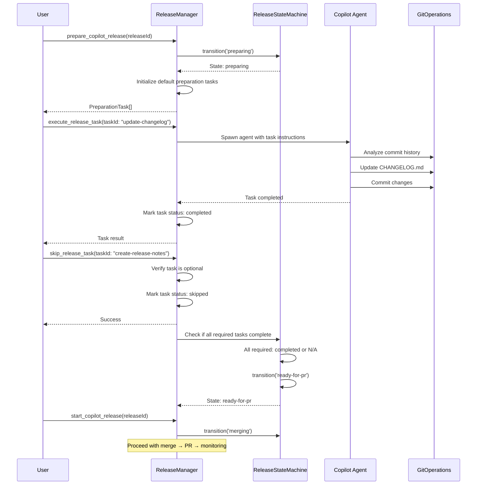
```mermaid
sequenceDiagram
    participant User
    participant RM as ReleaseManager
    participant StateMachine as ReleaseStateMachine
    participant Agent as Copilot Agent
    participant Git as GitOperations

    User->>RM: prepare_copilot_release(releaseId)
    RM->>StateMachine: transition('preparing')
    StateMachine-->>RM: State: preparing
    RM->>RM: Initialize default preparation tasks
    RM-->>User: PreparationTask[]

    User->>RM: execute_release_task(taskId: "update-changelog")
    RM->>Agent: Spawn agent with task instructions
    Agent->>Git: Analyze commit history
    Agent->>Git: Update CHANGELOG.md
    Agent->>Git: Commit changes
    Agent-->>RM: Task completed
    RM->>RM: Mark task status: completed
    RM-->>User: Task result

    User->>RM: skip_release_task(taskId: "create-release-notes")
    RM->>RM: Verify task is optional
    RM->>RM: Mark task status: skipped
    RM-->>User: Success

    RM->>StateMachine: Check if all required tasks complete
    StateMachine->>StateMachine: All required: completed or N/A
    StateMachine->>StateMachine: transition('ready-for-pr')
    StateMachine-->>RM: State: ready-for-pr

    User->>RM: start_copilot_release(releaseId)
    RM->>StateMachine: transition('merging')
    Note over RM: Proceed with merge → PR → monitoring
```

### Preparation Task Types

| Task Type | Automatable | Default Required | Agent Instructions |
|-----------|-------------|------------------|--------------------|
| `update-changelog` | ✅ | Yes | Analyze commits and update CHANGELOG.md following Keep a Changelog format |
| `update-version` | ✅ | Yes | Bump version in package.json and other version files |
| `update-docs` | ✅ | No | Update README.md and docs/ with new features and changes |
| `create-release-notes` | ✅ | No | Generate release notes from commit messages |
| `run-checks` | ✅ | Yes | Run compile + test validation |
| `ai-review` | ✅ | No | Spawn AI agent to review all changes and report issues |
| `custom` | ❌ | Varies | User-defined task (manual completion required) |

### Provider Detection and Credential Chain

```mermaid
graph TB
    subgraph "Provider Detection"
        URL[git remote URL]
        Parse[URL Parser]
        Type{Provider Type}
    end
    
    subgraph "Credential Acquisition"
        GH_CLI[gh auth token]
        AZ_CLI[az account get-access-token]
        GIT_CRED[git credential fill]
        ENV_GH[GITHUB_TOKEN env var]
        ENV_ADO[AZURE_DEVOPS_TOKEN env var]
    end
    
    URL --> Parse
    Parse --> Type
    
    Type -->|github.com| GH{GitHub}
    Type -->|custom hostname| GHE{GitHub Enterprise}
    Type -->|dev.azure.com| ADO{Azure DevOps}
    
    GH --> GH_CLI
    GH_CLI -->|fallback| GIT_CRED
    GIT_CRED -->|fallback| ENV_GH
    
    GHE --> GH_CLI
    
    ADO --> AZ_CLI
    AZ_CLI -->|fallback| GIT_CRED
    GIT_CRED -->|fallback| ENV_ADO
    
    style GH fill:#e3f2fd
    style GHE fill:#e3f2fd
    style ADO fill:#fff3e0
```

### Isolated Repository Architecture

Releases execute in isolated git clones under `.orchestrator/release/<sanitized-branch>/`:

```mermaid
graph TB
    subgraph "Main Repository"
        MainRepo[Repository Root]
        MainGit[.git/]
    end
    
    subgraph "Isolated Clones (.orchestrator/release/)"
        Clone1[release-v1.2.0/]
        Clone2[hotfix-auth/]
        Clone3[feature-bundle/]
        
        C1Git[.git/ (shared objects)]
        C2Git[.git/ (shared objects)]
        C3Git[.git/ (shared objects)]
    end
    
    MainRepo --> MainGit
    MainGit -.->|git clone --shared| C1Git
    MainGit -.->|git clone --shared| C2Git
    MainGit -.->|git clone --shared| C3Git
    
    Clone1 --> C1Git
    Clone2 --> C2Git
    Clone3 --> C3Git
    
    style Clone1 fill:#c8e6c9
    style Clone2 fill:#fff9c4
    style Clone3 fill:#e1f5fe
```

**Key benefits:**
- **Concurrent releases** — Multiple releases can run in parallel without conflicts
- **Shared objects** — Uses `--shared` or `--reference` to avoid duplicating repository objects
- **Persistent state** — Release artifacts remain after completion for debugging
- **Safe cleanup** — Isolated clones can be removed without affecting the main repository

### Storage Layout

```
.orchestrator/
└── release/
    ├── release-v1.2.0/                 # Isolated clone for release/v1.2.0
    │   ├── .git/                       # Shared with main repo via --shared
    │   ├── release-state.json          # Release metadata and status
    │   └── <source files>              # Full working tree with merged commits
    ├── hotfix-auth/                    # Another concurrent release
    │   ├── .git/
    │   ├── release-state.json
    │   └── <source files>
    └── feature-bundle/
        ├── .git/
        ├── release-state.json
        └── <source files>
```

---

## Experimental Feature Flags

Features under active development are gated behind `copilotOrchestrator.experimental.*` settings (default: `false`).

| Setting | What it gates |
|---------|--------------|
| `experimental.showTimeline` | Interactive Gantt-chart timeline view in plan detail panels |
| `experimental.enableReleaseManagement` | Release management + PR lifecycle MCP tools, commands, and UI |

When a flag is off:
- MCP tools for that feature are excluded from `tools/list` responses — agents never see them
- VS Code commands are not registered — command palette doesn't show them
- UI components (status bar items, panels) are not created
- DI services for that feature are not resolved — zero runtime overhead

Flags are checked once at extension activation via `vscode.workspace.getConfiguration()`.

## Related Documentation

| Document | Focus |
|----------|-------|
| [DI Guide](DI_GUIDE.md) | DI patterns, adding services, mocking |
| [Testing Guide](TESTING.md) | Test framework, patterns, coverage |
| [Copilot Integration](COPILOT_INTEGRATION.md) | MCP tools, agent delegation |
| [Groups](GROUPS.md) | Visual hierarchy, namespace isolation |
| [Worktrees & Merging](WORKTREES_AND_MERGING.md) | Git isolation, merge strategies |
| [Releases](RELEASES.md) | Release management, multi-provider PR support, monitoring |
| [Contributing](CONTRIBUTING.md) | Setup, workflow, PR process |
