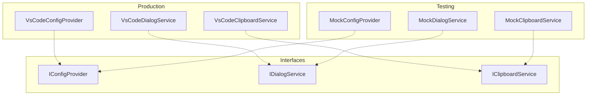

# Architecture

> Copilot Orchestrator — Parallel Copilot-driven development using DAG execution in isolated git worktrees.

## Overview

Copilot Orchestrator is a VS Code extension that decomposes complex development tasks into a **Directed Acyclic Graph (DAG)** of work nodes, each executing in parallel within isolated git worktrees. It integrates with GitHub Copilot Chat via the **Model Context Protocol (MCP)** and provides real-time visual feedback through VS Code's UI.


### Design Principles

| Principle | Implementation |
|-----------|----------------|
| **Isolation** | Each node executes in its own git worktree — no interference with the user's working directory |
| **Composability** | Plans are flat DAGs with visual grouping — no nested execution hierarchy |
| **Fault tolerance** | Failed nodes block only their dependents; retry resumes from the failed phase |
| **Extensibility** | DI interfaces (`INodeRunner`, `INodeExecutor`, `IGitOperations`) allow pluggable implementations |
| **Observability** | Real-time UI updates via event emission on every state transition |

---

## Core Components

### Module Layout

```
src/
├── extension.ts              # Extension activation and lifecycle
├── composition.ts            # Production DI composition root
├── compositionTest.ts        # Test DI composition root
├── agent/                    # Copilot CLI delegation
├── commands/                 # VS Code command registrations
├── core/                     # Core infrastructure
│   ├── container.ts          # Symbol-based DI container
│   ├── tokens.ts             # Service registration tokens
│   ├── logger.ts             # Centralized logging with per-component debug
│   ├── globalCapacity.ts     # Cross-instance job coordination
│   └── powerManager.ts       # Sleep prevention during execution
├── git/                      # Git operations (worktrees, merges, branches)
│   └── core/                 # Low-level git command modules
├── interfaces/               # DI interface definitions
│   ├── IConfigProvider.ts    # VS Code configuration abstraction
│   ├── IDialogService.ts     # VS Code dialog operations
│   ├── IProcessMonitor.ts    # Process monitoring interface
│   └── ...                   # Other service interfaces
├── vscode/                   # VS Code API adapters
│   ├── adapters.ts           # Production VS Code implementations
│   └── testAdapters.ts       # Mock implementations for testing
├── mcp/                      # MCP server, tools, handlers, transports
│   ├── handlers/             # Business logic for MCP tool calls
│   ├── ipc/                  # Inter-process communication bridge
│   ├── stdio/                # Stdio transport for MCP child process
│   ├── tools/                # MCP tool definitions (schemas)
│   └── validation/           # Ajv-based input validation
├── plan/                     # DAG execution engine
│   ├── phases/               # Execution phase handlers (prechecks, work, etc.)
│   └── types/                # Type definitions (nodes, plans, specs)
├── process/                  # OS process monitoring
├── types/                    # Shared types (config, job, process)
└── ui/                       # VS Code UI components
    ├── panels/               # Webview panels (plan detail, node detail)
    └── templates/            # HTML/CSS template functions
        ├── planDetail/       # Plan detail panel templates
        └── nodeDetail/       # Node detail panel templates
```

### Dependency Injection Architecture

Copilot Orchestrator uses a Symbol-based dependency injection container to manage service lifecycle, enable testability, and provide clean separation of concerns.

#### Core DI Components

| Component | File | Purpose |
|-----------|------|---------|
| **ServiceContainer** | `src/core/container.ts` | Type-safe DI container with Symbol tokens |
| **Tokens** | `src/core/tokens.ts` | Symbol-based service registration keys |
| **Production Root** | `src/composition.ts` | Wires real implementations for production |
| **Test Root** | `src/compositionTest.ts` | Wires mock implementations for testing |

#### Service Registration Patterns

```typescript
// Singleton services (shared state)
container.registerSingleton<ILogger>(Tokens.ILogger, (c) => {
  const logger = Logger.initialize(context);
  logger.setConfigProvider(c.resolve(Tokens.IConfigProvider));
  return logger;
});

// Transient services (new instance per resolve)
container.register<IEvidenceValidator>(
  Tokens.IEvidenceValidator,
  () => new DefaultEvidenceValidator()
);
```

#### VS Code API Abstraction

The DI layer provides clean abstractions over VS Code APIs:



**Benefits:**
- **Testability**: Mock adapters provide controllable test doubles
- **Isolation**: No direct vscode module coupling in business logic
- **Type Safety**: Symbol tokens prevent registration/resolution errors
- **Scoping**: Child containers enable isolated subsystem testing

### Template Architecture

UI panels use a template-based architecture for clean separation of presentation and logic:

#### Template Organization

```
src/ui/templates/
├── planDetail/              # Plan detail panel templates
│   ├── headerTemplate.ts    # Plan status and controls
│   ├── controlsTemplate.ts  # Action buttons
│   ├── dagTemplate.ts       # Mermaid DAG visualization
│   ├── nodeCardTemplate.ts  # Individual node cards
│   ├── summaryTemplate.ts   # Work summary display
│   ├── scriptsTemplate.ts   # Script elements
│   └── index.ts             # Barrel exports
└── nodeDetail/              # Node detail panel templates
    ├── headerTemplate.ts    # Node status header
    ├── actionButtons.ts     # Node action controls
    ├── processTree.ts       # Process monitoring display
    ├── logViewer.ts         # Log output formatting
    ├── attempts.ts          # Retry attempt history
    ├── config.ts            # Configuration display
    ├── metrics.ts           # Usage metrics display
    ├── scripts.ts           # Script elements
    └── index.ts             # Barrel exports
```

#### Template Pattern

Templates are pure functions that take data and return HTML strings:

```typescript
export function headerTemplate(data: HeaderData): string {
  return `
    <div class="header">
      <h1>${escapeHtml(data.title)}</h1>
      <span class="status ${data.status}">${data.status.toUpperCase()}</span>
    </div>
  `;
}
```

#### Controller Pattern

Controllers handle webview messages and coordinate with services via dependency injection:

```typescript
export class PlanDetailController {
  constructor(
    private readonly dialogService: IDialogService,
    private readonly planRunner: IPlanRunner
  ) {}

  handleMessage(message: WebviewMessage): Promise<any> {
    switch (message.command) {
      case 'cancelPlan':
        return this.handleCancelPlan(message.planId);
      // ... other handlers
    }
  }

  private async handleCancelPlan(planId: string): Promise<void> {
    const confirmed = await this.dialogService.showWarning(
      'Are you sure you want to cancel this plan?',
      { modal: true },
      'Yes', 'No'
    );
    
    if (confirmed === 'Yes') {
      this.planRunner.cancel(planId);
    }
  }
}
```

**Template Benefits:**
- **Zero vscode imports**: Pure functions can be unit tested easily
- **Reusable components**: Templates can be composed and shared
- **Separation of concerns**: Logic in controllers, presentation in templates
- **Type safety**: Strongly typed template data interfaces

### PlanRunner — Central Orchestrator

`PlanRunner` (`src/plan/runner.ts`) is the composition root for plan execution. It owns the pump loop, coordinates all subsystems, and emits events consumed by the UI.


**Responsibilities:**
- **Lifecycle**: `initialize()` → pump loop (~200ms) → `shutdown()`
- **Plan creation**: `enqueue(spec)` builds the DAG via `buildPlan()` and persists it
- **Pump loop**: Selects ready nodes → schedules → executes → transitions state → checks completion
- **Retry**: `retryNode()` resets a failed node to `pending`, unblocks descendants, optionally resumes from the failed phase
- **Events**: Emits `planCreated`, `planCompleted`, `nodeTransition`, `planDeleted`

### DAG Builder

`buildPlan()` (`src/plan/builder.ts`) converts a `PlanSpec` into a `PlanInstance` using a three-pass algorithm:

1. **Node creation** — Assigns UUIDs, resolves group paths, auto-creates group hierarchy
2. **Dependency resolution** — Maps `producerId` references to node UUIDs
3. **Reverse edge computation** — Builds `dependents` arrays, identifies root/leaf nodes

**Validation**: Cycle detection (DFS), duplicate `producerId` rejection, unknown dependency checks, requires at least one root node.

Root nodes (no dependencies) start in `ready` status; all others start `pending`.

### PlanStateMachine — State Transitions

`PlanStateMachine` (`src/plan/stateMachine.ts`) is the single source of truth for node and group state. It enforces valid transitions and propagates status changes through the DAG.


**Valid transitions** are enforced by a lookup table (`VALID_TRANSITIONS` in `src/plan/types/nodes.ts`). Terminal states (`succeeded`, `failed`, `blocked`, `canceled`) allow no further transitions.

**DAG propagation rules:**
- **On success** → Check all dependents; if all their dependencies are met, transition to `ready`
- **On failure** → BFS propagation of `blocked` to all downstream nodes
- **On retry** → `resetNodeToPending()` resets node and unblocks descendants

**Group state aggregation**: Groups recompute their status from direct children (nodes + child groups) using priority: `running` > `failed`/`blocked` > `succeeded` > `canceled` > `pending`. Changes propagate up the parent hierarchy.

### PlanScheduler — Capacity Management

`PlanScheduler` (`src/plan/scheduler.ts`) selects which `ready` nodes to execute next, respecting concurrency limits.

**Algorithm:**
1. Collect all nodes with status `ready`
2. Count currently `running`/`scheduled` nodes that perform work (excludes coordination nodes)
3. Compute available capacity: `min(plan.maxParallel − planRunning, globalMaxParallel − globalRunning)`
4. Sort by dependent count (descending) — nodes that unlock the most work execute first
5. Return the top N nodes

### JobExecutor — Work Execution

`DefaultJobExecutor` (`src/plan/executor.ts`) runs each node through a four-phase pipeline:

```
prechecks → work → postchecks → commit
```

**Phase details:**
- **Prechecks/Postchecks** — Optional validation commands
- **Work** — Routed by `WorkSpec` type (see [Work Specification Types](#work-specification-types))
- **Commit** — Validates work evidence, stages and commits changes in the worktree

Each phase captures **AI usage metrics** independently (tokens, session time, code changes). The executor aggregates phase-level metrics into a total and returns a `phaseMetrics` record so the UI can display a per-phase breakdown.

On retry, the executor can **skip completed phases** using `resumeFromPhase` and resume the Copilot session via captured session IDs.

### Work Specification Types

Defined in `src/plan/types/specs.ts`:

| Type | Description | Example |
|------|-------------|---------|
| `ProcessSpec` | Direct process spawn, no shell interpretation | `{ type: 'process', executable: 'node', args: ['build.js'] }` |
| `ShellSpec` | Shell command with configurable shell | `{ type: 'shell', command: 'npm test', shell: 'bash' }` |
| `AgentSpec` | AI agent delegation with Markdown instructions | `{ type: 'agent', instructions: '## Task\n...', model: 'gpt-4' }` |
| `string` | Legacy format — shell command or `@agent ...` | `"npm run lint"` |

### PlanPersistence — State Durability

`PlanPersistence` (`src/plan/persistence.ts`) serializes plan state to disk:

- **Per-plan files**: `plan-{id}.json` — Full plan topology + execution state (Maps serialized as Records)
- **Index file**: `plans-index.json` — Fast lookup of `{ planId → { name, createdAt } }`
- **Storage directory**: `.orchestrator/plans/` within the workspace

---

## MCP Integration

The extension exposes its functionality to Copilot Chat via the [Model Context Protocol](https://modelcontextprotocol.io/). MCP tools allow natural language plan creation and management.

### Architecture


### Transport

The MCP server uses a **child-process architecture** with IPC:

1. **Stdio child process** (`src/mcp/stdio/server.ts`) — Spawned by VS Code as `node out/mcp/stdio/server.js`. Reads newline-delimited JSON-RPC from stdin, writes responses to stdout.
2. **IPC bridge** (`src/mcp/ipc/`) — The child process connects to the extension host via a named pipe (secured with an auth nonce via `MCP_AUTH_NONCE` environment variable).
3. **McpHandler** (`src/mcp/handler.ts`) — Routes `tools/call` requests to handler functions via a switch statement.

**VS Code registration**: `McpDefinitionProvider` (`src/mcp/mcpDefinitionProvider.ts`) implements `vscode.McpServerDefinitionProvider` to auto-register the stdio server with VS Code's MCP subsystem.

### Tool Definitions

Tools are statically defined with JSON Schemas for LLM discoverability:

- **Plan tools** (`src/mcp/tools/planTools.ts`) — 13 tools: `create_copilot_plan`, `get_copilot_plan_status`, `list_copilot_plans`, `cancel_copilot_plan`, `delete_copilot_plan`, `retry_copilot_plan`, `create_copilot_job`, `get_copilot_node_details`, `get_copilot_node_logs`, `get_copilot_node_attempts`, `get_copilot_group_status`, `list_copilot_groups`, `cancel_copilot_group`
- **Node tools** (`src/mcp/tools/nodeTools.ts`) — 5 tools: `create_copilot_node`, `get_copilot_node`, `list_copilot_nodes`, `retry_copilot_node`, `get_copilot_node_failure_context`

### Request Pipeline

```
Tool call → Ajv schema validation → Handler dispatch → PlanRunner operation → Response formatting
```

**Validation** (`src/mcp/validation/`) uses Ajv with strict mode. All validation errors are formatted for LLM consumption.

**Handlers** (`src/mcp/handlers/`) implement business logic:
- `planHandlers.ts` — Plan CRUD, status queries, cancel/retry
- `nodeHandlers.ts` — Node-centric API (create, query, retry)
- `utils.ts` — Shared utilities: `errorResult()`, `lookupPlan()`, `lookupNode()`, `resolveBaseBranch()`

---

## Git Operations

### Worktree Lifecycle

Each node executes in an isolated git worktree. The orchestrator manages the full lifecycle:


**Key modules:**
- `git/orchestrator.ts` — High-level: `createJobWorktree()`, `finalizeWorktree()`, `squashMerge()`, `removeJobWorktree()`
- `git/core/worktrees.ts` — Low-level worktree CRUD with **per-repository mutex** serialization to prevent race conditions
- `git/core/executor.ts` — Async git command execution (`execAsync()`, `execAsyncOrThrow()`)

### Orphaned Worktree Cleanup (`src/core/orphanedWorktreeCleanup.ts`)

Detects and removes stale worktree directories on extension activation.

**Detection Logic:**
A worktree directory is considered "orphaned" if:
1. It exists in `.worktrees/` folder
2. It's NOT registered with git (`git worktree list` doesn't include it)
3. It's NOT tracked by any active plan's `nodeStates.worktreePath`

**Activation Flow:**
1. Extension activates
2. Plans loaded from persistence
3. After 2-second delay, trigger async cleanup
4. Scan all repo paths (from plans + workspace folders)
5. Remove orphaned directories
6. Log results (show message if ≥3 cleaned)

**Safety:**
- Never removes directories tracked by active plans
- Never removes git-registered worktrees
- Continues on individual failures
- Runs asynchronously (doesn't block startup)

### Worktree Directory Structure

Each job worktree contains orchestrator-specific directories:

```
{worktreePath}/
  .orchestrator/              # Orchestrator state (gitignored)
    .copilot/                 # Copilot CLI config directory
      session-state/          # Session data
      config.json             # Per-job config
    evidence/                 # Work evidence files
  .gitignore                  # Auto-updated to include .orchestrator
  ... (repository files)
```

#### Gitignore Auto-Update

When worktrees are created, the orchestrator ensures `.gitignore` contains:
- `.worktrees` - The worktree root directory
- `.orchestrator` - Per-worktree orchestrator state

This change is staged automatically so it's included in the job's commit.

#### Session Storage

Copilot CLI sessions are stored per-worktree using `--config-dir`:
- Sessions don't appear in user's VS Code session history
- Sessions are automatically cleaned when worktree is removed
- Each job has isolated session state

### Merge Strategies

Two merge strategies are available:

| Strategy | Method | Requirements | Working Directory Impact |
|----------|--------|-------------|--------------------------|
| **Standard** | `git merge` | Target branch checked out | Modifies working directory |
| **Checkout-free** | `git merge-tree` | Git 2.38+ | None — operates on tree objects |

The checkout-free strategy (`mergeWithoutCheckout()` in `src/git/core/merge.ts`) is preferred as it avoids touching the user's working directory. It returns a `MergeTreeResult` with the merged tree SHA and any conflicts.

### Branch Management

`src/git/core/branches.ts` handles branch lifecycle:
- **Default branch detection** — Queries git (not hardcoded), cached per repository
- **Existence checks** — Local and remote
- **Merge base** — `getMergeBase()` for common ancestor resolution

---

## UI Components

### Component Overview


### PlansViewProvider

`PlansViewProvider` (`src/ui/plansViewProvider.ts`) implements `vscode.WebviewViewProvider`:
- Displays all plans with progress bars, status badges, and node counts
- **Auto-refresh**: Listens to PlanRunner events (`planCreated`, `planCompleted`, `planDeleted`, `nodeTransition`) with debouncing
- **Message protocol**: Webview sends `openPlan`, `cancelPlan`, `deletePlan`, `refresh`; extension sends `update` with plan list

### Detail Panels

- **PlanDetailPanel** (`src/ui/panels/planDetailPanel.ts`) — Full execution view for a single plan: node breakdown, logs, Mermaid DAG rendering
- **NodeDetailPanel** (`src/ui/panels/nodeDetailPanel.ts`) — Individual node logs, status, evidence, error details

### Status Bar

`attachStatusBar()` (`src/ui/statusBar.ts`) shows live counts of running plans and active jobs, polling every second. Clicking opens the plan detail panel.

### Templates

`src/ui/templates/` provides HTML generation utilities:
- `helpers.ts` — `escapeHtml()`, `formatDuration()`, error/loading page generators
- `styles.ts` — Shared CSS for all webviews
- `workSummary.ts` — Commit and file change HTML rendering

---

## State Management

### Node Execution State

Each node maintains an `NodeExecutionState` record (`src/plan/types/plan.ts`):

| Field | Purpose |
|-------|---------|
| `status` | Current `NodeStatus` |
| `baseCommit` | Git commit the worktree was created from |
| `completedCommit` | Git commit after successful work |
| `scheduledAt` / `startedAt` / `endedAt` | Phase timestamps |
| `worktreePath` | Path to the node's isolated worktree |
| `workSummary` | Commit stats and file changes |
| `aggregatedWorkSummary` | Total work being merged to targetBranch (leaf nodes only) |
| `attempts` | Array of `AttemptRecord` for retry history |
| `lastAttempt` | Most recent attempt with phase statuses |
| `metrics` | Aggregate AI usage metrics for the node |
| `phaseMetrics` | Per-phase AI usage breakdown (`merge-fi`, `prechecks`, `work`, `commit`, `postchecks`, `merge-ri`) |

**Work Summary Behavior:** When a plan has a `targetBranch` configured, the plan detail panel filters the work summary to show only commits from leaf nodes that have successfully merged to the target branch (`mergedToTarget === true`). This ensures the displayed work summary reflects actual integrated work rather than all work performed across the plan. The summary updates dynamically as nodes complete their merge operations.

### Aggregated Work Summary

Leaf nodes that merge to `targetBranch` have two work summaries:

1. **`workSummary`**: Work done by this specific job (commits from baseCommit to completedCommit)
2. **`aggregatedWorkSummary`**: Total work being merged to targetBranch (commits from baseBranch to completedCommit)

The aggregated summary includes all upstream dependency work accumulated through FI (Forward Integration) merges. This is important for:

- No-op leaf nodes that only aggregate upstream work
- Accurately representing what's being merged to targetBranch
- Plan work summary views that show "merged work"

Example DAG:
```
A (3 files) → B (2 files) → C (leaf, 0 files)
```

- C's `workSummary`: 0 files (no changes)
- C's `aggregatedWorkSummary`: 5 files (A's 3 + B's 2 merged through FI)

### Group State Aggregation

Groups provide visual hierarchy without affecting execution. Each `GroupExecutionState` aggregates from its direct children:

```
runningCount > 0       → 'running'
failedCount > 0        → 'failed'
blockedCount > 0       → 'blocked'
succeededCount = total → 'succeeded'
canceledCount > 0      → 'canceled'
else                   → 'pending'
```

Changes propagate up the parent group hierarchy.

### Persistence Model

Plans are persisted as JSON files in `.orchestrator/plans/`:

```
.orchestrator/
└── plans/
    ├── plans-index.json          # { planId → { name, createdAt } }
    ├── plan-abc123.json          # Full plan topology + state
    └── plan-def456.json
```

Maps are serialized as `Record<string, T>` objects for JSON compatibility and restored to `Map` instances on load.

---

## Model Discovery

### Dynamic Model Discovery

The orchestrator discovers available LLM models at runtime by parsing `copilot --help` output. This ensures compatibility as Copilot CLI evolves.

**Flow:**
1. On extension activation, `discoverAvailableModels()` runs
2. Parses `--model` choices from CLI help
3. Caches results for 1 hour
4. MCP tool schemas include discovered models as enum

**Classification:**
- Vendor: claude→anthropic, gpt→openai, gemini→google
- Tier: mini/haiku→fast, opus/max→premium, default→standard

---

## Token Tracking

### Token Usage Tracking

After each agent job completes, the orchestrator extracts token usage from Copilot CLI output using `CopilotStatsParser`. Metrics are captured per-phase (prechecks, work, postchecks, merge-fi, merge-ri) and aggregated for the node total.

**Extracted Metrics:**
- Premium requests consumed
- API time and total session time
- Code changes (lines added/removed)
- Per-model token breakdown (input, output, cached tokens)

**Storage:**
Metrics are stored in `NodeExecutionState.metrics` (aggregate) and `NodeExecutionState.phaseMetrics` (per-phase breakdown), persisted with the plan.

---

## Power Management

### Power Management (`src/core/powerManager.ts`)

Prevents system sleep during plan execution to ensure reliability:

- **Reference-counted wake locks** — Multiple plans can hold locks simultaneously; system only sleeps when all locks are released
- **Cross-platform implementation** — Automatically selects the appropriate mechanism based on the operating system
  - **Windows**: `SetThreadExecutionState` API called periodically via PowerShell
  - **macOS**: `caffeinate` command with flags to prevent system, display, and disk sleep
  - **Linux**: `systemd-inhibit` with fallback to `xdg-screensaver` if systemd is unavailable
- **Automatic cleanup** — Wake locks are released when plans complete, are cancelled, or when VS Code closes
- **Error resilience** — If platform-specific methods fail, the extension logs a warning but continues operation gracefully

**Lifecycle:**
1. PlanRunner calls `powerManager.acquireWakeLock(reason)` when a plan starts
2. Platform-specific process is spawned to actively maintain wake lock
3. On plan completion/cancellation, the cleanup function is called
4. Process is terminated and resources are freed
5. On extension deactivation, `releaseAll()` terminates all remaining processes

---

## Extension Points and Interfaces

All DI interfaces are defined in `src/interfaces/` and exported via `src/interfaces/index.ts`.

### Core Interfaces

```typescript
// Node execution strategy — plug in custom executors
interface INodeExecutor {
  execute(context: NodeExecutionContext): Promise<NodeExecutionResult>;
  cancel(planId: string, nodeId: string): Promise<void>;
  getLogs(planId: string, nodeId: string): string[];
}

// Node lifecycle management
interface INodeRunner {
  createNodes(spec: NodeSpec[]): Promise<NodeInstance[]>;
  getNode(nodeId: string): NodeInstance | undefined;
  cancel(nodeId: string): Promise<void>;
  retryNode(nodeId: string, options?: RetryOptions): Promise<void>;
  setExecutor(executor: INodeExecutor): void;
}

// Git operations facade — composable sub-interfaces
interface IGitOperations {
  branches: IGitBranches;    // Branch CRUD, default branch detection
  worktrees: IGitWorktrees;  // Worktree lifecycle with mutex
  merge: IGitMerge;          // Standard and checkout-free merge
  repository: IGitRepository; // Fetch, pull, push, commit, stash
  executor: IGitExecutor;     // Low-level git command execution
}
```

### Supporting Interfaces

| Interface | File | Purpose |
|-----------|------|---------|
| `IProcessMonitor` | `IProcessMonitor.ts` | Process tree tracking, PID queries, termination |
| `IMcpManager` | `IMcpManager.ts` | MCP server lifecycle (`start`, `stop`, `isRunning`) |
| `ILogger` | `ILogger.ts` | Structured logging abstraction |
| `IFileSystem` | `IFileSystem.ts` | File system operations (for testability) |
| `IEvidenceValidator` | `IEvidenceValidator.ts` | Work evidence validation |

### Extending the System

**Custom executor**: Implement `INodeExecutor` to add new execution strategies (e.g., container-based, remote SSH):

```typescript
class RemoteExecutor implements INodeExecutor {
  async execute(ctx: NodeExecutionContext): Promise<NodeExecutionResult> {
    // SSH into remote machine, run work, collect results
  }
}
runner.setExecutor(new RemoteExecutor());
```

**Custom MCP tools**: Add tool definitions in `src/mcp/tools/`, handler functions in `src/mcp/handlers/`, and wire them in the switch statement in `src/mcp/handler.ts`.

**Custom work spec**: Extend the `WorkSpec` union type in `src/plan/types/specs.ts` and add routing logic in `DefaultJobExecutor.runWorkSpec()`.

---

## Security Model

### Agent Sandbox

Agent jobs run in isolated worktree folders with restricted file system and network access:

#### File System Access
The Copilot CLI is invoked with `--add-dir` restricted to:
1. The job's worktree folder (always included)
2. Any additional folders specified in `allowedFolders`

#### Network Access
By default, agents have no network access. URLs are allowed via:
1. Specific URLs or domains in `allowedUrls`
2. Each URL becomes an `--allow-url` flag to Copilot CLI

This prevents:
- Cross-job file access
- Modification of repository root
- Access to system files
- Data exfiltration via unauthorized network requests
- Malicious API calls

**Default Isolation**: When no `allowedFolders` are specified, agents can only read/write files within their assigned worktree. This provides baseline security for concurrent job execution without requiring explicit allowlisting.

**Opt-in Sharing**: Teams can grant agents access to shared resources (libraries, configs, shared tools) by explicitly listing paths in `allowedFolders` within the work specification. This follows a principle of least privilege — sharing is explicit, not implicit.

### Global Capacity Coordination (`src/core/globalCapacity.ts`)

Coordinates job capacity across multiple VS Code instances:

#### Registry File

Location: `{globalStorageUri}/capacity-registry.json`

```json
{
  "version": 1,
  "globalMaxParallel": 16,
  "instances": [
    {
      "instanceId": "abc123def456",
      "processId": 12345,
      "runningJobs": 3,
      "lastHeartbeat": 1234567890,
      "activePlans": ["plan-uuid-1"]
    }
  ]
}
```

#### Coordination Flow

1. On activation: Register instance with unique ID
2. Every 5 seconds: Update heartbeat, clean stale instances
3. Before scheduling: Check global capacity across all instances
4. On deactivation: Unregister instance

#### Failure Modes

- **Registry file locked**: Retry with exponential backoff
- **Corrupt registry**: Reset to empty state
- **Coordination unavailable**: Fall back to local counting

---

## Configuration

Key VS Code settings (prefix `copilotOrchestrator`):

| Setting | Default | Description |
|---------|---------|-------------|
| `maxWorkers` | `4` | Maximum parallel node executions |
| `mcp.enabled` | `true` | Enable MCP server |
| `mcp.transport` | `"http"` | MCP transport type (`"http"` or `"stdio"`) |

---

## Related Documentation

- [README](../README.md) — Product overview and quick start
- [Copilot Integration](COPILOT_INTEGRATION.md) — Using MCP tools with Copilot Chat
- [Groups](GROUPS.md) — Visual hierarchy and group semantics
- [Worktrees and Merging](WORKTREES_AND_MERGING.md) — Git isolation and merge strategies
- [Simplified Node Design](SIMPLIFIED_NODE_DESIGN.md) — Flat DAG design rationale
- [Stdio MCP Design](STDIO_MCP_DESIGN.md) — Stdio transport architecture
- [Work Evidence Design](WORK_EVIDENCE_DESIGN.md) — Evidence validation for no-change nodes
