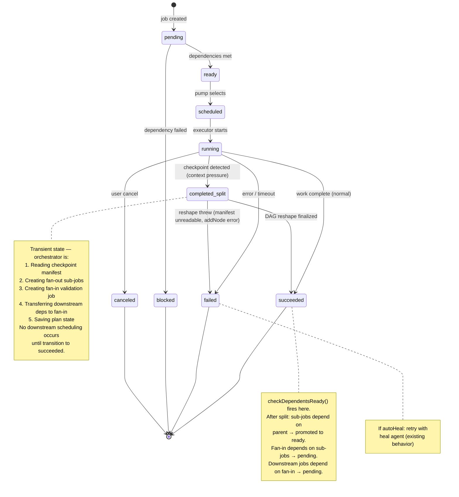
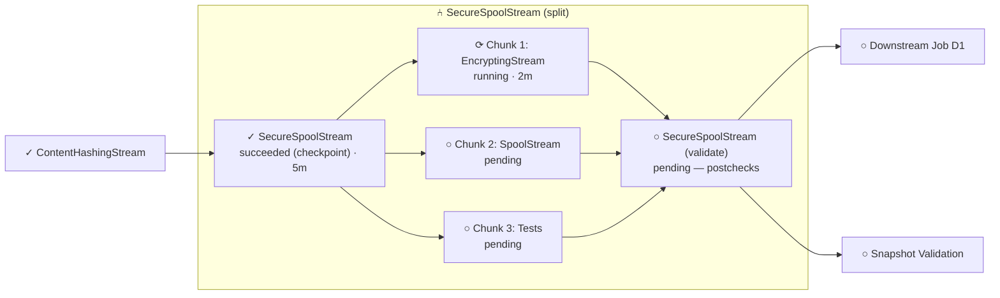
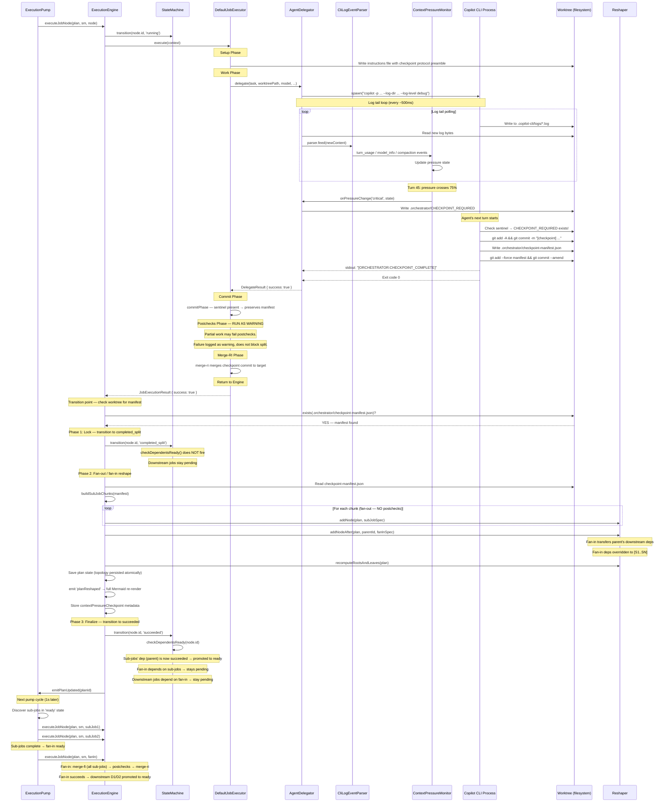
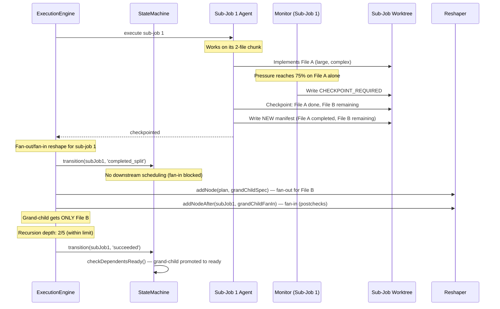
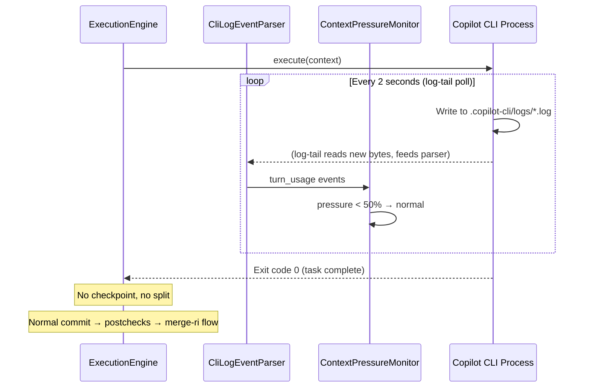

# Context Pressure Management — Detailed Design Document

> **Version**: 1.0 (Released)  
> **Release**: v0.16.0  
> **GitHub Issue**: #86  
> **Status**: Implemented  
> **Last Updated**: 2026-04-15  
> **Baseline**: v0.16.0 (release/v0.16.0 branch — includes pubsub migration, SV unification, RI-merge fix, Process Output Bus)

---

## Table of Contents

1. [Problem Statement](#1-problem-statement)
2. [Research Findings](#2-research-findings)
3. [System Architecture](#3-system-architecture)
4. [Detection Layer — Log-Tail Token Monitor](#4-detection-layer)
5. [Signal Layer — Sentinel File Protocol](#5-signal-layer)
6. [Checkpoint Layer — Agent Self-Checkpoint](#6-checkpoint-layer)
7. [Split Layer — Sub-Job Creation](#7-split-layer)
8. [State Machine — Node Lifecycle Changes](#8-state-machine)
9. [DAG Visualization — Sub-Job Rendering](#9-dag-visualization)
10. [Sequence Diagrams](#10-sequence-diagrams)
11. [Timing & Delays Analysis](#11-timing-and-delays)
12. [Configuration](#12-configuration)
13. [DI & Testability](#13-di-and-testability)
14. [Risks & Mitigations](#14-risks-and-mitigations)
15. [Pros & Cons of Key Decisions](#15-pros-and-cons)
16. [Implementation Phases](#16-implementation-phases)
17. [Open Questions](#17-open-questions)

---

## 1. Problem Statement

When a Copilot CLI agent runs a complex job (6+ files, crypto/protocol work, 500+ LOC), its
context window fills with tool outputs, file reads, and conversation history. At some point:

1. **Compaction occurs** — the CLI silently truncates older context (`truncateBasedOn: "tokenCount"`)
2. **The model loses critical information** — earlier file implementations, API signatures, test patterns
3. **Output quality degrades** — stubs, placeholders, incomplete implementations, "passthrough for compatibility"
4. **The job "succeeds"** — postchecks may pass (exit code 0 with zero tests running)
5. **Downstream consumers get broken code** — other jobs FI-merge the stub implementations

**Production example**: Plan 02 "SecureSpoolStream + Encryption Layer" — EncryptingStream.cs had
passthrough instead of real AES-256-GCM. The agent ran 102 turns, `input_tokens` grew from 39,880
to 139,372, exceeding the model's `max_prompt_tokens: 136,000`.

**Goal**: Detect context pressure before compaction degrades quality, cooperatively checkpoint
the agent's work, and split remaining work into sub-jobs with fresh context windows.

---

## 2. Research Findings

### 2.1 Available Signals

| Signal | Source | Format | Granularity | Real-time? |
|--------|--------|--------|-------------|------------|
| `input_tokens` per turn | CLI log (`assistant_usage`) | `"input_tokens": 39880` | Per API call | Yes (2s poll; Phase A upgrades to fs.watch + 500ms) |
| `max_prompt_tokens` | CLI log (model caps) | `"max_prompt_tokens": 136000` | Once per session | Yes |
| `max_context_window_tokens` | CLI log (model caps) | `"max_context_window_tokens": 200000` | Once per session | Yes |
| `truncateBasedOn` | CLI log | `"truncateBasedOn": "tokenCount"` | When compaction happens | Yes |
| `output_tokens` per turn | CLI log (`assistant_usage`) | `"output_tokens": 153` | Per API call | Yes |
| End-of-session totals | stdout `CopilotStatsParser` | `231.5k in, 1.3k out` | End only | No |

### 2.2 Rejected Approaches

| Approach | Why Rejected |
|----------|-------------|
| `/context` stdin command | Only works in interactive TTY mode; piped stdio (how orchestrator spawns CLI) ignores it |
| Mid-flight stdin commands | `ChildProcessLike` has no stdin; even with stdin exposed, `-p` mode doesn't read stdin after initial prompt |
| `--max-turns` as pressure control | No distinct signal for "stopped by max turns" vs "task complete" — both exit code 0 |
| Query context window API | No such API exists in the CLI |
| `kill(SIGTERM)` to stop agent | Risks file corruption mid-write; agent can't checkpoint cleanly; orchestrator must guess what's remaining |

### 2.3 Chosen Approach

**Log-tail detection + Sentinel file signaling + Agent self-checkpoint + Dynamic sub-job creation**

Communication model:
```
Orchestrator ←── log file ──── CLI Process ←── LLM API
     │                              ▲
     │ write sentinel file          │ reads sentinel on each turn
     └──── .orchestrator/ ──────────┘
                  │
                  │ writes checkpoint manifest
                  ▼
           Sub-job creation via reshaper
```

### 2.4 Key Infrastructure Already Available (Updated v0.15.6)

| Capability | Where | Status |
|------------|-------|--------|
| Log file tailing (2s poll) | `agentDelegator.ts` L377-436 | Exists — 2s `setInterval` poll, needs `fs.watch()` + 500ms upgrade (Phase A0-pre) and token extraction |
| Injected instructions (skills) | `setupPhase.ts` → `.github/skills/.orchestrator/SKILL.md` | Exists — available for supplementary context (checkpoint protocol goes in instructions file instead — see §6.1) |
| Injected instructions (job) | `copilotCliRunner.ts` → `.github/instructions/orchestrator-job-*.md` | Exists — add checkpoint protocol as **mandatory preamble** (not SKILL.md — see §6.1) |
| Worktree init hooks | `executor.ts` L232-270 → `plan.spec.worktreeInit` | **NEW in v0.15.5** — auto-detects `.github/instructions/worktree-init.instructions.md` |
| Dynamic node addition | `reshaper.addNodeAfter()` | Exists — add sub-jobs to running plan |
| `--log-dir` + `--log-level debug` | `copilotCliRunner.ts` L706-708 | Always enabled — logs available |
| SV node rewiring | `reshaper.recomputeRootsAndLeaves()` + `syncSnapshotValidationDeps()` | Exists — auto-rewires on topology change |
| `git add --force` (override gitignore) | Git CLI | Standard git — agent can force-add manifest |
| Worktree FI merge | `mergeFiPhase.ts` | Exists — sub-jobs get parent's committed work |
| Stub detection | `complexityScorer.ts` | Exists — static analysis at plan creation |
| WebView Subscription Manager | `webViewSubscriptionManager.ts` | **NEW in v0.15.5** — pub/sub with `EventProducer<TCursor>` interface |
| Unified finalize helper | `finalizePlanHelper.ts` | **NEW in v0.15.5** — single code path for MCP + UI finalize |
| XML artifact sanitization | `normalizeWorkSpec()` in `specs.ts` | **NEW in v0.15.6** — strips LLM-injected XML from spec fields |
| Transient failure detection | `copilotCliRunner.ts` L100-130 | Exists — 429/5xx retry with exponential backoff |
| Execution pump picks up new nodes | `executionPump.ts` pump loop | Exists — polls every 1s |
| SV node spec builder | `svNodeBuilder.ts` → `buildSvJobSpec()`, `buildDefaultVerificationSpec()` | **NEW in v0.16.0** — canonical SV construction delegated from `builder.ts` |
| RI-merge worktree HEAD resolution | `executor.ts` L382-399 | **FIXED in v0.16.0** — merge-RI uses worktree HEAD (not commit-phase result), critical for fan-in no-op nodes |

---

## 3. System Architecture

```
┌─────────────────────────────────────────────────────────────────────────┐
│                        ORCHESTRATOR (Extension Host)                    │
│                                                                         │
│  ┌──────────────┐    ┌─────────────────┐    ┌─────────────────────┐    │
│  │ Setup Phase   │    │ Execution Engine │    │ Context Pressure    │    │
│  │               │    │                  │    │ Monitor             │    │
│  │ Injects       │    │ Manages node     │    │                     │    │
│  │ checkpoint    │    │ lifecycle,       │    │ Reads log tail data │    │
│  │ protocol into │    │ auto-heal,       │    │ Tracks cumulative   │    │
│  │ instructions  │    │ sub-job creation │    │ input_tokens        │    │
│  └──────┬───────┘    └────────┬─────────┘    │ Computes pressure % │    │
│         │                     │               │ Writes sentinel     │    │
│         │                     │               └──────────┬──────────┘    │
│         │                     │                          │               │
│         │              ┌──────┴──────┐            ┌──────┴──────┐       │
│         │              │ Job Splitter │            │ Log Tailer   │       │
│         │              │              │            │ (2s poll;    │       │
│         │              │ Reads manifest│           │  → 500ms     │       │
│         │              │ Creates sub-  │           │  in Phase A) │       │
│         │              │ jobs via      │           │ input_tokens │       │
│         │              │ reshaper      │           │ max_prompt   │       │
│         │              └──────────────┘           │ truncate evt │       │
│         │                                         └──────┬───────┘       │
│         │                                                │               │
└─────────┼────────────────────────────────────────────────┼───────────────┘
          │                                                │
          │ writes instructions           reads .log files │
          │ (incl. checkpoint preamble)                    │
          ▼                                                ▼
   ┌──────────────────────────────────────────────────────────────┐
   │                    WORKTREE (filesystem)                      │
   │                                                               │
   │  .github/skills/.orchestrator/SKILL.md  ← supplementary context    │
   │  .github/instructions/orchestrator-job-*.md ← task + checkpoint protocol │
   │                                                               │
   │  .orchestrator/CHECKPOINT_REQUIRED      ← sentinel (signal)   │
   │  .orchestrator/checkpoint-manifest.json ← recovery state      │
   │  .orchestrator/.copilot-cli/logs/*.log  ← CLI token usage     │
   │      ↑ (gitignored, ephemeral — unique per worktree)          │
   │                                                               │
   │  src/...  ← agent's work product                              │
   └──────────────────────────────────────────────────────────────┘

   ┌──────────────────────────────────────────────────────────────┐
   │          PLAN STORAGE (main repo, outside worktrees)          │
   │                                                               │
   │  <repoRoot>/.orchestrator/plans/<planId>/                     │
   │    specs/<nodeId>/attempts/<n>/execution.log ← orchestrator   │
   │    specs/<nodeId>/current/ → symlink to latest attempt        │
   │      ↑ (persistent across worktree lifecycle)                 │
   └──────────────────────────────────────────────────────────────┘
          ▲                                                ▲
          │ reads skill/instructions                       │
          │ checks sentinel every turn                     │
          │ writes manifest on checkpoint                  │
          │                                                │ writes logs
   ┌──────┴──────────────────────────────────────────────┴───┐
   │                    COPILOT CLI PROCESS                    │
   │                                                           │
   │  copilot -p "..." --log-dir <dir> --log-level debug ...   │
   │                                                           │
   │  Turn 1: LLM call → input_tokens: 40k → tool_use → ...   │
   │  Turn 2: LLM call → input_tokens: 45k → tool_use → ...   │
   │   ...                                                     │
   │  Turn N: Check sentinel → CHECKPOINT_REQUIRED found!      │
   │          → commit work → write manifest → exit             │
   └───────────────────────────────────────────────────────────┘
```

---

## 4. Detection Layer — Log-Tail Token Monitor

### 4.0 Prerequisite: Log-Tail Infrastructure (⚠️ PARTIAL — upgrade in Phase A0-pre)

**Status: PARTIALLY DONE.** The log-tail loop in `agentDelegator.ts` (lines 377-436)
provides the foundation but uses a **2-second `setInterval` poll only** — no `fs.watch()`.
Phase A0-pre upgrades to the hybrid `fs.watch()` + 500ms poll approach. The existing
implementation includes:

- 2000ms `setInterval` poll (adequate for v1 — see timing analysis in §11.2)
- File rotation detection (checks for newer `.log` files)
- Byte-offset tracking via `logTailOffset` (prevents double-reads)
- `fstatSync` after `openSync` to avoid TOCTOU race conditions (fixed in v0.15.5)
- `emitLogLine` callback for all log consumers

**What remains for context pressure**: The `CliLogEventParser` (§4.0.1) is wired into
the log-tail loop and receives raw chunks. The `ContextPressureMonitor` subscribes
to the parser's typed events (`turn_usage`, `model_info`, `compaction`) — it never
touches raw log bytes directly. See §4.1 for the wiring pattern.

**DI compliance**: The context pressure feature adds **no new raw `fs` operations**.
The `ContextPressureMonitor` receives typed events from the parser (pure logic, no I/O).
The `CheckpointManager` reads/writes sentinel and manifest files through `IFileSystem`.
All raw `fs` usage (`fs.watch()`, `fs.openSync`, `fs.readSync`, etc.) is confined to
the existing log-tail loop in `agentDelegator.ts` — an already-approved exemption path
(performance-critical log tailing, see `code-review.instructions.md`).

**Impact on UI responsiveness:**

The `emitLogLine` callback flows through the delegator → executor `logOutput` → 
`executionEngine.execLog()` → executor's in-memory `executionLogs` map. The node
detail panel polls these logs via `_sendLog()` which is called on every pulse tick
(1-second interval from `pulse.ts`). The 1-second pulse is the true UI bottleneck —
even with <50ms log detection, the UI only renders new lines once per second.

**Recommendation**: For the UI to benefit fully from faster log tailing, the pulse
interval could be reduced to 500ms for running nodes, or the log viewer control could
use a separate faster update path. However, this is optional — the 1-second pulse is
acceptable for log viewing, and the primary beneficiary of <50ms detection is the
context pressure monitor (which acts on data, not displays it).

### 4.1 New Module: `src/plan/analysis/contextPressureMonitor.ts`

Subscribes to `CliLogEventParser` events — specifically `turn_usage`, `model_info`,
and `compaction`. The monitor does **no raw log parsing** itself; it receives typed
events from the parser and tracks cumulative state. The parser is wired into the
log-tail loop (Phase A0b) and emits events with 0–2s latency (current 2s poll);
after Phase A0-pre upgrades to `fs.watch()` + 500ms poll, latency drops to
<50ms typical, 500ms worst case.

```typescript
// Wiring in agentDelegator.ts (Phase A0b):
const parser = container.get<ICliLogEventParser>(Tokens.ICliLogEventParser);
const monitor = container.get<IContextPressureMonitor>(Tokens.IContextPressureMonitor);

// Parser receives raw chunks from log-tail loop
logTailCallback = (chunk: string) => parser.feed(chunk);

// Monitor subscribes to parser's typed events — no raw log bytes
parser.on('turn_usage', (e) => monitor.recordTurnUsage(e.inputTokens, e.outputTokens));
parser.on('model_info', (e) => monitor.setModelLimits(e.maxPromptTokens, e.maxContextWindow));
parser.on('compaction', ()  => monitor.recordCompaction());
```

**How `agentPhase` is determined**: The delegator is called from `runAgent()` inside
each phase executor (`PrecheckPhaseExecutor`, `WorkPhaseExecutor`, `PostcheckPhaseExecutor`).
The phase executor must pass its phase name to the delegator so the monitor is created
with the correct `agentPhase`. For auto-heal, the engine sets the phase to `'auto-heal'`
when constructing the heal agent's delegation context. This is a small wiring detail
in Phase A3 — the `delegate()` signature gains an optional `agentPhase` parameter
(defaulting to `'work'` for backward compatibility), and each phase executor passes
its name: `this.agentDelegator.delegate({ ..., agentPhase: 'prechecks' })`.

**Why not just `fs.watch()`?** It's unreliable on:
- Windows Subsystem for Linux (WSL2) when the log is on the Windows filesystem
- Network-mounted filesystems (NFS, SMB)
- Some Docker volume mounts
The 500ms poll catches these edge cases. Together, detection latency is **<50ms typical,
500ms worst case** — a 4-40x improvement over the previous 2-second poll.

**Why not `fs.watchFile()` (stat-based polling)?** It polls at configurable intervals (min
5007ms by default in Node.js) — slower than our 500ms setInterval and more resource-intensive
since it calls `stat()` even when nothing changed. `fs.watch()` uses OS-level inotify/kqueue/
ReadDirectoryChangesW which are essentially free when idle.

```typescript
// Watcher setup in agentDelegator.ts log-tail initialization
let logWatcher: fs.FSWatcher | undefined;

function startLogWatch(logFilePath: string) {
  // Primary: event-driven via OS file watcher
  try {
    logWatcher = fs.watch(logFilePath, { persistent: false }, (eventType) => {
      if (eventType === 'change') {
        readNewLogBytes(); // immediate read on file change
      }
    });
    logWatcher.on('error', () => {
      // Watcher failed — polling fallback handles it
    });
  } catch {
    // fs.watch() not supported — polling fallback covers us
  }

  // Fallback: 500ms polling (catches missed events + new file detection)
  logTailInterval = setInterval(() => {
    readNewLogBytes();      // no-op if watcher already read the data
    checkForNewerLogFile(); // handle log file rotation
  }, 500);
}
```

**Tracked state per agent delegation:**

Each `agentDelegator.delegate()` call creates its own `ContextPressureMonitor` instance.
Multiple nodes can execute concurrently — the monitor is **never shared** across
delegations. The state carries enough metadata to identify which delegation it
belongs to and whether it's a phase that warrants splitting.

```typescript
interface ContextPressureState {
  // ── Instance identity (set once at monitor creation) ──
  /** Plan this delegation belongs to */
  planId: string;
  /** Node this delegation is executing */
  nodeId: string;
  /** Attempt number (1-based) — distinguishes retries */
  attemptNumber: number;
  /**
   * Which execution phase spawned this agent instance.
   * All three user-facing phases (prechecks, work, postchecks) accept AgentSpec
   * and route through agentDelegator.delegate() — each gets its own monitor.
   * Only 'work' delegations are eligible for checkpoint splitting.
   * 'prechecks'/'postchecks' agents are validation-only — no code to checkpoint.
   * 'auto-heal' agents are short-lived fixers — splitting them would
   * create sub-jobs that don't know what they're healing.
   */
  agentPhase: 'prechecks' | 'work' | 'postchecks' | 'auto-heal';

  // ── Token tracking (updated per turn via parser events) ──
  /** Model's max prompt tokens (from parser 'model_info' event) */
  maxPromptTokens: number | undefined;
  /** Model's max context window (from parser 'model_info' event) */
  maxContextWindow: number | undefined;
  /** Latest input_tokens value from most recent 'turn_usage' event */
  currentInputTokens: number;
  /** History of input_tokens per turn (for growth rate analysis) */
  tokenHistory: number[];

  // ── Derived state ──
  /** Current pressure level */
  level: 'normal' | 'elevated' | 'critical';
  /** Whether a compaction event was detected */
  compactionDetected: boolean;
  /** Timestamp of last update */
  lastUpdated: number;
}
```

**Phase filtering**: Only `agentPhase === 'work'` delegations trigger checkpoint
splitting. All three user-facing phases (`prechecks`, `work`, `postchecks`) accept
`AgentSpec` and route through `agentDelegator.delegate()`, so **all agent phases get
a monitor** for UI observability. However, only `work` writes the sentinel and triggers
the checkpoint/split protocol:

| Agent Phase | Monitor? | Sentinel on critical? | Split on manifest? | Rationale |
|---|---|---|---|---|
| `prechecks` | Yes | **No** — log warning | No | Validation-only — no committed code to split |
| `work` | Yes | **Yes** | **Yes** | Produces code — manifest describes completed/remaining |
| `postchecks` | Yes | **No** — log warning | No | Validation-only — no committed code to split |
| `auto-heal` | Yes | **No** — log warning | No | Short-lived fixer — splitting loses healing context |

When pressure reaches `critical` on a non-`work` delegation (prechecks, postchecks,
auto-heal), the monitor logs a warning but does **not** write a sentinel. The agent
completes or fails naturally. If it fails, auto-heal retries with a **fresh context
window** — the standard recovery path.

**Why splitting doesn't apply to prechecks/postchecks:**

The fan-out/fan-in pattern assumes the agent produces *committed code* with a meaningful
"completed vs. remaining" split. The checkpoint manifest schema (`completed` files,
`inProgress` file, `remaining` files, `suggestedSplits`) is inherently about code
production work. Prechecks validate prerequisites (read files, check state) and
postchecks validate output (run tests, analyze results) — neither produces commits
that sub-jobs can continue. If a precheck/postcheck agent is complex enough to fill
the context window, the user should simplify the spec or restructure the plan.

**Monitor registry**: Active monitors are stored in a `Map<string, IContextPressureMonitor>`
keyed by `${planId}:${nodeId}:${attemptNumber}:${agentPhase}`. The composite key
includes `agentPhase` because a single node can have multiple agent delegations
across phases (e.g., agent-based prechecks followed by agent-based work). The UI's
`ContextPressureProducer` looks up monitors by this key. When a delegation ends
(agent exits), the monitor is removed from the registry.

### 4.2 Parsing Logic (in `CliLogEventParser`, NOT the monitor)

The `CliLogEventParser` owns all regex extraction from raw log chunks. It emits
typed events that the monitor (and other consumers) subscribe to:

```typescript
// CliLogEventParser regex patterns (extract from raw log chunks):
/\"max_prompt_tokens\":\s*(\d+)/        → emit 'model_info' event
/\"max_context_window_tokens\":\s*(\d+)/ → emit 'model_info' event
/\"input_tokens\":\s*(\d+)/              → emit 'turn_usage' event
/\"output_tokens\":\s*(\d+)/             → emit 'turn_usage' event
/\"truncateBasedOn\":\s*\"tokenCount\"/  → emit 'compaction' event
```

The `ContextPressureMonitor` receives these as typed calls (`recordTurnUsage`,
`setModelLimits`, `recordCompaction`) and updates its internal `ContextPressureState`.
It never runs regex on raw log content.

### 4.3 Pressure Level Computation

```
pressure = currentInputTokens / maxPromptTokens

Level thresholds (configurable):
  normal:   pressure < 0.50  (< 50% of prompt limit consumed)
  elevated: pressure ≥ 0.50  (≥ 50% — log warning)
  critical: pressure ≥ 0.75  (≥ 75% — write sentinel, trigger checkpoint)
```

**Compaction override**: If `compactionDetected` and `currentInputTokens > maxPromptTokens * 0.60`,
immediately escalate to `critical` regardless of percentage — compaction means quality is already
degrading.

### 4.4 Growth Rate Analysis (Secondary Signal)

Track `tokenHistory` — if the growth rate suggests the agent will exceed the limit within
the next ~5 turns, escalate early.

**Use weighted exponential moving average (EMA)**, not simple linear average. Token growth
is bursty — file reads spike +5-10K tokens, while simple tool calls add only +500-2K.
A naive 5-turn linear window could predict "18 turns remaining" right before a burst
consumes 30K tokens in 3 turns.

```typescript
function predictTurnsToLimit(history: number[], maxTokens: number): number {
  if (history.length < 3) return Infinity;
  const recent = history.slice(-10);  // use up to 10 turns for stability
  const growths = recent.slice(1).map((v, i) => v - recent[i]);
  
  // Weight recent turns more heavily (exponential decay, factor 1.5)
  const weights = growths.map((_, i) => Math.pow(1.5, i));
  const weightedSum = growths.reduce((sum, g, i) => sum + g * weights[i], 0);
  const weightTotal = weights.reduce((a, b) => a + b, 0);
  const weightedAvgGrowth = weightedSum / weightTotal;
  
  if (weightedAvgGrowth <= 0) return Infinity;
  return (maxTokens - history[history.length - 1]) / weightedAvgGrowth;
}
```

If `predictTurnsToLimit < 5`, escalate to `critical` even if current percentage is below 75%.

### 4.5 Fallback When No Model Info Available

If `maxPromptTokens` is never found in the log (older CLI version, different model provider):

```typescript
const FALLBACK_MAX_PROMPT_TOKENS: Record<string, number> = {
  'claude-opus-4': 136_000,
  'claude-sonnet-4': 136_000,
  'gpt-4.1': 800_000,
  'gpt-4o': 100_000,
  // Unknown models: conservative 100k default
};
```

### 4.6 Interface (DI-Injectable)

```typescript
// The monitor subscribes to CliLogEventParser events — no raw log parsing.
interface IContextPressureMonitor {
  /** Record a turn's token usage (from parser 'turn_usage' event) */
  recordTurnUsage(inputTokens: number, outputTokens: number): void;
  /** Set model limits (from parser 'model_info' event) */
  setModelLimits(maxPromptTokens: number, maxContextWindow: number): void;
  /** Record a compaction event (from parser 'compaction' event) */
  recordCompaction(): void;
  /** Get current pressure state */
  getState(): ContextPressureState;
  /** Register callback for pressure level changes */
  onPressureChange(callback: (level: 'normal' | 'elevated' | 'critical', state: ContextPressureState) => void): Disposable;
  /** Reset for a new session */
  reset(): void;
}
```

---

## 5. Signal Layer — Sentinel File Protocol

### 5.1 Sentinel File: `.orchestrator/CHECKPOINT_REQUIRED`

When the monitor reaches `critical` pressure, the orchestrator writes:

```json
{
  "reason": "context_pressure",
  "currentTokens": 98000,
  "maxTokens": 136000,
  "pressure": 0.72,
  "timestamp": "2026-04-02T15:30:45.123Z",
  "instructions": "Finish current tool call, commit work, write manifest, exit."
}
```

**File path**: `<worktreePath>/.orchestrator/CHECKPOINT_REQUIRED`

**Who writes it**: The orchestrator, from the monitor's `onPressureChange` callback.

**Who reads it**: The agent, via the checkpoint protocol injected as a mandatory preamble
in the instructions file (see §6.1).

**When removed**: Not actively removed — the sentinel is in `.orchestrator/` which is
gitignored. It never enters the commit tree, never flows via FI merge, and is destroyed
when the worktree is cleaned up. It's a purely transient filesystem signal.

### 5.2 Writing the Sentinel (DI Compliant)

The sentinel write happens through `IFileSystem` (the orchestrator's file system abstraction),
NOT through raw `fs`. This is invoked from within the `agentDelegator`'s log-tail interval:

```typescript
// In agentDelegator.ts, inside the log-tail setInterval callback:
if (monitor.getState().level === 'critical' && !sentinelWritten) {
  await this.fileSystem.writeFile(
    path.join(worktreePath, '.orchestrator', 'CHECKPOINT_REQUIRED'),
    JSON.stringify({ reason: 'context_pressure', ... }),
    'utf-8'
  );
  sentinelWritten = true;
  this.logger.info('Context pressure: sentinel written', { worktreePath, pressure: state.pressure });
}
```

### 5.3 Timing Considerations

| Event | Expected Delay |
|-------|---------------|
| Monitor detects `critical` | 0–2s (current 2s poll); <500ms after Phase A0-pre upgrade |
| Sentinel file written | <100ms after detection |
| Agent checks for sentinel | 0-60 seconds (depends on current turn length) |
| Agent finishes current tool call | 0-30 seconds |
| Agent commits + writes manifest | 5-15 seconds |
| Agent exits | <1 second after manifest write |
| **Total: detection → agent exit** | **5-109 seconds (median ~21s)** |

---

## 6. Checkpoint Layer — Agent Self-Checkpoint

### 6.1 Injected Instructions (Instructions File Preamble)

Injected as a **mandatory preamble** at the top of `writeInstructionsFile()` in
`copilotCliRunner.ts` — NOT as a SKILL.md. The instructions file is the agent's
primary prompt (read first, treated as authoritative). A SKILL.md is a secondary
file discovered via convention that the model can easily deprioritize or ignore.
The checkpoint protocol must be unignorable, so it goes at the top of the
instructions template, before the task description:

```markdown
## Orchestrator Checkpoint Protocol (MANDATORY)

Before EVERY action you take (before each tool call), you MUST check:

```bash
test -f .orchestrator/CHECKPOINT_REQUIRED
```

If this file EXISTS:
1. **STOP immediately** — do not start any new work
2. Finish ONLY the current statement/line you are writing (do not leave syntax errors)
3. Stage and commit all your work:
   ```bash
   git add -A
   git commit -m "[checkpoint] <one-line summary of what you completed>"
   ```
4. Create the checkpoint manifest — this is your **memory transfer** to the next agent.
   Write it as richly as possible so the next agent can start productive work immediately:
   ```bash
   cat > .orchestrator/checkpoint-manifest.json << 'MANIFEST_EOF'
   {
     "status": "checkpointed",
     "completed": [
       {
         "file": "<path>",
         "summary": "<what you implemented and key decisions>",
         "publicApi": "<exports, interfaces, key method signatures>",
         "patterns": "<coding patterns the remaining work should follow>"
       }
     ],
     "inProgress": {
       "file": "<file you were working on, if any>",
       "completedParts": "<what's done in this file>",
       "remainingParts": "<specific methods/tests NOT done>",
       "notes": "<any gotchas or decisions made>"
     },
     "remaining": [
       {
         "file": "<filename>",
         "description": "<what needs to be built>",
         "dependsOn": "<what completed items it uses>",
         "constraints": "<anything you discovered that matters>"
       }
     ],
     "suggestedSplits": [
       {
         "name": "<short name for this sub-job>",
         "files": ["<file1>", "<file2>"],
         "prompt": "<full prompt for the agent that will do this work — be specific about what to build, what patterns to follow, what APIs are available from completed work, and any pitfalls to avoid>",
         "priority": 1
       }
     ],
     "codebaseContext": {
       "buildCommand": "<command that builds the project>",
       "testCommand": "<command that runs tests>",
       "conventions": "<naming conventions, patterns used>",
       "warnings": "<gotchas or issues you encountered>"
     },
     "summary": "<one paragraph: what you accomplished and what's left>"
   }
   MANIFEST_EOF
   ```
   
   **Writing effective `suggestedSplits`**: You know the remaining work best. Group
   related items together (e.g., an implementation file + its tests). Write each
   `prompt` as if you're briefing a colleague who has never seen this codebase —
   include the specific APIs from your completed work they'll need, the patterns
   they should follow, and any constraints or gotchas you discovered. The more
   specific your prompt, the faster the next agent starts producing real code.
5. Force-add the manifest and your instruction file to git (they're in .gitignore):
   ```bash
   git add --force .orchestrator/checkpoint-manifest.json
   git add --force .github/instructions/orchestrator-job-*.md
   git commit --amend --no-edit
   ```
6. Print exactly: `[ORCHESTRATOR:CHECKPOINT_COMPLETE]`
7. You are done. Exit immediately.

**IMPORTANT**: The orchestrator will create sub-jobs for the remaining work.
Your checkpoint commit will be the starting point for those sub-jobs.
Do not try to rush through remaining items — a clean checkpoint of completed
work is far more valuable than a hasty attempt at everything.
```

### 6.2 Manifest Schema

The manifest is the **agent's memory transfer protocol** — a compressed brain dump that
lets each sub-job agent pick up work as if it had been working alongside the parent agent.
It must be rich enough that a new agent with zero prior context can immediately understand:
- What has been built, what patterns were used, what conventions were followed
- What is partially done and exactly where to resume
- What remains and what the parent learned about the codebase that's relevant

```typescript
interface CheckpointManifest {
  /** Always "checkpointed" */
  status: 'checkpointed';

  /** 
   * Summary of ALL completed work — not just file names, but enough context
   * for a new agent to understand the implementation without reading all the code.
   */
  completed: Array<{
    /** File path */
    file: string;
    /** What was implemented and key design decisions made */
    summary: string;
    /** Public API surface — exports, interfaces, key method signatures */
    publicApi?: string;
    /** Patterns used that the remaining work should follow (e.g., "uses factory pattern", 
     *  "all methods are async", "error handling via Result<T> type") */
    patterns?: string;
  }>;

  /** 
   * File the agent was mid-way through when checkpointed.
   * Must include enough detail for a new agent to seamlessly continue.
   */
  inProgress?: {
    /** File path */
    file: string;
    /** What's done in this file */
    completedParts: string;
    /** What's NOT done — specific methods, test cases, logic blocks */
    remainingParts: string;
    /** Any important decisions made or constraints discovered */
    notes?: string;
  };

  /** 
   * Work items not yet started — each with full context from the original
   * instructions so the sub-job agent doesn't need to re-read them.
   */
  remaining: Array<{
    /** File path or logical unit of work */
    file: string;
    /** Full description of what needs to be built */
    description: string;
    /** Dependencies on completed work — what to import, extend, or reference */
    dependsOn?: string;
    /** Any constraints or requirements the parent agent discovered */
    constraints?: string;
  }>;

  /**
   * Agent's recommended split strategy. The agent knows the work best — it
   * understands which remaining items are coupled, what order makes sense,
   * and what context each sub-job needs to be immediately productive.
   *
   * When present, the JobSplitter uses these as the primary chunking strategy.
   * When absent, falls back to naive batching (inProgress first, then remaining
   * items grouped by 2).
   */
  suggestedSplits?: Array<{
    /** Human-readable name for this sub-job (e.g., "Complete EncryptingStream tests") */
    name: string;
    /** Which remaining files/items this sub-job should handle (references into `remaining`) */
    files: string[];
    /** 
     * Full prompt the orchestrator should give to the sub-job agent. This is the agent's
     * chance to write the most effective instructions for its successor — including what
     * to build, what patterns to follow, what APIs to use, and what pitfalls to avoid.
     * The orchestrator will use this as the primary instructions for the sub-job, wrapped
     * with standard preamble (completed files list, rules).
     */
    prompt: string;
    /** Suggested execution order — lower runs first. Sub-jobs with the same priority
     *  can run in parallel. */
    priority?: number;
  }>;

  /**
   * Codebase context the parent agent discovered during its work that will
   * save sub-job agents from re-discovering it (project structure, build
   * commands, naming conventions, existing patterns, gotchas).
   */
  codebaseContext?: {
    /** Build/test commands that work */
    buildCommand?: string;
    testCommand?: string;
    /** Key directories and what they contain */
    projectStructure?: string;
    /** Naming conventions, coding patterns the project follows */
    conventions?: string;
    /** Gotchas or issues encountered (e.g., "net8.0 has breaking changes in X") */
    warnings?: string;
  };

  /** One-paragraph executive summary for the orchestrator's UI */
  summary: string;
}
```

**Why this is richer than just file paths:**

A new agent reading `"remaining": [{ "file": "SecureSpoolStream.cs" }]` has to spend
5-10 turns reading the completed files, understanding the patterns, and figuring out
the API surfaces before it can start productive work. That's 15-30k tokens of context
burned on rediscovery.

With the rich manifest, the sub-job's instructions can include:
```
## Context from Parent Agent
The EncryptingStream uses ITransform pattern with Encrypt/Decrypt methods.
All streams implement IDisposable via SafeHandle. Error handling uses
OperationResult<T>. The ICryptoProvider interface has 3 methods: CreateEncryptor(),
CreateDecryptor(), GenerateKey(). Build with: dotnet build --no-restore.

Your job: Implement SecureSpoolStream.cs which composes EncryptingStream
(already complete — see above patterns) with buffered disk spooling.
```

This gives the sub-job agent a **warm start** — it can begin productive work on turn 1
instead of spending turns 1-10 on rediscovery.

### 6.3 Manifest & Instruction File Persistence — Git Force-Add

The manifest lives at `.orchestrator/checkpoint-manifest.json`. The parent job's
instruction file lives at `.github/instructions/orchestrator-job-<nodeId>.md`.
Since both paths are in `.gitignore`, the agent must `git add --force` to include
them in the commit. This is critical: sub-job worktrees are created via FI merge
from the parent's `completedCommit`, and only committed files appear in the new
worktree.

**Why force-add the instruction file?** The instruction file is the most complete
specification of the parent job's task — it contains the full original prompt,
context, and constraints. Rather than having the orchestrator try to
`extractRelevantSections()` from the original instructions (lossy, fragile), the
sub-job can reference the file directly from the worktree. Since instruction files
are named with the job's `nodeId`, they never conflict across jobs.

**Lifecycle of checkpoint artifacts**:

```
Parent job:    agent creates manifest → git add --force manifest + instruction file
               → committed in checkpoint commit
               commit phase preserves both (sentinel present = checkpoint mode)
Sub-job FI:    git merge <parent-commit> → manifest + instruction file appear in worktree
Sub-job setup: orchestrator reads manifest → injects chunk assignment
               sub-job prompt references instruction file by path
Sub-job work:  agent reads assignment, can also read parent's instruction file for context
Sub-job done:  cleanup commit removes manifest + instruction file via git rm
               (sentinel NOT present = consuming mode → safe to remove)
               (OR: sub-job also checkpoints → recursive split, keeps its own artifacts)
```

### 6.4 Commit Phase Modification

**IMPORTANT**: The commit phase must distinguish between a **checkpointed parent job** and
a **sub-job that consumed a manifest**:

- **Parent job (checkpointing)**: The manifest and instruction file were just force-added to
  the commit by the agent. The commit phase must **NOT remove them** — they need to survive
  in the commit tree so sub-job worktrees receive them via FI merge. The commit phase should
  detect the presence of `CHECKPOINT_REQUIRED` sentinel and skip artifact cleanup.

- **Sub-job (consuming artifacts)**: The manifest and parent instruction file arrived via FI
  from the parent. After the sub-job's work commit succeeds (sub-jobs have no postchecks —
  the fan-in handles validation), the commit phase must
  **remove these artifacts from the commit tree** — they've been consumed and would pollute
  downstream merges if left in.

**Artifact cleanup is NOT a filesystem delete — it's a `git rm` + cleanup commit.**

A filesystem `delete()` only removes the file from the worktree, but it remains in the
commit tree. Any downstream FI merge would carry the stale artifacts forward. The cleanup
must be a proper `git rm` followed by a dedicated cleanup commit. This cleanup commit:
- Happens **after** the work commit's postchecks pass (not before)
- Does **NOT count** toward the job's work commit status — it's an orchestrator housekeeping
  commit, not a code change
- Uses a distinctive commit message: `[orchestrator:cleanup] Remove consumed checkpoint artifacts`
- Is the final commit on the branch — it becomes the `completedCommit` that's merged via RI

**Why cleanup must happen after postchecks:**

If we `git rm` the artifacts before postchecks, the postcheck runs against a commit that
doesn't match what the agent produced. Postchecks should validate the agent's actual work
commit (which includes the artifacts). After postchecks pass, we know the work is valid,
and we can safely strip the consumed artifacts in a cleanup commit.

**Recursive split detection** — A sub-job that itself hits context pressure will have BOTH
the sentinel AND freshly-written artifacts. The same rule applies: sentinel present = keep
artifacts. This handles arbitrary recursion depth with a single invariant:

| Sentinel? | Artifacts? | State | Commit Phase Action |
|-----------|-----------|-------|---------------------|
| ✅ | ✅ | Checkpointing (parent or recursive sub-job) | **Keep** — force-added artifacts flow to sub-jobs |
| ❌ | ✅ | Consuming (sub-job doing work from manifest) | **`git rm` + cleanup commit** after sub-job postchecks pass |
| ❌ | ❌ | Normal job (no context pressure) | No action |
| ✅ | ❌ | Agent failed to write manifest after checkpoint signal | **Fail** commit phase — auto-heal will retry |

```typescript
// In commitPhase.ts — two-phase artifact handling:

const sentinelPath = path.join(worktreePath, '.orchestrator', 'CHECKPOINT_REQUIRED');
const manifestPath = path.join(worktreePath, '.orchestrator', 'checkpoint-manifest.json');
const hasSentinel = await this.fileSystem.exists(sentinelPath);
const hasManifest = await this.fileSystem.exists(manifestPath);

// --- Phase 1: Pre-commit validation (runs before the work commit) ---
if (hasSentinel && !hasManifest) {
  return {
    success: false,
    error: 'Checkpoint sentinel present but no manifest written. ' +
           'The agent must create .orchestrator/checkpoint-manifest.json with completed/remaining ' +
           'work details and force-add it to git before committing.',
  };
} else if (hasSentinel && hasManifest) {
  ctx.logInfo('Preserving checkpoint artifacts (checkpoint mode — will flow to sub-jobs)');
  // No cleanup — artifacts stay in the commit tree for sub-jobs
}

// ... normal commit + postchecks happen here ...

// --- Phase 2: Post-work cleanup (runs AFTER work succeeds — sub-jobs have no postchecks) ---
if (!hasSentinel && hasManifest) {
  // Sub-job consumed parent's artifacts — clean them from the commit tree.
  // This is NOT a filesystem delete — it's a git rm + dedicated cleanup commit.
  ctx.logInfo('Cleaning up consumed checkpoint artifacts (sub-job mode)');
  
  // Find all checkpoint artifacts to remove
  const artifactsToRemove: string[] = [];
  if (await this.fileSystem.exists(manifestPath)) {
    artifactsToRemove.push(manifestPath);
  }
  // Parent instruction files that arrived via FI
  const instrPattern = path.join(worktreePath, '.github', 'instructions', 'orchestrator-job-*.md');
  const parentInstrFiles = await this.findGlob(instrPattern);
  // Only remove instruction files that aren't THIS job's instruction file
  for (const f of parentInstrFiles) {
    if (!f.includes(ctx.nodeId)) {
      artifactsToRemove.push(f);
    }
  }
  
  if (artifactsToRemove.length > 0) {
    // git rm (removes from both worktree and index)
    await this.git.rm(worktreePath, artifactsToRemove);
    
    // Dedicated cleanup commit — does NOT count as the job's work commit
    await this.git.commit(worktreePath, 
      '[orchestrator:cleanup] Remove consumed checkpoint artifacts');
    
    ctx.logInfo('Cleanup commit created', { 
      removedFiles: artifactsToRemove.length,
      artifacts: artifactsToRemove.map(f => path.basename(f)),
    });
  }
}
```

**Why the cleanup commit must be separate and after postchecks:**

```
Work commit (agent's code)
  → postchecks validate THIS commit ← agent's real work
  → postchecks pass ✓
Cleanup commit ([orchestrator:cleanup])
  → removes manifest + parent instruction files
  → this is the completedCommit used for merge-ri
  → downstream FI from this commit = clean tree
```

If we removed artifacts before postchecks, the postcheck would run against a different
tree than what the agent produced. If we removed them in the same commit as the work,
we'd be modifying the agent's commit before validation.

This logic works identically for:
- A parent job checkpointing for the first time (sentinel + artifacts → keep)
- A sub-job that consumed its parent's artifacts (no sentinel, artifacts present → `git rm` + cleanup commit)
- A sub-job that itself hit pressure recursively (sentinel + NEW artifacts → keep)
- A normal job with no context pressure involvement (no sentinel, no artifacts → no-op)

---

## 7. Split Layer — Sub-Job Creation

### 7.1 New Module: `src/plan/analysis/jobSplitter.ts`

After the parent job completes with a checkpoint, the execution engine uses a
**fan-out / fan-in** pattern to split remaining work across sub-jobs and validate
the combined result:

```
Parent (completed_split → succeeded)
  ├→ Sub-1 (fan-out — work only, NO postchecks)
  ├→ Sub-2 (fan-out — work only, NO postchecks)
  ├→ Sub-3 (fan-out — work only, NO postchecks)
  └→ Fan-In (depends on S1+S2+S3 — runs ONLY postchecks)
       └→ D1, D2 (original downstream dependents, transferred from parent)
       └→ SV Node (via recomputeRootsAndLeaves)
```

**Why fan-out / fan-in:**

- **Sub-jobs can't run postchecks independently** — sub-job S1's code may not compile
  without S2's types. Postchecks against a single sub-job's partial output are meaningless.
- **The fan-in job validates the COMBINED output** — it FI-merges all sub-job commits
  into one worktree, then runs the parent's original postchecks against the full tree.
- **Downstream dependents wait on ONE node** — D1/D2 depend on the fan-in, not on
  N individual sub-jobs. The dependency graph stays simple.
- **FI-merge safety** — downstream nodes only FI-merge the fan-in's commit (which
  includes all sub-job work, validated by postchecks). They never see partial checkpoints.

**The `completed_split` state (§8) is critical here:**

The engine transitions `running → completed_split` before reshaping. This prevents
`checkDependentsReady()` from firing while the DAG is being restructured. Without it,
downstream nodes could FI-merge the parent's partial checkpoint commit before sub-jobs
and the fan-in are wired in. See §8.2 for the full justification.

**The lifecycle — step by step:**

1. Pressure detected → monitor reaches `critical`
2. Sentinel created → `.orchestrator/CHECKPOINT_REQUIRED` written to worktree
3. Agent sees sentinel → commits work, writes manifest, exits
4. **Executor phases complete — postchecks run as WARNING for checkpoint commits.**
   The commit phase preserves the manifest (sentinel present = checkpoint mode,
   per §6.4). **Postchecks run but failures are non-blocking** — partial code may
   fail compilation or have missing tests, but the failure is logged as a warning
   (with `postchecksWarning: true` on the checkpoint metadata) rather than failing
   the job. This provides observability into the state of the partial work without
   blocking the split. Merge-ri still runs to merge the checkpoint commit to the
   target branch. The executor returns a normal `{ success: true }`.
5. **Engine: manifest check** — at the single `succeeded` transition point, the engine
   checks the worktree for `.orchestrator/checkpoint-manifest.json`.
6. **Manifest found → `running → completed_split`** — blocks `checkDependentsReady()`.
7. **Engine reads manifest, builds fan-out/fan-in topology:**
   a. Create sub-jobs S1..SN via `addNode({ dependencies: [parent], postchecks: undefined })`
   b. Create fan-in F via `addNodeAfter(parent)` — transfers parent's downstream deps to F
   c. Override F's dependencies to `[S1, S2, ..., SN]` — wait for all sub-jobs
   d. Set F's spec: `work: { type: 'shell', command: 'true' }`, `postchecks: parent.postchecks`
   e. Call `recomputeRootsAndLeaves()` — SV node rewired to depend on fan-in
8. **Engine saves plan state** — topology persisted atomically
9. **Engine emits `'planReshaped'` event** — triggers full Mermaid re-render (§9.3.6)
10. **Engine stores checkpoint metadata** on `nodeState.contextPressureCheckpoint`
11. **`completed_split → succeeded`** — NOW `checkDependentsReady()` fires:
    - S1..SN depend on parent → promoted to `ready` (parent succeeded)
    - Fan-in F depends on S1..SN → stays `pending`
    - D1/D2 depend on fan-in F (transferred) → stay `pending`
12. Pump discovers sub-jobs in `ready` state → schedules them concurrently
13. Sub-jobs complete → fan-in F's deps met → F promoted to `ready`
14. Fan-in F executes: merge-fi (all sub-job commits) → postchecks → merge-ri
15. Fan-in F succeeds → D1/D2 promoted to `ready`

**No manifest found → normal `succeeded`** — if the worktree doesn't contain a manifest,
the engine transitions directly to `succeeded` as usual.

**Why filesystem detection at the transition point is the right design:**

- **The executor stays simple** — it doesn't need a `checkpointed` return flag, no new
  result types, no awareness of context pressure. It just runs phases and reports success.
- **Single detection point** — there's exactly one place in the engine where `succeeded`
  transitions happen. That one `if (manifest exists)` check catches all cases.
- **Appropriate phases run** — the checkpoint commit goes through commit and merge-ri.
  Postchecks run as WARNING (partial work may fail — failure is logged, not blocking).
  Sub-jobs inherit the parent's postchecks and run them on their completed work.
- **Resilient** — even if the executor's internals change, the manifest check always works.
  It doesn't depend on the executor threading special flags through its return path.
- **The manifest IS the signal** — the sentinel told the agent to checkpoint, the agent
  wrote the manifest, the commit phase preserved it, and now the engine reads it. The
  file is the single source of truth, following the same filesystem-based protocol used
  for sentinel communication in the other direction.

```typescript
// In executionEngine.ts — at the single point where succeeded transitions happen:
const manifestPath = path.join(nodeState.worktreePath, '.orchestrator', 'checkpoint-manifest.json');
const hasManifest = await this.checkpointManager.manifestExists(manifestPath);

if (hasManifest && nodeState.agentPhase === 'work') {
  // NOTE: `agentPhase` must be added to NodeExecutionState (Phase C7).
  // Set by the engine when delegation starts: 'work' for normal work phase,
  // 'auto-heal' for heal agents. Only 'work' phases are eligible for splitting.
  // Phase 1: Lock — transition to completed_split (blocks checkDependentsReady)
  sm.transition(node.id, 'completed_split');
  log.info('Checkpoint manifest detected: entering split phase', { nodeId: node.id });

  try {
    const manifest = await this.checkpointManager.readManifest(nodeState.worktreePath);
    
    if (manifest) {
      const chunks = this.jobSplitter.buildChunks(manifest, originalInstructions);
      
      // Fan-out: create sub-jobs (work only, NO postchecks)
      const subJobIds: string[] = [];
      for (const chunk of chunks) {
        const subId = `${node.producerId}-sub-${subJobIds.length + 1}`;
        reshaper.addNode(plan, {
          ...buildSubJobSpec(chunk),
          producerId: subId,
          dependencies: [node.producerId],
          postchecks: undefined,  // ← NO postchecks on sub-jobs
        });
        subJobIds.push(subId);
      }
      
      // Fan-in: create validation job that runs postchecks against combined output
      const fanInId = `${node.producerId}-fan-in`;
      reshaper.addNodeAfter(plan, node.id, {
        producerId: fanInId,
        name: `${node.spec.name} (validate)`,
        task: 'Validate combined sub-job output via postchecks',
        work: { type: 'shell', command: 'true' },  // no-op work — merge-fi brings in sub-job commits
        postchecks: node.spec.postchecks,            // ← parent's postchecks run HERE
        autoHeal: true,
      });
      
      // Override fan-in's dependencies: wait for ALL sub-jobs (not parent)
      // Use reshaper.updateNodeDependencies() — NOT direct mutation.
      // This updates dependency/dependent arrays atomically and calls
      // recomputeRootsAndLeaves() internally (which rewires the SV node).
      const fanInNodeId = plan.producerIdToNodeId.get(fanInId)!;
      reshaper.updateNodeDependencies(plan, fanInNodeId, subJobIds);
      
      // Persist — reshaper mutations are in-memory only, caller must save
      await this.savePlanState(plan);
      
      // Emit reshape event for full UI re-render (§9.3.6)
      this.state.events.emit('planReshaped', plan.id);
      
      // Store checkpoint metadata (ref-based)
      const manifestRef = await this.persistManifestToSpecs(plan.id, node.id, manifest);
      nodeState.contextPressureCheckpoint = {
        pressure: manifest.pressure ?? 0,
        subJobCount: chunks.length,
        subJobIds,
        fanInJobId: fanInId,
        manifestPath: manifestRef,
      };
    }
  } catch (err) {
    // Reshape failed — DO NOT transition to failed or succeeded.
    // Instead: reset and retry the job with a fresh context window.
    //
    // Why not 'failed'? It would propagateBlocked() to downstream nodes,
    // requiring manual intervention to unblock the plan.
    //
    // Why not 'succeeded'? checkDependentsReady() would fire and downstream
    // nodes would FI-merge the parent's partial checkpoint commit.
    //
    // The recovery strategy:
    // 1. Remove the sentinel — so the next agent doesn't immediately checkpoint
    // 2. Record this attempt as failed (work phase: 'reshape-failed')
    // 3. Transition back to scheduled → running with a NEW attempt
    //    - No session resumption ID → fresh CLI context window
    //    - Same worktree → agent sees all committed files from checkpoint
    //    - Agent picks up remaining work with full context headroom
    //
    // If the fresh agent also hits pressure → new checkpoint → reshape retry.
    // If reshape fails again → same recovery. Bounded by maxAttempts.
    
    log.error('Context pressure: DAG reshape failed, resetting for retry', {
      nodeId: node.id, error: err, attemptNumber: nodeState.attempts,
    });
    
    // 1. Remove sentinel so next agent doesn't immediately checkpoint
    await this.checkpointManager.cleanupSentinel(nodeState.worktreePath);
    
    // 2. Record failed attempt in history
    const reshapeFailedAttempt: AttemptRecord = {
      attemptNumber: nodeState.attempts,
      triggerType: 'context-pressure-reshape',  // NOTE: extend AttemptRecord.triggerType union (Phase C7)
      status: 'failed',
      startedAt: attemptStartedAt,
      endedAt: Date.now(),
      error: `DAG reshape failed: ${err}`,
      stepStatuses: { ...nodeState.stepStatuses, work: 'succeeded', reshape: 'failed' },
    };
    this.recordCompletedAttempt(nodeState, reshapeFailedAttempt, node.id);
    
    // 3. Clear session ID so next attempt gets a fresh context window
    nodeState.copilotSessionId = undefined;
    nodeState.pid = undefined;
    
    // Transition completed_split → failed (triggers auto-heal retry with fresh session)
    // The state machine allows completed_split → failed. Auto-heal retries
    // with a fresh agent on the same worktree — committed files preserved.
    sm.transition(node.id, 'failed');
    // Auto-heal will retry with a fresh agent on the same worktree.
    // The manifest is still there, so if the agent completes the work
    // normally this time, no reshape is needed — regular postchecks run.
    return;
  }

  // Phase 2: Finalize — transition to succeeded
  sm.transition(node.id, 'succeeded');
} else {
  // No manifest — normal completion
  sm.transition(node.id, 'succeeded');
}
```

**RI-merge worktree HEAD fix (v0.16.0) makes the fan-in pattern safe:**

The fan-in's work phase is a no-op (`{ type: 'shell', command: 'true' }`), so the
commit phase returns no commit (`cr.commit = undefined`). Before the v0.16.0 fix,
merge-RI would skip entirely for nodes with no commit, losing all plan work. The fix
resolves `completedCommit` from the worktree HEAD (which contains all FI-merged sub-job
commits), ensuring merge-RI always runs and merges the combined output to the target branch.

**Why `addNodeAfter()` for the fan-in + `addNode()` for sub-jobs:**

Sub-jobs are created via `addNode({ dependencies: [parentId] })` — simple, uniform.
The fan-in is created via `addNodeAfter(parentId)` which **transfers the parent's
downstream dependents** (D1, D2, etc.) to the fan-in. This is the key mechanism that
ensures downstream nodes wait for the fan-in (not the parent's partial commit).

After the fan-in is created, its `dependencies` are overridden to `[S1, S2, ..., SN]`
so it waits for all sub-jobs. Then `recomputeRootsAndLeaves()` rewires the SV node.

**Resulting topology:**

```
Parent (succeeded) → S1 (ready) ─┐
                   → S2 (ready) ──┼→ Fan-In (pending → postchecks) → D1, D2
                   → S3 (ready) ─┘                                 → SV Node
```

- D1/D2 depend on fan-in (transferred from parent via `addNodeAfter`)
- Fan-in depends on S1+S2+S3 (overridden after creation)
- SV depends on fan-in (rewired via `recomputeRootsAndLeaves`)
- D1/D2 never see partial work — they only start after fan-in's postchecks pass

**What the fan-in job actually does:**

The fan-in's **work** phase is a no-op (`{ type: 'shell', command: 'true' }`). Its
purpose is to be the convergence point:
1. **merge-fi** — FI-merges all sub-job `completedCommit`s into one worktree
2. **postchecks** — runs the parent's original postchecks against the combined tree
3. **merge-ri** — merges the validated combined commit to the target branch

If postchecks fail on the fan-in, the fan-in job fails → auto-heal kicks in on the
fan-in (not the sub-jobs). The heal agent sees the combined tree and can fix issues
that span sub-job boundaries.

**Summary of the orchestrator's role after job completion:**

1. Executor phases complete (commit + postchecks as warning + merge-ri)
2. Engine reaches `succeeded` transition point → checks worktree for manifest
3. Manifest found → `running → completed_split` (blocks downstream scheduling)
4. Engine reads manifest, creates fan-out sub-jobs + fan-in validation job
5. `addNodeAfter()` transfers parent's downstream deps to fan-in
6. `recomputeRootsAndLeaves()` rewires SV node
7. `savePlanState()` persists atomically → emit `'planReshaped'` for UI
8. `completed_split → succeeded` → `checkDependentsReady()` fires:
   - Sub-jobs → `ready` (parent succeeded)
   - Fan-in + downstream → stay `pending` (deps not met yet)

### 7.2 Chunk Strategy

The agent's `suggestedSplits` are the **primary** chunking strategy. The agent
understands the work intimately — it knows which files are coupled, what the
dependency order is, and what context each sub-job needs. The naive fallback
only kicks in when the agent didn't provide split recommendations.

```typescript
function buildSubJobChunks(manifest: CheckpointManifest, originalInstructions: string): WorkChunk[] {
  // Primary: use agent's suggested splits (agent knows the work best)
  if (manifest.suggestedSplits && manifest.suggestedSplits.length > 0) {
    return manifest.suggestedSplits
      .sort((a, b) => (a.priority ?? 99) - (b.priority ?? 99))
      .map(split => ({
        name: split.name,
        files: split.files,
        description: split.name,
        prompt: split.prompt,    // Agent-authored prompt — used as primary instructions
        priority: split.priority ?? 99,
      }));
  }

  // Fallback: naive batching (when agent didn't provide suggestedSplits)
  const chunks: WorkChunk[] = [];
  
  // If there's an in-progress file, it gets its own chunk (highest priority)
  if (manifest.inProgress) {
    chunks.push({
      files: [manifest.inProgress.file],
      description: `Complete ${manifest.inProgress.file}: ${manifest.inProgress.remainingParts}`,
      priority: 1,
    });
  }
  
  // Group remaining items: 1-2 files per chunk (avoid overloading sub-job context)
  const remaining = [...manifest.remaining];
  let priorityCounter = 2;
  while (remaining.length > 0) {
    const batch = remaining.splice(0, 2); // max 2 files per sub-job
    chunks.push({
      files: batch.map(r => r.file),
      description: batch.map(r => `${r.file}: ${r.description}`).join('\n'),
      priority: priorityCounter++,
    });
  }
  
  return chunks;
}
```

**Why agent-suggested splits are superior to naive batching:**

| Aspect | Agent-Suggested | Naive Batch-by-2 |
|--------|----------------|-----------------|
| **File grouping** | Semantically aware — couples impl + tests | Positional — takes next 2 in array order |
| **Dependency ordering** | Agent sets `priority` based on build order | No ordering awareness |
| **Sub-job prompts** | Agent writes targeted prompts with API details | Generic "implement these files" |
| **Context warm-start** | Agent includes patterns, conventions, gotchas | Sub-job must rediscover from code |
| **Edge cases** | Agent can flag "this file is trivial, batch with 3" | Fixed 2-file chunks regardless |

When `suggestedSplits` is present, the `JobSplitter` uses the agent's `prompt` field
as the core of the sub-job's instructions. The orchestrator wraps it with standard
preamble (completed files list, "DO NOT modify" rules) but the substance of *what to
build and how* comes from the checkpointing agent.

### 7.3 Sub-Job Work Spec Generation

Each sub-job gets an `AgentSpec`. When the chunk has an agent-authored `prompt`
(from `suggestedSplits`), it becomes the core of the instructions. When using the
naive fallback, the orchestrator generates instructions from the original spec:

```typescript
const subJobWork: AgentSpec = {
  type: 'agent',
  modelTier: 'premium',  // Hardest remaining work gets best model
  resumeSession: false,   // CRITICAL: fresh context window, not parent's session
  instructions: chunk.prompt
    // Agent-authored prompt: use it as the core, wrap with standard preamble
    ? `
# Continuation Task — ${chunk.name}

You are continuing work that a prior agent checkpointed due to context pressure.
The prior agent's completed work is already in this worktree via forward integration.

## Already Completed (DO NOT modify)
${manifest.completed.map(f => `- ✅ \`${f.file}\`: ${f.summary}`).join('\n')}

## Your Assignment (from the prior agent)
${chunk.prompt}

## Rules
- ONLY work on the files listed in your assignment
- DO NOT modify completed files
- Implement REAL, functional code — not stubs or placeholders
- Write tests alongside implementations where required
- Commit when done
`
    // Fallback: orchestrator-generated instructions referencing parent's instruction file
    : `
# Continuation Task — ${chunk.description}

You are continuing work that a prior agent checkpointed due to context pressure.
The prior agent's completed work is already in this worktree via forward integration.

## Already Completed (DO NOT modify)
${manifest.completed.map(f => `- ✅ \`${f.file}\``).join('\n')}

## Your Assignment
${chunk.files.map(f => `- \`${f}\``).join('\n')}

## Original Specification
The parent job's full specification is available at:
\`.github/instructions/orchestrator-job-${parentNodeId}.md\`
Read this file for the complete task description, constraints, and acceptance criteria.
Focus only on the files listed in "Your Assignment" above.

## Codebase Context
${manifest.codebaseContext ? formatCodebaseContext(manifest.codebaseContext) : '(not provided)'}

## Rules
- ONLY work on the files listed in "Your Assignment"
- DO NOT modify completed files
- Implement REAL, functional code — not stubs or placeholders
- Write tests alongside implementations where required
- Commit when done
`,
};
```

### 7.4 Wiring into the DAG

**Session isolation**: Sub-jobs must NOT inherit the parent's `copilotSessionId`. The
execution engine must omit `copilotSessionId` from the sub-job's `ExecutionContext` so
the CLI spawns a completely new session. The `resumeSession: false` on the `AgentSpec`
is a belt-and-suspenders safeguard — but the primary enforcement is at the engine level
by not passing the session ID through.

```typescript
// Fan-out: create sub-jobs (work only, NO postchecks)
for (let i = 0; i < chunks.length; i++) {
  const chunk = chunks[i];
  reshaper.addNode(plan, {
    producerId: `${parentProducerId}-sub-${i + 1}`,
    name: `${parentName} (${i + 1}/${chunks.length})`,
    task: chunk.description.slice(0, 200),
    work: buildSubJobAgentSpec(chunk, manifest, originalInstructions),
    postchecks: undefined,                    // ← NO postchecks — fan-in handles this
    dependencies: [parentNode.producerId],    // Depend on parent
    group: parentNode.group
      ? `${parentNode.group}/${parentName}`
      : parentName,
    autoHeal: true,
  });
}

// Fan-in: create validation job that runs parent's postchecks against combined output
const fanInNode = reshaper.addNodeAfter(plan, parentNode.id, {
  producerId: `${parentProducerId}-fan-in`,
  name: `${parentName} (validate)`,
  task: 'Validate combined sub-job output',
  work: { type: 'shell', command: 'true' },   // no-op — merge-fi brings in sub-job commits
  postchecks: parentNode.postchecks,            // ← parent's postchecks run HERE
  group: parentNode.group
    ? `${parentNode.group}/${parentName}`
    : parentName,
  autoHeal: true,
});

// Override fan-in dependencies: wait for ALL sub-jobs (not parent)
// Use updateNodeDependencies() — NOT direct array mutation.
// This atomically updates deps/dependents and calls recomputeRootsAndLeaves()
// internally, which rewires the SV node to depend on the fan-in.
const fanInNodeId = plan.producerIdToNodeId.get(`${parentProducerId}-fan-in`)!;
reshaper.updateNodeDependencies(plan, fanInNodeId,
  subJobIds.map(id => plan.producerIdToNodeId.get(id)!));
```

### 7.5 Recursive Splitting

Sub-jobs themselves can be split if they hit context pressure too. The protocol is recursive:
- Sub-job gets the same checkpoint protocol in its instructions file preamble
- Sub-job has its own log-tail monitor
- If pressured → same checkpoint → writes NEW manifest → creates grand-child jobs
- The manifest always reflects THAT job's remaining work, not the original parent's

Maximum recursion depth is bounded by `maxSplitDepth` config (default: 3 levels deep).

---

## 8. State Machine — Node Lifecycle Changes

### 8.1 Current State Machine

```
pending → ready → scheduled → running → succeeded
                                      → failed
                                      → canceled
pending → blocked (dependency failed)
```

### 8.2 New State: `completed_split`

A new **non-terminal, transient state** is added: `completed_split`. This state
represents a job whose work phase completed successfully with a checkpoint, but
whose DAG reshaping (sub-job creation) is still in progress.

**Why a new state is needed:**

The "hold-before-transition" alternative (reshape the DAG, *then* transition to
`succeeded`) relies on fragile code ordering. If anyone refactors the engine and
moves the `sm.transition('succeeded')` call above the reshaping logic, the race
condition returns silently. A dedicated state eliminates this class of bugs entirely
and provides these additional benefits:

- **Structural safety**: `checkDependentsReady()` only fires on `succeeded`, so
  `completed_split` blocks downstream scheduling by design
- **Observable**: appears in logs, UI state history, and debug diagnostics
- **Auditable**: the two-phase transition (`running → completed_split → succeeded`)
  is recorded in `stateHistory`, making post-mortem analysis trivial
- **Testable**: tests can assert on the intermediate state and verify sub-job
  creation happens between the two transitions

**Updated state flow:**

```
pending → ready → scheduled → running → succeeded       (normal completion)
                                      → completed_split  (checkpoint detected)
                                      → failed
                                      → canceled
pending → blocked (dependency failed)

completed_split → succeeded  (after DAG reshape finalized)
```

**How it flows (the full lifecycle):**

```
1. Pressure detected            → monitor reaches 'critical'
2. Sentinel created             → .orchestrator/CHECKPOINT_REQUIRED written to worktree
3. Agent sees sentinel           → commits work, writes manifest, exits
4. Executor phases complete      → commit preserves manifest, postchecks run as WARNING, merge-ri merges
5. Executor returns              → normal { success: true } — no checkpoint flag needed
6. Engine: manifest check        → .orchestrator/checkpoint-manifest.json exists in worktree?
7. YES → running → completed_split   ← orchestrator is reshaping the DAG
8. Engine reads manifest         → determines what sub-jobs to create
9. Engine creates fan-out        → addNode() for each sub-job (NO postchecks)
10. Engine creates fan-in        → addNodeAfter(parent) — transfers downstream deps, runs postchecks
11. Fan-in deps overridden       → depends on [S1..SN] instead of parent
12. recomputeRootsAndLeaves()    → SV node rewired to depend on fan-in
13. savePlanState()              → topology persisted atomically
14. emit 'planReshaped'          → triggers full Mermaid re-render
15. completed_split → succeeded  ← all DAG updates finalized
16. checkDependentsReady() fires → sub-jobs promoted to ready, fan-in stays pending
17. Pump picks up sub-jobs       → scheduled and executed concurrently
18. All sub-jobs succeed         → fan-in promoted to ready
19. Fan-in executes              → merge-fi (all sub-jobs) + postchecks + merge-ri
20. Fan-in succeeds              → downstream dependents promoted to ready
```

**If manifest NOT found** (step 6 → NO):
```
6. Engine: manifest check        → no manifest in worktree
7. Engine: running → succeeded   ← normal completion, no split
```

### 8.3 State Machine Transition Diagram



### 8.4 Updated State Type and Transition Table

```typescript
// In src/plan/types/nodes.ts:
export type NodeStatus =
  | 'pending'
  | 'ready'
  | 'scheduled'
  | 'running'
  | 'completed_split'   // NEW: checkpoint detected, DAG reshaping in progress
  | 'succeeded'
  | 'failed'
  | 'blocked'
  | 'canceled';

// Terminal states — completed_split is NOT terminal (it transitions to succeeded)
export const TERMINAL_STATES: readonly NodeStatus[] = ['succeeded', 'failed', 'blocked', 'canceled'];

export const VALID_TRANSITIONS: Record<NodeStatus, readonly NodeStatus[]> = {
  'pending':         ['ready', 'blocked', 'canceled'],
  'ready':           ['scheduled', 'blocked', 'canceled'],
  'scheduled':       ['running', 'failed', 'canceled'],
  'running':         ['succeeded', 'completed_split', 'failed', 'canceled'],  // +completed_split
  'completed_split': ['succeeded', 'failed'],  // NEW: succeeded after reshape; failed if reshape throws
  'succeeded':       [],
  'failed':          [],
  'blocked':         [],
  'canceled':        [],
};
```

**Key design invariant**: `completed_split` transitions to `succeeded` on successful
reshape, or `failed` if the reshape throws. It cannot be canceled — by the time we
reach `completed_split`, the agent's work is already committed.

- **Reshape succeeds** → `completed_split → succeeded` → sub-jobs + fan-in scheduled
- **Reshape fails** → `completed_split → failed` → **recovery with fresh context:**
  1. Remove sentinel from worktree (prevents next agent from immediately checkpointing)
  2. Record the attempt as failed (`triggerType: 'context-pressure-reshape'`)
  3. Clear `copilotSessionId` so the retry gets a **fresh CLI session**
  4. Auto-heal picks up the failed node → new attempt on the **same worktree**
  5. The fresh agent sees all committed files from the checkpoint, rebuilds context
     naturally (file reads), and completes the remaining work with full headroom
  6. If postchecks pass on the retry → `succeeded` fires normally, no reshape needed

This recovery avoids blocking downstream nodes (`propagateBlocked` fires temporarily,
but auto-heal resets the node quickly). The key insight: the agent's committed work
is preserved in the worktree — a fresh agent can finish the job without splitting.
If the fresh agent also hits pressure → new checkpoint → reshape retry (bounded by
`maxAttempts`).

### 8.5 Side Effects — `completed_split` vs `succeeded`

The state machine's `handleTransitionSideEffects()` must treat `completed_split`
differently from `succeeded`:

| Side Effect | On `completed_split` | On `succeeded` |
|-------------|---------------------|----------------|
| `checkDependentsReady()` | **NO** — must not fire | **YES** — fires as normal |
| `updateGroupState()` | YES — group shows "splitting" | YES — group updates to final state |
| `propagateBlocked()` | N/A (not a failure) | N/A |
| `checkPlanCompletion()` | **NO** — plan is not done | **YES** — checks if all nodes terminal |
| Emit `'transition'` event | YES — UI sees intermediate state | YES — UI sees final state |

```typescript
// In stateMachine.ts handleTransitionSideEffects():
// NOTE: The current code uses independent `if` checks (not if/else).
// completed_split is already handled correctly with ZERO changes to this method:
//   - updateGroupState(): fires (unconditional)
//   - checkDependentsReady(): does NOT fire (only on 'succeeded')
//   - propagateBlocked(): does NOT fire (only on 'failed')
//   - checkPlanCompletion(): does NOT fire (isTerminal returns false)
// The ONLY changes needed are in nodes.ts (NodeStatus + VALID_TRANSITIONS).
private handleTransitionSideEffects(nodeId: string, from: NodeStatus, to: NodeStatus): void {
  this.updateGroupState(nodeId, from, to);
  if (to === 'succeeded') { this.checkDependentsReady(nodeId); }
  if (to === 'failed') { this.propagateBlocked(nodeId); }
  if (isTerminal(to)) { this.checkPlanCompletion(); }
}
```

### 8.6 New Metadata on NodeExecutionState

```typescript
// Additions to NodeExecutionState
interface NodeExecutionState {
  // ... existing fields ...
  
  /** Set when this job was checkpointed due to context pressure */
  contextPressureCheckpoint?: {
    /** Pressure percentage at checkpoint time */
    pressure: number;
    /** Number of sub-jobs created */
    subJobCount: number;
    /** Producer IDs of sub-jobs (fan-out) */
    subJobIds: string[];
    /** Producer ID of the fan-in validation job */
    fanInJobId: string;
    /** Path to the persisted manifest in plan specs directory (ref-based, not inline) */
    manifestPath: string;
  };
}
```

### 8.7 How the Parent "Waits" for Sub-Jobs

It doesn't — the fan-in job does. The parent transitions to `succeeded` immediately
after the DAG reshape. Downstream dependents wait on the **fan-in**, not the parent:

```
Before split:
  Parent (leaf) → D1, D2, SV Node

During completed_split (reshape in progress):
  Parent (completed_split) → S1, S2, S3 (fan-out, no postchecks)
                           → Fan-In (depends on S1+S2+S3, runs postchecks)
  Fan-In → D1, D2 (transferred from parent via addNodeAfter)
  Fan-In → SV Node (via recomputeRootsAndLeaves)

After succeeded transition:
  Parent (succeeded) → S1 (ready), S2 (ready), S3 (ready)
  S1+S2+S3 → Fan-In (pending — waiting for sub-jobs)
  Fan-In → D1 (pending), D2 (pending), SV (pending)
```

The `completed_split → succeeded` transition promotes sub-jobs to `ready` (their
dep — the parent — is now `succeeded`). When all sub-jobs complete, the fan-in's
deps are met and it executes: merge-fi → postchecks → merge-ri. Only after the
fan-in succeeds do D1/D2 get promoted.

---

## 9. DAG Visualization — Sub-Job Rendering

### 9.1 Visual Design

Sub-jobs are rendered using the existing **groups system**. When sub-jobs are created, they're
assigned to a group named after the parent node:



### 9.2 Visual Indicators

| Element | Indicator |
|---------|-----------|
| Parent node (checkpointed) | `⑃` icon (fork symbol) + "(split)" label |
| Sub-job (fan-out) | Standard job card, `(1/N)` numbering, no postchecks badge |
| Fan-in validation job | `⇉` icon + "(validate)" label, postchecks badge visible |
| Sub-job group | Dashed border group box with parent's name |
| Pressure gauge (running node) | Optional: progress bar showing context usage % |

### 9.3 Node Detail Panel — Live Context Pressure in AI Usage Card

The existing **⚡ AI Usage** card in the node detail panel already receives live
updates via pulse ticks (`_sendAiUsageUpdate()`). Context pressure data is a natural
extension — it uses the same `ContextPressureState` tracked by the monitor and
arrives on the same pulse cadence.

#### 9.3.1 Live View (Running Node)

When a node is in `running` state and context pressure monitoring is active, the
AI Usage card gains a new **Context Window** section rendered in real-time:

```
┌──────────────────────────────────────────────────┐
│ ⚡ AI Usage                                       │
│                                                    │
│ 🎫 3 Premium requests  ⏱ 45.2s API               │
│ 🕐 2m 30s Session      📝 +120 -45               │
│                                                    │
│ Model Breakdown:                                   │
│ ├─ Claude Opus 4: 98.0k in, 12.3k out (3 req)    │
│                                                    │
│ ┈┈┈┈┈┈┈┈┈┈┈┈┈┈┈┈┈┈┈┈┈┈┈┈┈┈┈┈┈┈┈┈┈┈┈┈┈┈┈┈┈┈┈┈┈  │
│ 🧠 Context Window                                 │
│                                                    │
│  ░░░░░░░░░░░░░░░░░░████████░░░░░  72% of 136k    │
│  ├─ input_tokens: 98,000                          │
│  ├─ max_prompt: 136,000                           │
│  └─ growth: ~2.1k/turn (est. 18 turns remaining) │
│                                                    │
│  Status: ⚠ Elevated                               │
│  Split risk: Low — ~18 turns of headroom          │
│                                                    │
└──────────────────────────────────────────────────┘
```

**At critical pressure (≥75%), the card escalates the visual:**

```
│ 🧠 Context Window                                 │
│                                                    │
│  ░░░░░░░░░░░░░░░░░░░░░░████████  82% of 136k    │
│  ├─ input_tokens: 111,520                         │
│  ├─ max_prompt: 136,000                           │
│  └─ growth: ~2.3k/turn (est. 5 turns remaining)  │
│                                                    │
│  Status: 🔴 Critical — checkpoint in progress     │
│  Split risk: Imminent — sentinel written at 75%   │
│                                                    │
│  ⑃ Agent will checkpoint on next turn boundary.   │
│    Remaining work will be split into sub-jobs.     │
│                                                    │
└──────────────────────────────────────────────────┘
```

#### 9.3.2 Visual Elements

| Element | Normal (<50%) | Elevated (50-75%) | Critical (≥75%) |
|---------|--------------|-------------------|-----------------|
| Progress bar fill | `--vscode-charts-green` | `--vscode-charts-yellow` | `--vscode-charts-red` |
| Status label | `✅ Normal` | `⚠ Elevated` | `🔴 Critical` |
| Split risk label | Hidden | `Low` / `Moderate` | `Imminent` / `In progress` |
| Checkpoint banner | Hidden | Hidden | Visible — explains what's happening |
| Growth rate | Hidden (not enough data) | Shown after 3+ turns | Shown with turns-to-limit |

The progress bar uses CSS variables from the VS Code theme to match native styling.
The bar width is `(currentInputTokens / maxPromptTokens) * 100%`, capped at 100%.

#### 9.3.3 Split Risk Computation (for UI display)

The "split risk" label is a human-readable summary derived from the monitor's state:

```typescript
function computeSplitRisk(state: ContextPressureState): {
  label: string;          // 'None' | 'Low' | 'Moderate' | 'High' | 'Imminent' | 'In progress'
  turnsRemaining: number; // Infinity if unknown, 0 if already splitting
  description: string;    // Human-readable explanation
} {
  if (state.level === 'critical') {
    return { label: 'Imminent', turnsRemaining: 0,
             description: 'Checkpoint sentinel written — agent will split on next turn' };
  }
  
  const turnsLeft = predictTurnsToLimit(state.tokenHistory, state.maxPromptTokens ?? 136_000);
  
  if (state.level === 'elevated') {
    if (turnsLeft < 10) return { label: 'High', turnsRemaining: turnsLeft,
                                  description: `~${turnsLeft} turns of headroom at current growth rate` };
    if (turnsLeft < 20) return { label: 'Moderate', turnsRemaining: turnsLeft,
                                  description: `~${turnsLeft} turns remaining before checkpoint threshold` };
    return { label: 'Low', turnsRemaining: turnsLeft,
             description: `~${turnsLeft} turns of headroom` };
  }
  
  return { label: 'None', turnsRemaining: Infinity, description: 'Context usage is healthy' };
}
```

#### 9.3.4 Data Flow — Monitor to AI Usage Card

**Updated for v0.16.0 — WebViewSubscriptionManager pub/sub is fully deployed.**

The context pressure data is delivered via the `WebViewSubscriptionManager`
pub/sub system. Seven producers already exist (`nodeState`, `processStats`,
`aiUsage`, `logFile`, `dependencyStatus`, `planState`, `planList`) —
`ContextPressureProducer` follows the same pattern.

**Recommended approach:**

Create a `ContextPressureProducer` implementing the `EventProducer<TCursor>` interface:

```typescript
// src/ui/producers/contextPressureProducer.ts
import type { EventProducer } from '../webViewSubscriptionManager';

export type ContextPressureCursor = number; // lastUpdated timestamp

export class ContextPressureProducer implements EventProducer<ContextPressureCursor> {
  readonly type = 'contextPressure';

  constructor(private readonly getMonitor: (planId: string, nodeId: string) => IContextPressureMonitor | undefined) {}

  readFull(key: string): { content: any; cursor: ContextPressureCursor } | null {
    const [planId, nodeId] = key.split(':');
    const monitor = this.getMonitor(planId, nodeId);
    if (!monitor) return null;
    const state = monitor.getState();
    return { content: state, cursor: state.lastUpdated };
  }

  readDelta(key: string, cursor: ContextPressureCursor): { content: any; cursor: ContextPressureCursor } | null {
    const [planId, nodeId] = key.split(':');
    const monitor = this.getMonitor(planId, nodeId);
    if (!monitor) return null;
    const state = monitor.getState();
    if (state.lastUpdated <= cursor) return null; // no change
    return { content: state, cursor: state.lastUpdated };
  }
}
```

**Data flow:**

```
ContextPressureMonitor.getState()
  ↓ (called by ContextPressureProducer.readDelta on each tick)
WebViewSubscriptionManager.tick()
  ↓ postMessage({ type: 'subscriptionData', tag: 'pressure-<nodeId>', ... })
WebView messageRouter → Topics.SUBSCRIPTION_DATA
  ↓ EventBus routing by tag
ContextPressureCard.update(state)
  ↓ DOM update
#contextWindowContainer inner HTML
```

The webview subscribes to context pressure data via:
```typescript
vscode.postMessage({ type: 'subscribeContextPressure', planId, nodeId, tag: 'pressure-' + nodeId });
```

This replaces the ad-hoc `_sendContextPressureUpdate()` approach and automatically
handles pause/resume when the panel is hidden/shown.

The `_sendAiUsageUpdate` method is extended to include context pressure:

```typescript
private _sendAiUsageUpdate(state: NodeExecutionState): void {
  const metrics = getNodeMetrics(state);
  if (!metrics) { return; }
  
  // Existing metrics
  this._panel.webview.postMessage({
    type: 'aiUsageUpdate',
    premiumRequests: metrics.premiumRequests,
    apiTimeSeconds: metrics.apiTimeSeconds,
    sessionTimeSeconds: metrics.sessionTimeSeconds,
    codeChanges: metrics.codeChanges,
    modelBreakdown: metrics.modelBreakdown,
  });
  
  // Context pressure — monitor is scoped per delegation, looked up via active monitors registry
  const pressureState = this._getActivePressureState(state);
  if (pressureState) {
    this._panel.webview.postMessage({
      type: 'contextPressureUpdate',
      currentInputTokens: pressureState.currentInputTokens,
      maxPromptTokens: pressureState.maxPromptTokens,
      maxContextWindow: pressureState.maxContextWindow,
      level: pressureState.level,
      compactionDetected: pressureState.compactionDetected,
      tokenHistory: pressureState.tokenHistory.slice(-10), // last 10 turns for chart
      turnsRemaining: predictTurnsToLimit(pressureState.tokenHistory, 
                                           pressureState.maxPromptTokens ?? 136_000),
      growthRate: computeGrowthRate(pressureState.tokenHistory),
    });
  }
}
```

A new WebView control handles the rendering:

```typescript
// src/ui/webview/controls/contextPressureCard.ts
export class ContextPressureCard {
  constructor(private container: HTMLElement, bus: EventBus) {
    bus.on(Topics.CONTEXT_PRESSURE_UPDATE, (msg) => this.update(msg));
  }
  
  update(state: ContextPressureMessage): void {
    if (!state.maxPromptTokens) {
      this.container.style.display = 'none';
      return;
    }
    
    const pct = Math.round((state.currentInputTokens / state.maxPromptTokens) * 100);
    const risk = computeSplitRisk(state);
    const barColor = state.level === 'critical' ? 'var(--vscode-charts-red)' 
                   : state.level === 'elevated' ? 'var(--vscode-charts-yellow)'
                   : 'var(--vscode-charts-green)';
    
    this.container.style.display = '';
    this.container.innerHTML = `
      <div class="context-pressure-section">
        <div class="context-pressure-label">🧠 Context Window</div>
        <div class="context-pressure-bar-container">
          <div class="context-pressure-bar" style="width:${Math.min(pct,100)}%;background:${barColor}"></div>
        </div>
        <div class="context-pressure-stats">
          ${pct}% of ${formatTokenCount(state.maxPromptTokens)}
        </div>
        <div class="context-pressure-details">
          <span>input_tokens: ${formatTokenCount(state.currentInputTokens)}</span>
          ${state.growthRate > 0 ? `<span>~${formatTokenCount(state.growthRate)}/turn</span>` : ''}
          ${risk.turnsRemaining < Infinity ? `<span>~${risk.turnsRemaining} turns remaining</span>` : ''}
        </div>
        <div class="context-pressure-status context-pressure-${state.level}">
          Status: ${statusIcon(state.level)} ${capitalize(state.level)}
          ${risk.label !== 'None' ? ` · Split risk: ${risk.label}` : ''}
        </div>
        ${state.level === 'critical' ? `
          <div class="context-pressure-checkpoint-banner">
            ⑃ Agent will checkpoint on next turn boundary.
            Remaining work will be split into sub-jobs.
          </div>
        ` : ''}
      </div>
    `;
  }
}
```

#### 9.3.5 Post-Split View (Completed Node with `contextPressureCheckpoint`)

After a node completes via checkpoint split, the AI Usage card shows a static
summary instead of the live view:

```
│ 🧠 Context Pressure — Checkpointed                │
│                                                    │
│  Pressure at checkpoint: 82%                       │
│  Tokens consumed: 111,520 / 136,000                │
│  Split into: 3 sub-jobs                            │
│                                                    │
│  ├─ ⟳ Complete EncryptingStream tests (1/3)       │
│  ├─ ○ SpoolTempDirectory + SecureSpoolStream (2/3) │
│  └─ ○ SecureSpoolStream tests (3/3)               │
│                                                    │
│  📋 Manifest ▸ (click to expand)                   │
│                                                    │
└──────────────────────────────────────────────────┘
```

The sub-job links are clickable — they navigate to the sub-job's node detail panel.

#### 9.3.6 Full Mermaid Re-Render on DAG Reshape

When a checkpoint split reshapes the DAG (adding sub-jobs + fan-in), the plan detail
panel **must fully re-render** the Mermaid diagram. The existing incremental node-status
updates are insufficient — the topology has changed (new nodes, new edges, new group).

**Implementation**: The engine emits `'planReshaped'` after `savePlanState()` during
the `completed_split` phase. The plan detail panel listens for this event and triggers
a full re-render:

```typescript
// In executionEngine.ts, during completed_split reshape:
this.state.events.emit('planReshaped', plan.id);

// In planDetailPanel.ts:
this._events.on('planReshaped', (planId) => {
  if (planId === this._currentPlanId) {
    this._fullRender();  // Rebuild Mermaid from scratch — new nodes, edges, groups
  }
});
```

This is distinct from the per-node `'nodeTransition'` event. A `'planReshaped'` event
means "the DAG topology changed — new nodes exist, edges were rewired, groups were
created. Re-read the plan and rebuild the diagram from scratch."

---

## 10. Sequence Diagrams

### 10.1 Happy Path — Checkpoint and Split



### 10.2 Recursive Split — Sub-Job Hits Pressure Too



### 10.3 No Pressure — Normal Execution



---

## 11. Timing & Delays Analysis

### 11.1 Detection-to-Checkpoint Timeline

```
T+0.0s   CLI writes assistant_usage to log file
         Log-tail poll reads new bytes (0–2s latency with current 2s poll;
         <500ms after Phase A0-pre fs.watch upgrade)
         Parser emits turn_usage → Monitor receives: 102,000 / 136,000 = 75%
         Monitor transitions to 'critical'
         
T+0–2s   Sentinel file written to .orchestrator/CHECKPOINT_REQUIRED

T+0–2s   --- WAITING FOR AGENT TO CHECK ---
to       The agent is mid-turn (executing a tool call or waiting for LLM response).
T+60s    It will check the sentinel at the START of its next turn.
         Worst case: a very long tool call (e.g., running a full test suite).

T+??     Agent sees sentinel, finishes current statement
T+??+5s  git add -A && git commit
T+??+10s Write manifest, git add --force, git commit --amend
T+??+12s Print CHECKPOINT_COMPLETE marker
T+??+13s Process exits

T+??+14s Executor continues: commit phase (preserves manifest)
T+??+16s Executor: postchecks run as WARNING (partial work — failure logged, non-blocking)
T+??+16s Executor continues: merge-ri to target branch
T+??+19s Executor returns { success: true } to engine
T+??+48s Engine checks worktree for manifest → found
T+??+48s Engine transitions to completed_split
T+??+49s Engine reads manifest, creates sub-jobs via reshaper
T+??+50s Plan state saved, engine transitions to succeeded
T+??+51s checkDependentsReady fires, sub-jobs promoted to ready
T+??+52s Pump discovers sub-jobs on next tick
T+??+55s Sub-job 1 spawns (3s stagger delay)
T+??+58s Sub-job 2 spawns
```

### 11.2 Critical Timing Question

**How many turns does the agent consume between sentinel write and checkpoint?**

With fs.watch(), the sentinel is written within ~50ms of the log event that crossed the
threshold. Since the sentinel is checked "before every action" (per our injected instructions),
the agent should see it within 1 turn. Each turn takes ~1-10 seconds depending on:
- LLM response time (1-5s)
- Tool execution time (1-30s for shell commands, <1s for file reads)

**Worst case**: Agent is in the middle of a 30-second `dotnet build` tool call when sentinel
is written. It finishes the build, then on the NEXT turn boundary, sees the sentinel. This
adds ~30s + ~10s (commit/manifest) = ~40s of additional context consumption.

**At 75% pressure with ~136k max, 40s of extra turns uses ~5-10k additional tokens**. This
pushes to ~80-82%, well within the remaining 25% buffer. The 75% threshold accounts for this.

### 11.3 Delay Between Parent Exit and Sub-Job Start

```
Agent exits     → Executor continues with remaining phases:
                  → Commit phase runs (~2s) — preserves manifest
                  → Postchecks run as WARNING (partial work — failure logged, non-blocking)
                  → Merge-RI runs (~2-5s) — merges checkpoint commit to target
                → Executor returns { success: true } to engine (~1ms)
                → Engine checks worktree for manifest (~1ms)
                → Manifest found → transitions to completed_split (~1ms)
                  ← downstream scheduling blocked ←
                → Reads manifest, builds chunks (~1s)
                → addNode() per chunk (~1s total)
                → recomputeRootsAndLeaves() rewires SV deps
                → savePlanState (~1s)
                → Store checkpoint metadata (~1ms)
                → Engine transitions to succeeded (~1ms)
                  → checkDependentsReady() fires
                  → Sub-jobs promoted: pending → ready
                → Pump next cycle (0-1s)
                → Sub-job scheduled → executeJobNode starts
                → Worktree creation via FI merge (~5-10s)
                → CLI spawn + initialization (~5-10s)
               
Total: ~15-25 seconds from agent exit to first sub-job agent starting work
Time in completed_split state: ~3-4 seconds (manifest read + reshape + save)
Time in executor phases after agent exit: ~6-10 seconds (commit + postchecks as warning + merge-ri)
Time from last sub-job completing to fan-in starting: ~5-15 seconds (pump tick + FI merge)
```

**Why postchecks run as WARNING on the parent's checkpoint commit:**

The checkpoint commit is partial work — the agent completed some files but not all.
Running postchecks on partial code may fail (build errors from missing files, tests
for unimplemented code). However, **skipping entirely loses valuable signal:**

- If postchecks **pass**: the partial work is solid — sub-jobs start on a clean base
- If postchecks **fail**: the failure is logged, `postchecksWarning: true` is set on
  the checkpoint metadata, and the UI shows a warning icon

**Sub-jobs do NOT run postchecks** — only the fan-in job does, against the combined
output of all sub-jobs. This avoids false negatives (sub-job S1 fails postchecks
because S2's types aren't available yet) and ensures postchecks validate the complete
work product, not individual fragments.

---

## 12. Configuration

### 12.1 VS Code Settings (package.json)

```json
"copilotOrchestrator.contextPressure.enabled": {
  "type": "boolean",
  "default": true,
  "description": "Enable automatic context pressure detection and job splitting. When enabled, the orchestrator monitors agent token usage and creates sub-jobs when context pressure is detected."
},
"copilotOrchestrator.contextPressure.elevatedThreshold": {
  "type": "number",
  "default": 50,
  "minimum": 20,
  "maximum": 90,
  "description": "Percentage of context window usage that triggers an 'elevated' warning (logged but no action taken)."
},
"copilotOrchestrator.contextPressure.criticalThreshold": {
  "type": "number",
  "default": 75,
  "minimum": 40,
  "maximum": 95,
  "description": "Percentage of context window usage that triggers checkpoint and split. Lower values split sooner (more sub-jobs, fresher context). Higher values allow more work per job."
},
"copilotOrchestrator.contextPressure.maxSplitDepth": {
  "type": "number",
  "default": 3,
  "minimum": 1,
  "maximum": 5,
  "description": "Maximum recursion depth for sub-job splitting. Prevents infinite splits."
},
"copilotOrchestrator.contextPressure.maxSubJobs": {
  "type": "number",
  "default": 8,
  "minimum": 2,
  "maximum": 20,
  "description": "Maximum sub-jobs created from a single checkpoint. Remaining items beyond this are batched into the last sub-job."
}
```

### 12.2 Plan-Level Override

```json
{
  "env": {
    "ORCH_CONTEXT_PRESSURE": "false"  // Disable for this plan
  }
}
```

### 12.3 Job-Level Override

```typescript
// In AgentSpec (future):
{
  "type": "agent",
  "instructions": "...",
  "contextPressure": false  // Disable for this specific job
}
```

---

## 13. DI & Testability

### 13.1 New Interfaces

```typescript
// ICliLogEventParser — unified log parser (feeds monitor + future consumers)
interface ICliLogEventParser {
  /** Feed a raw log chunk. Parser extracts events and emits them. */
  feed(chunk: string): void;
  /** Subscribe to parsed events */
  on(event: 'turn_usage', cb: (e: { inputTokens: number; outputTokens: number }) => void): void;
  on(event: 'model_info', cb: (e: { maxPromptTokens: number; maxContextWindow: number }) => void): void;
  on(event: 'compaction', cb: () => void): void;
  /** Reset internal buffer state (e.g., on log file rotation) */
  reset(): void;
}

// IContextPressureMonitor — testable token tracking (event-driven, no raw parsing)
// Created per-delegation with identity: new ContextPressureMonitor(planId, nodeId, attemptNumber, agentPhase)
interface IContextPressureMonitor {
  recordTurnUsage(inputTokens: number, outputTokens: number): void;
  setModelLimits(maxPromptTokens: number, maxContextWindow: number): void;
  recordCompaction(): void;
  getState(): ContextPressureState;
  onPressureChange(cb: PressureChangeCallback): Disposable;
  reset(): void;
}

// IJobSplitter — testable manifest-to-subjob conversion  
interface IJobSplitter {
  buildChunks(manifest: CheckpointManifest, originalInstructions: string): WorkChunk[];
  buildSubJobSpec(chunk: WorkChunk, manifest: CheckpointManifest, originalInstructions: string): AgentSpec;
}

// ICheckpointManager — testable sentinel/manifest file operations
interface ICheckpointManager {
  writeSentinel(worktreePath: string, state: ContextPressureState): Promise<void>;
  manifestExists(worktreePath: string): Promise<boolean>;
  readManifest(worktreePath: string): Promise<CheckpointManifest | undefined>;
  cleanupManifest(worktreePath: string): Promise<void>;
  cleanupSentinel(worktreePath: string): Promise<void>;
}
```

### 13.2 DI Registration

```typescript
// In composition.ts / tokens.ts
Tokens.ICliLogEventParser = Symbol('ICliLogEventParser');
Tokens.IContextPressureMonitor = Symbol('IContextPressureMonitor');
Tokens.IJobSplitter = Symbol('IJobSplitter');
Tokens.ICheckpointManager = Symbol('ICheckpointManager');
```

### 13.3 Mock Strategy for Tests

```typescript
// Unit tests mock IFileSystem for sentinel/manifest operations
const mockFileSystem = {
  writeFile: sandbox.stub().resolves(),
  readFile: sandbox.stub().resolves('{"status":"checkpointed",...}'),
  exists: sandbox.stub().resolves(true),
  delete: sandbox.stub().resolves(),
};

// Unit tests mock IContextPressureMonitor
const mockMonitor = {
  recordTurnUsage: sandbox.stub(),
  setModelLimits: sandbox.stub(),
  recordCompaction: sandbox.stub(),
  getState: sandbox.stub().returns({ level: 'normal', currentInputTokens: 50000 }),
  onPressureChange: sandbox.stub().returns({ dispose: () => {} }),
  reset: sandbox.stub(),
};
```

---

## 14. Risks & Mitigations

| # | Risk | Severity | Likelihood | Mitigation |
|---|------|----------|------------|------------|
| 1 | Agent ignores sentinel check instructions | High | Medium | Dual signal: also check post-commit in commit phase; fail if pressure was critical and no manifest exists |
| 2 | Agent writes invalid/incomplete manifest JSON | Medium | Low | Parse with try/catch; fall back to diff-based analysis if manifest is unreadable |
| 3 | Log file doesn't contain `input_tokens` (older CLI) | Medium | Low | Fall back to `extractTokenUsage()` legacy method; use conservative heuristics |
| 4 | `max_prompt_tokens` not in log | Medium | Low | Hardcoded fallback table by model name; conservative 100k default |
| 5 | Sub-job worktree doesn't get manifest (gitignore) | High | Low | `git add --force` in agent instructions; verify in split layer before creating sub-jobs |
| 6 | Infinite recursive splitting | Medium | Low | `maxSplitDepth` config cap; track depth in job metadata |
| 7 | Too many sub-jobs overwhelm the plan | Low | Low | `maxSubJobs` cap; batch remaining items into last sub-job |
| 8 | Agent checkpoints with no real work done | Low | Low | If manifest.completed is empty AND remaining equals original, skip split and let auto-heal retry instead |
| 9 | Sub-job conflicts with parent's work | Medium | Very Low | Sub-jobs only work on their assigned files; completed files are marked "DO NOT modify" |
| 10 | 2-second log tail delay misses rapid pressure spike | Low | Very Low | Growth rate prediction catches imminent-limit scenarios; 75% threshold has 25% buffer |

---

## 15. Pros & Cons of Key Decisions

### 15.1 Log-Tail Detection vs. `/context` Stdin

| Aspect | Log-Tail (Chosen) | `/context` Stdin (Rejected) |
|--------|-------------------|----------------------------|
| **Works in `-p` mode** | ✅ Yes | ❌ No — TTY-only |
| **Works with piped stdio** | ✅ Yes | ❌ No — requires TTY |
| **Granularity** | Per-turn (2s polling) | On-demand |
| **Data richness** | `input_tokens`, `max_prompt_tokens`, compaction events | Model, tokens, %, breakdown |
| **Requires interface change** | No (`ChildProcessLike` unchanged) | Yes (add `stdin`) |
| **Reliability** | High — logs always written when `--log-level debug` | Unknown in piped mode |

**Verdict**: Log-tail is the only viable option given the CLI's `-p` mode architecture.

### 15.2 Sentinel File vs. `kill(SIGTERM)`

| Aspect | Sentinel File (Chosen) | `kill()` (Rejected) |
|--------|----------------------|---------------------|
| **File corruption risk** | None — agent finishes current operation | High — mid-write kill |
| **Manifest quality** | Agent writes its own accurate manifest | Orchestrator must guess |
| **Time to stop** | 5-60s delay (agent must see file) | Immediate |
| **Agent cooperation** | Required — agent must honor instructions | Not required |
| **Recovery quality** | Excellent — agent commits clean state | Poor — whatever's in git |
| **Testability** | Easy — mock file writes | Easy — mock signals |

**Verdict**: Sentinel file is superior despite the delay. The delay is bounded and the
quality of the checkpoint is dramatically better.

### 15.3 `completed_split` State vs. Direct `succeeded`

| Aspect | `completed_split` → `succeeded` (Chosen) | Direct `succeeded` with code-ordering (Rejected) |
|--------|------------------------------------------|--------------------------------------------------|
| **Race condition safety** | Structural — state machine prevents scheduling | Fragile — depends on reshape-before-transition ordering |
| **Refactor resilience** | Safe — reordering engine code can't break it | Risky — moving `transition()` above reshaping reintroduces race |
| **Observability** | Visible in logs, UI, state history | Invisible — no trace that reshaping happened between phases |
| **State machine changes** | +1 state, +1 transition rule | None |
| **Backward compatibility** | Clients must handle 9 states (vs 8) | Fully compatible |
| **UI complexity** | New indicator for "splitting in progress" | Reuse existing ✓ |
| **Testability** | Can assert on intermediate state | Can only test final outcome |
| **Duration in state** | <1 second (manifest read + reshape + save) | N/A (no intermediate state) |
| **`checkDependentsReady()`** | Fires only on `succeeded` — guaranteed safe | Fires on `succeeded` — relies on DAG being pre-rewired |
| **`checkPlanCompletion()`** | Not called during `completed_split` | Would incorrectly fire if transition happens early |

**Verdict**: `completed_split` provides a structural guarantee against downstream
nodes FI-merging partial checkpoint commits. The critical scenario: without it,
`checkDependentsReady()` fires immediately on `succeeded`, allowing D1 to start
and FI-merge the parent's incomplete work before sub-jobs and the fan-in exist.
With `completed_split`, the state machine blocks this — `areDependenciesMet()`
returns `false` for D1 because the parent is not `succeeded`. The fan-out/fan-in
topology is fully wired, and `addNodeAfter()` transfers D1's dependency to the
fan-in, before the `completed_split → succeeded` transition releases scheduling.

### 15.4 Force-Add Manifest vs. External Storage

| Aspect | `git add --force` (Chosen) | Plan Specs Directory |
|--------|--------------------------|---------------------|
| **Survives FI merge** | ✅ Yes — in commit tree | ✅ Yes — separate path |
| **Self-contained** | ✅ Yes — everything in the worktree | ❌ No — requires external read |
| **Agent can write it** | ✅ Yes — standard git | ❌ No — agent doesn't know specs path |
| **Recursive splits** | ✅ Natural — each level overwrites | Complex — path management |
| **Cleanup** | Simple — remove before staging | Simple — delete file |
| **Test isolation** | Easy — mock git operations | Easy — mock file system |

**Verdict**: Force-add keeps everything self-contained in the worktree, which is the
agent's natural workspace. The agent writes it, git carries it, the next agent reads it.

---

## 16. Implementation Phases

> **Updated for v0.15.6 baseline.** Phase 0 (log-tail foundation) is partially complete.
> Total estimated effort: **~3,500 lines across 5 phases (A-E), 6-9 sessions**

### Phase 0: Log-Tail Foundation (⚠️ PARTIAL)

The 2s `setInterval` poll + byte-offset tracking + file rotation detection exist in
`agentDelegator.ts`. TOCTOU race conditions were fixed in v0.15.5 (openSync + fstatSync).
**Remaining**: upgrade to `fs.watch()` + 500ms poll hybrid (Phase A0-pre below).

### Phase A: Foundation (1-2 sessions)

| # | Task | New/Modified | Lines Est. |
|---|------|-------------|------------|
| A0 | `ICliLogEventParser` interface + `CliLogEventParser` implementation (unified log parser) | `src/agent/cliLogEventParser.ts`, `src/interfaces/` | 180 |
| A0b | Wire parser into log-tail **alongside** existing consumers (additive — both run in parallel for validation) | `src/agent/agentDelegator.ts` | 40 |
| A0c | Validate parser parity with existing consumers, then deprecate `CopilotStatsParser` stdout parsing in follow-up (keep for backward compat with pre-debug-log CLI versions) | `src/agent/copilotStatsParser.ts`, `src/agent/copilotCliRunner.ts` | 80 |
| A1 | `IContextPressureMonitor` interface + DI token | `src/interfaces/`, `src/core/tokens.ts` | 40 |
| A2 | `ContextPressureMonitor` implementation (event-driven, no raw parsing — subscribes to parser events) | `src/plan/analysis/contextPressureMonitor.ts` | 150 |
| A3 | Wire parser + monitor into `agentDelegator.ts` log-tail loop | `src/agent/agentDelegator.ts` | 40 |
| A4 | `ICheckpointManager` interface + implementation | `src/plan/analysis/checkpointManager.ts` | 120 |
| A5 | Unit tests for `CliLogEventParser` (regex patterns, event emission, edge cases) | `src/test/unit/agent/` | 200 |
| A6 | Unit tests for monitor (thresholds, weighted EMA prediction — mock events, no raw parsing) | `src/test/unit/plan/analysis/` | 200 |
| A7 | Unit tests for checkpoint manager | `src/test/unit/plan/analysis/` | 100 |

> **Migration safety (A0b):** The parser is wired **alongside** existing consumers, not as a
> replacement. Both the old `emitLogLine` + `copilotStatsParser` and the new `CliLogEventParser`
> run in parallel during the first release. Debug logging compares parser events vs existing
> behavior. After validating parity in production, A0c removes the old consumers.

### Phase B: Checkpoint Protocol (1-2 sessions)

| # | Task | New/Modified | Lines Est. |
|---|------|-------------|------------|
| B1 | Add checkpoint protocol as **mandatory preamble** in `writeInstructionsFile()` — injected at the top of the instructions template, before the task description. NOT a SKILL.md (agents can deprioritize skills; the instructions file is the primary unignorable prompt). | `src/agent/copilotCliRunner.ts` | 40 |
| B2 | Sentinel write in delegator on critical pressure | `src/agent/agentDelegator.ts` | 30 |
| B3 | Artifact cleanup in commit phase (`git rm` + cleanup commit + sentinel/manifest logic) | `src/plan/phases/commitPhase.ts` | 60 |
| B4 | Run postchecks as **warning** when sentinel present (log failure, set `postchecksWarning: true`, proceed with split) | `src/plan/executor.ts` | 25 |
| B5 | Unit tests for checkpoint protocol | `src/test/unit/` | 150 |

### Phase C: Job Splitting & DAG Reshape (2-3 sessions)

| # | Task | New/Modified | Lines Est. |
|---|------|-------------|------------|
| C1 | `IJobSplitter` interface + DI token | `src/interfaces/`, `src/core/tokens.ts` | 30 |
| C2 | `JobSplitter` implementation (manifest → fan-out chunks + fan-in spec) | `src/plan/analysis/jobSplitter.ts` | 300 |
| C3 | Manifest validation (verify completed files exist, non-empty manifest, security sanitization) | `src/plan/analysis/checkpointManager.ts` | 60 |
| C4 | `completed_split` state: add to `NodeStatus`, `VALID_TRANSITIONS`, `TERMINAL_STATES`, `handleTransitionSideEffects` | `src/plan/types/nodes.ts`, `src/plan/stateMachine.ts` | 40 |
| C5 | Fan-out/fan-in reshape in `executionEngine.ts` (manifest check → `completed_split` → reshape → `succeeded`) | `src/plan/executionEngine.ts` | 100 |
| C6 | Fan-in job spec builder (no-op work + postchecks from parent + `addNodeAfter` dep transfer) | `src/plan/analysis/jobSplitter.ts` | 60 |
| C7 | `contextPressureCheckpoint` metadata + `agentPhase` on NodeExecutionState (4-value union: `'prechecks' \| 'work' \| 'postchecks' \| 'auto-heal'`) + extend `AttemptRecord.triggerType` union with `'context-pressure-reshape'` | `src/plan/types/plan.ts` | 35 |
| C8 | Manifest persistence to plan specs directory | `src/plan/executionEngine.ts` | 20 |
| C9 | `'planReshaped'` event emission + handler in `planDetailPanel.ts` for full Mermaid re-render | `src/plan/executionEngine.ts`, `src/ui/panels/planDetailPanel.ts` | 30 |
| C10 | Unit tests for job splitter (fan-out chunks + fan-in spec generation) | `src/test/unit/plan/analysis/` | 200 |
| C11 | Unit tests for `completed_split` transitions + side effects | `src/test/unit/plan/` | 100 |
| C12 | Unit tests for fan-in reshape (sub-jobs created, deps transferred, SV rewired) | `src/test/unit/plan/` | 150 |
| C13 | Integration test: pressure → checkpoint → fan-out → fan-in → postchecks → downstream ready | `src/test/unit/plan/` | 200 |

### Phase D: UI (1-2 sessions)

> **Updated:** Uses `WebViewSubscriptionManager` pub/sub (v0.15.5) instead of ad-hoc
> `postMessage`. If the `feat/webview-pubsub-migration` plan has merged, producers
> for nodeState, processStats, etc. already exist — `ContextPressureProducer` follows
> the same pattern.

| # | Task | New/Modified | Lines Est. |
|---|------|-------------|------------|
| D1 | Checkpoint indicator on parent node in Mermaid DAG | `src/ui/templates/planDetail/mermaidBuilder.ts` | 30 |
| D2 | Sub-job group nesting in Mermaid diagram | `src/ui/templates/planDetail/mermaidBuilder.ts` | 40 |
| D3 | `ContextPressureProducer` for WebViewSubscriptionManager | `src/ui/producers/contextPressureProducer.ts` | 60 |
| D4 | `ContextPressureCard` WebView control — live progress bar, status, split risk | `src/ui/webview/controls/contextPressureCard.ts` | 120 |
| D5 | Wire `subscriptionData` routing for pressure type in `messageRouter.ts` | `src/ui/templates/nodeDetail/scripts/messageRouter.ts` | 10 |
| D6 | Register `ContextPressureProducer` on nodeDetailPanel subscription manager | `src/ui/panels/nodeDetailPanel.ts` | 15 |
| D7 | Static post-split view in attempt card (sub-job links, manifest expander) | `src/ui/webview/controls/attemptCard.ts` | 80 |
| D8 | CSS for pressure bar, status colors, checkpoint banner | `src/ui/templates/nodeDetail/stylesTemplate.ts` | 40 |
| D9 | `computeSplitRisk()` + `computeGrowthRate()` utilities | `src/ui/webview/controls/contextPressureCard.ts` | 30 |
| D10 | Configuration settings in package.json | `package.json` | 30 |

### Phase E: Hardening (1 session)

| # | Task | New/Modified | Lines Est. |
|---|------|-------------|------------|
| E1 | Recursive split depth tracking | `src/plan/executionEngine.ts` | 20 |
| E2 | maxSubJobs cap | `src/plan/analysis/jobSplitter.ts` | 15 |
| E3 | Edge cases: empty manifest, parse errors, no log data | All modules | 50 |
| E4 | Feature flag (`ORCH_CONTEXT_PRESSURE` env var) | `src/plan/executor.ts` | 10 |
| E5 | XML artifact sanitization for manifest fields | Already done in `normalizeWorkSpec()` | 0 |
| E6 | End-to-end test with mock CLI output | `src/test/unit/` | 200 |

**Total estimated effort: ~3,500 lines across 5 phases (A-E), 6-9 sessions**

> **Pub/sub infrastructure is in place.** All 7 producers from the webview pub/sub
> migration are merged. Phase D's `ContextPressureProducer` follows the same pattern
> as `AiUsageProducer`, `NodeStateProducer`, etc. — no fallback needed.

---

## 17. Open Questions

### Q1: Should the agent always check the sentinel, or only when instructed?

**Resolved: Option A — always inject.** The check is a single `test -f` command,
negligible cost, and it makes the system work even for jobs that didn't expect pressure.

### Q2: What if the agent can't `git add --force` the manifest?

If the agent fails to force-add (unusual git configuration, hook rejection, etc.), the
orchestrator should fall back to:
1. Copy the manifest from the worktree to the plan specs directory before cleanup
2. Read it from there during split phase

### Q3: Should sub-jobs share the parent's Copilot session?

**Absolutely not** — this is the most critical correctness constraint. Resuming the parent's
session would carry the full conversation history (all the tool outputs, file reads, and
reasoning that filled the context window in the first place). The sub-job would start at
the same pressure level as the parent and immediately trigger another checkpoint.

Sub-jobs MUST set `resumeSession: false` in their `AgentSpec` AND the execution engine
must NOT pass the parent's `copilotSessionId` to sub-job contexts. Each sub-job gets:
- A fresh Copilot CLI session (new `--config-dir` per worktree)
- No `--resume` flag in the CLI command
- No `sessionId` in the `DelegateOptions`
- A clean context window starting from just the system prompt + tools

### Q4: How does this interact with auto-heal?

If a parent job checkpoints and sub-jobs are created:
- Sub-jobs have `autoHeal: true` — they get their own heal retries if they fail
- The parent job already succeeded — it doesn't need heal
- If ALL sub-jobs fail (unlikely), the SV node gets blocked, plan enters failed state

### Q5: What about the `addNodeAfter()` transferring dependents?

**Resolved: Use `addNode()` for fan-out sub-jobs + `addNodeAfter()` for the fan-in.**

Sub-jobs are created via `addNode({ dependencies: [parentNodeId] })` — simple, uniform.
The fan-in validation job is created via `addNodeAfter(parentNodeId)` which **transfers
the parent's downstream dependents** (D1, D2, etc.) to the fan-in. The fan-in's
dependencies are then overridden to `[S1, S2, ..., SN]` so it waits for all sub-jobs.
A single `recomputeRootsAndLeaves()` call rewires the SV node to depend on the fan-in.
See §7.1 and §7.4 for the full wiring details.

### Q6: What is the minimum job complexity that should trigger monitoring?

**Resolved: Monitor all agent jobs for v1.** The overhead is minimal (parser emits
events every ~500ms, monitor updates a few numbers). Filtering by file count or `maxTurns` adds complexity with
marginal benefit. Can add filtering in a future version if monitoring proves expensive.

### Q7: How do we handle the 500ms poll fallback on very fast turns?

If the agent does 5 turns per second (unlikely but possible with simple tool calls), the 500ms
poll interval might miss individual turns — but `fs.watch()` typically catches them within 50ms.
Even if both miss:
- The monitor processes ALL accumulated data in each read cycle (not just the last event)
- The 75% threshold has 25% buffer for exactly this reason
- Growth rate prediction catches "will exceed soon" even if current reading is under threshold

### Q8: Is `fs.watch()` safe to use in the extension host?

Yes. It's used via Node.js `fs` module (not VS Code API). The `persistent: false` option
ensures the watcher doesn't keep the Node.js event loop alive, so it won't block extension
deactivation. The watcher is cleaned up in the same `finally` block that clears the log-tail
interval.

---

## Appendix A: Checkpoint Manifest Example

```json
{
  "status": "checkpointed",
  "completed": [
    {
      "file": "src/Streaming/ICryptoProvider.cs",
      "summary": "Interface defining crypto provider contract — 3 methods for symmetric encryption lifecycle",
      "publicApi": "interface ICryptoProvider { ICryptoTransform CreateEncryptor(byte[] key, byte[] iv); ICryptoTransform CreateDecryptor(byte[] key, byte[] iv); (byte[] key, byte[] iv) GenerateKeyAndIv(); }",
      "patterns": "All crypto operations use ICryptoTransform (System.Security.Cryptography). Keys are byte arrays, not strings."
    },
    {
      "file": "src/Streaming/EphemeralCryptoProvider.cs",
      "summary": "AES-256-GCM implementation of ICryptoProvider with auto-generated ephemeral keys",
      "publicApi": "class EphemeralCryptoProvider : ICryptoProvider — constructor generates random key+IV, implements all 3 interface methods",
      "patterns": "Uses AesGcm (not AesCng). IV is 12 bytes per NIST recommendation. Tag size is 16 bytes."
    },
    {
      "file": "src/Streaming/NullCryptoProvider.cs",
      "summary": "Pass-through ICryptoProvider for testing — no actual encryption",
      "publicApi": "class NullCryptoProvider : ICryptoProvider — all methods return identity transforms"
    },
    {
      "file": "src/Streaming/EncryptingStream.cs",
      "summary": "Stream wrapper that encrypts on Write and decrypts on Read using an ICryptoProvider",
      "publicApi": "class EncryptingStream : Stream — constructor takes (Stream inner, ICryptoProvider provider). Overrides Read/Write/Flush/Dispose. Position/Length/Seek throw NotSupportedException (non-seekable).",
      "patterns": "Uses IDisposable via base Stream. Inner stream is NOT disposed — caller owns it. Buffer size is 4096 bytes."
    }
  ],
  "inProgress": {
    "file": "src/Streaming/EncryptingStreamTests.cs",
    "completedParts": "Constructor tests (null args, valid construction), Encrypt round-trip test (write→read→compare), Empty stream test, Large data test (1MB)",
    "remainingParts": "Decrypt-only tests, Error handling tests (disposed stream, corrupt data), Concurrent access tests, NullCryptoProvider integration test",
    "notes": "Using xUnit with FluentAssertions. Test data generated via RandomNumberGenerator. MemoryStream used as inner stream for all tests."
  },
  "remaining": [
    {
      "file": "src/Streaming/SecureSpoolStream.cs",
      "description": "Composable stream wrapper: ContentHashingStream + EncryptingStream + temp file spool for buffered encrypted output with integrity verification",
      "dependsOn": "EncryptingStream (composition — wraps it), ICryptoProvider (constructor injection), ContentHashingStream (from Plan 01 — already in worktree)",
      "constraints": "Must support Seek after Write (spooled to temp file). Temp files go in SpoolTempDirectory. Must handle >2GB streams (use long, not int for positions)."
    },
    {
      "file": "src/Streaming/SecureSpoolStreamTests.cs",
      "description": "≥20 unit tests covering construction, encryption delegation, spool lifecycle (create→write→seek→read→dispose→cleanup), error handling, and seek/position behavior",
      "dependsOn": "SecureSpoolStream, NullCryptoProvider (for non-crypto tests), EphemeralCryptoProvider (for encryption integration tests)",
      "constraints": "Follow same xUnit + FluentAssertions pattern as EncryptingStreamTests. Use temp directories that auto-cleanup."
    },
    {
      "file": "src/Streaming/SpoolTempDirectory.cs",
      "description": "Secure temporary directory manager with auto-cleanup on Dispose, concurrent access safety via file locking, and configurable retention policy",
      "dependsOn": "None — standalone utility class",
      "constraints": "Must work on Windows and Linux (Path.GetTempPath differences). Use SafeFileHandle for cleanup reliability."
    }
  ],
  "suggestedSplits": [
    {
      "name": "Complete EncryptingStream tests",
      "files": ["src/Streaming/EncryptingStreamTests.cs"],
      "prompt": "Complete the remaining test cases in EncryptingStreamTests.cs. 4 of 8 tests are already written (constructor, round-trip, empty stream, large data). You need to add:\n\n1. Decrypt-only test: Create an EncryptingStream with EphemeralCryptoProvider, write encrypted data, create a NEW EncryptingStream on the same inner MemoryStream with the SAME key/IV, read back and verify decryption.\n2. Disposed stream test: Call Dispose() then verify Read/Write throw ObjectDisposedException.\n3. Corrupt data test: Modify encrypted bytes before decryption, verify it throws CryptographicException (AES-GCM tag validation).\n4. NullCryptoProvider integration: Use NullCryptoProvider, verify Write/Read passes data through unchanged (identity transform).\n\nPatterns: xUnit + FluentAssertions. Test data via RandomNumberGenerator.GetBytes(). MemoryStream as inner stream. All tests are in the CoseSignTool.Streaming.Tests namespace. File-scoped namespace.",
      "priority": 1
    },
    {
      "name": "SpoolTempDirectory + SecureSpoolStream",
      "files": ["src/Streaming/SpoolTempDirectory.cs", "src/Streaming/SecureSpoolStream.cs"],
      "prompt": "Build SpoolTempDirectory first (no dependencies), then SecureSpoolStream (depends on it + EncryptingStream).\n\nSpoolTempDirectory: Manages a secure temp directory with auto-cleanup on Dispose. Constructor takes optional base path (default Path.GetTempPath()). Creates a uniquely-named subdirectory. Implements IDisposable — deletes the directory recursively on Dispose. Must use SafeFileHandle for reliable cleanup. Thread-safe via lock. Works on Windows and Linux.\n\nSecureSpoolStream: Composes ContentHashingStream (already in worktree from Plan 01) + EncryptingStream (completed) + temp file spool. Constructor: (Stream inner, ICryptoProvider provider, SpoolTempDirectory spoolDir). On Write: data flows through ContentHashingStream → EncryptingStream → temp file in spoolDir. Must support Seek/Position after writes (reads from temp file). Use long for positions (>2GB support). Inherits from Stream, overrides Read/Write/Seek/Position/Length/Flush/Dispose. Dispose cleans up temp file but NOT the inner stream.\n\nPatterns: file-scoped namespaces, nullable reference types, IDisposable via SafeHandle pattern, async suffix for async methods.",
      "priority": 2
    },
    {
      "name": "SecureSpoolStream tests",
      "files": ["src/Streaming/SecureSpoolStreamTests.cs"],
      "prompt": "Write ≥20 unit tests for SecureSpoolStream. Follow the exact same xUnit + FluentAssertions pattern used in EncryptingStreamTests.cs (already in worktree).\n\nTest categories:\n- Construction: null args throw ArgumentNullException, valid construction succeeds\n- Write + Read round-trip: write data, Seek(0), read back, verify matches original\n- Encryption delegation: use EphemeralCryptoProvider, verify data in temp file is encrypted (not plaintext)\n- Identity mode: use NullCryptoProvider, verify data passes through\n- Spool lifecycle: write → verify temp file exists → Dispose → verify temp file deleted\n- Seek/Position: verify Position updates on Write, Seek(0) works, Seek to middle works\n- Large data: 1MB+ write/read cycle\n- Error handling: write to disposed stream, read from empty stream\n- Concurrent access: NOT required (single-threaded usage per stream)\n\nUse temp directories that auto-cleanup via SpoolTempDirectory in test fixtures. MemoryStream as inner stream.",
      "priority": 3
    }
  ],
  "codebaseContext": {
    "buildCommand": "dotnet build --no-restore",
    "testCommand": "dotnet test --no-build --verbosity normal",
    "conventions": "All streams inherit from System.IO.Stream. Async methods use Async suffix. Nullable reference types enabled. File-scoped namespaces.",
    "warnings": "net8.0 deprecated some AesCsp APIs — use AesGcm instead. The Directory.Packages.props controls package versions — don't add package versions to .csproj directly."
  },
  "summary": "Implemented the core crypto provider interfaces (ICryptoProvider, EphemeralCryptoProvider, NullCryptoProvider) and the EncryptingStream with real AES-256-GCM encryption. EncryptingStream tests are 60% complete (4 of 8 test cases done). SecureSpoolStream composition layer and SpoolTempDirectory are not yet started."
}
```

## Appendix B: Token Growth Pattern (Real Data)

From the production Plan 02 failure (102 turns):

```
Turn  1: input_tokens:  39,880  (baseline — system prompt + tools)
Turn  5: input_tokens:  49,210  (+9,330 — reading files, planning)
Turn 10: input_tokens:  58,400  (+9,190)
Turn 20: input_tokens:  72,100  (+13,700 — implementing EncryptingStream)
Turn 30: input_tokens:  83,500  (+11,400 — test implementation)
Turn 40: input_tokens:  91,200  (+7,700 — context compaction may have started)
Turn 50: input_tokens:  98,000  (+6,800 — ← 72% of 136k — CHECKPOINT HERE)
Turn 60: input_tokens: 105,400  (+7,400 — stubs appearing in output)
Turn 70: input_tokens: 114,800  (+9,400)
Turn 80: input_tokens: 124,300  (+9,500 — "passthrough for compatibility")
Turn 90: input_tokens: 133,100  (+8,800)
Turn102: input_tokens: 139,372  (+6,272 — exceeded max, severe degradation)

With 75% threshold (102k), checkpoint would trigger at ~Turn 48.
Turns 48-102 (54 turns!) would have been saved by splitting.
```
