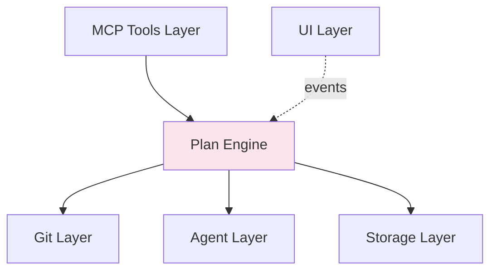

# Contributing Guide

> Everything you need to know to contribute to Copilot Orchestrator.

## Table of Contents

- [Quick Start](#quick-start)
- [Project Structure](#project-structure)
- [Development Workflow](#development-workflow)
- [Architecture Overview](#architecture-overview)
- [DI Convention](#di-convention)
- [Testing](#testing)
- [Code Style](#code-style)
- [Common Tasks](#common-tasks)
- [PR Checklist](#pr-checklist)

---

## Quick Start

### Prerequisites

| Tool | Minimum Version | Check |
|------|----------------|-------|
| Node.js | 18.x | `node -v` |
| VS Code | 1.109.0 | `code -v` |
| Git | 2.38+ (for `merge-tree`) | `git --version` |
| GitHub Copilot CLI | Latest | `copilot --version` |

### Setup

```bash
# 1. Clone
git clone https://github.com/JeromySt/vscode-copilot-orchestrator.git
cd vscode-copilot-orchestrator

# 2. Install dependencies
npm install

# 3. Compile
npm run compile

# 4. Run unit tests (headless, no VS Code needed)
npm run test:unit

# 5. Open in VS Code and press F5 to launch Extension Dev Host
code .
```

### Build Commands

| Command | Description |
|---------|-------------|
| `npm run compile` | Type-check + esbuild bundle |
| `npm run compile:tsc` | Full TypeScript compile to `out/` (for tests) |
| `npm run watch` | Compile in watch mode (esbuild + tsc) |
| `npm run test:unit` | Run all unit tests (Mocha TDD, headless) |
| `npm run test:coverage` | Tests + 95% line coverage enforcement |
| `npm run lint` | ESLint |
| `npm run local-install` | Bump patch + package VSIX + install locally |

---

## Project Structure

```
src/
├── extension.ts          # Activation entry point
├── composition.ts        # Production DI wiring (the ONLY place to new ConcreteClass())
├── agent/                # Copilot CLI integration
├── core/                 # Container, tokens, logger, infrastructure
├── git/                  # Git worktree/merge operations
├── interfaces/           # One interface per file (18 files)
├── mcp/                  # MCP server, tools, handlers, validation
├── plan/                 # DAG execution engine (the heart of the system)
│   ├── phases/           #   7-phase pipeline implementations
│   ├── repository/       #   Plan persistence & lazy spec loading
│   └── store/            #   Filesystem storage backend
├── process/              # OS process monitoring
├── ui/                   # Webview panels, templates, controls
│   ├── panels/           #   Plan + node detail panels
│   ├── templates/        #   HTML/CSS/JS generators
│   └── webview/          #   Browser-bundled control framework
├── test/                 # ALL test code lives here
│   ├── helpers/          #   Shared test infrastructure
│   │   ├── compositionTest.ts  # Test DI container with mock services
│   │   └── testAdapters.ts     # Mock implementations (MockConfigProvider, etc.)
│   └── unit/             #   Unit tests mirroring src/ structure
└── vscode/               # VS Code API adapters (production only)
```

**Key files to understand first:**
1. [composition.ts](../src/composition.ts) — DI wiring; shows how everything connects
2. [core/tokens.ts](../src/core/tokens.ts) — All 23 DI tokens
3. [plan/runner.ts](../src/plan/runner.ts) — Top-level orchestrator
4. [plan/executionEngine.ts](../src/plan/executionEngine.ts) — 7-phase pipeline

---

## Development Workflow

### Branch Naming

| Type | Pattern | Example |
|------|---------|---------|
| Feature | `feat/<description>` | `feat/add-retry-backoff` |
| Bug fix | `fix/<description>` | `fix/merge-conflict-handling` |
| Chore | `chore/<description>` | `chore/update-deps` |
| Release | `release/v<X.Y.Z>` | `release/v0.14.0` |

### Never commit directly to `main`

```bash
# Always create a feature branch first
git checkout -b feat/my-feature
# Make changes, then commit
git add -A && git commit -m "feat: description"
```

### Squash before pushing

If your branch has more than 5 commits ahead of main:
```bash
git reset --soft origin/main && git commit -m "feat: comprehensive summary"
```

### PR Process

1. Push your branch: `git push -u origin feat/my-feature`
2. Create PR: `gh pr create --base main`
3. Wait for CI (compile, test, coverage, CodeQL)
4. Address all review comments
5. Merge via squash: `gh pr merge --squash --delete-branch`

---

## Architecture Overview

The system follows a clean layered architecture. See [ARCHITECTURE.md](ARCHITECTURE.md) for full diagrams.



### Core Concepts

| Concept | Description |
|---------|-------------|
| **Plan** | A DAG of work nodes with a base branch, target branch, and execution state |
| **Node** | A single unit of work (agent, shell, or process) running in an isolated worktree |
| **Phase** | One step in the 7-phase pipeline (merge-fi → setup → prechecks → work → commit → postchecks → merge-ri) |
| **Worktree** | An isolated git checkout (detached HEAD) where a node executes |
| **Snapshot** | A temporary branch accumulating leaf merges before final validation |

### 7-Phase Pipeline

Every node passes through:

```
merge-fi → setup → prechecks → work → commit → postchecks → merge-ri
```

Failed phases can be retried individually via `resumeFromPhase`.

---

## DI Convention

**The single most important rule:** Never call `new ConcreteClass()` outside of `src/composition.ts`.

### Adding a New Service

1. **Define interface** — `src/interfaces/IMyService.ts`
2. **Add Symbol token** — `src/core/tokens.ts`
3. **Export from barrel** — `src/interfaces/index.ts`
4. **Implement** — accept dependencies via constructor (interfaces only)
5. **Register** — `src/composition.ts` (singleton or transient)
6. **Write tests** — mock via interfaces, never import concrete classes

```typescript
// ✅ Correct — accept interface
constructor(private readonly git: IGitOperations) {}

// ❌ Wrong — direct instantiation
const git = new DefaultGitOperations();
```

### Where can vscode be imported?

Only in these files:
- `src/vscode/adapters.ts`
- `src/extension.ts`
- `src/composition.ts`
- `src/ui/**`

Business logic must use DI interfaces (`IConfigProvider`, `IDialogService`, etc.).

---

## Testing

### Framework: Mocha TDD + Sinon + Assert

```typescript
import { suite, test, setup, teardown } from 'mocha';
import * as assert from 'assert';
import * as sinon from 'sinon';

suite('MyService', () => {
  let sandbox: sinon.SinonSandbox;

  setup(() => { sandbox = sinon.createSandbox(); });
  teardown(() => { sandbox.restore(); });

  suite('methodName', () => {
    test('should handle expected case', () => {
      // Arrange → Act → Assert
    });
  });
});
```

**Style rules:**
- Use `suite()` / `test()` — never `describe()` / `it()`
- Use Node.js `assert` — never chai or expect
- Mock DI dependencies as plain objects — never import concrete classes
- Use `sinon.createSandbox()` and restore in `teardown()`

### File naming

| Source file | Test file |
|-------------|-----------|
| `src/foo/bar.ts` | `src/test/unit/foo/bar.unit.test.ts` |

### Running tests

```bash
# All tests
npm run test:unit

# With 95% coverage enforcement
npm run test:coverage

# Specific test file
npx mocha --ui tdd --exit "out/test/unit/plan/builder.unit.test.js" \
  --require src/test/unit/register-vscode-mock.js
```

### Mocking DI dependencies

```typescript
// ✅ Correct — plain mock object
const mockLogger: any = {
  info: sandbox.stub(),
  warn: sandbox.stub(),
  error: sandbox.stub(),
  debug: sandbox.stub(),
};

// ❌ Wrong — never stub concrete classes
import { Logger } from '../../../core/logger';
```

See [TESTING.md](TESTING.md) for comprehensive patterns.

---

## Code Style

### TypeScript Conventions

| Rule | Example |
|------|---------|
| Strict mode enabled | `tsconfig.json` has all strict checks |
| Named exports only | `export function foo()` — no `export default` |
| `import type` for types | `import type { PlanInstance } from './types'` |
| CommonJS modules | `module: "commonjs"` in tsconfig |
| Target ES2022 | Modern JS features available |

### Error Handling

```typescript
// ✅ Return typed results for expected failures
async function merge(): Promise<{ success: boolean; error?: string }> {
  try {
    // ...
    return { success: true };
  } catch (err: any) {
    log.error('Merge failed', { error: err.message });
    return { success: false, error: err.message };
  }
}

// ❌ Don't throw for expected failures
```

### Logging

```typescript
const log = Logger.for('my-component');
log.info('Operation started', { planId, nodeId });
log.error('Operation failed', { error: err.message, phase: 'merge-ri' });
```

- Use structured context objects (never string interpolation)
- Never log credentials, tokens, or secrets
- Log entry/exit of significant operations

### File size limits

- **500 lines** — consider splitting
- **Methods > 50 lines** — extract helpers
- **Constructor > 5 dependencies** — class has too many responsibilities

---

## Common Tasks

### Adding a New MCP Tool

1. Add tool definition in `src/mcp/tools/planTools.ts` or `jobTools.ts`
2. Create handler in `src/mcp/handlers/`
3. Add JSON schema in `src/mcp/validation/schemas.ts`
4. Wire in `src/mcp/handler.ts` switch statement
5. Add tests for validation + handler logic

### Adding a New Execution Phase

1. Create `src/plan/phases/myPhase.ts` implementing `IPhaseExecutor`
2. Register in the phase dispatch in `executionEngine.ts`
3. Add to the phase order array in `executor.ts`
4. Add unit tests covering success, failure, and skip paths

### Adding a New UI Panel

1. Create panel class in `src/ui/panels/`
2. Create controller for message handling
3. Create templates in `src/ui/templates/<viewName>/`
4. Create webview controls in `src/ui/webview/controls/`
5. Wire webview bundle entry in `src/ui/webview/entries/`

### Modifying Plan Types

1. Update type in `src/plan/types/plan.ts` or `specs.ts`
2. Update MCP schema in `src/mcp/validation/schemas.ts`
3. Update MCP tool `inputSchema` in `src/mcp/tools/`
4. Update handler to process the new field
5. Add to persistence serialization if needed

---

## PR Checklist

Before submitting:

- [ ] `npm run compile` passes with no errors
- [ ] `npm run test:unit` passes with no failures
- [ ] `npm run test:coverage` meets 95% line coverage
- [ ] No `new ConcreteClass()` outside `composition.ts`
- [ ] No `import * as vscode` in business logic
- [ ] New interfaces have matching tokens in `tokens.ts`
- [ ] New services registered in `composition.ts`
- [ ] Tests use `suite()`/`test()` (not `describe()`/`it()`)
- [ ] No `console.log` — use `Logger.for()`
- [ ] Error handling follows `{ success, error? }` pattern
- [ ] Mermaid diagrams updated if architecture changed

### Must-Fix (blocks PR)

| Rule | Violation |
|------|-----------|
| DI violation | `new ConcreteClass()` outside composition root |
| Direct vscode import | `import * as vscode from 'vscode'` in business logic |
| Missing interface | New service without `src/interfaces/I*.ts` file |
| Missing token | New DI service without Symbol in `tokens.ts` |
| Wrong test style | Using `describe`/`it` instead of `suite`/`test` |
| Test coverage gap | New source lines without unit tests |

---

## Questions?

- **Architecture decisions** → [ARCHITECTURE.md](ARCHITECTURE.md)
- **DI patterns** → [DI_GUIDE.md](DI_GUIDE.md)
- **Testing patterns** → [TESTING.md](TESTING.md)
- **Git worktree details** → [WORKTREES_AND_MERGING.md](WORKTREES_AND_MERGING.md)
- **MCP tools** → [COPILOT_INTEGRATION.md](COPILOT_INTEGRATION.md)
- **Group semantics** → [GROUPS.md](GROUPS.md)
