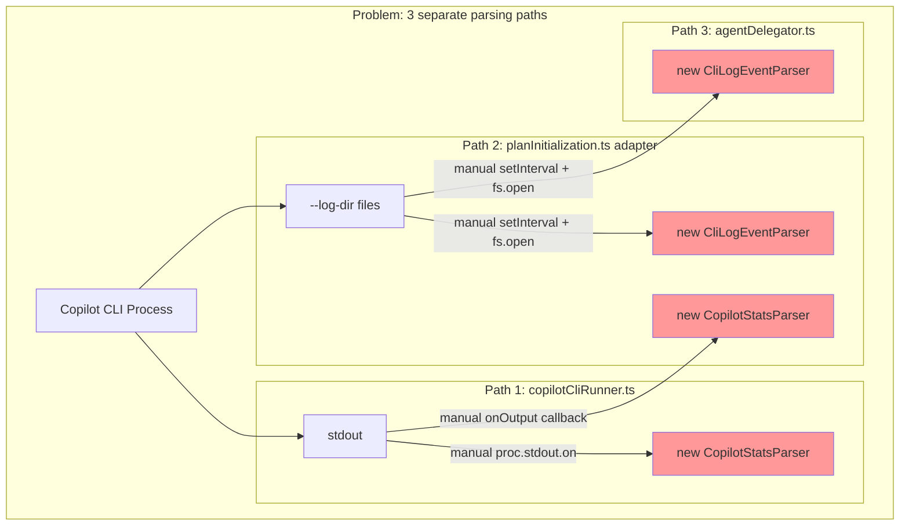
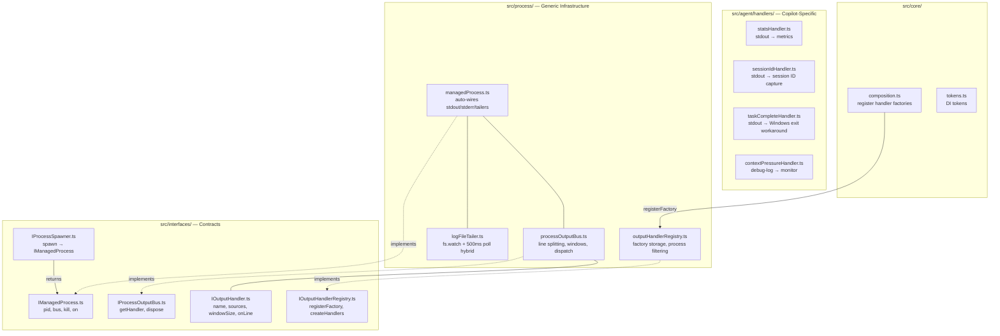

# Process Output Bus — Architecture Design Document

> **Version**: 1.0 (Released)  
> **Release**: v0.16.0  
> **Status**: Implemented  
> **Last Updated**: 2026-04-15  
> **Supersedes**: `CopilotStatsParser`, `CliLogEventParser`, adapter log-tailing in `planInitialization.ts`, delegator log-tailing in `agentDelegator.ts`

---

## Table of Contents

1. [Problem Statement](#1-problem-statement)
2. [Current Architecture (Problems)](#2-current-architecture-problems)
3. [Proposed Architecture](#3-proposed-architecture)
4. [Core Interfaces](#4-core-interfaces)
5. [Implementation Components](#5-implementation-components)
6. [Handler Design](#6-handler-design)
7. [Log File Tailing](#7-log-file-tailing)
8. [DI & Composition](#8-di--composition)
9. [Migration Path](#9-migration-path)
10. [File Layout](#10-file-layout)
11. [Testing Strategy](#11-testing-strategy)
12. [Resolved Decisions](#12-resolved-decisions)
13. [Resolved Open Questions](#13-resolved-open-questions)

---

## 1. Problem Statement

Process output parsing in the orchestrator has accumulated into a fragmented, duplicated, untestable mess:

1. **Two separate parsers** for the same CLI output — `CopilotStatsParser` (stdout summary) and `CliLogEventParser` (debug-log JSON) — with no shared abstraction
2. **Multiple parser instances** — `copilotCliRunner.ts` creates its own `CopilotStatsParser`, the adapter in `planInitialization.ts` creates another, `agentDelegator.ts` creates yet another `CliLogEventParser`
3. **Manual stdout wiring** — every caller does `proc.stdout.on('data', ...)` and manually feeds parsers
4. **Manual log-dir tailing** — `agentDelegator.ts` has 100+ lines of `setInterval` + `fs.openSync` + offset tracking + file rotation detection, duplicated in the adapter
5. **God-object parsers** — `CliLogEventParser` knows about token regex, model limits, summary stats, AND accumulates metrics state
6. **No extensibility** — adding a new output pattern means modifying a monolithic parser class
7. **Copilot-specific infrastructure** — log tailing and output parsing are hardwired to the Copilot CLI, but the patterns are generic to any spawned process
8. **No process-level lifecycle** — cleanup (clearing intervals, closing file handles) is scattered and easy to leak

### What We Want

- **One thing** responsible for capturing process output (stdout, stderr, log files)
- **Pluggable handlers** that declare what source/process they care about and co-locate pattern matching with response logic
- **Zero manual wiring** — the spawner auto-captures output, callers just declare what log sources exist
- **Process-agnostic** — works for `copilot`, `git`, `gh`, or any future process
- **Near real-time** — log file tailing at <100ms typical latency, not 2-second polls
- **Testable** — every component testable in isolation with mock dependencies

---

## 2. Current Architecture (Problems)



### Specific Smells

| Smell | Where | Impact |
|-------|-------|--------|
| Same stdout parsed twice | `copilotCliRunner` + adapter both parse | Wasted cycles, risk of divergent behavior |
| 100+ lines of log-tail boilerplate | `agentDelegator.ts` L440-540, adapter | Duplicated, error-prone, untestable |
| Parser knows all event shapes | `CliLogEventParser` has token regex + model regex + compaction regex + stats accumulation | Violates SRP, hard to extend |
| No handler lifecycle | `setInterval` timers manually cleared | Easy to leak on error paths |
| Copilot-specific infrastructure | Log tailing only works for Copilot | Can't reuse for git or other processes |

---

## 3. Proposed Architecture



### Design Principles

1. **Spawner owns output capture** — `IProcessSpawner.spawn()` returns an `IManagedProcess` that auto-captures stdout/stderr and tails declared log sources
2. **Bus is per-invocation** — each `spawn()` call creates its own `ProcessOutputBus` with its own line windows and handler instances. No cross-process contamination.
3. **Handlers co-locate extract + respond** — each handler file contains the regex pattern AND the response logic. No separate extractor/event/subscriber indirection.
4. **Handler registry is DI singleton** — handler factories are registered once at composition time. The spawner asks the registry "give me handlers for a `copilot` process" and gets back matched instances.
5. **Callers declare, never feed** — callers tell `spawn()` about log sources via `logSources` option. The `ManagedProcess` handles all wiring internally.
6. **Process-agnostic** — `ProcessOutputBus`, `LogFileTailer`, handler interfaces know nothing about Copilot. They work with any process.

---

## 4. Core Interfaces

### 4.1 `IProcessSpawner` (UNCHANGED)

`IProcessSpawner` is **not modified**. Only 2 of 22 spawn call sites need the bus/handler infrastructure. The other 20 (taskkill, git, gh, powershell.exe, caffeinate, etc.) would pay the cost of bus creation + handler registry lookup for no benefit.

```typescript
// src/interfaces/IProcessSpawner.ts — NO CHANGES
// Existing interface preserved exactly as-is.
// All 22 existing callers continue to work without modification.
```

### 4.1.1 `IManagedProcessFactory` (NEW — opt-in bus creation)

Callers that need the output bus create a `ManagedProcess` wrapping an already-spawned `ChildProcessLike`. This is the only new DI dependency callers need.

```typescript
// src/interfaces/IManagedProcessFactory.ts

export interface LogSourceConfig {
  /** Source tag used in handler.sources filter (e.g., 'debug-log') */
  name: string;
  /** 'file' = single file, 'directory' = watch dir for newest .log file */
  type: 'file' | 'directory';
  /** Absolute path to the file or directory */
  path: string;
  /** Fallback poll interval in ms (default: 500). Only used when fs.watch misses events. */
  pollIntervalMs?: number;
  /** Use fs.watch() for near-realtime notification (default: true) */
  watch?: boolean;
  /** Debounce interval for rapid fs.watch events (default: 50ms) */
  debounceMs?: number;
}

export interface ManagedProcessOptions {
  /** Process identity — used by handler registry to match handler factories */
  label: string;
  /** Log sources to tail automatically */
  logSources?: LogSourceConfig[];
  /** Plan context — passed to handler factories for per-job handler creation */
  planId?: string;
  nodeId?: string;
  worktreePath?: string;
}

export interface IManagedProcessFactory {
  /**
   * Wrap an already-spawned process with output bus + handlers + log tailers.
   * The factory asks the handler registry for matching handlers based on label,
   * creates a ProcessOutputBus, wires stdout/stderr, starts log tailers.
   */
  create(proc: ChildProcessLike, options: ManagedProcessOptions): IManagedProcess;
}
```

This means:
- **20 of 22 callers** — zero changes, keep using `spawner.spawn()` → `ChildProcessLike`
- **2 callers** (copilotCliRunner, workPhase) — spawn normally, then wrap: `factory.create(proc, { label: 'copilot', ... })`

### 4.2 `IManagedProcess`

```typescript
// src/interfaces/IManagedProcess.ts

/**
 * High-resolution timestamp captured via `performance.now()`.
 * Stored as milliseconds with sub-millisecond fractional precision (~5μs on most platforms).
 *
 * For display/serialization, convert to wall-clock via:
 *   wallMs = processOriginEpoch + hrTimestamp
 * where processOriginEpoch = Date.now() - performance.now() (captured once at module load).
 */
export type HrTimestamp = number;

/**
 * Module-level epoch anchor: wall-clock millis at the time `performance.now()` was 0.
 * Used to convert HrTimestamp → Date for display/persistence.
 */
export const processOriginEpoch: number = Date.now() - performance.now();

/** Convert a high-resolution timestamp to a wall-clock epoch ms value. */
export function hrToEpoch(hr: HrTimestamp): number {
  return processOriginEpoch + hr;
}

/**
 * Lifecycle timestamps for a managed process.
 * All values are high-resolution `performance.now()` timestamps for sub-ms precision.
 * Use `hrToEpoch()` to convert to wall-clock milliseconds for display.
 */
export interface ProcessTimestamps {
  /** When spawn() was called by the caller */
  requested: HrTimestamp;
  /** When the child process was actually created (post child_process.spawn) */
  created?: HrTimestamp;
  /** When the process emitted its first stdout/stderr data (confirms it's alive) */
  running?: HrTimestamp;
  /** When kill() was called (by caller, timeout, or watchdog) */
  killRequested?: HrTimestamp;
  /** When the OS confirmed the kill (process exited after kill request) */
  killed?: HrTimestamp;
  /** When the process exited (any reason — normal, error, signal, kill) */
  exited?: HrTimestamp;
}

/**
 * Computed durations derived from timestamps.
 * All values are milliseconds with sub-ms fractional precision.
 * Undefined if the prerequisite timestamps aren't available.
 */
export interface ProcessDurations {
  /** Total wall time from spawn request to process exit: exited - requested */
  total?: number;
  /** Time to spawn: created - requested */
  spawnLatency?: number;
  /** Time from created to first output: running - created */
  startupLatency?: number;
  /** Process active time: exited - created */
  processLifetime?: number;
  /** Time from kill request to actual exit: exited - killRequested */
  killLatency?: number;
}

/**
 * Comprehensive diagnostic snapshot for logging and debugging.
 * Available at any point in the process lifecycle.
 */
export interface ProcessDiagnostics {
  pid: number | undefined;
  exitCode: number | null;
  killed: boolean;
  timestamps: ProcessTimestamps;
  durations: ProcessDurations;
  /** Names of all registered handlers */
  handlerNames: string[];
  /** Bus-level metrics: lines per source, handler invocations, errors */
  busMetrics: import('../process/processOutputBus').BusMetrics;
  /** Per-tailer metrics: bytes read, offset, errors */
  tailerMetrics: Array<import('../process/logFileTailer').TailerMetrics>;
}

export interface IManagedProcess {
  readonly pid: number | undefined;
  readonly exitCode: number | null;
  readonly killed: boolean;
  /** The output bus for this process invocation. Handlers are pre-registered. */
  readonly bus: IProcessOutputBus;
  /** Lifecycle timestamps — populated as events occur */
  readonly timestamps: Readonly<ProcessTimestamps>;
  /** Computed durations — derived from timestamps, available after exit */
  readonly durations: ProcessDurations;
  /**
   * Diagnostic snapshot — all lifecycle state, handler names, bus metrics, tailer metrics.
   * Use for logging on failure or debugging missing handler output.
   */
  diagnostics(): ProcessDiagnostics;
  kill(signal?: NodeJS.Signals | number): boolean;
  on(event: 'exit', listener: (code: number | null, signal: string | null) => void): this;
  on(event: 'error', listener: (err: Error) => void): this;
  /** Emitted for every complete line from any source. Handlers AND line listeners both fire. */
  on(event: 'line', listener: (line: string, source: OutputSource) => void): this;
  on(event: string, listener: (...args: any[]) => void): this;
}
```

`ManagedProcess` populates timestamps automatically using `performance.now()`:

```typescript
// In DefaultProcessSpawner.spawn():
timestamps.requested = performance.now();
// ... child_process.spawn() ...
timestamps.created = performance.now();

// In ManagedProcess constructor:
proc.stdout?.on('data', () => { if (!timestamps.running) timestamps.running = performance.now(); });
proc.stderr?.on('data', () => { if (!timestamps.running) timestamps.running = performance.now(); });

// In kill():
timestamps.killRequested = performance.now();

// In proc.on('exit'):
timestamps.exited = performance.now();
if (timestamps.killRequested) timestamps.killed = timestamps.exited;

// durations getter computes from timestamps:
get durations(): ProcessDurations {
  const t = this.timestamps;
  return {
    total: t.exited && t.requested ? t.exited - t.requested : undefined,
    spawnLatency: t.created && t.requested ? t.created - t.requested : undefined,
    startupLatency: t.running && t.created ? t.running - t.created : undefined,
    processLifetime: t.exited && t.created ? t.exited - t.created : undefined,
    killLatency: t.exited && t.killRequested ? t.exited - t.killRequested : undefined,
  };
}
```

### 4.3 `IProcessOutputBus`

```typescript
// src/interfaces/IProcessOutputBus.ts

export interface IProcessOutputBus {
  /** Retrieve a registered handler by name, cast to the expected type. */
  getHandler<T extends IOutputHandler>(name: string): T | undefined;
  /** Names of all registered handlers */
  getHandlerNames(): string[];
  /** Bus-level metrics for diagnostics */
  getMetrics(): Readonly<BusMetrics>;
  /** Clean up all handlers and internal state. Called automatically on process exit. */
  dispose(): void;
}
```

> **Note**: `feed()` is NOT on the public interface. It's internal to `ProcessOutputBus` — only `ManagedProcess` and `LogFileTailer` call it. Callers never feed manually.

### 4.4 `IOutputHandler`

```typescript
// src/interfaces/IOutputHandler.ts

/**
 * Strongly typed output source descriptor.
 * Handlers declare which sources they listen to using these types,
 * not raw strings.
 */
export type OutputSource =
  | { type: 'stdout' }
  | { type: 'stderr' }
  | { type: 'log-file'; pattern: string };  // pattern matches LogSourceConfig.name (e.g., 'debug-log')

/** Frozen singleton source descriptors — no allocation per handler */
export const OutputSources = {
  stdout: Object.freeze({ type: 'stdout' } as const),
  stderr: Object.freeze({ type: 'stderr' } as const),
  logFile: (pattern: string): OutputSource => Object.freeze({ type: 'log-file', pattern } as const),
} as const;

/**
 * Get the source key used internally by the bus for matching.
 * - stdout → 'stdout'
 * - stderr → 'stderr'
 * - log-file with pattern 'debug-log' → 'log-file:debug-log'
 */
export function sourceKey(source: OutputSource): string {
  if (source.type === 'log-file') { return `log-file:${source.pattern}`; }
  return source.type;
}

export interface IOutputHandler {
  /** Unique name for retrieval via bus.getHandler(name) */
  readonly name: string;
  /** Which sources this handler listens to — strongly typed */
  readonly sources: OutputSource[];
  /** Number of trailing lines this handler needs to evaluate a match */
  readonly windowSize: number;
  /**
   * Called for each new line from a matching source.
   * @param window - The last N lines (handler's windowSize) for this source. ReadonlyArray — no copies.
   * @param source - The typed source that produced this line
   */
  onLine(window: ReadonlyArray<string>, source: OutputSource): void;
  /** Optional cleanup when the bus is disposed. */
  dispose?(): void;
}
```

Usage in handlers becomes:

```typescript
// StatsHandler — listens to stdout only
readonly sources = [OutputSources.stdout];

// TokenPressureHandler — listens to the copilot debug log
readonly sources = [OutputSources.logFile('debug-log')];

// A future handler that needs both stdout and a specific log
readonly sources = [OutputSources.stdout, OutputSources.logFile('otel-trace')];
```

The bus uses `sourceKey()` internally for matching. `ManagedProcess` feeds with:
- `bus.feed(chunk, OutputSources.stdout)`
- `bus.feed(chunk, OutputSources.stderr)`
- `LogFileTailer` feeds with `bus.feed(chunk, OutputSources.logFile(config.name))`

### 4.5 `IOutputHandlerRegistry`

```typescript
// src/interfaces/IOutputHandlerRegistry.ts

export interface HandlerContext {
  /** Process identity (e.g., 'copilot', 'git') — used for factory filtering */
  processLabel: string;
  /** Plan context for per-job handler creation */
  planId?: string;
  nodeId?: string;
  worktreePath?: string;
}

export interface IOutputHandlerFactory {
  /** Unique factory name */
  readonly name: string;
  /** Which process labels this factory creates handlers for. ['*'] = all. */
  readonly processFilter: string[];
  /** Create a handler instance, or undefined to skip (e.g., missing required context) */
  create(context: HandlerContext): IOutputHandler | undefined;
}

export interface IOutputHandlerRegistry {
  /** Register a handler factory (called at composition time) */
  registerFactory(factory: IOutputHandlerFactory): void;
  /** Create handler instances matching the given context's processLabel */
  createHandlers(context: HandlerContext): IOutputHandler[];
}
```

---

## 5. Implementation Components

### 5.1 `ProcessOutputBus`

```typescript
// src/process/processOutputBus.ts
// ~100 lines — pure infrastructure, zero domain knowledge

/** Maximum line length before forced line break (prevents unbounded buffer on progress spinners) */
const MAX_LINE_LENGTH = 65_536; // 64KB

export interface BusMetrics {
  /** Total lines fed per source key */
  linesBySource: Record<string, number>;
  /** Total handler invocations */
  handlerInvocations: number;
  /** Handler errors caught and swallowed */
  handlerErrors: number;
}

export class ProcessOutputBus implements IProcessOutputBus {
  private _windows = new Map<string, string[]>();
  private _lineBuffers = new Map<string, string>();
  private _handlers = new Map<string, IOutputHandler>();
  private _maxWindowPerSource = new Map<string, number>(); // per-source max(handler.windowSize)
  private _handlersBySourceKey = new Map<string, IOutputHandler[]>(); // pre-computed dispatch table
  private _metrics: BusMetrics = { linesBySource: {}, handlerInvocations: 0, handlerErrors: 0 };
  private _lineCallback?: (line: string, source: OutputSource) => void;

  /** Optional callback for IManagedProcess 'line' event emission */
  setLineCallback(cb: (line: string, source: OutputSource) => void): void {
    this._lineCallback = cb;
  }

  register(handler: IOutputHandler): void {
    this._handlers.set(handler.name, handler);
    // Pre-compute source key → handler[] dispatch table (avoids per-line sourceKey() calls)
    for (const src of handler.sources) {
      const key = sourceKey(src);
      const existing = this._handlersBySourceKey.get(key) ?? [];
      existing.push(handler);
      this._handlersBySourceKey.set(key, existing);
      // Track per-source max window
      const current = this._maxWindowPerSource.get(key) ?? 0;
      if (handler.windowSize > current) { this._maxWindowPerSource.set(key, handler.windowSize); }
    }
  }
  
  /** Internal — called by ManagedProcess and LogFileTailer only */
  feed(chunk: string, source: OutputSource): void {
    const key = sourceKey(source);
    const buffer = (this._lineBuffers.get(key) ?? '') + chunk;
    const lines = buffer.split(/\r?\n/);
    let remainder = lines.pop() ?? '';
    // Guard: if remainder exceeds max length, force a line break
    if (remainder.length > MAX_LINE_LENGTH) {
      lines.push(remainder);
      remainder = '';
    }
    this._lineBuffers.set(key, remainder);

    const maxWin = this._maxWindowPerSource.get(key) ?? 0;
    const handlers = this._handlersBySourceKey.get(key);
    if (!handlers || handlers.length === 0) { return; } // no handlers for this source — skip

    for (const line of lines) {
      if (line.length === 0) { continue; }
      this._metrics.linesBySource[key] = (this._metrics.linesBySource[key] ?? 0) + 1;

      // Emit line event for IManagedProcess listeners
      this._lineCallback?.(line, source);

      // Update sliding window (skip if all handlers need windowSize=1)
      let window: string[];
      if (maxWin <= 1) {
        window = [line]; // fast path — no window management
      } else {
        const win = this._windows.get(key) ?? [];
        win.push(line);
        if (win.length > maxWin) { win.splice(0, win.length - maxWin); }
        this._windows.set(key, win);
        window = win;
      }

      // Dispatch to matching handlers — errors isolated per handler
      for (const handler of handlers) {
        try {
          const tail = handler.windowSize >= window.length
            ? window
            : window.slice(window.length - handler.windowSize);
          handler.onLine(tail, source);
          this._metrics.handlerInvocations++;
        } catch (err) {
          this._metrics.handlerErrors++;
          // Log but don't propagate — one handler failure must not break others
          try { console.error(`[ProcessOutputBus] Handler '${handler.name}' threw:`, err); } catch { /* */ }
        }
      }
    }
  }

  getHandler<T extends IOutputHandler>(name: string): T | undefined {
    return this._handlers.get(name) as T | undefined;
  }

  /** Bus-level metrics for diagnostics */
  getMetrics(): Readonly<BusMetrics> { return this._metrics; }

  dispose(): void {
    for (const h of this._handlers.values()) { h.dispose?.(); }
    this._handlers.clear();
    this._handlersBySourceKey.clear();
    this._windows.clear();
    this._lineBuffers.clear();
  }
}
```

### 5.2 `ManagedProcess`

```typescript
// src/process/managedProcess.ts
// Wraps ChildProcess + auto-wires stdout/stderr + starts log tailers

export class ManagedProcess implements IManagedProcess {
  private _tailers: LogFileTailer[] = [];
  private _lineEmitter = new EventEmitter();
  readonly bus: ProcessOutputBus;

  constructor(
    private _proc: ChildProcessLike,
    bus: ProcessOutputBus,
    logSources: LogSourceConfig[],
    private _spawner?: IProcessSpawner,
    private _platform?: string,
  ) {
    this.bus = bus;
    
    // Auto-wire stdout/stderr → bus with typed sources
    _proc.stdout?.on('data', (data: Buffer) => bus.feed(data.toString(), OutputSources.stdout));
    _proc.stderr?.on('data', (data: Buffer) => bus.feed(data.toString(), OutputSources.stderr));
    
    // Start log tailers (ensure directories exist first)
    for (const src of logSources) {
      if (src.type === 'directory') {
        try { fs.mkdirSync(src.path, { recursive: true }); } catch { /* best-effort */ }
      }
      const tailer = new LogFileTailer(src, bus);
      tailer.start();
      this._tailers.push(tailer);
    }
    
    // Auto-cleanup on exit AND error
    const cleanup = () => { for (const t of this._tailers) { t.stop(); } };
    _proc.on('exit', () => cleanup());
    _proc.on('error', () => cleanup());
  }

  kill(signal?: NodeJS.Signals | number): boolean {
    this.timestamps.killRequested = performance.now();
    // Platform-aware kill: Windows ignores SIGTERM — use taskkill for process tree kill
    if (this._platform === 'win32' && this._spawner && this._proc.pid) {
      try {
        this._spawner.spawn('taskkill', ['/pid', String(this._proc.pid), '/f', '/t'], { shell: true });
        return true;
      } catch { return false; }
    }
    const result = this._proc.kill(signal);
    // Unix: escalate to SIGKILL after 5s if SIGTERM doesn't work
    if (this._platform !== 'win32' && signal !== 'SIGKILL') {
      setTimeout(() => { try { this._proc.kill('SIGKILL'); } catch { /* ignore */ } }, 5000);
    }
    return result;
  }

  /** Subscribe to line events — callers get raw lines alongside handler processing */
  on(event: 'line', listener: (line: string, source: OutputSource) => void): this;
  on(event: string, listener: (...args: any[]) => void): this;
  on(event: string, listener: (...args: any[]) => void): this {
    if (event === 'line') {
      this._lineEmitter.on('line', listener);
    } else {
      this._proc.on(event, listener);
    }
    return this;
  }
  
  // Delegate pid, exitCode, killed to _proc
}
```

### 5.3 `LogFileTailer`

```typescript
// src/process/logFileTailer.ts
// Hybrid fs.watch() + fallback poll for near-realtime log tailing

export interface TailerMetrics {
  bytesRead: number;
  linesFed: number;
  readErrors: number;
  watchEventsReceived: number;
  pollReadsPerformed: number;
  currentOffset: number;
  currentFile?: string;
}

/** Delay before final flush on stop — allows OS file buffers to settle (Windows issue) */
const FINAL_FLUSH_DELAY_MS = 100;

export class LogFileTailer {
  private _watcher?: fs.FSWatcher;
  private _pollInterval?: ReturnType<typeof setInterval>;
  private _offset = 0;
  private _currentFile?: string;
  private _debounceTimer?: ReturnType<typeof setTimeout>;
  private _metrics: TailerMetrics = {
    bytesRead: 0, linesFed: 0, readErrors: 0,
    watchEventsReceived: 0, pollReadsPerformed: 0,
    currentOffset: 0,
  };

  constructor(
    private _config: LogSourceConfig,
    private _bus: ProcessOutputBus,
  ) {}

  start(): void {
    if (this._config.watch !== false) {
      this._startWatcher();
    }
    // Always start fallback poll (catches fs.watch misses)
    this._pollInterval = setInterval(() => this._readNewBytes(), 
      this._config.pollIntervalMs ?? 500);
  }

  stop(): void {
    this._watcher?.close();
    this._watcher = undefined;
    if (this._pollInterval) { clearInterval(this._pollInterval); this._pollInterval = undefined; }
    if (this._debounceTimer) { clearTimeout(this._debounceTimer); this._debounceTimer = undefined; }
    // Delayed final flush: allow OS file buffers to settle before last read
    // (Windows does not guarantee process writes are flushed to disk on exit)
    setTimeout(() => this._readNewBytes(), FINAL_FLUSH_DELAY_MS);
  }

  /** Tailer-level diagnostics for debugging */
  getMetrics(): Readonly<TailerMetrics> { return this._metrics; }

  private _startWatcher(): void {
    const watchPath = this._config.type === 'directory' 
      ? this._config.path 
      : path.dirname(this._config.path);
    
    try {
      this._watcher = fs.watch(watchPath, () => {
        this._metrics.watchEventsReceived++;
        if (this._debounceTimer) clearTimeout(this._debounceTimer);
        this._debounceTimer = setTimeout(() => this._readNewBytes(), 
          this._config.debounceMs ?? 50);
      });
      this._watcher.on('error', (err) => {
        // fs.watch can fail (permission, too many watchers) — fallback poll covers it
        this._metrics.readErrors++;
        this._watcher?.close();
        this._watcher = undefined;
      });
    } catch {
      // fs.watch not available — fallback poll only
    }
  }

  private _readNewBytes(): void {
    this._metrics.pollReadsPerformed++;
    try {
      // For 'directory' type: find newest .log file, switch if needed
      // Read from _offset to end, feed to bus
      // Uses openSync + fstatSync + readSync (TOCTOU-safe)
      const chunk = /* read new bytes */;
      if (chunk.length > 0) {
        this._metrics.bytesRead += chunk.length;
        this._metrics.linesFed += chunk.split('\n').filter(l => l.length > 0).length;
        this._metrics.currentOffset = this._offset;
        this._metrics.currentFile = this._currentFile;
        this._bus.feed(chunk, OutputSources.logFile(this._config.name));
      }
    } catch {
      this._metrics.readErrors++;
    }
  }
}
```

**Latency characteristics:**

| Trigger | Typical Latency | Worst Case |
|---------|----------------|------------|
| `fs.watch()` fires | 10–50ms | Missed (unreliable on some FS) |
| Debounce | +50ms | +50ms |
| Fallback poll | — | 500ms |
| **Total** | **60–100ms** | **500ms** |

### 5.4 `OutputHandlerRegistry`

```typescript
// src/process/outputHandlerRegistry.ts

export class OutputHandlerRegistry implements IOutputHandlerRegistry {
  private _factories = new Map<string, IOutputHandlerFactory>();

  registerFactory(factory: IOutputHandlerFactory): void {
    this._factories.set(factory.name, factory);
  }

  createHandlers(context: HandlerContext): IOutputHandler[] {
    const handlers: IOutputHandler[] = [];
    for (const factory of this._factories.values()) {
      if (factory.processFilter.includes('*') || 
          factory.processFilter.includes(context.processLabel)) {
        const handler = factory.create(context);
        if (handler) { handlers.push(handler); } // factory returns undefined to skip
      }
    }
    return handlers;
  }
}
```

### 5.5 `ManagedProcessFactory`

```typescript
// src/process/managedProcessFactory.ts

export class ManagedProcessFactory implements IManagedProcessFactory {
  constructor(
    private readonly _registry: IOutputHandlerRegistry,
  ) {}

  create(proc: ChildProcessLike, options: ManagedProcessOptions): IManagedProcess {
    const bus = new ProcessOutputBus();
    const handlers = this._registry.createHandlers({
      processLabel: options.label,
      planId: options.planId,
      nodeId: options.nodeId,
      worktreePath: options.worktreePath,
    });
    for (const h of handlers) { bus.register(h); }
    
    return new ManagedProcess(proc, bus, options.logSources ?? []);
  }
}
```

> **Note**: `DefaultProcessSpawner` is **unchanged**. It still returns `ChildProcessLike`.
> Callers opt in to the bus by injecting `IManagedProcessFactory` and wrapping the process.

---

## 6. Handler Design

Each handler is a single file that co-locates pattern matching with response logic. No intermediary events.

### 6.1 `StatsHandler` (extracted from `CopilotStatsParser`)

```typescript
// src/agent/handlers/statsHandler.ts
// sources: ['stdout'], processFilter: ['copilot']

export class StatsHandler implements IOutputHandler {
  readonly name = 'stats';
  readonly sources = [OutputSources.stdout];
  readonly windowSize = 1;  // summary stats are per-line

  private _premiumRequests?: number;
  private _apiTimeSeconds?: number;
  private _sessionTimeSeconds?: number;
  private _codeChanges?: CodeChangeStats;
  private _modelBreakdown?: ModelUsageBreakdown[];
  private _parsingModels = false;
  private _hasAnyMetric = false;
  private _statsStartedAt?: number;

  onLine(window: ReadonlyArray<string>, _source: OutputSource): void {
    const line = window[window.length - 1];
    // ... regex matching for Total usage, API time, model breakdown, etc.
    // ... directly accumulates into private fields
  }

  getStatsStartedAt(): number | undefined { return this._statsStartedAt; }
  getMetrics(): CopilotUsageMetrics | undefined { ... }
}

export const StatsHandlerFactory: IOutputHandlerFactory = {
  name: 'stats',
  processFilter: ['copilot'],
  create: () => new StatsHandler(),
};
```

### 6.2 `ContextPressureHandler` (merged — single handler, single monitor)

The three debug-log handlers (`TokenPressureHandler`, `ModelLimitsHandler`, `CompactionHandler`) all
operate on the same `IContextPressureMonitor`, listen to the same source, and use `windowSize: 1`.
Splitting them into three files adds indirection with no benefit. Merged into one:

```typescript
// src/agent/handlers/contextPressureHandler.ts
// sources: [log-file:debug-log], processFilter: ['copilot']

const RE_INPUT_TOKENS = /"input_tokens":\s*(\d+)/;
const RE_OUTPUT_TOKENS = /"output_tokens":\s*(\d+)/;
const RE_MAX_PROMPT = /"max_prompt_tokens":\s*(\d+)/;
const RE_MAX_WINDOW = /"max_context_window_tokens":\s*(\d+)/;
const RE_COMPACTION = /"truncateBasedOn":\s*"tokenCount"/;

export class ContextPressureHandler implements IOutputHandler {
  readonly name = 'context-pressure';
  readonly sources = [OutputSources.logFile('debug-log')];
  readonly windowSize = 1;

  constructor(private _monitor: IContextPressureMonitor) {}

  onLine(window: ReadonlyArray<string>, _source: OutputSource): void {
    const line = window[window.length - 1];

    // Token usage
    const inputMatch = RE_INPUT_TOKENS.exec(line);
    const outputMatch = RE_OUTPUT_TOKENS.exec(line);
    if (inputMatch || outputMatch) {
      this._monitor.recordTurnUsage(
        inputMatch ? parseInt(inputMatch[1], 10) : 0,
        outputMatch ? parseInt(outputMatch[1], 10) : 0,
      );
    }

    // Model limits
    const promptMatch = RE_MAX_PROMPT.exec(line);
    const windowMatch = RE_MAX_WINDOW.exec(line);
    if (promptMatch || windowMatch) {
      this._monitor.setModelLimits(
        promptMatch ? parseInt(promptMatch[1], 10) : 0,
        windowMatch ? parseInt(windowMatch[1], 10) : 0,
      );
    }

    // Compaction
    if (RE_COMPACTION.test(line)) {
      this._monitor.recordCompaction();
    }
  }

  /** Expose the monitor for UI producers that need to read pressure state */
  get monitor(): IContextPressureMonitor { return this._monitor; }

  dispose(): void {
    // Unregister from the global monitor registry
    unregisterMonitor(this._monitor.planId, this._monitor.nodeId);
  }
}
```

**Factory — monitor created once, cleanup guaranteed:**

```typescript
export const ContextPressureHandlerFactory: IOutputHandlerFactory = {
  name: 'context-pressure',
  processFilter: ['copilot'],
  create: (ctx) => {
    // Skip if no plan context (e.g., model discovery, CLI check — not a plan job)
    if (!ctx.planId || !ctx.nodeId) { return undefined; }
    const monitor = new ContextPressureMonitor(ctx.planId, ctx.nodeId, 1, 'work');
    registerMonitor(ctx.planId, ctx.nodeId, monitor);
    return new ContextPressureHandler(monitor);
  },
};
```

**Key design decisions:**
- **One handler, one monitor** — no risk of 3 factories creating 3 separate monitors
- **`dispose()` calls `unregisterMonitor()`** — no leaked global state
- **Explicit guard** for `planId`/`nodeId` — fails fast instead of `!` assertion
- **`monitor` getter** — `ContextPressureProducer` can access via `bus.getHandler<ContextPressureHandler>('context-pressure')?.monitor`

### 6.3 `SessionIdHandler` (extracted from copilotCliRunner inline logic)

Currently the runner extracts Copilot session IDs from stdout using 3 regex patterns
inline in the stdout `'data'` listener. This is copilot-specific stdout pattern matching —
exactly what a handler is for.

```typescript
// src/agent/handlers/sessionIdHandler.ts
// sources: [stdout], processFilter: ['copilot']

const RE_SESSION_PATTERNS = [
  /Session ID[:\s]+([a-f0-9-]{36})/i,
  /session[:\s]+([a-f0-9-]{36})/i,
  /Starting session[:\s]+([a-f0-9-]{36})/i,
];

export class SessionIdHandler implements IOutputHandler {
  readonly name = 'session-id';
  readonly sources = [OutputSources.stdout];
  readonly windowSize = 1;

  private _sessionId?: string;

  onLine(window: ReadonlyArray<string>, _source: OutputSource): void {
    if (this._sessionId) { return; } // already captured — skip
    const line = window[window.length - 1];
    for (const re of RE_SESSION_PATTERNS) {
      const match = re.exec(line);
      if (match) { this._sessionId = match[1]; return; }
    }
  }

  getSessionId(): string | undefined { return this._sessionId; }
}

export const SessionIdHandlerFactory: IOutputHandlerFactory = {
  name: 'session-id',
  processFilter: ['copilot'],
  create: () => new SessionIdHandler(),
};
```

### 6.4 `TaskCompleteHandler` (Windows exit-code workaround)

On Windows, the Copilot CLI sometimes exits with `code=null, signal=null` even on
success. The runner detects this by looking for the `'Task complete'` marker in stdout.
Extracted as a handler so the runner just checks `handler.sawTaskComplete()`.

```typescript
// src/agent/handlers/taskCompleteHandler.ts
// sources: [stdout], processFilter: ['copilot']

export class TaskCompleteHandler implements IOutputHandler {
  readonly name = 'task-complete';
  readonly sources = [OutputSources.stdout];
  readonly windowSize = 1;

  private _sawTaskComplete = false;

  onLine(window: ReadonlyArray<string>, _source: OutputSource): void {
    if (!this._sawTaskComplete && window[window.length - 1].includes('Task complete')) {
      this._sawTaskComplete = true;
    }
  }

  sawTaskComplete(): boolean { return this._sawTaskComplete; }
}

export const TaskCompleteHandlerFactory: IOutputHandlerFactory = {
  name: 'task-complete',
  processFilter: ['copilot'],
  create: () => new TaskCompleteHandler(),
};
```

---

## 7. Log File Tailing

### 7.1 Strategy

Hybrid `fs.watch()` + fallback poll:

- **`fs.watch()`**: Fires within 10–50ms of a write on all major platforms. Used as the primary notification.
- **Debounce (50ms)**: Batches rapid sequential writes (CLI writes many lines per API turn).
- **Fallback poll (500ms)**: Catches events `fs.watch()` misses. `fs.watch()` is documented as unreliable on network filesystems, WSL1, and some edge cases.
- **File rotation**: For `type: 'directory'`, watches the directory for new `.log` files. On rotation: flush old file, switch to new, reset offset.
- **TOCTOU safety**: Uses `openSync` + `fstatSync` + `readSync` (proven pattern, previously used in `agentDelegator.ts`).

### 7.2 `fs` Exemption Consolidation

`LogFileTailer` centralizes ALL log-tailing `fs` operations (`openSync`, `fstatSync`, `readSync`,
`closeSync`, `readdirSync`, `statSync`, `existsSync`, `watch`). This eliminates duplicate `fs`
exemptions from two files:

| File | Current fs calls | After refactor | Exemption status |
|------|-----------------|----------------|------------------|
| `src/agent/agentDelegator.ts` | 16 (all log tailing) | 0 | **REMOVE exemption** |
| `src/core/planInitialization.ts` | 7 (all log tailing) | 0 | **REMOVE exemption** |
| `src/process/logFileTailer.ts` | ~10 (centralized) | N/A | **ADD exemption** (performance-critical log tailing) |
| `src/plan/logFileHelper.ts` | 9 (log file creation/reading) | Unchanged | Keep existing exemption |

**Net result**: Fewer files with `fs` exemptions, and the one new exemption is in a purpose-built
infrastructure module that IS the abstraction boundary for log file I/O (same pattern as
`DefaultProcessSpawner` being the boundary for `child_process`).

Update `code-review.instructions.md` to:
```
- Direct `fs` calls in `src/process/logFileTailer.ts` (performance-critical log tailing — the abstraction boundary for log file monitoring)
```
Remove from the acceptable patterns list:
- ~~`agentDelegator.ts` log-tail loop~~ (deleted)
- ~~`planInitialization.ts` adapter log-tail~~ (deleted)

### 7.3 Cleanup Guarantees

| Event | Cleanup Action |
|-------|---------------|
| Process exits | `ManagedProcess` stops all tailers (final flush) |
| Bus disposed | All handler `dispose()` called, windows cleared |
| Tailer stopped | `fs.watch()` closed, `setInterval` cleared, final read |

No manual cleanup required by callers.

---

## 8. DI & Composition

### 8.1 New DI Tokens

```typescript
// src/core/tokens.ts — additions
export const IOutputHandlerRegistry = Symbol('IOutputHandlerRegistry');
export const IManagedProcessFactory = Symbol('IManagedProcessFactory');
```

> **Note**: `IProcessSpawner` token already exists and is **unchanged**.

### 8.2 Composition Root

```typescript
// src/composition.ts — handler factory registration

// 1. Create and register the handler registry
const registry = new OutputHandlerRegistry();
container.registerInstance(Tokens.IOutputHandlerRegistry, registry);

// 2. Register handler factories (one line each — all visible here)
registry.registerFactory(StatsHandlerFactory);
registry.registerFactory(SessionIdHandlerFactory);
registry.registerFactory(TaskCompleteHandlerFactory);
registry.registerFactory(ContextPressureHandlerFactory);
// Future: registry.registerFactory(GitProgressHandlerFactory);

// 3. ManagedProcessFactory receives the registry
container.registerSingleton(Tokens.IManagedProcessFactory, (c) =>
  new ManagedProcessFactory(c.resolve(Tokens.IOutputHandlerRegistry))
);

// 4. DefaultProcessSpawner — UNCHANGED, no new dependencies
```

### 8.3 What `CopilotCliRunner` Becomes

```typescript
// BEFORE (hundreds of lines of wiring)
const statsParser = new CopilotStatsParser();
proc.stdout.on('data', (d) => { statsParser.feedLine(d); onOutput(d); });
logTailInterval = setInterval(() => { /* 100 lines of fs.open/read/rotation */ }, 2000);
// ...
const metrics = statsParser.getMetrics();

// AFTER
const rawProc = this.spawner.spawn(command, [], { cwd, shell: true, env: cleanEnv });
const proc = this.managedFactory.create(rawProc, {
  label: 'copilot',
  planId, nodeId,
  worktreePath: cwd,
  logSources: [{
    name: 'debug-log',
    type: 'directory',
    path: path.join(cwd, '.orchestrator', '.copilot-cli', 'logs'),
  }],
});
// stdout lines still available for execution log:
proc.on('line', (line, source) => { if (source.type === 'stdout') onOutput?.(line); });
// ... on exit:
const stats = proc.bus.getHandler<StatsHandler>('stats');
const sessionId = proc.bus.getHandler<SessionIdHandler>('session-id')?.getSessionId();
const sawComplete = proc.bus.getHandler<TaskCompleteHandler>('task-complete')?.sawTaskComplete();
const effectiveCode = (code === null && signal === null && sawComplete) ? 0 : code;
const metrics = stats?.getMetrics();
// On error, include diagnostics for debugging:
if (!success) { this.logger.error('[copilot] Process failed', proc.diagnostics()); }
```

### 8.4 Stats Hang Timer — Remains in `CopilotCliRunner`

The 30-second stats-hang kill timer is process-lifecycle logic specific to Copilot CLI's
known behavior (printing stats but not exiting). It stays in the runner:

```typescript
// In copilotCliRunner.ts — check on every stdout line
proc.on('line', (line, source) => {
  if (source.type === 'stdout') {
    const stats = proc.bus.getHandler<StatsHandler>('stats');
    if (stats?.getStatsStartedAt() && !statsHangTimer) {
      statsHangTimer = setTimeout(() => proc.kill(), 30_000);
    }
  }
});
```

This is **not** a handler because it requires process kill access and timeout scheduling —
concerns that don't belong in a pattern-matching handler.

---

## 9. Migration Path

### Phase 1: Core Infrastructure (no behavior change)

1. Create interfaces: `IManagedProcess`, `IManagedProcessFactory`, `IProcessOutputBus`, `IOutputHandler`, `IOutputHandlerRegistry`
2. Implement: `ProcessOutputBus`, `OutputHandlerRegistry`, `LogFileTailer`, `ManagedProcess`, `ManagedProcessFactory`
3. Register DI tokens (`IOutputHandlerRegistry`, `IManagedProcessFactory`)
4. **`IProcessSpawner` is NOT modified** — zero impact on existing callers
5. Unit tests for all infrastructure

### Phase 2: Extract Handlers (behavior-preserving extraction)

1. Extract `StatsHandler` from `CopilotStatsParser` logic
2. Extract `ContextPressureHandler` from `CliLogEventParser` logic (merged token/model/compaction)
3. Register handler factories in composition
4. Unit tests for each handler

### Phase 3: Migrate Callers (opt-in, no breaking changes)

1. Update `copilotCliRunner.ts` — inject `IManagedProcessFactory`, spawn then wrap, remove manual parsing + log tailing
2. Remove `createAgentDelegatorAdapter()` from `planInitialization.ts` — phases now inject `ICopilotRunner` directly
3. Delete `agentDelegator.ts` entirely — all callers (`workPhase`, `precheckPhase`, `postcheckPhase`, `commitPhase`) rewired to `ICopilotRunner`
4. Delete `cliLogEventParser.ts` and `ICliLogEventParser.ts` — logic in `ContextPressureHandler`
5. Remove `CopilotStatsParser` class (logic in `StatsHandler`)
6. Remove `IAgentDelegator` token from `tokens.ts` and ESLint rule from `eslint.config.js`
7. Remove `ICliLogEventParser` token and DI registration from `composition.ts`

### Phase 4: fs Exemption Cleanup

1. Add `src/process/logFileTailer.ts` to `code-review.instructions.md` exemption list
2. Remove `agentDelegator.ts` from ESLint legacy DI exemptions
3. Verify zero remaining `fs` calls in migrated files

### Phase 5: Context Pressure UI Integration

1. `ContextPressureHandlerFactory` already registers monitors in `pressureMonitorRegistry` — the same global registry `ContextPressureProducer` reads from
2. Deleting `agentDelegator.ts` removed the duplicate monitor creation — only the bus handler creates monitors now
3. No UI code changes needed — the producer's `getMonitor()` callback resolves monitors registered by the bus handler

---

## 10. File Layout

```
src/interfaces/
  IProcessSpawner.ts              UNCHANGED — still returns ChildProcessLike
  IManagedProcess.ts              NEW — process wrapper with bus + timestamps
  IManagedProcessFactory.ts       NEW — opt-in factory: ChildProcessLike → IManagedProcess
  IProcessOutputBus.ts            NEW — getHandler<T>, dispose
  IOutputHandler.ts               NEW — name, sources, windowSize, onLine, OutputSource type
  IOutputHandlerRegistry.ts       NEW — registerFactory, createHandlers, HandlerContext

src/process/
  processOutputBus.ts             NEW — line splitting, sliding windows, dispatch
  managedProcess.ts               NEW — wraps ChildProcess, auto-wires stdout/stderr/tailers
  managedProcessFactory.ts        NEW — creates ManagedProcess with bus + matched handlers
  logFileTailer.ts                NEW — fs.watch + 500ms poll hybrid (fs exemption)
  outputHandlerRegistry.ts        NEW — factory storage, process label matching

src/agent/handlers/
  statsHandler.ts                 NEW — extracted from CopilotStatsParser
  sessionIdHandler.ts             NEW — extracted from copilotCliRunner inline regex
  taskCompleteHandler.ts          NEW — extracted from copilotCliRunner sawTaskComplete flag
  contextPressureHandler.ts       NEW — merged token/model/compaction → monitor

src/agent/
  copilotCliRunner.ts             MODIFIED — inject IManagedProcessFactory, remove parsing
  copilotStatsParser.ts           DELETED (logic moved to StatsHandler)
  cliLogEventParser.ts            DELETED (logic moved to ContextPressureHandler)
  agentDelegator.ts               DELETED (callers rewired to ICopilotRunner directly)

src/interfaces/
  ICliLogEventParser.ts           DELETED (logic in ContextPressureHandler)

src/core/
  tokens.ts                       MODIFIED — add IOutputHandlerRegistry, IManagedProcessFactory; remove IAgentDelegator, ICliLogEventParser
  composition.ts                  MODIFIED — register handler factories; remove CliLogEventParser DI registration

src/plan/phases/
  workPhase.ts                    MODIFIED — runAgent() takes ICopilotRunner, not agentDelegator
  precheckPhase.ts                MODIFIED — constructor takes copilotRunner, not agentDelegator
  postcheckPhase.ts               MODIFIED — constructor takes copilotRunner, not agentDelegator
  commitPhase.ts                  MODIFIED — AI review calls copilotRunner.run(), not agentDelegator.delegate()

src/plan/
  executor.ts                     MODIFIED — removed setAgentDelegator(); phaseDeps uses copilotRunner

src/core/
  planInitialization.ts           MODIFIED — removed createAgentDelegatorAdapter(); removed setAgentDelegator() call
```

---

## 11. Testing Strategy

### 11.1 Unit Tests

| Component | Test Approach | Mocks |
|-----------|--------------|-------|
| `ProcessOutputBus` | Feed lines, verify handlers called with correct windows | Mock `IOutputHandler` |
| `ProcessOutputBus` (error isolation) | Handler throws → verify other handlers still called, error counted in metrics | Mock throwing handler |
| `ProcessOutputBus` (optimization) | All handlers windowSize=1 → verify no window allocation | Mock `IOutputHandler` |
| `ProcessOutputBus` (max line length) | Feed 100KB line with no newline → verify forced break at 64KB | Mock `IOutputHandler` |
| `ProcessOutputBus` (metrics) | Feed N lines → verify `getMetrics().linesBySource` counts correct | Mock `IOutputHandler` |
| `LogFileTailer` | Create temp files, write data, verify bus receives chunks | Real FS (temp dir) |
| `LogFileTailer` (metrics) | Write data, verify `getMetrics().bytesRead`, `pollReadsPerformed` | Real FS (temp dir) |
| `LogFileTailer` (watch failure) | Simulate `fs.watch` error → verify fallback to poll-only | Mock fs |
| `OutputHandlerRegistry` | Register factories, verify filtering by processLabel | Mock `IOutputHandlerFactory` |
| `OutputHandlerRegistry` (skip undefined) | Factory returns undefined → verify not added to handler list | Mock factory |
| `ManagedProcess` | Verify stdout/stderr auto-wired, tailers started/stopped | Mock `ChildProcessLike`, mock bus |
| `ManagedProcess` (timestamps) | Verify all timestamps populated at correct lifecycle points | Mock `ChildProcessLike` |
| `ManagedProcess` (error cleanup) | Proc emits 'error' → verify tailers stopped | Mock `ChildProcessLike` |
| `ManagedProcess` (diagnostics) | Verify `diagnostics()` returns complete snapshot | Mock all |
| `ManagedProcess` (kill Windows) | Platform='win32' → verify taskkill spawned | Mock spawner |
| `ManagedProcess` (kill Unix) | Platform='linux' → verify SIGTERM then SIGKILL escalation | Mock proc |
| `ManagedProcessFactory` | Verify registry called, bus created, handlers registered | Mock registry |
| `StatsHandler` | Feed known stdout lines, verify `getMetrics()` | None (pure logic) |
| `StatsHandler` (multi-line model) | Feed "Breakdown by AI model:" + model line → verify breakdown | None |
| `SessionIdHandler` | Feed line with Session ID → verify `getSessionId()` returns UUID | None |
| `SessionIdHandler` (already captured) | Feed two lines with IDs → verify only first captured | None |
| `TaskCompleteHandler` | Feed 'Task complete' → verify `sawTaskComplete()` returns true | None |
| `ContextPressureHandler` | Feed debug-log lines with tokens/limits/compaction, verify monitor calls | Mock `IContextPressureMonitor` |
| `ContextPressureHandler` (dispose) | Verify `unregisterMonitor` called on dispose | Mock registry |
| `ContextPressureHandlerFactory` (no context) | Missing planId → verify factory returns undefined | None |

### 11.2 Integration Tests

- Spawn a real process (e.g., `echo`), verify stdout flows through bus to handlers
- Write to a temp log file, verify `LogFileTailer` picks up data within 500ms

---

## 12. Resolved Decisions

Issues identified during architecture review, with resolutions:

### R1. `IProcessSpawner` is NOT modified — `IManagedProcessFactory` instead

**Problem**: Changing `spawn()` to return `IManagedProcess` would break 22 call sites, but only 2 need the bus.

**Resolution**: `IProcessSpawner` is unchanged. New `IManagedProcessFactory` wraps an already-spawned `ChildProcessLike` with bus + handlers. Callers opt in. The 20 simple call sites (taskkill, git, gh, power manager) are untouched.

### R2. One handler, one monitor — merged `ContextPressureHandler`

**Problem**: Three separate factories (`TokenPressure`, `ModelLimits`, `Compaction`) would create three separate `ContextPressureMonitor` instances for the same node.

**Resolution**: Merged into single `ContextPressureHandler` with one monitor. Factory validates `planId`/`nodeId` (no `!` assertions). `dispose()` calls `unregisterMonitor()` — no leaked global state.

### R3. `proc.on('line', ...)` for stdout passthrough

**Problem**: `copilotCliRunner` passes stdout lines to callers via `onOutput`. With the bus model, callers need raw lines for execution logs.

**Resolution**: `IManagedProcess` emits `'line'` events with `(line: string, source: OutputSource)`. Callers subscribe: `proc.on('line', (line, src) => { if (src.type === 'stdout') onOutput(line); })`. The bus feeds handlers AND emits line events — both happen, no choice needed.

### R4. `LogFileTailer` gets the `fs` exemption — removes 2 others

**Problem**: `LogFileTailer` uses raw `fs` calls (out of approved list). But `agentDelegator.ts` and `planInitialization.ts` currently have the same calls duplicated.

**Resolution**: `src/process/logFileTailer.ts` added to `code-review.instructions.md` exemption list. `agentDelegator.ts` and `planInitialization.ts` lose all `fs` calls (log tailing code deleted). Net: fewer exemptions, centralized in a purpose-built abstraction boundary.

### R5. Stats hang timer stays in `CopilotCliRunner`

**Problem**: The 30s stats-hang kill timer needs process kill access. Handlers don't have that.

**Resolution**: This is runner-owned lifecycle logic, not a handler. The runner reads `bus.getHandler<StatsHandler>('stats')?.getStatsStartedAt()` and manages the kill timer directly.

### R6. `windowSize` optimization — skip window for `windowSize: 1`

**Problem**: The bus maintains a 30-line sliding window per source, but all current handlers use `windowSize: 1`.

**Resolution**: Bus tracks `_maxWindowPerSource` instead of a global max. If all handlers for a source have `windowSize: 1`, skip window management entirely — just pass the one line. Add the optimization in implementation, not the interface.

### R7. `HrTimestamp` is session-scoped

**Problem**: `processOriginEpoch` is computed at module load. If the extension reloads, old timestamps are incomparable.

**Resolution**: Documented as intentional. Timestamps are session-scoped and NOT directly serializable. Use `hrToEpoch()` to convert to wall-clock `Date` for persistence or display.

### R8. `windowSize` vs stateful multi-line parsing

**Problem**: `StatsHandler` parses multi-line model breakdown blocks using internal state (`_parsingModels` flag), not `windowSize > 1`.

**Resolution**: `windowSize` is for **stateless** multi-line patterns where the handler needs N previous lines to decide. Stateful parsers like `StatsHandler` use `windowSize: 1` + internal state. Both are valid. Document the distinction.

### R9. `stdin` not supported on `IManagedProcess`

**Problem**: `remoteProviderDetector.ts` writes to `proc.stdin` for `git credential fill`. `IManagedProcess` doesn't expose stdin.

**Resolution**: Intentional limitation. `IManagedProcess` is for output monitoring, not interactive I/O. Callers needing stdin use `IProcessSpawner` directly and don't wrap with the factory. Documented.

### R10. Session ID extraction must be a handler (v0.3)

**Problem**: copilotCliRunner extracts session IDs from stdout using 3 inline regex patterns. This is copilot-specific stdout pattern matching — the same responsibility handlers serve.

**Resolution**: New `SessionIdHandler` (§6.3). Runner retrieves via `bus.getHandler<SessionIdHandler>('session-id')?.getSessionId()` on exit. The inline `extractSession()` function is deleted.

### R11. Task Complete marker must be a handler (v0.3)

**Problem**: `sawTaskComplete` flag in copilotCliRunner checks for `'Task complete'` in stdout for a Windows exit-code workaround. This is inline pattern matching.

**Resolution**: New `TaskCompleteHandler` (§6.4). Runner retrieves via `bus.getHandler<TaskCompleteHandler>('task-complete')?.sawTaskComplete()` in the exit handler.

### R12. `ManagedProcess.kill()` needs platform-aware logic (v0.3)

**Problem**: On Windows, `proc.kill('SIGTERM')` is silently ignored. The runner currently dispatches to `taskkill /pid N /f /t`. If `IManagedProcess` wraps kill() without platform logic, Windows kills silently fail and kill timestamps are wrong.

**Resolution**: `ManagedProcess` receives `IProcessSpawner` + platform string via constructor. `kill()` dispatches to `taskkill` on Windows, SIGTERM + SIGKILL escalation on Unix. Kill timestamps are recorded inside `ManagedProcess.kill()`, not the caller. See §5.2.

### R13. `'line'` event must be on `IManagedProcess` interface (v0.3)

**Problem**: §8.3 and §8.4 use `proc.on('line', ...)` but the interface only declared `'exit'` and `'error'` events.

**Resolution**: Added `on(event: 'line', listener: (line: string, source: OutputSource) => void)` overload to `IManagedProcess`. Bus emits line events via a `setLineCallback()` on the bus, called from `ManagedProcess`'s internal `EventEmitter`.

### R14. Log directory creation ownership (v0.3)

**Problem**: agentDelegator.ts creates the log directory (`fs.mkdirSync`) before CLI is spawned. The CLI needs it to exist. The doc didn't specify who creates it.

**Resolution**: `ManagedProcess` constructor creates directories for `type: 'directory'` log sources before starting tailers. Uses `fs.mkdirSync({ recursive: true })` with best-effort error handling. This is the natural place — it's the same component that starts the tailers on those directories.

### R15. Error isolation between handlers in bus dispatch (v0.3)

**Problem**: If one handler's `onLine()` throws, subsequent handlers for that line are skipped.

**Resolution**: Bus wraps each `handler.onLine()` call in `try/catch`. Errors are counted in `BusMetrics.handlerErrors` and logged to console but NOT propagated. All handlers for every line are guaranteed to run.

### R16. Max line length protection (v0.3)

**Problem**: A process emitting output without newlines (e.g., progress spinner) causes unbounded line buffer growth.

**Resolution**: `ProcessOutputBus` enforces `MAX_LINE_LENGTH = 64KB`. If the line buffer for any source exceeds this, it's forcefully flushed as a complete line. This caps memory usage per source at 64KB.

### R17. Tailers stopped on error, not just exit (v0.3)

**Problem**: `ManagedProcess` only called `tailer.stop()` on `'exit'`. If the process emitted `'error'` without exit (spawn failure), tailers leaked.

**Resolution**: `ManagedProcess` registers a `cleanup()` function on BOTH `'exit'` and `'error'` events. Tailers are stopped in either case.

### R18. Factory returns undefined instead of throwing (v0.3)

**Problem**: `ContextPressureHandlerFactory` threw when `planId`/`nodeId` were missing (e.g., model discovery). This blocked ALL handler creation for that process since the exception propagated through the registry.

**Resolution**: `IOutputHandlerFactory.create()` returns `IOutputHandler | undefined`. Factories return `undefined` to skip handler creation gracefully. Registry filters out `undefined` results. Non-plan copilot invocations (model discovery, CLI check) get `StatsHandler` + `SessionIdHandler` but no `ContextPressureHandler`.

### R19. Bus-level and tailer-level metrics for diagnostics (v0.3)

**Problem**: No visibility into whether lines are arriving but handlers aren't matching, or lines aren't arriving at all. Impossible to debug "context pressure card not updating" without metrics.

**Resolution**: `ProcessOutputBus` exposes `getMetrics(): BusMetrics` (lines per source, handler invocations, handler errors). `LogFileTailer` exposes `getMetrics(): TailerMetrics` (bytes read, lines fed, errors, watch events, poll reads, current offset/file). `IManagedProcess.diagnostics()` aggregates all into a single `ProcessDiagnostics` snapshot for error logging.

### R20. `processOriginEpoch` and `HrTimestamp` documentation (v0.3)

**Problem**: `performance.now()` relative timestamps look like garbage if logged as-is. And if the extension reloads, old HrTimestamps from a previous session aren't comparable.

**Resolution**: `HrTimestamp` type alias + `hrToEpoch()` helper documented. Session-scoped by design. Callers MUST use `hrToEpoch()` for persistence or display. `ProcessDiagnostics` includes both raw `timestamps` and computed `durations`.

---

## 13. Resolved Open Questions

### R21. `agentDelegator.ts` deleted in v0.16.0

**Problem**: Once the spawner handles log tailing and handler wiring, the `AgentDelegator` class becomes almost entirely dead code (the adapter already bypasses it). Should we remove it in this release or defer?

**Resolution**: Deleted entirely in v0.16.0. The `createAgentDelegatorAdapter()` in `planInitialization.ts` that bridged `AgentDelegator` to `ICopilotRunner` was also removed. All callers (`WorkPhaseExecutor`, `PrecheckPhaseExecutor`, `PostcheckPhaseExecutor`, `CommitPhaseExecutor`) now accept `ICopilotRunner` directly. `DefaultJobExecutor.setAgentDelegator()` removed — the runner is injected at construction time. `IAgentDelegator` token, `ICliLogEventParser` interface, `CliLogEventParser` implementation, and associated DI registrations all deleted.

### R22. Handler ordering — registration order is sufficient

**Problem**: If two handlers match the same source, they're called in registration order. Should we add a `priority` field for deterministic ordering, or is registration order sufficient?

**Resolution**: Registration order (defined in `composition.ts`) is sufficient. All current handlers have disjoint concerns and don't depend on execution order. Adding a `priority` field would be premature complexity. If needed in the future, it can be added to `IOutputHandler` without breaking existing handlers (default priority = 0).
