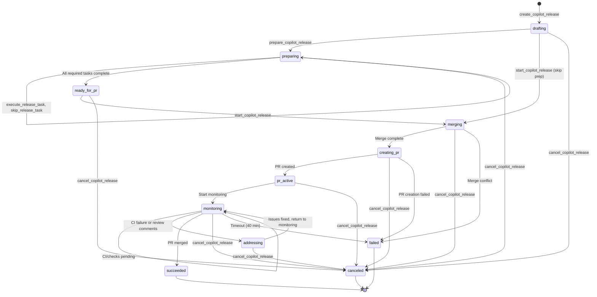

# Release Management User Guide

> Combine multiple plan commits into a single pull request with autonomous monitoring and feedback resolution — supporting GitHub, GitHub Enterprise, and Azure DevOps.

## Table of Contents

- [Overview](#overview)
- [Release Flow Types](#release-flow-types)
  - [From-Plans Flow](#from-plans-flow)
  - [From-Branch Flow](#from-branch-flow)
- [Quick Start](#quick-start)
- [UI Workflows](#ui-workflows)
  - [Create Release from Current Branch](#create-release-from-current-branch)
  - [Assign Plans to Release](#assign-plans-to-release)
- [Pre-PR Preparation](#pre-pr-preparation)
  - [Preparation Phase Overview](#preparation-phase-overview)
  - [Preparation Tasks](#preparation-tasks)
  - [Using prepare_copilot_release](#using-prepare_copilot_release)
  - [Auto-Executing Tasks](#auto-executing-tasks)
  - [Skipping Optional Tasks](#skipping-optional-tasks)
- [Release State Machine](#release-state-machine)
- [Multi-Provider Support](#multi-provider-support)
- [Release Workflow](#release-workflow)
- [Storage Layout](#storage-layout)
- [Concurrent Releases](#concurrent-releases)
- [PR Monitoring](#pr-monitoring)
- [Credential Troubleshooting](#credential-troubleshooting)
- [FAQ](#faq)

---

## Overview

**Release Management** enables you to:

1. **Combine multiple plans** into a single pull request
2. **Auto-detect** your remote provider (GitHub, GitHub Enterprise, or Azure DevOps)
3. **Automatically merge** all plan commits into a release branch in an isolated clone
4. **Create a PR** using provider-specific tooling (gh CLI for GitHub, az CLI for Azure DevOps)
5. **Monitor the PR** for 40 minutes, checking CI status, review comments, and security alerts every 2 minutes
6. **Autonomously address feedback** by spawning Copilot agents to fix CI failures, reply to comments, and resolve review threads
7. **Track progress** through detailed UI panels and MCP status queries

All release operations happen in **isolated repository clones** under `.orchestrator/release/<sanitized-branch>/` — never in OS temp directories, enabling concurrent releases and persistent state.

---

## Release Flow Types

The release system supports two distinct workflows to accommodate different development patterns.

### From-Plans Flow

**Use this when:** You have completed plans that you want to bundle into a single release PR.

**Workflow:**
1. Create release with specific `planIds`
2. System merges commits from those plans into the release branch
3. Optionally enter preparation phase to update changelog, version, docs
4. Create PR from the merged changes
5. Monitor and address feedback until merged

**Example:**
```typescript
create_copilot_release({
  name: "v1.2.0 Release",
  planIds: ["plan-feature-a", "plan-bugfix-b", "plan-improvement-c"],
  releaseBranch: "release/v1.2.0",
  targetBranch: "main"
})
```

### From-Branch Flow

**Use this when:** You have an existing branch (e.g., `release/v1.2.0`) with changes already committed, and you want release management without plan merging.

**Workflow:**
1. Create release with `releaseBranch` pointing to existing branch and empty or optional `planIds`
2. System skips merge phase (branch already has your changes)
3. Enter preparation phase for pre-PR quality checks
4. Create PR from the existing branch
5. Monitor and address feedback until merged

**Example:**
```typescript
create_copilot_release({
  name: "Hotfix Release",
  planIds: [],  // Empty for from-branch flow
  releaseBranch: "hotfix/critical-bug",
  targetBranch: "main",
  repoPath: "/path/to/repo"
})
```

**Key difference:** From-branch flow is optimized for scenarios where changes are already on a branch (manual commits, external tooling, or importing work from other sources). From-plans flow is for orchestrator-managed work that needs to be bundled.

---

## Quick Start

### Via Copilot Chat (MCP)

```
@workspace Create a release named "v1.2.0 Release" combining plans 
plan-abc-123 and plan-def-456 into branch release/v1.2.0 targeting main.
Start it immediately.
```

Copilot will:
1. Call `create_copilot_release` with `autoStart: true`
2. Return the release ID
3. Monitor progress via `get_copilot_release_status`

### Via MCP API Directly

```json
// 1. Create release
{
  "tool": "create_copilot_release",
  "arguments": {
    "name": "v1.2.0 Release",
    "planIds": ["plan-abc-123", "plan-def-456"],
    "releaseBranch": "release/v1.2.0",
    "targetBranch": "main",
    "autoStart": true
  }
}

// Returns: { releaseId: "rel-xyz-789", status: "merging", ... }

// 2. Monitor progress
{
  "tool": "get_copilot_release_status",
  "arguments": { "releaseId": "rel-xyz-789" }
}

// Returns: { 
//   release: { id, name, status, prNumber, prUrl, ... },
//   progress: { mergeResults, prMonitoring: { ... } }
// }
```

---

## UI Workflows

### Create Release from Current Branch

The quickest way to create a release from the active git branch:

1. Switch to the **Releases** tab in the Orchestrator sidebar
2. Click the **"From Current Branch"** button (git branch icon)
3. The release wizard opens with:
   - Release name pre-filled from the current branch (e.g., `release/v1.2.0` → `v1.2.0 Release`)
   - Release branch set to current branch
   - Target branch defaulted to `main`
   - Empty plan list (you'll assign plans next)
4. Add plans via:
   - **Assign from Plans tab**: Select succeeded/partial plans → Right-click → "Assign to Release..." → Choose this release
   - **Manual entry**: Type plan IDs in the wizard
5. Click **Create** to draft the release
6. Click **Start Release** to begin the merge → PR → monitoring cycle

**When to use:**
- You have a feature/release branch with completed plans you want to bundle into a PR
- You want to quickly create a release without typing the branch name manually
- The current branch is already the desired release branch (not `main` or another protected branch)

### Assign Plans to Release

After creating a release (from branch or via MCP), you can assign additional plans:

**Via Plans Tab:**
1. Switch to the **Plans** tab
2. Select one or more plans (Ctrl+Click for multi-select)
3. Right-click → **"Assign to Release..."**
4. Choose the target release from the dropdown
5. Plans are added to the release's `planIds` list

**Via Context Menu:**
1. Right-click a single plan card
2. Select **"Assign to Release..."**
3. Choose the release

**Bulk Action:**
1. Select multiple plans (Shift+Click for range, Ctrl+Click for individual)
2. Click the **"Assign to Release..."** button in the bulk actions toolbar
3. All selected plans are assigned to the chosen release

**Requirements:**
- Only plans with status `succeeded` or `partial` can be assigned
- Plans must be from the same repository as the release
- Assigning to a release in `drafting` status adds plans before PR creation
- Assigning to a release in `merging`, `creating-pr`, or `monitoring` status is not allowed (release must complete or be canceled first)

**When to use:**
- You've created a release but forgot to include some plans
- Additional plans completed after the release was created
- You want to batch-assign plans discovered via search or filter

---

## Pre-PR Preparation

Before creating a pull request, you may want to ensure the release meets quality standards, has up-to-date documentation, and passes validation checks. The preparation phase provides a structured checklist of tasks to complete before PR creation.

### Preparation Phase Overview

The **preparation phase** is an optional stage between merging/drafting and PR creation:

1. **Create release** (status: `drafting`)
2. **Call `prepare_copilot_release`** (status: `preparing`)
3. **Complete preparation tasks** (changelog, version, docs, review)
4. **All required tasks complete** (status: `ready-for-pr`)
5. **Call `start_copilot_release`** to create PR and begin monitoring

**When to use preparation:**
- Version releases that need changelog updates and version bumps
- Major features requiring documentation updates
- Any release where you want AI review before creating the PR
- Releases with custom validation requirements

**When to skip preparation:**
- Hotfixes that need immediate PR creation
- Simple bugfix releases with no version/docs changes
- When using `autoStart: true` (skips directly to merge → PR → monitoring)

### Preparation Tasks

The system provides a default checklist of tasks. Each task has:

- **Type**: `update-changelog`, `update-version`, `update-docs`, `create-release-notes`, `run-checks`, `ai-review`, or `custom`
- **Required**: Whether the task blocks PR creation (required tasks must be completed or can never be skipped)
- **Automatable**: Whether Copilot can auto-execute the task via `execute_release_task`
- **Status**: `pending`, `in-progress`, `completed`, `failed`, or `skipped`

**Default preparation tasks:**

| Task ID | Type | Title | Required | Automatable |
|---------|------|-------|----------|-------------|
| `update-changelog` | `update-changelog` | Update CHANGELOG.md | Yes | Yes |
| `update-version` | `update-version` | Bump version numbers | Yes | Yes |
| `update-docs` | `update-docs` | Update documentation | No | Yes |
| `create-release-notes` | `create-release-notes` | Generate release notes | No | Yes |
| `run-checks` | `run-checks` | Run compile + tests | Yes | Yes |
| `ai-review` | `ai-review` | AI code review | No | Yes |

### Using prepare_copilot_release

To enter the preparation phase:

**Via MCP:**
```typescript
// 1. Create release
create_copilot_release({
  name: "v1.3.0 Release",
  planIds: ["plan-a", "plan-b"],
  releaseBranch: "release/v1.3.0",
  targetBranch: "main"
})
// Returns: { releaseId: "rel-xyz", status: "drafting" }

// 2. Enter preparation phase
prepare_copilot_release({
  releaseId: "rel-xyz"
})
// Returns: { success: true, preparationTasks: [...] }

// 3. Check status
get_copilot_release_status({
  releaseId: "rel-xyz"
})
// Returns: { release: { status: "preparing", preparationTasks: [...] } }
```

**Via UI:**
1. Create release via wizard or "From Current Branch"
2. Click **"Prepare Release"** button in release detail panel
3. View preparation task checklist
4. Complete tasks manually or use auto-execute

### Auto-Executing Tasks

For tasks marked `automatable: true`, Copilot can complete them automatically:

```typescript
execute_release_task({
  releaseId: "rel-xyz",
  taskId: "update-changelog"
})
// Spawns Copilot agent to update CHANGELOG.md
// Returns: { success: true, status: "in-progress" }

// Agent will:
// 1. Analyze plan commits and changes
// 2. Update CHANGELOG.md with new entries
// 3. Commit the changes
// 4. Mark task as completed
```

**What auto-execution does:**

| Task Type | Agent Instructions |
|-----------|-------------------|
| `update-changelog` | Analyze commits, update CHANGELOG.md following Keep a Changelog format |
| `update-version` | Bump version in package.json, package-lock.json, and other version files |
| `update-docs` | Update README.md and docs/ with new features, API changes, configuration |
| `create-release-notes` | Generate release notes from commit messages and plan summaries |
| `run-checks` | Run `npm run compile && npm test` (or configured validation command) |
| `ai-review` | Spawn AI agent to review all changes and report issues |

### Skipping Optional Tasks

Optional tasks (`required: false`) can be skipped if not needed:

```typescript
skip_release_task({
  releaseId: "rel-xyz",
  taskId: "create-release-notes"
})
// Returns: { success: true, status: "skipped" }
```

**Rules:**
- Only optional tasks can be skipped
- Required tasks must be completed (via auto-execution or manual completion)
- Once all required tasks are `completed`, the release transitions to `ready-for-pr`
- Call `start_copilot_release` to proceed with PR creation

**Marking tasks complete manually:**

If you complete a task outside the orchestrator (e.g., manually edit CHANGELOG), mark it complete via:
1. UI: Click checkbox next to task in release detail panel
2. MCP: Tasks auto-transition to `completed` when their expected output is detected

---

## Release State Machine

The release lifecycle follows a strict state machine:



**State Descriptions:**

| State | Description | Possible Transitions |
|-------|-------------|---------------------|
| `drafting` | Release created, plans can be added | `preparing`, `merging`, `canceled` |
| `preparing` | Running pre-PR preparation tasks | `ready-for-pr`, `canceled` |
| `ready-for-pr` | All prep tasks complete, ready for PR | `merging`, `canceled` |
| `merging` | Merging plan commits into release branch | `creating-pr`, `failed`, `canceled` |
| `creating-pr` | Creating pull request via gh/az | `pr-active`, `failed`, `canceled` |
| `pr-active` | PR created, not yet monitoring | `monitoring`, `canceled` |
| `monitoring` | Monitoring PR for CI/reviews/alerts | `addressing`, `succeeded`, `failed`, `canceled` |
| `addressing` | Fixing issues and replying to feedback | `monitoring`, `canceled` |
| `succeeded` | PR merged successfully (terminal) | — |
| `failed` | Unrecoverable error (terminal) | — |
| `canceled` | User canceled (terminal) | — |

---

## Multi-Provider Support

The release system **automatically detects** your remote provider from the git remote URL and uses the appropriate tooling.

### Supported Providers

| Provider | Detection Pattern | Credential Chain | PR Tool |
|----------|------------------|------------------|---------|
| **GitHub** | `https://github.com/...` or `git@github.com:...` | `gh auth token` → `git credential fill` → `GITHUB_TOKEN` | `gh pr create` |
| **GitHub Enterprise** | `https://<hostname>/...` (not github.com) | `gh auth token` → `git credential fill` → `GITHUB_TOKEN` | `gh pr create` |
| **Azure DevOps** | `https://dev.azure.com/...` or `git@ssh.dev.azure.com:...` | `az account get-access-token` → `git credential fill` → `AZURE_DEVOPS_TOKEN` | `az repos pr create` |

### Provider Detection Flow

1. **Parse git remote URL** from `git config --get remote.origin.url`
2. **Identify provider type**:
   - `github.com` → GitHub
   - Custom hostname → GitHub Enterprise
   - `dev.azure.com` → Azure DevOps
3. **Extract metadata**: owner, repository name, organization (Azure DevOps), project (Azure DevOps)
4. **Acquire credentials** via provider-specific chain (see [Credential Troubleshooting](#credential-troubleshooting))

### No Configuration Required

Provider detection and credential acquisition happen **automatically** when you start a release — no setup or configuration needed. The system will fail early with clear error messages if credentials cannot be obtained.

---

## Release Workflow

### Lifecycle States

```
drafting → merging → creating-pr → monitoring → addressing → succeeded
                                                          ↘ failed
                                                          ↘ canceled
```

| Status | Description |
|--------|-------------|
| **drafting** | Release created, awaiting `start_copilot_release` call |
| **merging** | Merging all plan commits into release branch in isolated clone |
| **creating-pr** | Creating pull request via provider-specific tool (gh/az) |
| **monitoring** | Monitoring PR for CI checks, review comments, security alerts (40-min cycles) |
| **addressing** | Spawning Copilot agents to fix issues and reply to feedback |
| **succeeded** | PR merged successfully — release complete |
| **failed** | Unrecoverable error occurred (check `error` field) |
| **canceled** | User canceled the release via `cancel_copilot_release` |

### Detailed Workflow

#### 1. Drafting → Merging

- **Validate plan IDs**: All plans must be in `succeeded` or `partial` status
- **Create isolated clone**: Under `.orchestrator/release/<sanitized-branch>/`
  - Uses `git clone --shared` for efficiency (falls back to `--reference` if needed)
  - Full working tree with independent `.git` directory
- **Checkout release branch**: Creates branch if it doesn't exist, or checks out existing one
- **Merge plan commits**: Sequentially merges each plan's snapshot commit (from `snapshot.baseCommit` or final merge commit)
  - Conflict resolution: Manual intervention required (future: AI-assisted resolution)

#### 2. Merging → Creating-PR

- **Detect provider**: Parse git remote URL and identify GitHub/GHE/Azure DevOps
- **Acquire credentials**: Run credential chain (gh auth → git credential → env var)
- **Push release branch**: `git push origin <releaseBranch>`
- **Create PR**: 
  - GitHub/GHE: `gh pr create --base <targetBranch> --head <releaseBranch> --title "..." --body "..."`
  - Azure DevOps: `az repos pr create --source-branch <releaseBranch> --target-branch <targetBranch> --title "..." --description "..."`
- **Store PR metadata**: PR number and URL saved to release state

#### 3. Creating-PR → Monitoring

- **Start 40-minute monitoring cycle**
- **Check every 2 minutes**:
  - CI check statuses (via `gh pr checks` or `az repos pr list --status`)
  - Review comments (via `gh pr view --comments` or `az repos pr show`)
  - Security alerts (via GitHub Security API or Azure DevOps alerts)
- **Detect issues**:
  - CI failures → `addressing`
  - Unresolved review comments → `addressing`
  - Security vulnerabilities → `addressing`

#### 4. Monitoring → Addressing

- **Spawn Copilot agent** with:
  - CI failure logs
  - Review comment threads
  - Security alert details
- **Agent fixes issues** in the isolated clone
- **Commit and push** fixes
- **Reply to comments**: `gh pr comment` or `az repos pr comment add`
- **Resolve threads**: Mark review threads as resolved
- **Return to monitoring** to re-check CI and comments

#### 5. Addressing → Succeeded

- **PR merged**: Detected via `gh pr view --json state` or `az repos pr show --query "status"`
- **Transition to succeeded**
- **End monitoring cycle**

---

## Storage Layout

All release artifacts are stored under `.orchestrator/release/<sanitized-branch>/`:

```
.orchestrator/
└── release/
    ├── release-v1.2.0/                 # Isolated clone for release/v1.2.0
    │   ├── .git/                       # Shared with main repo via --shared
    │   │   ├── objects/                # Symlinked or referenced from main repo
    │   │   ├── refs/
    │   │   └── config
    │   ├── release-state.json          # Release metadata and status
    │   │                               # { id, name, planIds, status, prNumber, prUrl, ... }
    │   └── <source files>              # Full working tree with merged commits
    ├── hotfix-auth/                    # Another concurrent release
    │   ├── .git/
    │   ├── release-state.json
    │   └── <source files>
    └── feature-bundle/
        ├── .git/
        ├── release-state.json
        └── <source files>
```

### Why `.orchestrator/release/`?

- **Persistent state**: Artifacts remain after completion for debugging
- **Concurrent releases**: Multiple releases can run in parallel without conflicts
- **Shared objects**: Uses `--shared` to avoid duplicating repository objects (efficient)
- **Safe cleanup**: Can be removed without affecting the main repository
- **Never OS temp**: Avoids ephemeral temp directories that are cleaned up unpredictably

---

## Concurrent Releases

The isolated clone architecture enables **multiple releases to run simultaneously**:

```
Release 1: release/v1.2.0 → drafting → merging → ... → succeeded
Release 2: hotfix/auth    → drafting → merging → ... → succeeded
Release 3: feature/bundle → drafting → merging → creating-pr → ...
```

Each release operates in its own isolated clone under `.orchestrator/release/<branch>/`, ensuring:

- **No conflicts**: Changes in one release don't affect another
- **Independent state**: Each release has its own PR, monitoring cycles, and progress tracking
- **Resource efficiency**: Shared git objects minimize disk usage
- **Parallel progress**: Releases at different lifecycle stages run concurrently

**Limitations:**

- Only one release per **unique release branch name** at a time (sanitized name collision detection)
- Plan commits must be from the same repository root

---

## PR Monitoring

### Monitoring Cycle

Every **2 minutes** for **40 minutes** (configurable in future):

1. **Check CI status**: Query all check runs and report failures
2. **Check review comments**: Get unresolved review threads and general comments
3. **Check security alerts**: Query for vulnerabilities (CodeQL, Dependabot, etc.)
4. **Evaluate**: If all clear, continue monitoring. If issues detected, transition to `addressing`.

### What Triggers Addressing?

| Issue Type | Detection | Action |
|------------|-----------|--------|
| **CI Failure** | Check run status is `failure`, `action_required`, or `timed_out` | Spawn agent with failure logs to fix issue |
| **Unresolved Comment** | Review thread has `isResolved: false` or general comment awaits reply | Spawn agent to address feedback and reply |
| **Security Alert** | Vulnerability detected on branch | Spawn agent to remediate (e.g., update dependency, fix code pattern) |

### Addressing Strategy

1. **Collect context**: Failure logs, comment text, security alert details
2. **Spawn Copilot agent** with task:
   ```
   # Fix CI Failure
   
   The following check failed: 'Build and Test'
   
   Error output:
   <log excerpt>
   
   Fix the issue and commit the changes.
   ```
3. **Agent works** in the isolated clone
4. **Commit and push** fix to release branch
5. **Reply to comment** (if addressing review feedback)
6. **Resolve thread** (if addressing inline review comment)
7. **Return to monitoring** to verify fix

### Monitoring Timeout

After **40 minutes**, if the PR is not merged:

- Release transitions to `failed` with error message
- The PR remains open for manual intervention
- Isolated clone is preserved for debugging

---

## Adopting Existing PRs

The orchestrator can adopt **any existing pull request** (created manually, via release, or by another tool) for lifecycle management and autonomous monitoring. This enables unified PR tracking regardless of how the PR was created.

### Why Adopt PRs?

**Without PR Adoption:**
- Manual monitoring of CI status
- Manual response to review comments
- Manual tracking of security alerts
- Context-switching between code, CI dashboard, and PR conversations

**With PR Adoption:**
- **Autonomous monitoring** — Same 40-minute cycles as release-generated PRs
- **Automatic feedback handling** — Copilot agents fix CI failures and reply to comments
- **Priority-based scheduling** — Promote critical PRs for more frequent checks
- **Unified dashboard** — All managed PRs in one sidebar with status visibility

### Adoption Workflow

#### 1. List Available PRs

Use `list_available_prs` to discover PRs on your remote:

```json
{
  "repoPath": "/path/to/repo",
  "baseBranch": "main",
  "state": "open",
  "limit": 50
}
```

Returns:
```json
{
  "success": true,
  "prs": [
    { "prNumber": 42, "title": "Add auth module", "isManaged": false, "author": "alice", ... },
    { "prNumber": 38, "title": "Fix login bug", "isManaged": true, "author": "bob", ... }
  ]
}
```

The `isManaged` flag shows which PRs are already under lifecycle management.

#### 2. Adopt a PR

Use `adopt_pr` to take ownership:

```json
{
  "prNumber": 42,
  "repoPath": "/path/to/repo",
  "priority": 1,
  "releaseId": "rel-xyz-optional"
}
```

Returns:
```json
{
  "success": true,
  "managedPR": {
    "id": "pr-uuid-123",
    "prNumber": 42,
    "status": "adopted",
    "title": "Add auth module",
    "baseBranch": "main",
    "headBranch": "feature/auth",
    "providerType": "github",
    "priority": 1,
    ...
  }
}
```

The PR is now managed but **not yet monitored**. Status is `adopted`.

#### 3. Start Monitoring

Use `start_pr_monitoring` to begin autonomous cycles:

```json
{
  "id": "pr-uuid-123"
}
```

The PR transitions to `monitoring` status and begins 40-minute autonomous monitoring (same as release PRs):
- **Every 2 minutes**: Check CI status, review comments, security alerts
- **Autonomous addressing**: Spawn agents to fix failures and reply to feedback
- **Status updates**: Transitions to `addressing` when fixing, `ready` when all checks pass, `blocked` if issues remain

#### 4. Monitor Progress

Use `get_managed_pr` to check status:

```json
{
  "id": "pr-uuid-123"
}
```

Returns current PR state, CI status, unresolved comments, and monitoring history.

### Priority Management

Control monitoring frequency and resource allocation:

#### Promote PR

Use `promote_pr` to increase priority:

```json
{
  "id": "pr-uuid-123"
}
```

**Effect:**
- More frequent CI checks
- Earlier scheduling when agents are at capacity
- Higher priority in addressing queue

#### Demote PR

Use `demote_pr` to decrease priority:

```json
{
  "id": "pr-uuid-123"
}
```

**Effect:**
- Less frequent checks
- Deferred when higher-priority PRs need attention

### Lifecycle Transitions

#### Stop Monitoring (without abandoning)

Use `stop_pr_monitoring` to pause monitoring:

```json
{
  "id": "pr-uuid-123"
}
```

The PR transitions back to `adopted` status. Monitoring halts but the PR remains managed. You can restart monitoring later with `start_pr_monitoring`.

#### Abandon PR

Use `abandon_pr` to stop management:

```json
{
  "id": "pr-uuid-123"
}
```

The PR transitions to `abandoned` status. Monitoring stops and the PR is no longer actively managed, but the record remains for historical tracking.

#### Remove PR

Use `remove_pr` to completely delete from management:

```json
{
  "id": "pr-uuid-123"
}
```

All managed PR data is deleted. The PR itself remains on the remote, but the orchestrator has no record of it.

### Integration with Releases

- **Release-generated PRs** are automatically adopted when created
- **Externally-created PRs** can be adopted to join the same monitoring workflow
- **Unified tracking** — All managed PRs appear in the Active PRs sidebar regardless of origin
- **Release linking** — Adopted PRs can be linked to releases via the `releaseId` parameter during adoption

### Sidebar Integration

Managed PRs appear in the **"Active PRs"** section of the Plans sidebar:

- **Status badge** — Color-coded status (green = ready, yellow = monitoring, red = blocked)
- **Priority indicator** — Shows current priority tier
- **Quick actions** — Start/stop monitoring, promote/demote, abandon
- **PR detail panel** — Click to open detailed view with monitoring state, check status, unresolved comments

### Multi-Provider Support

PR adoption works with **any remote provider** supported by the orchestrator:
- **GitHub** (`github.com`)
- **GitHub Enterprise** (custom hostname)
- **Azure DevOps** (`dev.azure.com`)

Provider detection and credential acquisition happen automatically based on the repository's remote URL.

### Example: Complete Adoption Flow via Copilot Chat

```
@workspace List all open PRs targeting main

@workspace Adopt PR #42 with priority 1

@workspace Start monitoring the adopted PR

@workspace Check status of managed PR pr-uuid-123

@workspace The PR is critical — promote its priority

@workspace PR merged externally — remove it from management
```

Copilot will call the appropriate MCP tools (`list_available_prs`, `adopt_pr`, `start_pr_monitoring`, `get_managed_pr`, `promote_pr`, `remove_pr`) and handle the workflow.

---

## Credential Troubleshooting

### GitHub and GitHub Enterprise

**Credential chain:**
1. `gh auth token` — Checks if GitHub CLI is authenticated
2. `git credential fill` — Queries git credential manager/cache
3. `GITHUB_TOKEN` environment variable

**Common issues:**

| Problem | Solution |
|---------|----------|
| `gh: command not found` | Install GitHub CLI: `winget install GitHub.cli` (Windows) or `brew install gh` (macOS) |
| `gh auth token` fails | Run `gh auth login` to authenticate |
| `git credential fill` returns nothing | Run `git config --global credential.helper cache` and re-clone repo with credentials |
| `GITHUB_TOKEN` not set | Set environment variable: `export GITHUB_TOKEN=<your-token>` |
| Permission denied | Ensure token has `repo` scope for private repos |

**Testing credentials:**

```bash
# Test GitHub CLI
gh auth status

# Test git credential
echo "protocol=https
host=github.com
" | git credential fill

# Test environment variable
echo $GITHUB_TOKEN
```

### Azure DevOps

**Credential chain:**
1. `az account get-access-token` — Checks if Azure CLI is authenticated
2. `git credential fill` — Queries git credential manager
3. `AZURE_DEVOPS_TOKEN` environment variable

**Common issues:**

| Problem | Solution |
|---------|----------|
| `az: command not found` | Install Azure CLI: `winget install Microsoft.AzureCLI` (Windows) or `brew install azure-cli` (macOS) |
| `az account get-access-token` fails | Run `az login` to authenticate |
| `git credential fill` returns nothing | Use Git Credential Manager: `git config --global credential.helper manager-core` |
| `AZURE_DEVOPS_TOKEN` not set | Set environment variable with PAT: `export AZURE_DEVOPS_TOKEN=<your-pat>` |
| PAT permissions | Ensure token has `Code (Read & Write)` and `Pull Request (Read, Write & Manage)` scopes |

**Testing credentials:**

```bash
# Test Azure CLI
az account show

# Test git credential
echo "protocol=https
host=dev.azure.com
" | git credential fill

# Test environment variable
echo $AZURE_DEVOPS_TOKEN
```

### Generic Debugging

If credentials cannot be acquired:

1. **Check the Output panel** ("Copilot Orchestrator" channel) for detailed error messages
2. **Verify git remote URL**: `git config --get remote.origin.url`
3. **Test provider detection manually**: Create a test release and check logs
4. **Use environment variables** as a fallback: Set `GITHUB_TOKEN` or `AZURE_DEVOPS_TOKEN` before starting the release

---

## FAQ

### Can I use releases without GitHub CLI or Azure CLI?

Yes, but with limitations. The system will fall back to `git credential fill` and environment variables. However, some operations (like replying to comments or resolving threads) may not work without the CLI tools.

### What happens if my PR gets merged manually?

The monitoring cycle will detect the merge and transition the release to `succeeded`. Manual intervention is always allowed.

### Can I cancel a release after the PR is created?

Yes. Use `cancel_copilot_release` to stop monitoring. The PR remains open and can be managed manually or resumed later (future feature).

### What if two releases target the same branch?

The second release will fail during creation with an error message indicating a duplicate release branch. Each release must have a unique branch name.

### Can I create a release from plans in different repositories?

No. All plans must be from the same repository root. Cross-repository releases are not supported.

### How do I clean up old isolated clones?

Use the `IReleaseManager.cleanupIsolatedRepos()` method (via extension command in future) to remove clones for terminal releases (succeeded/failed/canceled). Manual cleanup: delete directories under `.orchestrator/release/`.

### What if the merge has conflicts?

Currently, conflicts require **manual resolution**. Future versions will support AI-assisted conflict resolution. The release will fail with a clear error message, and the isolated clone will be preserved for manual fixes.

### Can I customize the monitoring duration or interval?

Not yet. The 40-minute duration and 2-minute interval are hardcoded. Future versions will expose configuration settings.

### Does the release system work with self-hosted GitHub Enterprise or Azure DevOps?

Yes for GitHub Enterprise (same credential chain as GitHub.com). Azure DevOps support is designed for cloud (`dev.azure.com`) but may work with on-premises installations if `az` CLI is configured correctly.

### How do I see the release progress in the UI?

Release progress is visible in:
- **Copilot Chat**: Query via `get_copilot_release_status`
- **Output panel**: "Copilot Orchestrator" channel logs all release events
- **Future**: Dedicated release panel in the extension UI (planned)

### What if the agent addressing a PR issue makes things worse?

The release will continue monitoring. If the fix doesn't resolve the issue, another addressing cycle will trigger. After 40 minutes, the release times out, and you can manually intervene.

### Can I retry a failed release?

Not directly. You can create a new release with the same plans and branch name (after deleting the failed release). Future versions will support release retry.

### How do I add plans to a release after creation?

Use the `add_plans_to_release` MCP tool or the UI:

**Via MCP:**
```typescript
add_plans_to_release({
  releaseId: "rel-xyz",
  planIds: ["plan-new-1", "plan-new-2"]
})
```

**Via UI:**
1. Select plans in the Plans tab
2. Right-click → "Assign to Release..."
3. Choose the target release

**Restrictions:**
- Release must be in `drafting`, `preparing`, or `ready-for-pr` status
- Cannot add plans to releases in `merging`, `creating-pr`, `pr-active`, `monitoring`, or terminal states

### How do I skip the preparation phase?

Use `autoStart: true` when creating the release:

```typescript
create_copilot_release({
  name: "Hotfix",
  planIds: ["plan-hotfix"],
  releaseBranch: "hotfix/urgent",
  autoStart: true  // Skips preparation, goes straight to merge → PR → monitoring
})
```

Or omit calling `prepare_copilot_release` and directly call `start_copilot_release`:

```typescript
// 1. Create release
const { releaseId } = create_copilot_release({ ... });

// 2. Skip to PR creation (no preparation)
start_copilot_release({ releaseId });
```

### Can I customize the preparation tasks?

Not yet. The default task list is fixed. Future versions will support:
- Custom task definitions via release configuration
- Repository-specific task templates
- Task plugins for specialized validation

### What if I manually complete a preparation task?

The system auto-detects changes:
- If you manually update CHANGELOG.md, the `update-changelog` task will auto-transition to `completed` on next status check
- You can also manually mark tasks as complete via the UI checkbox
- Only required tasks block PR creation — optional tasks can be skipped

### When should I use from-branch vs from-plans flow?

**Use from-plans:**
- You have orchestrator-managed plans that need to be bundled
- You want the system to handle merging commits from multiple plans
- Standard version release workflow

**Use from-branch:**
- You have an existing branch with manual commits
- Importing work from external sources (another tool, manual changes)
- The branch already has all changes, you just want prep + PR + monitoring

---

## Related Documentation

- [Architecture: Release Pipeline](ARCHITECTURE.md#release-architecture) — Component diagrams and data flow
- [Copilot Integration: Release MCP Tools](COPILOT_INTEGRATION.md#release-management-api) — MCP tool reference
- [DI Guide: Release Tokens](DI_GUIDE.md) — DI container registration for release services


## Key ceremony procedure

The release manifest signing ceremony is performed offline on an air-gapped host. M-of-N (3 of 5) HSM operators are required to sign each release.

1. **Air-gap the host.** Ensure no non-loopback network interface is up. The ceremony binary refuses to start otherwise (INV-1). Pass `--allow-network` only for staging rehearsals.
2. **Stage inputs.** Copy `release-manifest.unsigned.json` (produced by main.yml) and the published `AiOrchestrator.Tools.KeyCeremony` binary onto the air-gapped host (e.g. via a write-once USB).
3. **Run the ceremony**:

   ``
   AiOrchestrator.Tools.KeyCeremony \
     --unsigned release-manifest.unsigned.json \
     --out release-manifest.signed.json \
     --transcript /var/log/ceremony-2025-01-02.log \
     --signers op1,op2,op3
   ``

   Each operator inserts their HSM, confirms the device serial and payload SHA-256 on the prompt, then signs. Each signature is requested individually with operator confirmation; batch signing is rejected (INV-2).
4. **Audit.** A timestamped JSON-line transcript is appended on every step (operator id, device serial, payload hash) and flushed on each write to a separate filesystem path so a crash mid-ceremony preserves audit (INV-3).
5. **Optional transparency log.** If `--transparency-log <url>` is supplied (or omitted; default is on), a Sigstore-style Merkle inclusion receipt is embedded in the signed manifest as `TransparencyLogProof` (INV-5). Use `--no-transparency-log` to skip.
6. **Carry off.** Copy `release-manifest.signed.json` and the transcript off the air-gapped host. Provide the signed manifest URL to the GitHub `release.yml` workflow via `workflow_dispatch` (CI-RELEASE).

