# DAG Execution State Machine

> **Branch**: `pre-release/1.0.0` | **Date**: April 2026
>
> This document describes the complete state machine governing plan execution
> in the .NET port of the AI Orchestrator, including DAG structure, job lifecycle,
> phase execution, auto-heal, scheduling, reshape operations, and persistence.

---

## 1. Architecture Overview

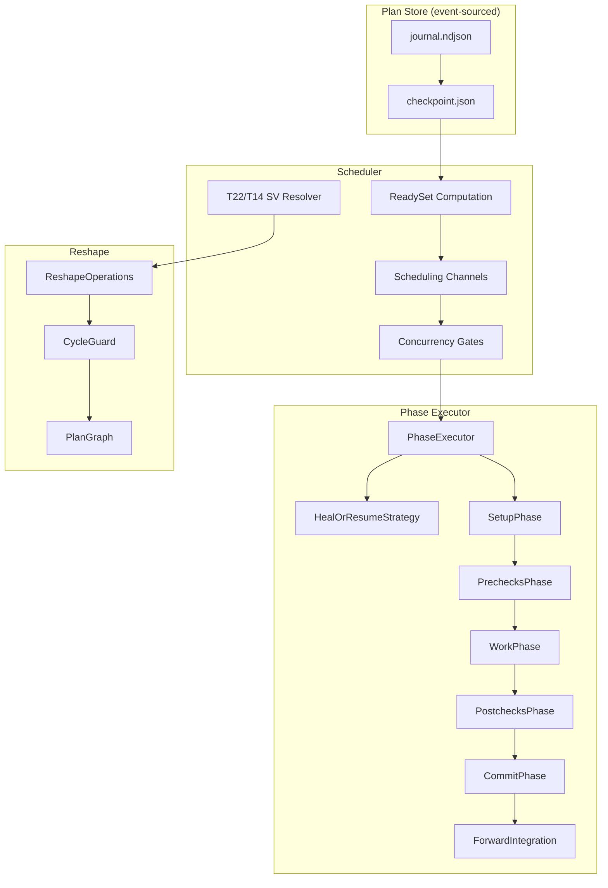

---

## 2. Job Status State Machine

### 2.1 Status Values

The system defines two `JobStatus` enums (a known discrepancy — see §8 Gap Analysis):

| Source | Values |
|--------|--------|
| `AiOrchestrator.Models.JobStatus` | `Pending`, `Ready`, `Scheduled`, `Running`, `Succeeded`, `Failed`, `Blocked`, `Canceled` |
| `AiOrchestrator.Plan.Models.JobStatus` | `Pending(0)`, `Ready(1)`, `Running(2)`, `Succeeded(3)`, `Failed(4)`, `Canceled(5)`, `Skipped(6)` |

### 2.2 State Transition Diagram

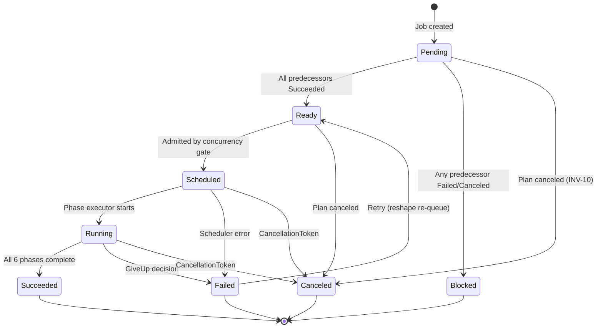

### 2.3 Transition Rules

| From | To | Trigger | Invariant |
|------|----|---------|-----------|
| `Pending` | `Ready` | All predecessors `Succeeded` | INV-2 |
| `Pending` | `Blocked` | Any predecessor `Failed` or `Canceled` | — |
| `Pending` | `Canceled` | Plan-level cancel | INV-10 |
| `Ready` | `Scheduled` | Admitted through concurrency gates | — |
| `Ready` | `Canceled` | Plan-level cancel | INV-10 |
| `Scheduled` | `Running` | PhaseExecutor begins | — |
| `Running` | `Succeeded` | All phases complete (`Done` sentinel) | — |
| `Running` | `Failed` | `HealOrResumeStrategy` returns `GiveUp` | — |
| `Running` | `Canceled` | CancellationToken fired | — |
| `Failed` | `Ready` | Explicit retry via reshape | — |

### 2.4 State Transition Record

Each transition is captured as an immutable record appended to `JobNode.Transitions`:

```csharp
sealed record StateTransition {
    JobStatus From;
    JobStatus To;
    DateTimeOffset OccurredAt;
    string? Reason;
}
```

---

## 3. Plan Status Lifecycle

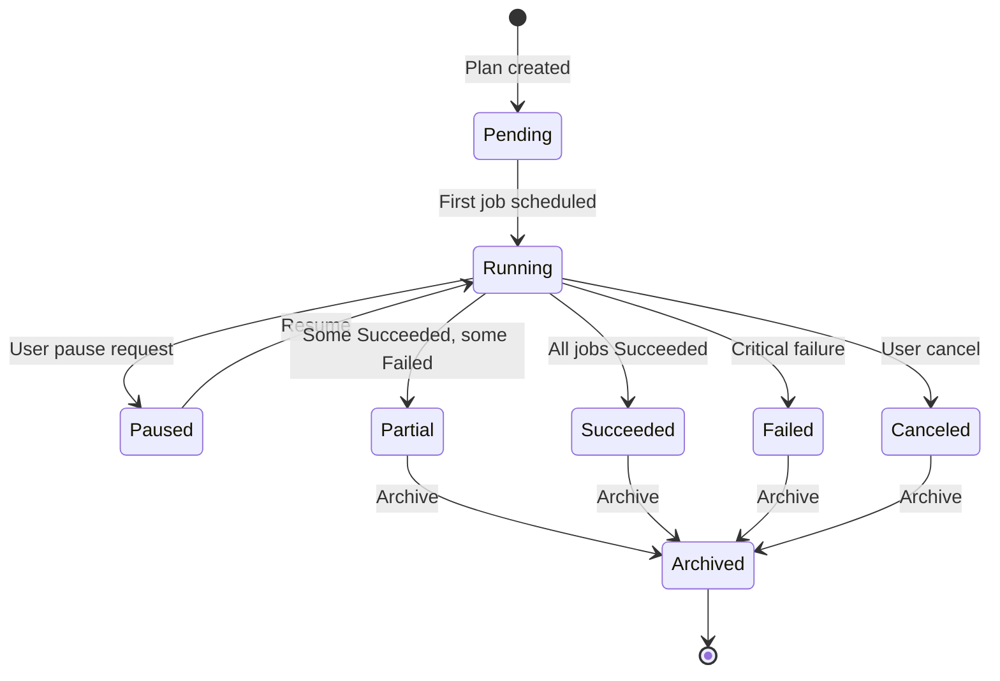

| Status | Meaning |
|--------|---------|
| `Pending` | Created, no jobs scheduled yet |
| `Running` | Actively scheduling and executing jobs |
| `Paused` | No new jobs will be scheduled; running jobs continue |
| `Succeeded` | All jobs completed successfully |
| `Partial` | Some jobs succeeded, others failed |
| `Failed` | Plan-level failure |
| `Canceled` | Externally canceled |
| `Archived` | Terminal, read-only |

---

## 4. DAG Structure

### 4.1 Data Model

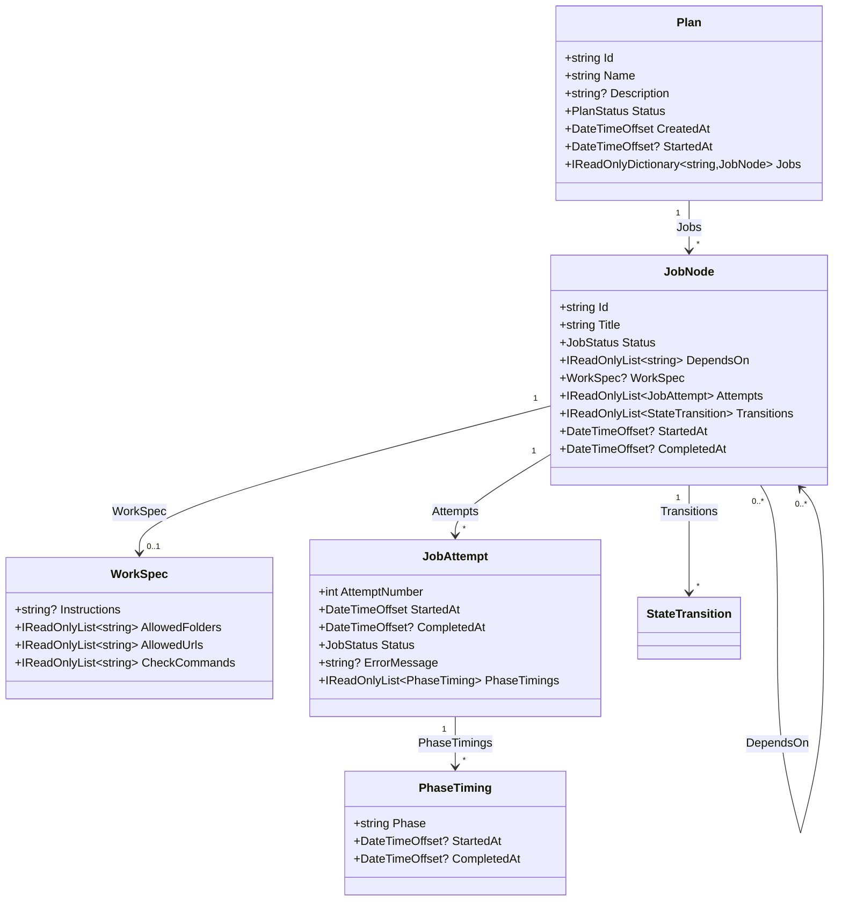

### 4.2 DAG Example

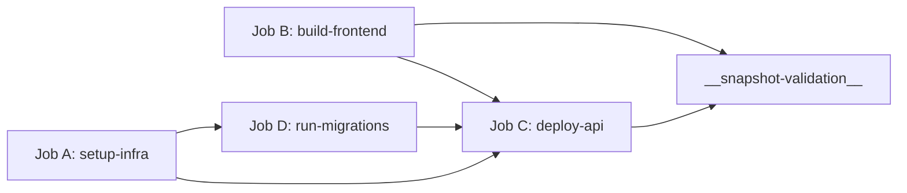

- **Roots**: Jobs with no predecessors (A, B)
- **Leaves**: Jobs with no successors (excluding SV)
- **SV Node**: `__snapshot-validation__` automatically depends on all leaf nodes

---

## 5. Phase Execution Pipeline

### 5.1 Phase Order (INV-1)

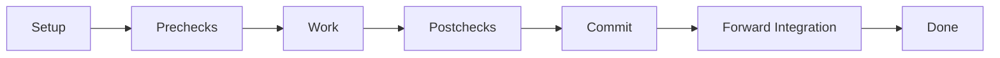

| Phase | Enum Value | Default Timeout | Purpose |
|-------|-----------|----------------|---------|
| **Setup** | 0 | 5 min | Forward-integrate base into worktree, allocate lease |
| **Prechecks** | 1 | 10 min | Validate pre-conditions before agent work |
| **Work** | 2 | 30 min | Invoke the AI agent runner |
| **Postchecks** | 3 | 10 min | Validate that work satisfies post-conditions |
| **Commit** | 4 | 5 min | Stage and commit changes |
| **ForwardIntegration** | 5 | 15 min | Merge target onto worktree for downstream jobs |
| **Done** | 6 | — | Terminal sentinel |

### 5.2 Phase Execution Sequence

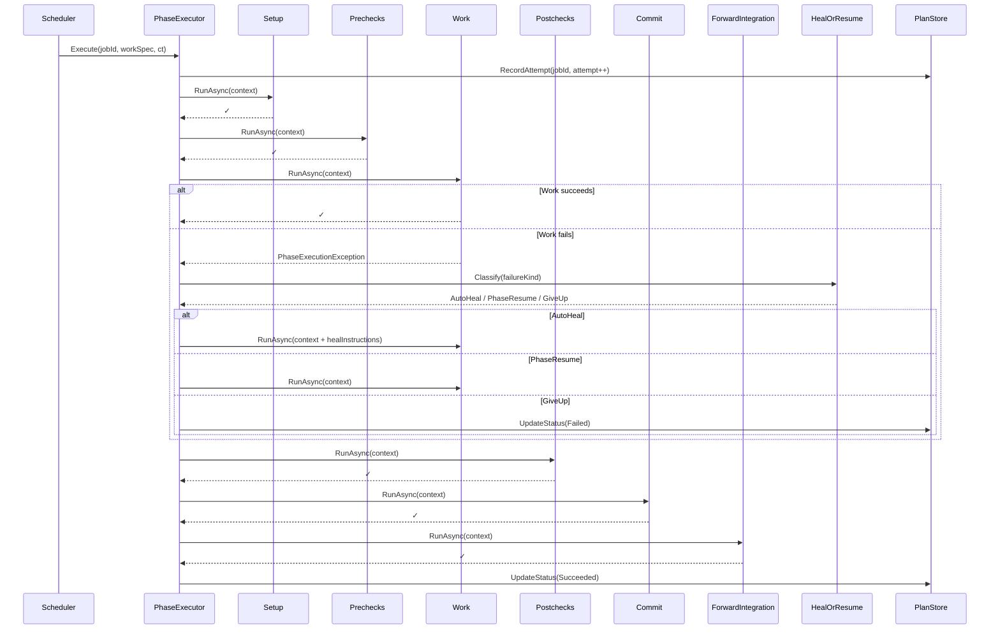

### 5.3 Auto-Heal Decision Matrix

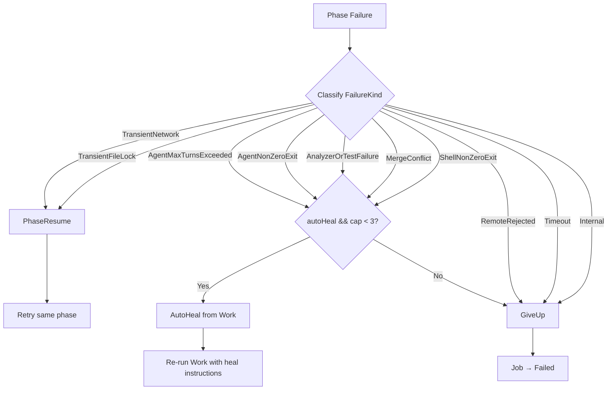

| FailureKind | autoHeal=ON, cap < 3 | autoHeal=OFF or cap ≥ 3 |
|-------------|---------------------|------------------------|
| `TransientNetwork` | **PhaseResume** | **PhaseResume** |
| `TransientFileLock` | **PhaseResume** | **PhaseResume** |
| `AgentMaxTurnsExceeded` | **AutoHeal** | **GiveUp** |
| `AgentNonZeroExit` | **AutoHeal** | **GiveUp** |
| `AnalyzerOrTestFailure` | **AutoHeal** | **GiveUp** |
| `MergeConflict` | **AutoHeal** | **GiveUp** |
| `ShellNonZeroExit` | **AutoHeal** | **GiveUp** |
| `RemoteRejected` | **GiveUp** (always) | **GiveUp** |
| `Timeout` | **GiveUp** (always) | **GiveUp** |
| `Internal` | **GiveUp** (always) | **GiveUp** |

**Caps**: `MaxAutoHealAttempts` = 3 (HEAL-RESUME-3), `MaxPhaseResumeAttempts` = 3.

---

## 6. Scheduler

### 6.1 Ready Set Computation

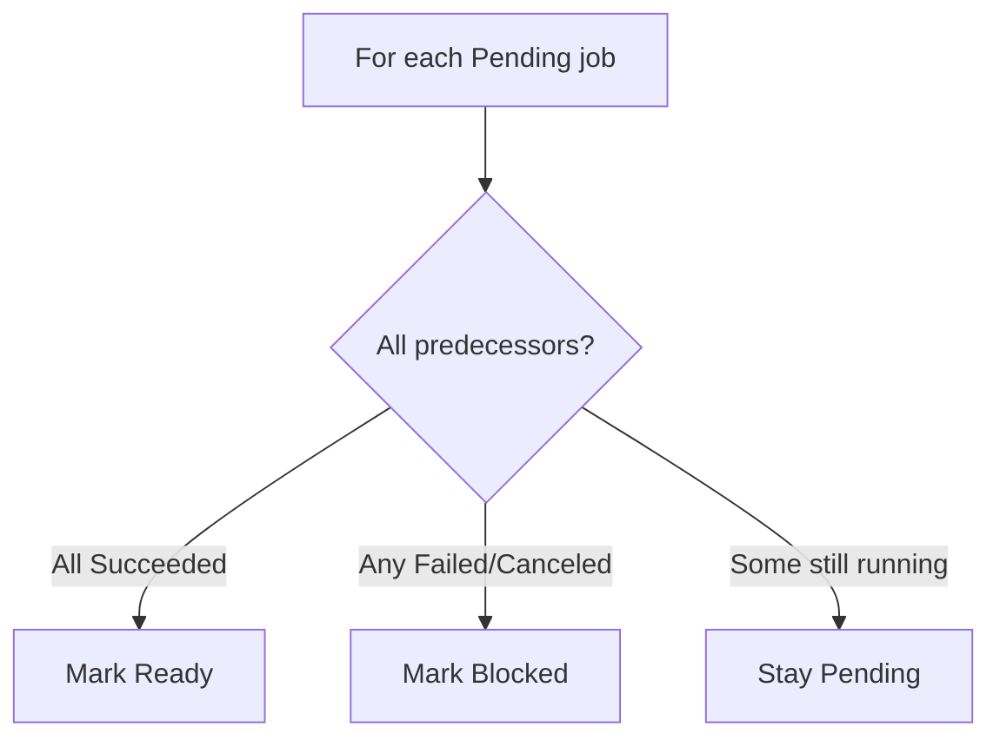

**Algorithm** (`ReadySet.ComputeReady`):
```
ready = []
for each job where status == Pending:
    anyTerminalFailure = false
    allSucceeded = true
    for each predecessor:
        if pred.status in {Failed, Canceled}:
            anyTerminalFailure = true; break
        if pred.status != Succeeded:
            allSucceeded = false
    if !anyTerminalFailure && allSucceeded:
        ready.add(job)
return ready
```

### 6.2 Concurrency Control

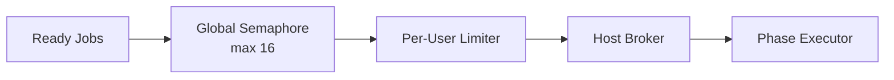

Three-level admission gate:
1. **Global**: `SchedulerOptions.GlobalMaxParallel` (default 16)
2. **Per-user**: `IPerUserConcurrency` — configurable per-user limit
3. **Host broker**: `IHostConcurrencyBrokerClient` — host-level coordination

### 6.3 T22/T14 SV Resolver

Keeps the Snapshot Validation (SV) node's dependencies synchronized with the current leaf set:

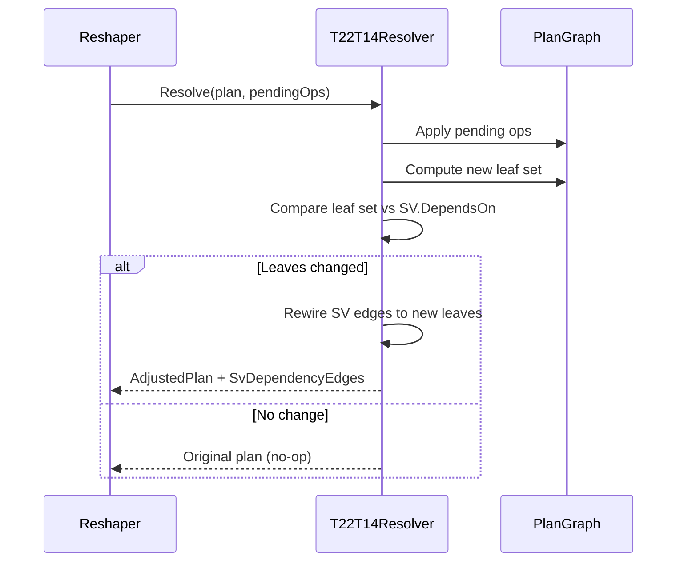

---

## 7. Reshape Operations

### 7.1 Operation Types

| Operation | Constraint | Effect |
|-----------|-----------|--------|
| `AddJob` | No duplicate ID, no cycle, not SV | Insert new node |
| `RemoveJob` | Must be Pending/Ready, not SV | Remove node + clean refs |
| `UpdateDeps` | Must be Pending, no cycle, not SV | Replace dependency list |
| `AddBefore` | Existing must be Pending, no cycle | Insert before existing |
| `AddAfter` | Not SV | Insert after existing, rewire successors |

### 7.2 Reshape Sequence

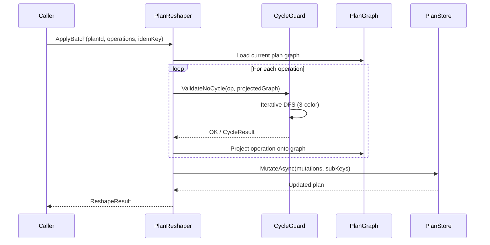

### 7.3 Cycle Detection (CycleGuard)

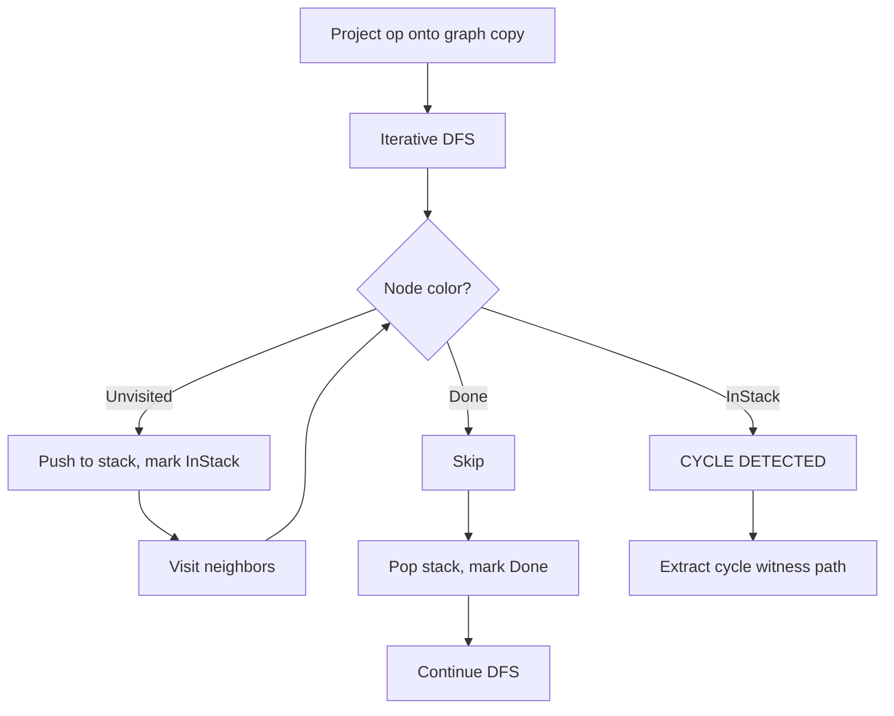

### 7.4 Invariants

| ID | Rule |
|----|------|
| RS-TXN-1 | Atomic batch — if ANY op fails, NOTHING persists |
| RS-TXN-2 | Derived sub-keys from single idempotency key |
| INV-6 | Only Pending/Ready jobs can be removed |
| INV-7 | Only Pending jobs can have deps updated |
| RS-AFTER-1 | AddAfter rewires all successors to depend on new node |

---

## 8. Plan Store (Event-Sourced)

### 8.1 Persistence Model

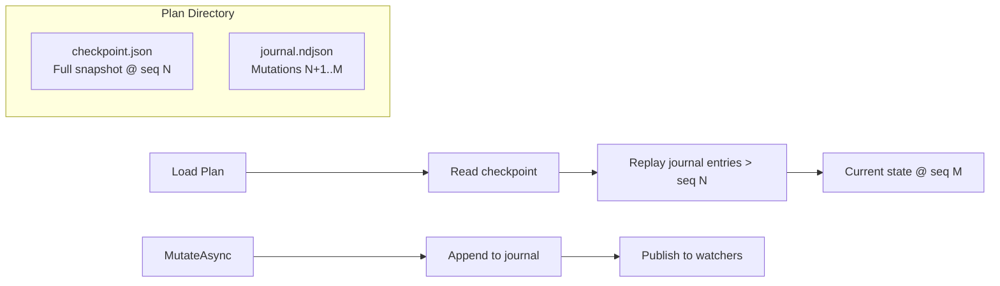

### 8.2 Mutation Types

| Mutation | Fields | Purpose |
|----------|--------|---------|
| `JobAdded` | Node | Add a job to the DAG |
| `JobRemoved` | JobIdValue | Remove a job |
| `JobDepsUpdated` | JobIdValue, NewDeps | Replace dependency list |
| `JobStatusUpdated` | JobIdValue, NewStatus | Change job status |
| `JobAttemptRecorded` | JobIdValue, Attempt | Append execution attempt |
| `PlanStatusUpdated` | NewStatus | Change plan-level status |

### 8.3 Watch (SUB-3)

`WatchAsync()` yields the current snapshot, then live updates after each mutation.
No gaps, no duplicates. Implemented via per-plan `Channel<Plan>` watchers.

### 8.4 Idempotency (RW-2-IDEM)

Every mutation carries an `IdemKey` (content hash). On journal replay, duplicate
keys are silently skipped, enabling safe retry of crashed operations.

---

## 9. Portability

### 9.1 Export Flow

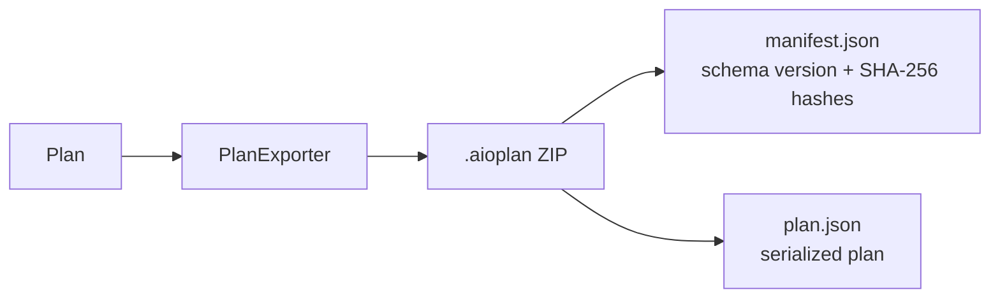

- Deterministic ZIP timestamps (epoch 2000-01-01)
- Optional: strip attempts/transitions, redact paths

### 9.2 Import Conflict Policies

| Policy | Behavior |
|--------|----------|
| `Reject` | Throw on ID collision |
| `GenerateNewId` | Assign fresh PlanId (default) |
| `OverwriteIfArchived` | Replace only if existing is Archived |

---

## 10. Complete Job Lifecycle Example

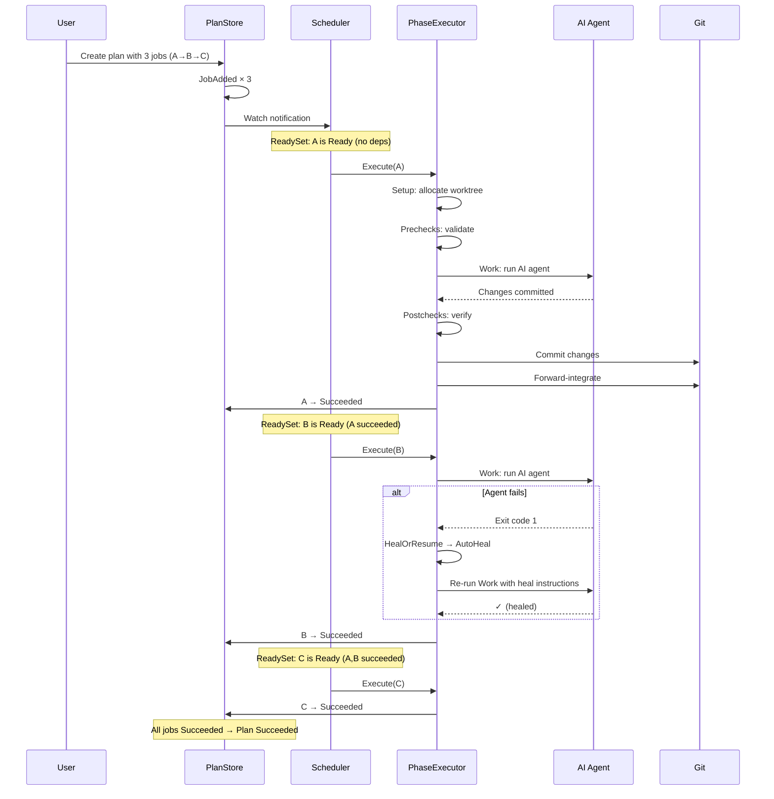
